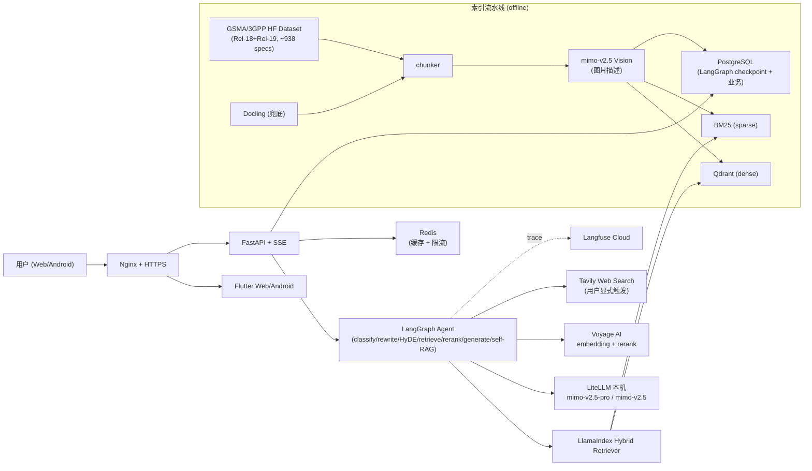

# 3GPP-Everything

> 基于 3GPP 规范文档的生产级 RAG Agent —— 让你像查代码一样查协议。

[]() [](./LICENSE) [](./docs/README.md)

## 是什么

一个对 3GPP 标准文档做深度 RAG 的 Agent 系统。你可以：

- **问问题，拿原文**：用自然语言问"PDU Session 建立完整流程是什么"，得到带段落级原文引用的回答，点击引用直接跳到完整章节阅读器
- **找原文**：切到"纯检索"模式，输入关键词返回相关章节段落 + 跳转
- **跨文档对比**：问"23.501 R18 vs R19 在 NEF 服务上的差异"，Agent 自动走多文档检索 + 对比
- **工具型查询**：缩写表、章节目录、参数 IE 字段查询

**严格 grounding**：找不到证据就直说"未在 3GPP 文档中找到"，绝不用模型通用知识糊弄。

## 当前阶段

```
M0 准备 ──> M1 数据接入 POC ──> M2 索引检索 POC ──> M3 评测集+Embedding决胜
   ↑ 现在在这里
   └── 计划文档全部就绪，代码尚未动工
```

完整里程碑见 [`docs/03-development/00-overview.md`](./docs/03-development/00-overview.md)。

## 架构速览



## 技术栈

| 层 | 选型 |
|---|------|
| **框架** | LangGraph (编排) + LlamaIndex (检索/解析) + LangChain (工具/Prompt) |
| **后端** | FastAPI + SQLAlchemy 2.0 (async) + Alembic + Pydantic v2 |
| **前端** | Flutter 3.x (Web + Android 同码) + Riverpod 2.x + go_router + dio (SSE) |
| **Agent LLM** | `mimo-v2.5-pro` (1M context) / `mimo-v2.5` (omni 多模态) - 本机 LiteLLM |
| **Embedding** | Voyage `voyage-3-large` 与智谱 `embedding-3` POC 双轨决胜 |
| **Reranker** | Voyage `rerank-2` |
| **向量库 / DB / 缓存** | Qdrant / PostgreSQL / Redis（**复用宿主已有实例**） |
| **监控** | Langfuse Cloud Free Tier |
| **评测** | Ragas + TeleQnA 转化的金标准集 (≥120 题) + Telco-DPR 风格 retrieval-only |
| **部署** | Docker Compose + Nginx + Let's Encrypt + GitHub Actions |

## 文档

整个 Plan 分三部分，按顺序阅读：

| # | 文档 | 主题 |
|---|------|------|
| **1** | [`docs/01-requirements.md`](./docs/01-requirements.md) | 需求澄清 - 项目定位、场景、功能/非功能需求、验收标准 |
| **2** | [`docs/02-tech-selection.md`](./docs/02-tech-selection.md) | 技术选型 - 选型总表、决策依据、POC 计划、成本估算 |
| **3** | [`docs/03-development/`](./docs/03-development/) | 开发规划（8 份） - 总览/基础设施/摄取/Agent/后端/前端/评测/CICD |

完整索引：[`docs/README.md`](./docs/README.md)

## 快速开始（开发期 - 待 M0 完成后启用）

> 当前阶段代码尚未动工，以下命令对应 Plan 中 `03-development/01-infrastructure.md` 验收通过后的形态。

```bash
# 1. 准备
cp .env.example .env
# 编辑 .env 填入 HF_TOKEN、VOYAGE_API_KEY、TAVILY_API_KEY、LANGFUSE keys、域名等

# 2. 启动（dev 模式 - 复用宿主已有 Qdrant/PG/Redis/LiteLLM）
make dev
# 或: docker compose -f deploy/docker-compose.yml up --build

# 3. 验证
curl http://localhost:8002/health

# 4. 摄取数据（M2+）
make ingest-poc                                                # 单文件 POC
docker compose --profile ingest run --rm ingest \
  python -m ingestion.cli pipeline-hf --releases 18,19         # 全量

# 5. 跑评测
make eval
```

## 项目结构

```
3GPP-Everything/
├── docs/                  ← 三部分 Plan 文档
├── backend/               ← FastAPI + LangGraph Agent
├── ingestion/             ← HF 数据加载 + Docling 兜底 + Vision + chunking + indexer
├── frontend/              ← Flutter Web + Android
├── eval/                  ← TeleQnA 转化 + 金标准集 + Ragas runner
├── deploy/                ← Docker Compose / Nginx / 脚本
├── .github/workflows/     ← CI / nightly eval / deploy
├── .env.example
├── Makefile
└── CLAUDE.md              ← Agent 协作行为准则
```

## 设计要点

- **现成轮子优先**：3GPP 文档主源走 [`GSMA/3GPP`](https://huggingface.co/datasets/GSMA/3GPP) 官方 HF 数据集（已预解析为结构化 markdown），评测集骨架走 [`TeleQnA`](https://github.com/netop-team/TeleQnA)，避免从零造解析与黄金集
- **服务器友好**：宿主已运行的 Qdrant / PostgreSQL / Redis / LiteLLM 全部复用，仅独立命名空间隔离，不在 3.8GB 内存的机器上再起一套
- **混合 API 策略**：embedding/reranker 走 Voyage 海外 SOTA，主 LLM 走本机 LiteLLM 国产 (MiMo)，平衡质量与成本/可控性
- **严格 grounding**：找不到证据明示"未在 3GPP 文档中找到"，Web 搜索仅在用户**显式触发**时启用，结果带"未经 3GPP 验证"标签
- **流式 + 可取消**：LangGraph `astream_events` + SSE，前端实时显示节点状态（改写中/检索中/重排中/生成中）+ 命中 chunk 预览，可中途取消

## 验收标准（高阶）

完整版见 [`docs/01-requirements.md §6`](./docs/01-requirements.md#6-验收标准高阶)。

- GSMA Rel-18 + Rel-19 全量 ~938 篇 specs 完成索引
- 金标准评测 ≥120 题：faithfulness ≥ 0.85、context recall ≥ 0.80
- Web + Android 端均可走完"提问 → 流式响应 → 看引用 → 跳章节"
- Docker Compose 一键拉起；Nginx + HTTPS 公网可访问
- CI 全绿：lint + unit + integration + RAG eval

## 不在本期范围

多用户并发 / RBAC / 灰度发布 / 移动端深度交互优化 / 自动定时索引更新 / LLM 微调。

详见 [`docs/01-requirements.md §5`](./docs/01-requirements.md#5-不在本期范围)。

## 许可证

[MIT](./LICENSE)

3GPP 规范的版权归 3GPP / ETSI / ARIB / ATIS / CCSA / TSDSI / TTA / TTC 等成员所有；GSMA HuggingFace 数据集按其声明使用。

---

## English (brief)

A production-grade RAG agent over 3GPP specifications. Ingests the [`GSMA/3GPP`](https://huggingface.co/datasets/GSMA/3GPP) HuggingFace dataset (Rel-18 + Rel-19, ~938 specs) via LlamaIndex; orchestrated by LangGraph with self-RAG, query rewrite, HyDE, multi-query, hybrid retrieval, and reranker; served via FastAPI + SSE; Flutter Web + Android frontend. Single-user MVP, multi-user reserved. See [`docs/`](./docs/) for the full 3-part plan.
