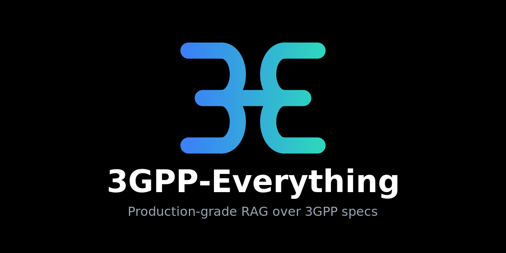
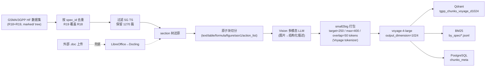
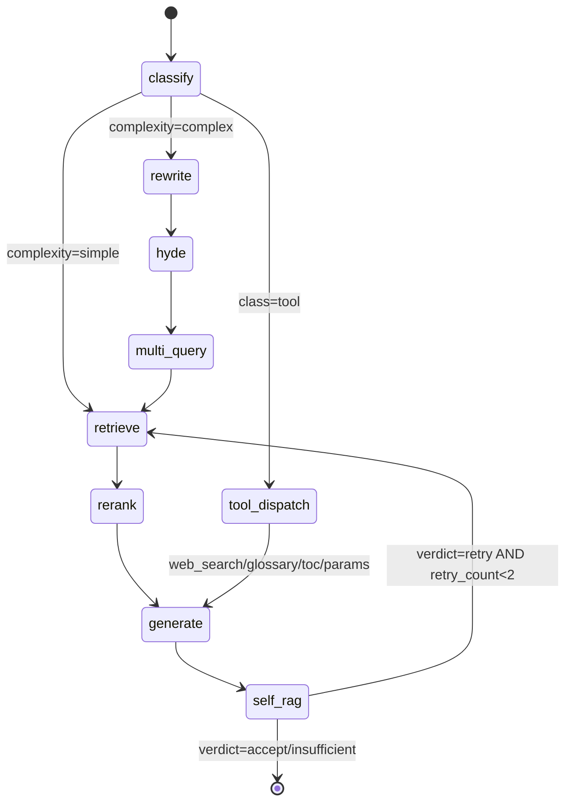
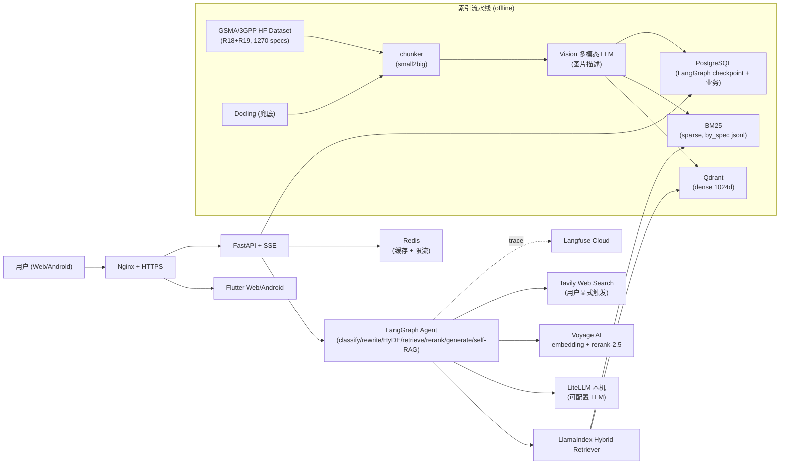

<p align="center">
  
</p>

# 3GPP-Everything

> 基于 3GPP 规范文档的生产级 RAG Agent —— 让你像查代码一样查协议。
> 🌐 在线访问：**[https://3gpp-everything.org/](https://3gpp-everything.org/)**

[](https://3gpp-everything.org/) []() [](./LICENSE)

## 是什么

一个对 3GPP 标准文档做深度 RAG 的 Agent 系统，覆盖 GSMA 发布的 **Rel-18 + Rel-19 全部 5G 系列 TS（1270 篇 / 394,859 段落块）**。核心是：用自然语言问 3GPP，拿到**带段落级原文引用、可点击跳转到完整章节**的回答，遵循协议的严谨性**，不掺杂模型通用知识**。

你可以：

- **问问题，拿原文**：自然语言提问（如"PDU Session 建立完整流程"），得到带 `[spec § 章节]` 引用的回答；点引用 chip 直接打开章节阅读器看完整原文。
- **跨文档 / 多证据推理**：复杂问题（多实体、多文档对比）自动走 HyDE + multi-query + 多文档检索 + self-RAG 自评闭环。
- **工具型查询**：缩写表（glossary）、章节目录（toc）、参数/IE 字段（params）、Web 搜索（仅用户显式触发，结果标注"未经 3GPP 验证"）。
- **收藏 / 笔记 / 反馈**：对回答收藏、记笔记；点赞/点踩反馈，管理员可溯源到整段会话与引用。
- **会话可控**：流式输出，支持取消 / 暂停 / 恢复、历史分叉（fork）与回滚（rollback）。

## 核心能力（按当前实现）


| 能力               | 说明                                                                                                           |
| ---------------- | ------------------------------------------------------------------------------------------------------------ |
| **检索增强问答**       | Hybrid 检索（Qdrant dense 1024 维 + BM25 sparse + RRF 融合）→ Voyage rerank → LLM 生成；small2big 召回（命中小块、回展父 section） |
| **段落级引用 + 阅读器**  | 回答内嵌 `[spec_id § section ¶offset]` 引用，正则抽取为可点 chip → 跳转章节阅读器看完整原文                                            |
| **严格 grounding** | 仅基于检索内容生成；查无证据明示"未在 3GPP 文档中找到"；self-RAG 用独立模型做 grounding/coverage/confidence 三维自评（最多 retry 2 次强制收敛）         |
| **双路 Agent**     | simple 快路径（术语/字段定义，P95 < 15s）；complex 路径（多证据，HyDE + multi-query + self-RAG，P95 < 60s）                        |
| **工具调度**         | glossary / toc / params / web_search（web 仅显式触发并标注未验证）                                                        |
| **会话与协作**        | 多轮历史压缩、checkpoint 取消/暂停/恢复、fork/rollback；收藏、笔记、反馈、管理员反馈溯源                                                    |
| **鉴权**           | JWT + refresh + RBAC（普通用户 / 管理员）                                                                             |
| **流式**           | LangGraph `astream_events` → SSE 10 类事件（run/node/chunks_hit/chunks_rerank/token/final/…）                     |


## 与华为 Telco-RAG 的对比评测

在 **100 题中立自产题集**（从 A∩B 的 R18 交集 spec 采样、闭卷、负题对称）上，三方盲评对比：

- **A = 3GPP-Everything**（本项目；LLM 可配置，本次基准用 mimo-v2.5-pro）
- **B = 华为开源 Telco-RAG**（`github.com/netop-team/Telco-RAG`，生成 LLM = gpt-4o-mini，R18 离线库）
- **C = 裸 LLM 基线**（deepseek-v4-pro，无检索）—— 用于检验"RAG 是否真有用，还是 LLM 预训练就会"
- 裁判 = **glm-5.1**（与三方生成 backbone 都不同源，避免同源偏袒）；成对盲评匿名 + 位置对冲。

**Scorecard**


| 指标                    | A 本项目    | B 华为 Telco-RAG | C 裸 LLM |
| --------------------- | -------- | -------------- | ------- |
| 正确性 fact_coverage（正题） | **0.80** | 0.22           | 0.44    |
| spec 归属命中（可溯源）        | **96%**  | 7%             | 39%     |
| 检索到 recall（A/B）       | 0.93     | 0.12           | —       |
| 利用率 = 答出÷检索到（A/B）     | 0.84     | 0.58           | —       |
| ✅ 正确拒答（负题）            | **93%**  | 0%             | 56%     |
| ⚠️ 幻觉率（负题，越低越好）       | **0%**   | 93%            | 43%     |


**成对盲评胜率（位置对冲）**：A vs B = **98:2**；A vs C = **84:10**（平 6）。

**结论**

1. **本项目（A）在每一项指标上都明显第一**：最正确（fact_coverage 0.80）、可溯源（spec 命中 96%）、负题零幻觉。
2. **RAG 的价值取决于检索质量**：A 相对裸 LLM 基线（C）带来 +0.36 正确性并把幻觉压到 0，体现好检索的增益；B 在本中立题集上检索召回偏低（spec 命中 7%）是其得分的主因。

> 完整方法、逐题数据与详细报告：`[eval/huawei_compare/results/REPORT.md](./eval/huawei_compare/results/REPORT.md)`；题集与可复现代码见 `[eval/huawei_compare/](./eval/huawei_compare/)`。

## 技术栈

> **设计原则**：现成轮子优先 + 复用本机服务 + 关键质量环节走海外 SOTA + 主 LLM 走本机国产 LiteLLM。

### Agent / RAG 框架（三件套协同）


| 层          | 选型                                                           | 角色                                                               |
| ---------- | ------------------------------------------------------------ | ---------------------------------------------------------------- |
| **编排层**    | [LangGraph](https://github.com/langchain-ai/langgraph) 1.x   | 状态机、节点流式（`astream_events`）、PostgreSQL checkpointer 持久化会话上下文与中断恢复 |
| **数据/检索层** | [LlamaIndex](https://github.com/run-llama/llama_index) 0.13+ | 文档摄取、Hybrid Retriever、BM25、reranker 包装                           |
| **适配层**    | [LangChain](https://github.com/langchain-ai/langchain) 0.3+  | LLM 客户端（`ChatOpenAI` → LiteLLM）、Tool 装饰器、Prompt 模板               |


> **关键边界**：LangGraph 节点不直接调 LlamaIndex 的高层 query engine（黑盒），而是把 LlamaIndex 当成"可控的检索 SDK"暴露 `retrieve / rerank` 等原子函数给 graph 调用。

### 模型层

> **生成侧 LLM 不锁定**：所有 LLM 统一走本机 [LiteLLM](https://github.com/BerriAI/litellm) proxy（OpenAI 协议适配），生成/Vision/self-RAG 等用哪个模型**可自由配置、随时切换**，不写死任何具体模型。Embedding / Reranker 当前以 Voyage 为默认。下方"评测基准"行的模型名仅作复现基准记录。


| 用途                                   | 模型                                | 备注                                                                                        |
| ------------------------------------ | --------------------------------- | ----------------------------------------------------------------------------------------- |
| **生成 / Agent 主脑**                    | 可配置 LLM（任意 OpenAI 兼容，经本机 LiteLLM） | 需 ≥1M context / function calling / 长 horizon 能力；按需切换                                      |
| **轻量任务**（路由/改写/multi-query/self-RAG） | 可配置 LLM（经本机 LiteLLM）              | —                                                                                         |
| **Vision**（索引期图片描述）                  | 可配置多模态 LLM（经本机 LiteLLM）           | 单次调用同时输出 description + 结构化字段（figure_kind / visible_labels / visible_acronyms / spec_role） |
| **Embedding（当前默认）**                  | `voyage-4-large` @ **1024 维**     | Voyage AI；MRL 截断（2048 vs 1024 retrieval 差距 ≤ 2pp，省存储一半 + 检索更快）                            |
| **Reranker（当前默认）**                   | `rerank-2.5`                      | Voyage AI；top-50 → top-5                                                                  |
| **Eval Judge**（评测基准）                 | `deepseek-v4-pro`                 | Ragas faithfulness / answer relevancy / correctness；与生成模型异源避免 self-bias                   |
| **Negative Judge**（评测基准）             | `mimo-v2.5-pro`                   | 拒答题 VALID/PARTIAL/INVALID 三档判别                                                            |
| **对比裁判**（评测基准）                       | `glm-5.1`                         | 华为对比测试成对盲评 + 绝对指标（与对比三方 backbone 都不同源）                                                    |


### 数据 / 存储 / 缓存（**复用宿主已运行实例**）


| 层        | 选型                                         | 用途                                                                        |
| -------- | ------------------------------------------ | ------------------------------------------------------------------------- |
| 向量库      | Qdrant                                     | dense 检索（`tgpp_chunks_voyage_d1024`，394,859 points）                       |
| 关系库      | PostgreSQL                                 | 业务数据 + LangGraph `AsyncPostgresSaver` checkpoint + ApiUsage               |
| 稀疏检索     | LlamaIndex BM25                            | 持久化到 `INGEST_DATA_DIR/bm25/voyage/by_spec/{spec_id}.jsonl`，backend 加载现场构建 |
| 缓存       | Redis                                      | retrieve/rerank/Vision 描述/history summary，跨进程共享                           |
| ORM / 迁移 | SQLAlchemy 2.0 (async) + asyncpg + Alembic | 与 LangGraph PG checkpointer 共用连接                                          |


### 后端 / 前端 / 工具


| 层                  | 选型                                                                                                                                 |
| ------------------ | ---------------------------------------------------------------------------------------------------------------------------------- |
| 后端                 | FastAPI + SSE + Pydantic v2 + python-jose（JWT + refresh + RBAC）                                                                    |
| 前端                 | Flutter 3.x（Web + Android 同码） + Riverpod 2.x + go_router + dio (SSE) + flutter_markdown_plus + flutter_math_fork；黑白主调 + 冷调蓝 accent |
| Web 搜索（用户显式触发）     | Tavily                                                                                                                             |
| 监控                 | Langfuse Cloud（每节点 span + token stream + dataset run）                                                                              |
| 评测                 | Ragas + 175 题金标准 YAML + TeleQnA 原生 MCQ + 华为对比 100 题中立集；`eval-{daily,weekly}` GitHub Actions CI                                     |
| 部署                 | Docker Compose + Nginx + Let's Encrypt（独立 ingress 项目跨项目分流）                                                                         |
| Lint / Type / Test | Ruff + Black + MyPy + Pytest + pytest-asyncio + httpx                                                                              |


完整决策依据与备选见 `[docs/02-tech-selection.md](./docs/02-tech-selection.md)`。

## RAG 策略

### 数据摄取（offline indexing）




**关键策略**：

- **主源走预解析数据**：直接消费 `[GSMA/3GPP](https://huggingface.co/datasets/GSMA/3GPP)` HF `marked/` 文件树（每篇 spec 一个 `raw.md` + 同目录图片），避免从零造解析。
- **chunking = small2big**：~250 token 小检索 chunk + parent section 大召回（`parent_section_id` 分组）；表格 / 公式 / 图片 / ASN.1 / RRC action list 走原子切片不切碎；chunk 头部强制注入 `[<spec_id> § <clause> <title>]` 让 BM25 命中标题词、embedding 获得上下文。
- **chunk_id 真·幂等**：`uuid5(spec_id + clause + sha256(content)[:16])` —— 内容不变 → ID 不变 → 重跑无重复。
- **Vision**：多模态 LLM 单次调用同时产出 description + 结构化字段；Redis 永久缓存按 `sha256(image_bytes)` 去重。
- **Embedding 维度**：单值 1024 维（节省存储一半 + 检索更快，retrieval 指标差距 ≤ 2pp）。
- **Reranker**：Voyage `rerank-2.5`，与 voyage embedding 同供应商协同最佳。

### Agent 状态图（online query）




**分支与性能预算**：


| 路径                   | 触发                                        | 节点序列                                                                                   | P95   |
| -------------------- | ----------------------------------------- | -------------------------------------------------------------------------------------- | ----- |
| **simple fast path** | 单一术语 / 字段定义                               | classify(含 rewrite) → retrieve → rerank → generate → 轻量 grounding check                | < 15s |
| **complex**          | 多 entity / 多文档证据                          | rewrite → hyde → multi_query → retrieve/rerank → generate → self-RAG（最多 retry 2 次强制收敛） | < 60s |
| **tool 路径**          | `query_class==tool` 且 `explicit_tools` 非空 | classify → tool_dispatch → generate（模板化渲染）→ self_rag                                   | 视工具   |


**核心检索逻辑**：

```python
# Hybrid retrieve（dense + sparse + RRF + small2big）
queries = state.rewritten_queries or [state.user_input]
if state.hyde_doc: queries.append(state.hyde_doc)        # complex 路径才有
for q in queries:
    dense  = await dense_retriever.aretrieve(q, top_k=30)   # Qdrant @ 1024 维
    sparse = await sparse_retriever.aretrieve(q, top_k=30)  # LlamaIndex BM25
    candidates.extend(rrf_merge(dense, sparse, k=60))       # RRF: score=Σ 1/(60+rank_i)
unique = dedup_by_chunk_id(candidates)[:50]
# rerank: voyage rerank-2.5, top-50 → top-5
reranked = await voyage_client.rerank(query, [c.content for c in unique], model="rerank-2.5", top_k=5)
```

- **Redis 缓存**：`tgpp:cache:retrieve:{sha256(query+filter)}` / `tgpp:cache:rerank:{sha256(query+top_chunk_ids)}`，TTL 1h。
- **小2big 召回**：拿到命中 chunk 后按 `parent_section_id` group by 取整段 section 给 reranker / LLM；超长 section 退化为 N=5 邻居窗口。

**严格 grounding 守约**：

1. Prompt 强约束："仅基于 reranked 内容生成；找不到 → 明示'未在 3GPP 文档中找到 …'"。
2. 引用格式 `[spec_id § section_path ¶offset]` + 正则抽取写入 `state.citations`。
3. self-RAG 用**独立模型**做三维自评避免同源偏差；`insufficient` 直接走"找不到"分支。
4. `web_search` 仅在用户**显式触发**时调用，结果强制加前缀"以下内容来自 Web 搜索，未经 3GPP 验证："。

详细节点实现 / Prompt 库 / Checkpoint 操作集见 `[docs/03-development/03-agent.md](./docs/03-development/03-agent.md)`。

## 架构速览




## 快速开始（本地自托管）

> **零宿主依赖**：standalone 把 Qdrant / LiteLLM / PostgreSQL / Redis **全部打进
> compose**，clone 下来一条命令起整个栈，不需要机器上预先跑任何服务。
> （若你已有现成的宿主 Qdrant / LiteLLM 想复用，走 `make dev`，见末尾「复用宿主服务」。）

```bash
# 1. 项目配置
cp .env.example .env
# 编辑 .env：APP_SECRET_KEY（openssl rand -hex 32）、POSTGRES_PASSWORD、
#            REDIS_PASSWORD、LITELLM_API_KEY（与下一步的 master key 一致）

# 2. LiteLLM proxy 配置（接你自己的模型上游；详见 deploy/litellm/README.md）
cp deploy/litellm/config.yaml.example deploy/litellm/config.yaml
cp deploy/litellm/.env.example         deploy/litellm/.env
# 编辑 deploy/litellm/.env：LITELLM_MASTER_KEY（= 项目 .env 的 LITELLM_API_KEY）+ 上游 key
# config.yaml 默认国产栈（mimo + voyage）；国际用户可改用内置的 OpenAI 栈

# 3. 起全栈（api + qdrant + litellm + pg + redis）
make standalone-up

# 4. 健康检查
curl http://127.0.0.1:8002/health   # liveness
curl http://127.0.0.1:8002/ready    # 4 依赖（PG/Qdrant/Redis/LiteLLM）全绿

# 5.（可选）Web UI —— 需先 host 上构建前端静态产物（镜像不含 Flutter SDK）
make web-build
docker compose -f deploy/docker-compose.standalone.yml --profile web up -d web   # → http://127.0.0.1:8082

# ── 索引侧 ──────────────────────────────────────────────
# 选项 A（推荐）：拉现成索引（395k chunks），免从零 ingestion（省 Voyage 费用 + 数小时）
./scripts/bootstrap-index.sh                  # 默认 HF: EpisodeYu/3gpp-everything-index
#   细节 / 兼容性约束见 deploy/index/README.md

# 选项 B：从零摄取（需 Voyage key + 时间；想自建 / 增量更新时用）
uv run --project ingestion python -m ingestion.cli pull-manifest
uv run --project ingestion python -m ingestion.cli pipeline-hf --spec-id 38.331
uv run --project ingestion python -m ingestion.cli index-status --provider voyage

# ── 评测侧 ──────────────────────────────────────────────
uv run --project eval python -m eval.cli golden validate -f eval/golden/v1.yaml
uv run --project eval python -m eval.cli golden stats    -f eval/golden/v1.yaml

# ── 测试 / lint ─────────────────────────────────────────
make lint                          # ruff + black + mypy
make test                          # unit + integration
```

<details>
<summary><b>复用宿主服务（<code>make dev</code>）</b></summary>

如果你的机器上已经跑着 Qdrant / LiteLLM（如多项目共享一套），用 `make dev`：它只起
业务容器 + 项目专属 PG/Redis，通过 external network 用容器名连宿主的 Qdrant / LiteLLM。
**注意**：`deploy/docker-compose.yml` 里的 external network 名（`p2-rag-assistant_default`
/ `litellm_default`）是按 maintainer 环境写的，复用前需改成你自己宿主上 Qdrant /
LiteLLM 所在的 compose network 名。一般自托管直接用上面的 standalone 更省事。

</details>

## 生产部署

> ⚠️ 下面这套是 **maintainer 自己的生产拓扑**：业务容器（`api + web + ingest`）跑在
> `docker-compose.prod.yml`，而 80/443 + TLS + Let's Encrypt + 跨项目分流抽到一个**独立的
> 私有 ingress 项目（`~/infra/ingress/`，不在本仓库内）**。Qdrant + LiteLLM 复用宿主已运行实例。
> **外部用户不要照抄 `~/infra/ingress/` 那几步**（你没有那个项目）——
> 自托管上生产请用上文的 **standalone**（它直接 publish `8002`/`8082`，前面**自备任意反代**
> （Nginx / Caddy / Traefik）做 TLS 即可），无需本项目的私有 ingress。下面的步骤仅供
> maintainer 同款环境复现参考。

```bash
# 1. 拉代码 + .env（ALLOWED_ORIGINS 追加 https://<DOMAIN>）
git clone <repo> && cd 3GPP-Everything && cp .env.example .env && vi .env

# 2. DNS A 记录 + 放行端口
sudo ufw allow 80,443/tcp

# 3. ingress 配置 + 业务镜像构建启动
cp ~/infra/ingress/.env.example ~/infra/ingress/.env && vi ~/infra/ingress/.env  # TGPP_DOMAIN/LETSENCRYPT_EMAIL/PUBLIC_IP
make prod-build && make prod-up

# 4. 签证书（先 staging 验链路，再切 prod）
cd ~/infra/ingress && ./scripts/init-letsencrypt.sh   # CERTBOT_STAGING=1→0 后再跑一次

# 5. 健康检查
make prod-health
curl -sS https://<DOMAIN>/health    # 200

# 6. 首个 admin（除非已有）
curl -X POST https://<DOMAIN>/api/v1/auth/bootstrap-admin ...

# 7（可选）: 全量索引
docker compose --profile ingest -f deploy/docker-compose.prod.yml run --rm ingest \
    python -m ingestion.cli pipeline-hf --releases 18,19 --provider $EMBEDDING_PROVIDER

# 日常运维
make prod-restart / prod-logs / prod-backup / prod-restore BACKUP=./backups/<ts>
```

完整 runbook、备份/恢复与故障回滚见 `[docs/03-development/07-cicd-and-deployment.md](./docs/03-development/07-cicd-and-deployment.md)`。

## 项目结构

```
3GPP-Everything/
├── docs/                  ← 需求 / 选型 / 开发文档
├── backend/               ← FastAPI + LangGraph Agent
│   ├── app/
│   │   ├── agent/         ← LangGraph 状态图 + 节点 + checkpoint 操作
│   │   ├── retrieval/     ← dense / sparse / hybrid / rerank / cache
│   │   ├── tools/         ← web_search / glossary / toc / params
│   │   ├── api/v1/        ← auth/sessions/chat SSE/checkpoint/reader/tools/
│   │   │                     favorites/notes/feedback/admin/users/docs
│   │   └── llm/           ← LiteLLM client + pricing
│   └── alembic/
├── ingestion/             ← HF 加载 + Docling 兜底 + Vision + chunker + indexer
├── frontend/              ← Flutter Web + Android（chat/reader/library/favorites/notes/admin）
├── eval/                  ← 金标准 175 题 + Ragas runner + 华为对比测试(eval/huawei_compare/)
├── deploy/                ← Docker Compose / Nginx / 脚本
├── .github/workflows/     ← CI / eval-daily / eval-weekly / deploy
├── .env.example
└── Makefile
```

## 设计要点

- **现成轮子优先**：3GPP 文档主源走 `[GSMA/3GPP](https://huggingface.co/datasets/GSMA/3GPP)` 官方 HF 数据集（已预解析为结构化 markdown），避免从零造解析。
- **服务器友好**：宿主已运行的 Qdrant / PostgreSQL / Redis / LiteLLM 全部复用，仅独立命名空间隔离。
- **混合 API 策略**：embedding/reranker 走 Voyage 海外 SOTA（当前默认），生成 LLM 走本机 LiteLLM（OpenAI 协议，可自由配置/切换，不锁定供应商），平衡质量与成本/可控性。
- **严格 grounding**：找不到证据明示"未在 3GPP 文档中找到"，Web 搜索仅在用户显式触发时启用并带"未经 3GPP 验证"标签。
- **流式 + 可取消 + 可恢复**：LangGraph `astream_events` + SSE 10 类 event；`AsyncPostgresSaver` checkpoint 支持取消/暂停/恢复/fork/rollback 全套语义。

## 当前不支持

多用户高并发优化 / 复杂细粒度 RBAC / 灰度发布 / 自动定时索引更新 / LLM 微调。

## 许可证

[MIT](./LICENSE)

3GPP 规范的版权归 3GPP / ETSI / ARIB / ATIS / CCSA / TSDSI / TTA / TTC 等成员所有；GSMA HuggingFace 数据集按其声明使用。

---

## English (brief)

A production-grade RAG agent over 3GPP specifications — live at **[https://3gpp-everything.org/](https://3gpp-everything.org/)**.

- **Coverage**: GSMA Rel-18 + Rel-19 5G-series TS — 1270 specs / 394,859 chunks.
- **Stack**: LangGraph (orchestration) + LlamaIndex (retrieval) + LangChain (adapters); FastAPI + SSE backend; Flutter Web/Android frontend.
- **Models**: generation / Vision / self-RAG run on a **configurable LLM** via local LiteLLM (any OpenAI-compatible model — not hardcoded); Embedding / Reranker default to Voyage `voyage-4-large` @ 1024d & `rerank-2.5`. Eval-baseline judges: `deepseek-v4-pro` (Ragas) / `glm-5.1` (Huawei comparison).
- **RAG**: GSMA/3GPP HF dataset → small2big chunking (atomic blocks for tables/formulas/ASN.1/figures) → multimodal-LLM Vision for figures → hybrid retrieval (Qdrant dense + BM25 + RRF) → Voyage rerank → LangGraph dual-path (simple fast / complex with HyDE + multi-query + self-RAG). Strict citation-only grounding; web search only when explicitly invoked.
- **vs Huawei Telco-RAG** (neutral 100-question R18 set, glm-5.1 judge): this project leads on every metric (fact-coverage 0.80 vs 0.22, spec-attribution 96% vs 7%, 0% vs 93% hallucination on negatives); RAG's value hinges on retrieval quality. Details: `[eval/huawei_compare/results/REPORT.md](./eval/huawei_compare/results/REPORT.md)`.

See `[docs/](./docs/)` for full design docs.