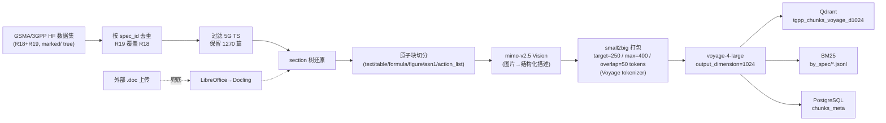
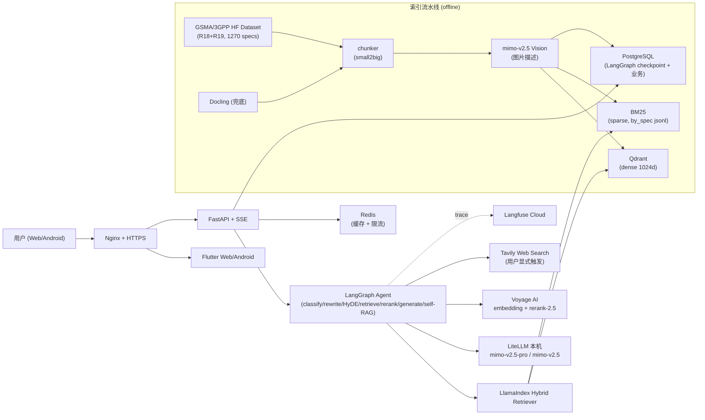

# 3GPP-Everything

> 基于 3GPP 规范文档的生产级 RAG Agent —— 让你像查代码一样查协议。

[]() []() [](./LICENSE) [](./docs/README.md)

## 是什么

一个对 3GPP 标准文档做深度 RAG 的 Agent 系统。你可以：

- **问问题，拿原文**：用自然语言问"PDU Session 建立完整流程是什么"，得到带段落级原文引用的回答，点击引用直接跳到完整章节阅读器
- **找原文**：切到"纯检索"模式，输入关键词返回相关章节段落 + 跳转
- **跨文档对比**：问"23.501 R18 vs R19 在 NEF 服务上的差异"，Agent 自动走多文档检索 + 对比
- **工具型查询**：缩写表、章节目录、参数 IE 字段查询

**严格 grounding**：找不到证据就直说"未在 3GPP 文档中找到"，绝不用模型通用知识糊弄。

## 当前阶段

```
M0 准备 ─ M1 数据接入 ─ M2 索引 POC ─ M3 维度决胜 ─ M4 Agent+后端 ─ M6 全量索引 ─ M7 评测扩展 ─ M5 前端 ─ M8 上线
   ✅        ✅           ✅            ✅(1024)      ✅              ✅(1270 specs)  ⏳ 进行中     ⏸ 与 M7 并行
```

**阶段性产出**：

| 里程碑 | 关键产出 |
|---|---|
| M3 (2026-05-16) | Voyage `voyage-4-large` **1024 维**胜出（MRL，2048 vs 1024 retrieval 差距 ≤ 2pp，tie-fallback 选 1024） |
| M4 (2026-05-18) | LangGraph 主干 9 节点 + self-RAG + 工具 dispatch + dual-path（simple/complex/raw_lookup）；FastAPI 全套路由（auth/sessions/chat SSE/checkpoint/reader/tools/admin/health）；176 unit + 80 integration 全绿 |
| M6 (2026-05-17) | GSMA Rel-18+Rel-19 5G 系列 TS **1270 篇**全量索引：394,859 chunks 入 `tgpp_chunks_voyage_d1024` + BM25 持久化（by_spec/jsonl）+ PG `chunks_meta`；Voyage 94.4M tokens / 9.5h |
| M7.0 (2026-05-20) | 金标准 `eval/golden/v1.yaml` 扩到 **175 题**（119 TeleQnA 转化 + 56 手写） |

**进行中**：M7.1+ 端到端 RAG runner（HTTP `/chat` SSE → Ragas → Langfuse Dataset → Daily/Weekly CI）。

里程碑按"完成度门禁"推进（**不绑定时间表**）：上一个里程碑的门禁未全绿，不进下一个。
完整里程碑与"必须自动化 / 必须人审"清单见 [`docs/03-development/00-overview.md`](./docs/03-development/00-overview.md)。

## 技术栈

> **设计原则**：现成轮子优先 + 复用本机服务 + 关键质量环节走海外 SOTA + 主 LLM 走本机国产 LiteLLM。

### Agent / RAG 框架（三件套协同）

| 层 | 选型 | 角色 |
|---|---|---|
| **编排层** | [LangGraph](https://github.com/langchain-ai/langgraph) 1.x | 状态机、节点流式（`astream_events`）、PostgreSQL checkpointer 持久化会话上下文与中断恢复 |
| **数据/检索层** | [LlamaIndex](https://github.com/run-llama/llama_index) 0.13+ | 文档摄取、Hybrid Retriever、BM25、reranker 包装 |
| **适配层** | [LangChain](https://github.com/langchain-ai/langchain) 0.3+ | LLM 客户端（`ChatOpenAI` → LiteLLM）、Tool 装饰器、Prompt 模板 |

> **关键边界**：LangGraph 节点不直接调 LlamaIndex 的高层 query engine（黑盒），而是把 LlamaIndex 当成"可控的检索 SDK"暴露 `retrieve / rerank` 等原子函数给 graph 调用。

### 模型层

| 用途 | 模型 | 提供方 | 备注 |
|---|---|---|---|
| **Agent 主脑** | `mimo-v2.5-pro` | 小米（本机 LiteLLM） | 1M context、function calling、长 horizon agent |
| **轻量任务**（路由/改写/multi-query/self-RAG） | `mimo-v2.5` | 小米（本机 LiteLLM） | 310B/15B MoE，原生 omni 多模态 |
| **Vision**（索引期图片描述） | `mimo-v2.5` | 小米（本机 LiteLLM） | 方案 E：单次调用同时输出 description + 结构化字段（figure_kind / visible_labels / visible_acronyms / spec_role）|
| **Embedding** | `voyage-4-large` @ **1024 维** | Voyage AI | M3 决胜（MRL，200M tokens 免费）|
| **Reranker** | `rerank-2.5` | Voyage AI | top-50 → top-5；200M tokens 免费 |
| **Eval Judge** | `glm-4.6` | 智谱（本机 LiteLLM） | Ragas faithfulness / answer relevancy；与生成模型异源避免 self-bias |

> 所有 LLM 统一走本机 [LiteLLM](https://github.com/BerriAI/litellm) proxy（OpenAI 协议适配），LangGraph 节点零额外抽象。

### 数据 / 存储 / 缓存（**复用宿主已运行实例**）

| 层 | 选型 | 用途 |
|---|---|---|
| 向量库 | Qdrant `:6333` | dense 检索（`tgpp_chunks_voyage_d1024`，394,859 points）|
| 关系库 | PostgreSQL `:5432` | 业务数据 + LangGraph `AsyncPostgresSaver` checkpoint + ApiUsage |
| 稀疏检索 | LlamaIndex BM25 | 持久化到 `INGEST_DATA_DIR/bm25/voyage/by_spec/{spec_id}.jsonl`，backend 加载现场构建 |
| 缓存 | Redis `:6379` | retrieve/rerank/Vision 描述/history summary，跨进程共享 |
| ORM / 迁移 | SQLAlchemy 2.0 (async) + asyncpg + Alembic | 与 LangGraph PG checkpointer 共用连接 |

### 后端 / 前端 / 工具

| 层 | 选型 |
|---|---|
| 后端 | FastAPI + SSE + Pydantic v2 + python-jose（JWT + refresh + RBAC） |
| 前端 | Flutter 3.x（Web + Android 同码） + Riverpod 2.x + go_router + dio (SSE) + flutter_markdown_plus + flutter_math_fork |
| Web 搜索（用户显式触发） | Tavily |
| 监控 | Langfuse Cloud（每节点 span + token stream）|
| 评测 | Ragas + 175 题金标准 YAML + TeleQnA 原生 MCQ + Telco-DPR 风格 retrieval-only |
| CI / 部署 | GitHub Actions + Docker Compose + Nginx + Let's Encrypt |
| Lint / Type / Test | Ruff + Black + MyPy + Pytest + pytest-asyncio + httpx |

完整决策依据与备选见 [`docs/02-tech-selection.md`](./docs/02-tech-selection.md)。

## RAG 策略

### 数据摄取（offline indexing）



**关键策略**：

- **主源走预解析数据**：直接消费 [`GSMA/3GPP`](https://huggingface.co/datasets/GSMA/3GPP) HF `marked/` 文件树（每篇 spec 一个 `raw.md` + 同目录图片），避免从零造解析
- **chunking = small2big**：~250 token 小检索 chunk + parent section 大召回（`parent_section_id` 作为分组 key）；表格 / 公式 / 图片 / ASN.1 / RRC action list 走原子切片不切碎；chunk 头部强制注入 `[<spec_id> § <clause> <title>]` 让 BM25 命中标题词、embedding 获得上下文
- **chunk_id 真·幂等**：`uuid5(spec_id + clause + sha256(content)[:16])` —— 内容不变 → ID 不变 → 重跑无重复
- **Vision 方案 E**：mimo-v2.5 单次调用同时产出 description + 结构化字段；Redis 永久缓存按 `sha256(image_bytes)` 去重（27k 图片引用 / 6.4k 唯一）
- **Embedding 维度**：M3 决胜后**单值 1024 维**（节省存储一半 + retrieval latency 快 30-50%，retrieval 指标差距 ≤ 2pp）
- **Reranker**：Voyage `rerank-2.5`，与 voyage embedding 同供应商协同最佳

### Agent 状态图（online query）

```mermaid
stateDiagram-v2
    [*] --> classify
    classify --> raw_lookup: mode=raw_lookup
    classify --> retrieve: complexity=simple
    classify --> rewrite: complexity=complex
    classify --> tool_dispatch: class=tool
    rewrite --> hyde
    hyde --> multi_query
    multi_query --> retrieve
    retrieve --> rerank
    rerank --> generate
    tool_dispatch --> generate: web_search/glossary/toc/params
    generate --> self_rag
    self_rag --> retrieve: verdict=retry AND retry_count<2
    self_rag --> [*]: verdict=accept/insufficient
    raw_lookup --> retrieve_only --> rerank_lookup --> [*]
```

**三路分支与性能预算**：

| 路径 | 触发 | 节点序列 | P95 |
|---|---|---|---|
| **simple fast path** | 单一术语 / 字段定义 | classify(含 rewrite) → retrieve → rerank → generate → 轻量 grounding check | < 15s |
| **complex** | 多 entity / 多文档证据 | rewrite → hyde → multi_query → retrieve/rerank → generate → self-RAG（最多 retry 2 次强制收敛） | < 60s |
| **raw_lookup** | 前端"纯检索"模式 | retrieve + rerank，**不调生成 LLM** | < 5s |
| **tool 路径** | `query_class==tool` 且 `explicit_tools` 非空 | classify → tool_dispatch → generate（模板化渲染）→ self_rag | 视工具 |

**核心检索逻辑**：

```python
# Hybrid retrieve（dense + sparse + RRF + small2big）
queries = state.rewritten_queries or [state.user_input]
if state.hyde_doc: queries.append(state.hyde_doc)        # complex 路径才有
for q in queries:
    dense  = await dense_retriever.aretrieve(q, top_k=30)   # Qdrant @ 1024 维
    sparse = await sparse_retriever.aretrieve(q, top_k=30)  # LlamaIndex BM25
    candidates.extend(rrf_merge(dense, sparse, k=60))       # RRF: score=Σ 1/(60+rank_i)
unique = dedup_by_chunk_id(candidates)[:50]
# rerank: voyage rerank-2.5, top-50 → top-5
reranked = await voyage_client.rerank(query, [c.content for c in unique], model="rerank-2.5", top_k=5)
```

- **Redis 缓存**：`tgpp:cache:retrieve:{sha256(query+filter)}` / `tgpp:cache:rerank:{sha256(query+top_chunk_ids)}`，TTL 1h
- **小2big 召回**：拿到命中 chunk 后按 `parent_section_id` group by 取整段 section 给 reranker / LLM；超长 section（`parent_section_chars > 50_000`）退化为 N=5 邻居窗口

**self-RAG 闭环**：

- 用独立 LLM（`mimo-v2.5`）做 grounding / coverage / confidence 三维自评，输出 `accept / retry / insufficient`
- `retry` 时把 `missing_aspects` 改写为新 query 回到 retrieve 节点；`retry_count >= 2` 强制 accept
- simple fast path 默认只做轻量 grounding check（`allow_retry=false`）；只有低置信度时才升级到完整 retry loop

**严格 grounding 三层守约**：

1. Prompt 强约束："仅基于 reranked 内容生成；找不到 → 明示'未在 3GPP 文档中找到 …'"
2. 引用格式 `[spec_id § section_path ¶offset]` + 正则抽取写入 `state.citations`
3. self-RAG 用**独立模型**避免同源偏差；`insufficient` 直接走"找不到"分支
4. `web_search` 工具仅在用户**显式触发**（`explicit_tools` 含 `"web_search"`）才调用，结果强制加前缀"以下内容来自 Web 搜索，未经 3GPP 验证："

### 流式 + 可控

- **SSE 协议**：LangGraph `astream_events(v="v2")` 重映射成前端友好的 10 类事件 —— `run_start / node_start / node_end / chunks_hit / chunks_rerank / token / final / cancelled / error / end`
- **取消 / 暂停 / 恢复**：`AsyncPostgresSaver` 在每个节点输出后落 checkpoint；后端通过 `aupdate_state({cancelled|paused: true})` + 节点边界 `langgraph.types.interrupt(...)` 实现
- **Fork / Rollback**：从历史 checkpoint 拷贝 thread → 新 `session_id`（原会话标 `archived_branch`）；rollback 删最近 N 个 checkpoint + PG `messages` 一致性
- **多轮历史压缩**：取最近 6 条原文 + 旧消息 `mimo-v2.5` summary 注入 prompt 头部，Redis `tgpp:cache:history_summary:{session_id}` TTL 24h

详细节点实现 / Prompt 库 / Checkpoint 操作集见 [`docs/03-development/03-agent.md`](./docs/03-development/03-agent.md)。

## 架构速览



## 文档

整个 Plan 分三部分，按顺序阅读：

| # | 文档 | 主题 |
|---|------|------|
| **1** | [`docs/01-requirements.md`](./docs/01-requirements.md) | 需求澄清 - 项目定位、场景、功能/非功能需求、验收标准 |
| **2** | [`docs/02-tech-selection.md`](./docs/02-tech-selection.md) | 技术选型 - 选型总表、决策依据、POC 计划、成本估算 |
| **3** | [`docs/03-development/`](./docs/03-development/) | 开发规划（8 份） - 总览/基础设施/摄取/Agent/后端/前端/评测/CICD |
| **4** | [`docs/04-handoff/`](./docs/04-handoff/) | 每个里程碑节点的完成报告 / 交接文档 |

完整索引：[`docs/README.md`](./docs/README.md)

## 快速开始

```bash
# 1. 准备
cp .env.example .env
# 编辑 .env 填入 HF_TOKEN、VOYAGE_API_KEY、LITELLM_*、QDRANT_*、PG_*、REDIS_*、LANGFUSE_* 等

# 2. 启动 dev compose（复用宿主已有 Qdrant / PostgreSQL / Redis / LiteLLM）
make dev
# 或: docker compose -f deploy/docker-compose.yml up --build

# 3. 后端健康检查
curl http://127.0.0.1:8002/health   # liveness
curl http://127.0.0.1:8002/ready    # 4 依赖（PG/Qdrant/Redis/LiteLLM）联通性

# ── 索引侧 ──────────────────────────────────────────────
# 拉取 HF manifest（缓存到 INGEST_DATA_DIR/manifest/）
uv run --project ingestion python -m ingestion.cli pull-manifest

# 单 spec 端到端索引（chunker → vision → embed → Qdrant + BM25 + PG）
uv run --project ingestion python -m ingestion.cli pipeline-hf --spec-id 38.331

# 状态查询
uv run --project ingestion python -m ingestion.cli index-status --provider voyage

# ── 评测侧 ──────────────────────────────────────────────
# 金标准校验 / 统计
uv run --project eval python -m eval.cli golden validate -f eval/golden/v1.yaml
uv run --project eval python -m eval.cli golden stats    -f eval/golden/v1.yaml

# ── 测试 / lint ─────────────────────────────────────────
make lint                                             # ruff + black + mypy
cd backend    && uv run pytest -m unit                # 176 unit
cd backend    && uv run pytest -m integration         # 80 + 21 integration
cd ingestion  && uv run pytest                        # 292 passed, 6 skipped
```

> Flutter 前端 (`frontend/`) 当前为骨架，M5 启用（与 M7 评测扩展并行）。

## 项目结构

```
3GPP-Everything/
├── docs/                  ← 需求 / 选型 / 开发规划 / 里程碑 handoff
├── backend/               ← FastAPI + LangGraph Agent（M4 完成 ✅）
│   ├── app/
│   │   ├── agent/         ← LangGraph 状态图 + 9 节点 + checkpoint 操作
│   │   ├── retrieval/     ← dense / sparse / hybrid / rerank / cache
│   │   ├── tools/         ← web_search / glossary / toc / params
│   │   ├── api/v1/        ← auth/sessions/chat SSE/checkpoint/reader/admin
│   │   └── llm/           ← LiteLLM client + pricing
│   └── alembic/
├── ingestion/             ← HF 加载 + Docling 兜底 + Vision + chunker + indexer
├── frontend/              ← Flutter Web + Android（M5 启用）
├── eval/                  ← 金标准 YAML + TeleQnA 转化 + Ragas runner（M7 进行中）
├── eval-results/          ← M2/M3/M6 retrieval baseline 报告
├── deploy/                ← Docker Compose / Nginx / 脚本
├── .github/workflows/     ← CI / nightly eval / deploy
├── .env.example
└── Makefile
```

## 设计要点

- **现成轮子优先**：3GPP 文档主源走 [`GSMA/3GPP`](https://huggingface.co/datasets/GSMA/3GPP) 官方 HF 数据集（已预解析为结构化 markdown），评测集骨架走 [`TeleQnA`](https://github.com/netop-team/TeleQnA)，避免从零造解析与黄金集
- **服务器友好**：宿主已运行的 Qdrant / PostgreSQL / Redis / LiteLLM 全部复用，仅独立命名空间隔离，不在 3.8GB 内存的机器上再起一套
- **混合 API 策略**：embedding/reranker 走 Voyage 海外 SOTA，主 LLM 走本机 LiteLLM 国产 (MiMo)，平衡质量与成本/可控性
- **严格 grounding**：找不到证据明示"未在 3GPP 文档中找到"，Web 搜索仅在用户**显式触发**时启用，结果带"未经 3GPP 验证"标签
- **流式 + 可取消 + 可恢复**：LangGraph `astream_events` + SSE 10 类 event；`AsyncPostgresSaver` checkpoint 支持取消/暂停/恢复/fork/rollback 全套语义

## 验收标准（高阶）

完整版见 [`docs/01-requirements.md §6`](./docs/01-requirements.md#6-验收标准高阶)。

- ✅ GSMA Rel-18 + Rel-19 5G 系列 TS（1270 篇）完成索引
- ⏳ 金标准评测 ≥120 题：faithfulness ≥ 0.85、context recall ≥ 0.80（M7 nightly 跑宽松版 0.75/0.65；M8 上线收紧到严格版）
- ⏸ Web + Android 端均可走完"提问 → 流式响应 → 看引用 → 跳章节"（M5）
- ✅ Docker Compose 一键拉起；⏸ Nginx + HTTPS 公网可访问（M8）
- ⏳ CI 全绿：lint + unit + integration + RAG eval

## 不在本期范围

多用户并发 / 复杂 RBAC / 灰度发布 / 移动端深度交互优化 / 自动定时索引更新 / LLM 微调。

详见 [`docs/01-requirements.md §5`](./docs/01-requirements.md#5-不在本期范围)。

## 许可证

[MIT](./LICENSE)

3GPP 规范的版权归 3GPP / ETSI / ARIB / ATIS / CCSA / TSDSI / TTA / TTC 等成员所有；GSMA HuggingFace 数据集按其声明使用。

---

## English (brief)

A production-grade RAG agent over 3GPP specifications.

- **Stack**: LangGraph (orchestration) + LlamaIndex (retrieval) + LangChain (tools); FastAPI + SSE backend; Flutter Web/Android frontend
- **Models**: `mimo-v2.5-pro` / `mimo-v2.5` (local LiteLLM, omni multimodal) + Voyage `voyage-4-large` @ 1024d (MRL-truncated) + `rerank-2.5`
- **RAG strategy**: GSMA/3GPP HF dataset → small2big chunking (target 250 / max 400 / overlap 50 Voyage tokens, atomic blocks for tables/formulas/ASN.1/figures) → mimo-v2.5 Vision for figures → hybrid retrieval (Qdrant dense + LlamaIndex BM25 + RRF) → Voyage rerank → LangGraph dual-path (simple fast / complex with HyDE+multi-query+self-RAG / raw lookup)
- **Grounding**: strict citation-only generation; web search only when explicitly invoked; self-RAG verifier with cap-2 retry
- **Status (2026-05-20)**: M0–M4 + M6 done (1270 specs / 394,859 chunks indexed); M7 evaluation expansion in progress (golden set 175 items); M5 Flutter frontend in parallel

See [`docs/`](./docs/) for the full plan.
