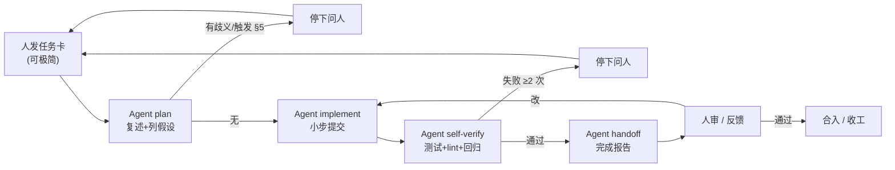

# 00 - Vibe Coding 协作协议

> 本文是 Agent 与人在 3GPP-Everything 项目内部协作的"操作手册"。
> 与项目根 `CLAUDE.md` 同读；冲突时以 `CLAUDE.md` 为准。

## 1. 角色与边界

| 角色 | 主要职责 | 不做 |
|------|---------|------|
| **Agent**（你） | 代码实现、单元/集成测试、自动化调试、文档维护、CI 配置、回归验证、提交 PR、跑评测、写完成报告 | 不替人做产品决策、不替人审 UX、不动用钱/动数据/破坏安全的事情 |
| **人**（用户） | 产品方向、需求澄清、UX 反馈、阶段验收、上线节奏、密钥与外部账号、成本审批、重大方案选择 | 不写代码、不调 Agent 已经能自动化的事情；只在 §5 列出的触发条件下介入 |

> 简单说：**Agent 负责"怎么做"，人负责"做不做、做什么、何时做、谁付钱"。**

## 2. 协作循环



**节奏由谁控**：人决定"现在做哪个里程碑"，Agent 决定"这个里程碑内部按什么顺序、跑多久"。

## 3. 任务卡格式（人写给 Agent，可极简）

人提任务时不必填完整 8 字段；以下是 Agent 收到任务后**心里要展开**的字段。如果人没给清，Agent 应该在 plan 阶段补齐并请人确认。

```yaml
task:
  id: <可选，如 M2-ingest-poc-01>
  goal: 一句话目标
  scope: 涉及哪些模块/文件（粗）
  acceptance:                # 完成的可验证条件
    - 自动化：xxx 测试通过
    - 人审：xxx 输出由人看一眼
  out_of_scope:              # 防止 Agent 顺手扩张
    - 不做 yyy
  context:                   # 相关文档/已有代码指针
    - docs/03-development/02-...md §4.1
  deadline_hint: 软目标（可不填）
```

**人最常用的极简版**（也合法）：

```
做 docs/03-development/02-ingestion-and-indexing.md §4.1 HF loader，完成后我看一下。
```

Agent 收到这种极简任务后，应该按 `CLAUDE.md §6.1` 的 plan 步骤把上面字段补齐再开工。

## 4. Agent 完成报告模板（每个任务完成后输出）

```markdown
## 任务：<goal>

### 交付物
- <文件/模块/接口/文档变更点 1>
- <...>

### 自验证结果
- [x] make lint：通过（或：N 个旧 warning，本任务未引入新问题）
- [x] make test-unit：A passed, B skipped
- [x] make test-int：C passed
- [x] 回归（如适用）：eval subset N 题，context_recall=X.XX，faithfulness=Y.YY
- [x] ReadLints：clean

### 留给人审的项
- 是否符合 UX 预期：截图/录屏 / curl 输出片段
- 评测分数是否可接受
- 命名/接口名是否对外可读

### 自主决策记录（来自 CLAUDE.md §4.3）
- 把 chunk overlap 选成了 120，理由：与文档区间一致 + 简单 spec 上抽检看着合理
- 在 X 处加了 5 行 debug log，方便日后排查

### 剩余风险 / 已知问题
- <比如：Voyage 限流时尚未做 backoff，记入 TODO 而非本任务范围>

### 下一步建议
- <如果有自然的下一任务，建议人选哪一个>
```

> 没有这份报告 → 任务未结束。报告越简短越好，但上面 5 段都不能空。

## 5. 升级 / 回报机制

### 5.1 何时升级

参见 `CLAUDE.md §5` 的 10 条触发条件。**任何一条命中就停**。

### 5.2 升级消息格式

```markdown
**[需要人介入]**

触发条件：<对应 CLAUDE.md §5 第几条>

我在做什么：<一句话>
我现在卡在哪：<一句话>
我已经尝试过：
  - 尝试 1：xxx → 结果 yyy
  - 尝试 2：zzz → 结果 www
我看到的选项：
  - A：xxx（代价 / 影响）
  - B：xxx（代价 / 影响）
我的倾向：A，理由是 ...
等你说一声再继续。
```

### 5.3 长任务的可见性

Agent 在跑 > 5 分钟的任务（全量索引、跑评测、大规模 refactor）时，应：

- 任务开始前给一个**总步数**预估或**预期耗时**
- 中途至少给 1 次进度（"已完成 30/120 题，目前 recall avg=0.78"）
- 如果实际进度比预期慢 50% 以上，主动告知 + 给原因

## 6. 测试与回归测试分层

| 层 | 跑什么 | 何时跑 | 强制度 |
|----|-------|--------|--------|
| **L0 单元 (unit)** | 每个纯函数/数据变换/路由 schema | 每次改动相关代码后 | 必须，红了不算完成 |
| **L1 集成 (integration)** | API + DB + Qdrant + Redis；mock LiteLLM | 触及 API/DB/检索任一时 | 必须 |
| **L2 RAG 子集 eval** | 10 题金标准（分层抽样） | 触及 Agent/检索/prompt 时 | 必须，阈值见 06 文档 |
| **L3 完整回归 (smoke + eval full)** | 端到端 smoke + 30-100 题完整 eval | "大功能完成" + 上线前 | 必须，由 Agent 主动触发 |
| **L4 nightly** | 全量 eval + 性能 + 成本 | 定时 CI | 自动，结果告警人 |

**"大功能完成"的判定**（来自 `CLAUDE.md §4.2`）：

- 在某份 `03-development/*.md` 顶部"交付物"清单中勾掉 ≥ 1 条
- 或跨 ≥ 3 个模块/文件改动
- 或人显式说"这个完成后跑一下回归"

### 6.1 测试可以不写的极少数情况

- 纯文档改动（`docs/`）
- 纯注释 / 类型 hint 补充（无运行时影响）
- 纯重命名（且 IDE / `sed` 能确认全部引用都已替换）
- pyproject.toml 的版本号 bump（但 `dependencies` 列表变化必须有最小冒烟测试）

这些情况下，完成报告里要点名"本任务无需测试，因为 X"。

## 7. 决策留痕（Agent 与人共同维护）

变更超过"小范围调整"的决策写到对应 `03-development/*.md` 的相关章节里。**不另立 ADR 目录**，避免双轨。

什么算"变更"：

- 增删一个模块边界
- 切换 embedding/LLM/reranker 供应商
- 改了对外 API 路径或 SSE event 名
- 改了 Qdrant collection 命名规则
- 改了评测阈值

记录方式：在对应 `03-development/*.md` 相关小节增加一段「变更 YYYY-MM-DD」或「决策」短记录，写清楚：背景、选项、最终选择、影响范围。

## 8. 失败处理与回滚

- 任务跑一半失败：尝试 1 次自修；再失败 → 升级（§5）
- 部署失败：自动跑 `deploy/scripts/deploy.sh <previous-sha>` 回滚后告人（见 07 文档 §6.3）
- 评测分数突降：停止任何 prompt / chunking / embedding 改动，先 bisect 出"哪个 PR 引入退化"
- 索引数据损坏：从最近 snapshot 恢复（见 07 文档 §7），不要原地修

## 9. 上下文管理

- 不要把 8 份开发文档全塞进上下文。每个任务**只读涉及的子文档**。
- 跨文档引用：用 `docs/03-development/XX-...md §Y.Z` 这种锚点格式，让接力的下个 Agent / 人能定位。
- 长任务过程中累积的中间产物（脚本、临时 fixture）：要么提交进 `deploy/scripts/` 或 `eval/builder/`，要么完成时清掉，不要留在工作树里。

## 10. 与外部世界的边界

| 场景 | Agent 可以自己做 | 必须人介入 |
|------|-----------------|-----------|
| LiteLLM 调用 | 单次 / 几十次 / dev 测试 | 全量 batch（>100 次 或 >1M token） |
| Voyage embedding | POC 范围 < 1 万 chunks | 全量索引（1296 篇 spec） |
| Tavily Web 搜索 | dev / 单次冒烟 | 批量评测 |
| Vision 描述 | 抽检 < 50 张 | 6.4k 张唯一图片全量跑 |
| Qdrant 写入 | 任意（本项目 collection） | 删除 collection / 改命名规则 |
| PG 写入 | 业务表正常 CRUD | 任何 schema 变更必走 Alembic migration |
| 部署到生产 | 不可 | 必须人手动 approve |
| 给 GitHub repo push 到 main | 不可 | 走 PR，人 merge |
| 修改 `.env`（项目根真实文件，不是 example） | 不可 | 必须人来 |

## 11. 命名与文风

Agent 在写新文档 / 注释 / commit message 时：

- 中英混排：技术名词保留英文（`PostgresSaver`, `Hybrid Retriever`），叙述用中文
- 不在文档里写"我"或"我们"；用客观陈述
- 文档章节结尾不要写"以上就是 X 的完整方案，希望对你有帮助"这种 LLM 客套
- 不在代码里加"// Increment counter" 这种废话注释（参 `CLAUDE.md §`）

## 12. 完成 vs 暂存

- **完成**：跑通自验证 + 报告 + commit + 推上 PR
- **暂存**：没跑通也没空跑通 → 必须发"中间报告"说明当前可用范围、未覆盖的项，并把代码留在 feature branch 不要污染 main

不允许"我先合上去后面补测试"。

## 13. 协议本身的演化

本协议本身是活文档。Agent 在执行中如果发现某条规则"明显增加摩擦但没带来收益"或"与现实严重不符"：

1. 不要擅自改本文件
2. 在完成报告"剩余风险 / 已知问题"里写一句"建议改 §X.Y"
3. 等人确认后再改

---

入场顺序见 `CLAUDE.md §10`。
