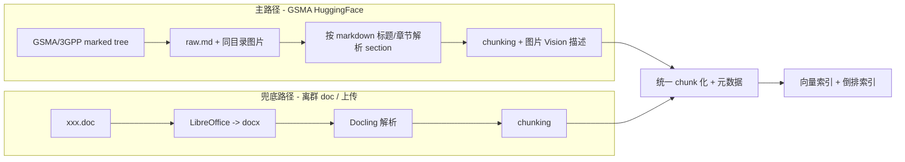

# 01 - 需求澄清

> Plan 第 1 部分。定义"做什么、做到什么程度"，不含技术选型与开发拆分。

## 1. 项目定位

3GPP-Everything 是一个基于 3GPP 规范文档的 RAG Agent 系统，提供两种核心服务：

- **检索原文**：用户输入关键词/问题，返回相关 3GPP 段落原文 + 章节定位
- **基于文档问答**：基于 3GPP 内容用自然语言回答，附段落级原文引用与章节跳转

技术上按生产级交付（CI/CD、评测、监控、HTTPS、鉴权、备份/恢复），本期即实现**多用户基础能力**。目标不是高并发 SaaS，而是小规模多用户低并发私有服务：账号、角色、审计和配额从第一版落地，复杂组织/租户权限留到二期。

## 2. 用户与场景

- 用户：协议工程师/学习者（先期可只有一名管理员使用，但账号体系按多用户实现）
- 主要场景：
  1. 问 3GPP 协议的语义问题（"PDU Session 建立完整流程"）—— 默认问答模式，带引用与章节跳转
  2. 找原文（"38.331 中 RRCReconfiguration 的 IE 列表"）—— 一键切到"纯检索原文"模式
  3. 工具型查询：缩写、术语、参数、章节目录 —— 调用专门工具节点

> 注：跨版本对比（如 "23.501 R17 vs R18 差异"）不在范围内——RAG 源策略对同一 spec 只保留最新 release（详见 §3.1），物理上无法支持。

## 3. 功能需求

### 3.1 文档语料

- **范围**：**Rel-18 + Rel-19 中 5G 相关系列的 TS 文档，不收录 TR**；按 `spec_id` 去重并保留最新 release（同一 spec 同时存在 R18/R19 时保留 R19；R18-only 保留 R18）
- **系列白名单**：核心系列 `21/22/23/24/28/29/31/32/33`，无线接入 `36/37/38`，周边与垂直主题 `26/27/34/35`
- **主要来源**：[`GSMA/3GPP`](https://huggingface.co/datasets/GSMA/3GPP) HuggingFace 数据集——官方维护；当前实际形态为 `marked/Rel-{18,19}/{NN}_series/{spec_id}/raw.md` + 同目录图片文件，`original/` 保留官方 doc/docx 源文件
- **量级**：按 GSMA `main`（2026-04-15，sha `25e0bfe...`）统计：Rel-18 `1345` 篇、Rel-19 `1557` 篇，合计 `2902` 个 release-doc entries；跨 release 重复 `1173` 篇，去重后再过滤 TS + 5G 系列白名单，保留 `1296` 篇（Rel-19 `1274` 篇、R18-only `22` 篇），`raw.md` 约 `621MiB`
- **系列分布**：核心系列 `932` 篇，无线接入 `200` 篇，周边与垂直主题 `164` 篇
- **图片量级**：过滤后约 `27,042` 个图片文件引用，按文件名/hash 去重约 `6,435` 张唯一图片；Vision 描述必须基于图片 hash 缓存，避免重复调用
- **兜底来源**：内置 3GPP FTP 爬虫 + LibreOffice + Docling 解析链路——用于"用户上传的离群 spec"、"GSMA 数据集还未收录的最新版本"、"特定 Rel-17 或更老 spec 临时需求"等场景
- **更新**：手动触发"重新拉取 GSMA HF"；HF 推送新版即可更新；增量重建索引

### 3.2 文档解析（两条链路）

- **主路径**：直接消费 GSMA HF `marked/` 文件树——表格已 inlined 在 `raw.md` 中、公式 GSMA 已转化；需从 markdown 标题/章节文本中还原 section 树，再做 chunking 与图片 Vision 描述
- **兜底路径**：保留 LibreOffice + Docling，用于外部 doc 上传 / Rel-17 / 最新 freeze 未入 HF 的 spec
- 解析单元保留：spec 编号、release、章节号路径（如 `5.6.1.2`）、章节标题、所在 document_order
- 公式：保留 LaTeX 形式（GSMA 输出已是 markdown 内可识别公式），前端 MathJax/KaTeX 渲染
- 表格：GSMA 已 inline 在 section body 中；chunking 时若表格独占段落则拆为独立 chunk
- 图片：GSMA 在 spec 目录下提供 jpg 等图片文件；按图片 bytes hash 生成并缓存 Vision 结构化描述加入检索，原图前端可点击查看

### 3.3 Agent 能力（最高档 + 平衡延迟）

LangGraph 编排，节点包含：

- **查询分类/路由**：判定"定义类 / 流程类 / 工具型"等，走不同检索策略
- **查询改写 + HyDE**（仅复杂查询）
- **多查询拆分**（仅复杂查询）
- **多路检索**：向量 + BM25 关键词 + 章节路径过滤
- **Reranker**
- **生成**
- **self-RAG / CRAG 自校验**：低置信度触发二次检索或承认未找到
- **多轮对话**：会话级上下文，可对话内追问/澄清

外部工具节点：

- Web 搜索（**仅用户显式触发**，非自动回退；用于查规范进度/最新会议结论/外部术语解释）
- 缩写/术语表查询
- 章节目录检索（"列出 38.331 §5.3 所有子节"）
- 参数/IE 字段查询（"X 字段在哪些 spec 里出现过"）

**性能路由策略**：

- **所有查询都必须流式反馈**：从入口起就持续向前端推送 SSE 事件——节点状态（路由中/检索中/重排中/生成中）、工具调用、思考过程、命中 chunk 预览、token 增量；不允许"先黑屏等几秒再一次性吐结果"
- 简单查询 → 单跳 RAG（≤3 次 LLM 调用，<15s）
- 复杂查询 → 完整链路（4-6 次调用，可达 30-60s）

### 3.4 严格 Grounding

- 默认禁止使用模型通用知识补齐；找不到证据明确告知"未在已索引的 3GPP 文档中找到"
- Web 搜索是**独立工具**，不是 grounding 回退；调用时输出明示"以下内容来自 Web 搜索，未经 3GPP 验证"

### 3.5 多语言

- 输入：中英任意
- 内部检索改写为英文 query
- 回答语言与用户输入语言一致
- 原文引用 always 英文

### 3.6 引用与原文体验

- 段落/表格/公式级精确定位，回答中以可点击引用标注（`23.501 §5.6.1 ¶3`）
- 点击引用：高亮段落 + 上下文可展开 + 一键跳到完整章节阅读器
- 前端内置"文档阅读器"：章节目录树 + 全文 markdown 视图 + 当前会话高亮

### 3.7 前端

- **Flutter 单代码库同时交付 Web + Android**；MVP 优先 Web 体验，但 Android 也必须完成核心闭环验收
- **流式 UX**：SSE 节点状态流（改写中/检索中/重排中/生成中）+ token 流 + 命中 chunk 实时预览 + 中途取消/重问
- **会话 checkpoint 控制**（依托 LangGraph PostgresSaver，详见 §3.9）：
  - **暂停/恢复**：跑 Agent 中可"暂停"（区别于"取消"——暂停保留中间态，下次进会话从同一 checkpoint 续跑）
  - **从历史消息分叉重问**：点会话里某条 user 消息的"从这里重问"，从该轮 checkpoint 起新分支，旧分支折叠为只读历史（MVP 单线分叉，不做多分支并存树）
  - **会话回滚**：删除最后 N 轮消息（与对应 checkpoint），用于上下文跑偏时"清屏但保留前面有用部分"
- **管理页**（Web）：
  - 已索引文档/版本/chunk 数列表
  - 一键"拉取新文档/重建索引"
  - 会话评分统计
  - trace/eval 详情 → 跳 Langfuse（本地不重复造轮子）
- 用户行为：会话历史列表、收藏、笔记、thumb up/down 反馈

### 3.8 后端

- FastAPI + SSE
- 鉴权：多用户账号体系 + JWT/refresh token + RBAC（admin/user）+ 基础审计
- 文档管理/索引管理 API
- 会话/收藏/反馈 API
- **会话 checkpoint API**（包装 LangGraph PostgresSaver）：列出某会话的 checkpoints、从指定 checkpoint 分叉、暂停正在跑的 run、恢复已暂停 run、回滚最后 N 轮
- 健康检查、配置分离（dev/prod）

### 3.9 会话 checkpoint 与可恢复性

- **持久化层**：LangGraph `PostgresSaver` 在每个节点输出后落 checkpoint 到 PG（同库 `langgraph_checkpoints` schema），`thread_id = session_id`
- **MVP 范围**：
  - **暂停 / 恢复**：暂停 = 中断当前 run 但保留 checkpoint；恢复 = 从最后一个 checkpoint 续跑，不重做前面节点（区别于"取消 + 重问"——后者从头跑）
  - **单线分叉**：从某条历史 user 消息对应的 checkpoint 起新分支后，老分支变只读但仍保留在 DB（用户可切回查看），新分支成为当前活跃线
  - **会话回滚**：删除最后 N 轮 messages + 对应 checkpoints，恢复到第 N+1 轮末状态
- **不在 MVP 范围**：多分支并存的对话树可视化、checkpoint 时间轴 UI、跨会话合并、按 chunk 级粒度回滚

## 4. 非功能需求

### 4.1 性能与成本

- 优先 API 服务（Embedding / Reranker / Vision / 部分 LLM）
- Agent LLM：本机 LiteLLM 的 `mimo-v2.5-pro`
- 简单查询 P95 < 15s；复杂查询 P95 < 60s
- 不做高并发优化（按小规模多用户低并发设计，重点控制成本与稳定性）

### 4.2 可观测性

- **Langfuse Cloud Free Tier**：trace + 自动 eval + 数据集
- 后端结构化日志（JSON）
- 关键指标计数器（每日 token 消耗、API 费用估算、查询数）

### 4.3 质量保证（生产级 C 档）

- **RAG 评测集（≥ 120 题）**：
  - 主体：从公开 [`TeleQnA`](https://github.com/netop-team/TeleQnA) `Standards specifications` + `Standards overview` 类共 3000 道题中，**筛选与 Rel-18/19 TS 相关的 100-200 道** → 用 LLM 转化为"开放式问答 + 期望章节 + 关键事实点" → 人工校验修改
  - 补充：手工写 20-30 道复杂场景题（表格定位、公式查询、多章节合并推理、负样本）
- **自动评测**：Ragas + Langfuse eval（faithfulness、answer relevance、context recall、context precision）
- **辅助评测**：保留 TeleQnA 原生选择题模式作为"知识准确性"对照（看 LLM 选对 %）
- **检索专项评测**：参考 [`Telco-DPR`](https://huggingface.co/papers/2410.19790) 思路，对 retrieval-only 评 top-K / MRR（用于 M3 embedding 决胜）
- **CI/CD**：PR 触发 lint + 单元测试 + 集成测试 + RAG eval
- 高覆盖集成测试（覆盖每个 Agent 节点 + 端到端冒烟）
- 调试/生产配置分离
- 负载与成本告警（每日费用阈值）

### 4.4 部署

- **Docker Compose** 全栈编排
- 公网暴露 + 域名 + Let's Encrypt HTTPS + Nginx 反代 + 多用户鉴权
- 服务器 `/dev/vda2` 当前仅剩 5.4GB，**项目启动前需要准备 `/data` 可用空间 ≥ 50GB**（推荐扩容 +50GB；最低不低于 +30GB；M2-M3 维度 ablation 期 voyage 2048+1024 双 collection 临时占 ~7-8GB，M3 决胜后清理输者）

### 4.5 数据持久化

- 向量索引 + 原始 Markdown
- 会话历史
- 文档/版本元数据（已索引清单、上次更新时间）
- 用户收藏、笔记、反馈
- 用户账号、角色、refresh token、审计日志

## 5. 不在本期范围

- 高并发多租户 SaaS（组织/租户隔离、复杂权限矩阵、企业 SSO）
- 灰度发布 / AB
- 移动端深度交互优化（本期 Android 做核心闭环与基础适配，不做精细移动体验）
- 自动定时索引更新（手动触发即可）
- LLM 微调（业界共识：3GPP 频繁更新，RAG 优于微调）
- **多 Agent backbone 并存与用户显式模式选择**（二期演进方向）：
  - **用户显式 Agent 模式选择**：UI 上让用户主动选 `fast / deep / react / multi-agent`，覆盖系统自动路由
  - **ReAct 范式**：把 §3.3 现有的 self-RAG retry 升级成显式的 reasoning + action loop（LLM 自主决定是否继续检索、调用哪个工具、何时停止），与"复杂查询完整链路"形成两套独立 backbone
  - **专家团队多 Agent**：Supervisor + 多 worker（按系列/层面切分，如核心网 / 无线接入 / 安全），并行检索后讨论汇总
  - 不进入本期原因：(a) 与现有 self-RAG retry 语义重叠，效果增量需要先把基线跑起来才能验证；(b) 单查询成本翻 3-10 倍，与 §4.1 成本目标冲突；(c) 评测要按模式分桶重做，金标准集口径变化大；(d) 多 Agent 并行事件流需要重写前端可视化。MVP 保留 `explicit_tools` 轻量级显式开关即可（`mode: raw_lookup` 已于 2026-05-26 下线，仅保留 `qa`，协议章节引用改为可点击超链接）

## 6. 验收标准（高阶）

- **GSMA Rel-18 + Rel-19 去重保留最新、过滤为 5G 相关系列 TS 后的 `1296` 篇 specs 完成索引**（含保留集全量图片 Vision 描述、失败可续跑、重复图片 hash 缓存）
- **金标准评测 ≥ 120 题**（TeleQnA 抽取 + 转化 100-200 + 手工补充 20-30）：faithfulness ≥ 0.85、context recall ≥ 0.80
- TeleQnA Standards 类原生选择题 LLM 正确率 ≥ 80%（对照口径，不卡死）
- Web 端 + Android 端均可走完"登录 → 提问 → 流式响应 → 看引用 → 跳章节"完整链路
- **会话 checkpoint 闭环可用**：暂停跑中 run → 关页面 → 重进会话恢复续跑；从历史 user 消息分叉重问 → 新分支接管、旧分支只读保留；删除最后 N 轮 + checkpoints 后会话状态正确回滚
- 多用户基础能力可用：管理员初始化、登录/刷新 token、用户启停、admin/user 权限隔离、审计日志可查
- Docker Compose 一键拉起；Nginx + HTTPS 可公网访问
- CI 跑通：lint + unit + integration + RAG eval
- Langfuse 中能看到每次查询的完整 trace 与 eval 分数
