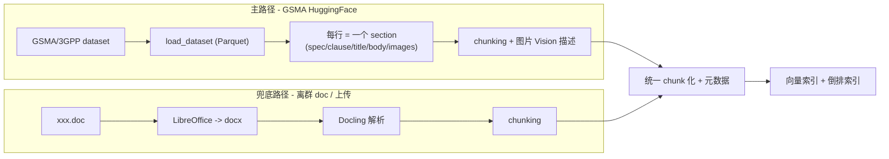

# 01 - 需求澄清

> Plan 第 1 部分。定义"做什么、做到什么程度"，不含技术选型与开发拆分。

## 1. 项目定位

3GPP-Everything 是一个基于 3GPP 规范文档的 RAG Agent 系统，提供两种核心服务：

- **检索原文**：用户输入关键词/问题，返回相关 3GPP 段落原文 + 章节定位
- **基于文档问答**：基于 3GPP 内容用自然语言回答，附段落级原文引用与章节跳转

技术上对标生产级（CI/CD、评测、监控、HTTPS、鉴权），但短期内**单用户**，不考虑多用户与高并发。

## 2. 用户与场景

- 用户：协议工程师/学习者（先期一人，账号体系预留多用户扩展）
- 主要场景：
  1. 问 3GPP 协议的语义问题（"PDU Session 建立完整流程"）—— 默认问答模式，带引用与章节跳转
  2. 找原文（"38.331 中 RRCReconfiguration 的 IE 列表"）—— 一键切到"纯检索原文"模式
  3. 跨文档/跨版本对比（"23.501 R17 vs R18 差异"）—— Agent 走更重的链路
  4. 工具型查询：缩写、术语、参数、章节目录 —— 调用专门工具节点

## 3. 功能需求

### 3.1 文档语料

- **范围**：**Rel-18 + Rel-19 全部 TS/TR**，覆盖 SA/RAN/CT 工作组
- **主要来源**：[`GSMA/3GPP`](https://huggingface.co/datasets/GSMA/3GPP) HuggingFace 数据集——官方维护，**已预解析为结构化 markdown**，每行 = 一个 section，含 `spec_number / release / clause / section_title / body / images` 字段
- **量级**：约 **938 篇 specs / 169k sections**，dataset 体积 ~1.51GB
- **兜底来源**：内置 3GPP FTP 爬虫 + LibreOffice + Docling 解析链路——用于"用户上传的离群 spec"、"GSMA 数据集还未收录的最新版本"、"特定 Rel-17 spec 临时需求"等场景
- **更新**：手动触发"重新拉取 GSMA HF"；HF 推送新版即可更新；增量重建索引

### 3.2 文档解析（两条链路）

- **主路径**：直接消费 GSMA HF 数据集——表格已 inlined 在 markdown body 中、公式 GSMA 已转化、章节号天然是字段；只需做 chunking 与图片 Vision 描述
- **兜底路径**：保留 LibreOffice + Docling，用于外部 doc 上传 / Rel-17 / 最新 freeze 未入 HF 的 spec
- 解析单元保留：spec 编号、release、章节号路径（如 `5.6.1.2`）、章节标题、所在 document_order
- 公式：保留 LaTeX 形式（GSMA 输出已是 markdown 内可识别公式），前端 MathJax/KaTeX 渲染
- 表格：GSMA 已 inline 在 section body 中；chunking 时若表格独占段落则拆为独立 chunk
- 图片：GSMA 提供 `images` 字段（原图引用列表），调用 Vision 多模态模型生成结构化描述加入检索；原图前端可点击查看

### 3.3 Agent 能力（最高档 + 平衡延迟）

LangGraph 编排，节点包含：

- **查询分类/路由**：判定"定义类 / 流程类 / 跨文档对比 / 工具型"等，走不同检索策略
- **查询改写 + HyDE**（仅复杂查询）
- **多查询拆分**（仅复杂查询）
- **多路检索**：向量 + BM25 关键词 + 章节路径过滤
- **Reranker**
- **生成**
- **self-RAG / CRAG 自校验**：低置信度触发二次检索或承认未找到
- **多轮对话**：会话级上下文，可对话内追问/澄清

外部工具节点：

- Web 搜索（**仅用户显式触发**，非自动回退；用于查规范进度/最新会议结论/外部术语解释）
- 缩写/术语表查询
- 章节目录检索（"列出 38.331 §5.3 所有子节"）
- 参数/IE 字段查询（"X 字段在哪些 spec 里出现过"）

**性能路由策略**：

- 简单查询 → 单跳 RAG（≤3 次 LLM 调用，<15s）
- 复杂查询 → 完整链路（4-6 次调用，可达 30-60s，必须流式反馈）

### 3.4 严格 Grounding

- 默认禁止使用模型通用知识补齐；找不到证据明确告知"未在已索引的 3GPP 文档中找到"
- Web 搜索是**独立工具**，不是 grounding 回退；调用时输出明示"以下内容来自 Web 搜索，未经 3GPP 验证"

### 3.5 多语言

- 输入：中英任意
- 内部检索改写为英文 query
- 回答语言与用户输入语言一致
- 原文引用 always 英文

### 3.6 引用与原文体验

- 段落/表格/公式级精确定位，回答中以可点击引用标注（`23.501 §5.6.1 ¶3`）
- 点击引用：高亮段落 + 上下文可展开 + 一键跳到完整章节阅读器
- 前端内置"文档阅读器"：章节目录树 + 全文 markdown 视图 + 当前会话高亮

### 3.7 前端

- **Flutter 单代码库同时交付 Web + Android**；MVP 优先 Web 体验，Android 交互适配排在 v2
- **流式 UX**：SSE 节点状态流（改写中/检索中/重排中/生成中）+ token 流 + 命中 chunk 实时预览 + 中途取消/重问
- **管理页**（Web）：
  - 已索引文档/版本/chunk 数列表
  - 一键"拉取新文档/重建索引"
  - 会话评分统计
  - trace/eval 详情 → 跳 Langfuse（本地不重复造轮子）
- 用户行为：会话历史列表、收藏、笔记、thumb up/down 反馈

### 3.8 后端

- FastAPI + SSE
- 鉴权：基础 token / 账号（账号体系预留多用户）
- 文档管理/索引管理 API
- 会话/收藏/反馈 API
- 健康检查、配置分离（dev/prod）

## 4. 非功能需求

### 4.1 性能与成本

- 优先 API 服务（Embedding / Reranker / Vision / 部分 LLM）
- Agent LLM：本机 LiteLLM 的 `mimo-v2.5-pro`
- 简单查询 P95 < 15s；复杂查询 P95 < 60s
- 不做高并发优化（单用户）

### 4.2 可观测性

- **Langfuse Cloud Free Tier**：trace + 自动 eval + 数据集
- 后端结构化日志（JSON）
- 关键指标计数器（每日 token 消耗、API 费用估算、查询数）

### 4.3 质量保证（生产级 C 档）

- **RAG 评测集（≥ 120 题）**：
  - 主体：从公开 [`TeleQnA`](https://github.com/netop-team/TeleQnA) `Standards specifications` + `Standards overview` 类共 3000 道题中，**筛选与 Rel-18/19 TS 相关的 100-200 道** → 用 LLM 转化为"开放式问答 + 期望章节 + 关键事实点" → 人工校验修改
  - 补充：手工写 20-30 道复杂场景题（跨文档对比、表格定位、公式查询、负样本）
- **自动评测**：Ragas + Langfuse eval（faithfulness、answer relevance、context recall、context precision）
- **辅助评测**：保留 TeleQnA 原生选择题模式作为"知识准确性"对照（看 LLM 选对 %）
- **检索专项评测**：参考 [`Telco-DPR`](https://huggingface.co/papers/2410.19790) 思路，对 retrieval-only 评 top-K / MRR（用于 M3 embedding 决胜）
- **CI/CD**：PR 触发 lint + 单元测试 + 集成测试 + RAG eval
- 高覆盖集成测试（覆盖每个 Agent 节点 + 端到端冒烟）
- 调试/生产配置分离
- 负载与成本告警（每日费用阈值）

### 4.4 部署

- **Docker Compose** 全栈编排
- 公网暴露 + 域名 + Let's Encrypt HTTPS + Nginx 反代 + 鉴权
- 服务器 `/dev/vda2` 当前仅剩 5.4GB，**项目启动前需要扩容 +20GB**

### 4.5 数据持久化

- 向量索引 + 原始 Markdown
- 会话历史
- 文档/版本元数据（已索引清单、上次更新时间）
- 用户收藏、笔记、反馈
- 用户账号（即便单用户也存 user_id，预留多用户）

## 5. 不在本期范围

- 多用户并发与权限矩阵（账号字段预留，逻辑暂不实现）
- 灰度发布 / AB
- 移动端深度交互优化
- 自动定时索引更新（手动触发即可）
- LLM 微调（业界共识：3GPP 频繁更新，RAG 优于微调）

## 6. 验收标准（高阶）

- **GSMA Rel-18 + Rel-19 全量 ~938 篇 specs 完成索引**（含图片 Vision 描述）
- **金标准评测 ≥ 120 题**（TeleQnA 抽取 + 转化 100-200 + 手工补充 20-30）：faithfulness ≥ 0.85、context recall ≥ 0.80
- TeleQnA Standards 类原生选择题 LLM 正确率 ≥ 80%（对照口径，不卡死）
- Web 端 + Android 端均可走完"提问 → 流式响应 → 看引用 → 跳章节"完整链路
- Docker Compose 一键拉起；Nginx + HTTPS 可公网访问
- CI 跑通：lint + unit + integration + RAG eval
- Langfuse 中能看到每次查询的完整 trace 与 eval 分数
