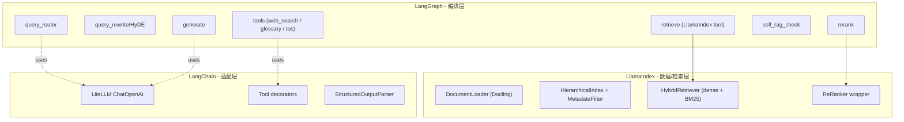
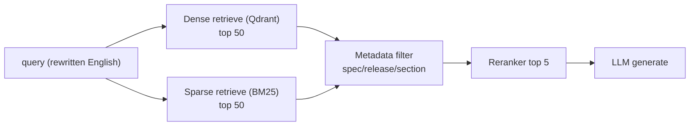
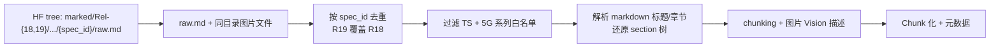
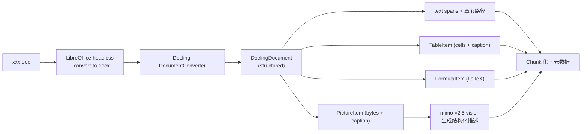
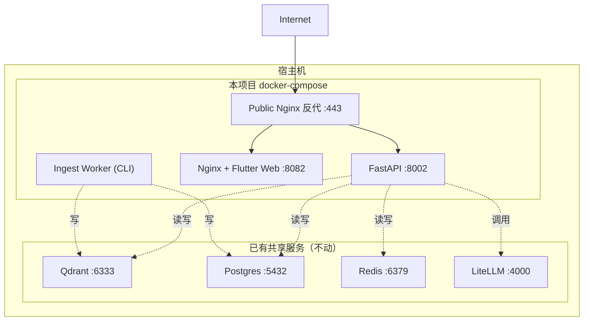
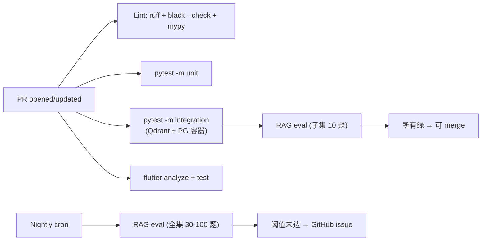

# 02 - 技术选型

> Plan 第 2 部分。逐项列出最终选型 + 备选 + 决策依据 + POC 计划 + 替换路径。
>
> 决策原则（来自需求文档 + 服务器现实）：
>
> 1. **服务器性能差**：2 核 / 3.8GB RAM（实际可用 ~500MB）/ 8GB swap，**严禁本地跑 embedding/reranker/重模型**
> 2. **磁盘紧张**：根盘 `/dev/vda2` 50G 已用 90%，本期要做全量 GSMA + 全量 Vision + 备份，**项目启动前必须准备 `/data` 可用空间 ≥ 80GB**（推荐扩容 +80GB，最低 +50GB）
> 3. **优先复用本机已有服务**：Qdrant（:6333）、PostgreSQL（:5432）、Redis（:6379）、LiteLLM（:4000）都已运行
> 4. **混合模式**：关键质量环节（embedding / reranker）走海外 SOTA API，其余环节走本地 LiteLLM 国产
> 5. **POC 验证**：embedding 选型有显著不确定性，必须用小子集双轨建索引 + 金标准评测后再全量
> 6. **优先吃现成轮子**：3GPP 文档主源走 [`GSMA/3GPP`](https://huggingface.co/datasets/GSMA/3GPP) HF 数据集（已预解析）；评测集骨架走 [`TeleQnA`](https://github.com/netop-team/TeleQnA)；自己只做"现成体系装配不出来的部分"

## 0. 选型总表

| 维度 | 最终选型 | 备选 | 关键理由 |
|------|---------|------|----------|
| **框架·编排** | LangGraph 1.x | - | 业界 2026 共识；PG checkpointer；状态流原生支持 |
| **框架·检索/解析** | LlamaIndex 0.13+ | - | Docling 集成、auto-merging/hierarchical 索引、hybrid 检索原生 |
| **框架·工具/Prompt** | LangChain 0.3+ | - | 与 LangGraph 同生态、Loader 全、Tools/Prompt 兼容层 |
| **Agent 主 LLM** | `mimo-v2.5-pro` (本机 LiteLLM) | `glm-4.6` | 1M context、function calling、长 horizon agent |
| **轻量 LLM**（路由/改写/多查询） | `mimo-v2.5` (本机 LiteLLM) | `glm-4.5-air` | 便宜一半、原生 omni、1M context |
| **Vision**（索引期图片描述） | `mimo-v2.5` (本机 LiteLLM) | `qwen-vl-plus` | 已在 LiteLLM、omni 多模态、零额外配置 |
| **Embedding（首选）** | Voyage `voyage-3-large` | 智谱 `embedding-3` | POC 双轨决出，默认主用 Voyage |
| **Embedding（POC 对照组）** | 智谱 `embedding-3` (本机 LiteLLM) | OpenAI `text-embedding-3-large` | 验证国产是否足够 |
| **Reranker** | Voyage `rerank-2` | Jina v2 | 与 voyage embedding 同供应商，协同最佳 |
| **稀疏检索** | LlamaIndex BM25 / SPLADE | Qdrant 原生 sparse | 与 dense 混合做 hybrid |
| **文档主源** | `GSMA/3GPP` HF `marked/` tree (Rel-18 + Rel-19，按 `spec_id` 去重保留最新，仅 5G 相关系列 TS) | TSpec-LLM (已陈旧)、自爬+Docling | 官方预解析 markdown；过滤后约 1296 篇；表格 inline、公式保留、图片为同目录文件；不收录 TR |
| **文档兜底** | LibreOffice + Docling | unstructured | 用于外部上传 doc / Rel-17 / 离群 spec |
| **FTP 爬虫** | `download_3gpp` PyPI | `gw-space/3gpp-document-downloader-mcp` | 兜底场景才用，主路径用 HF |
| **向量库** | Qdrant (复用本机 :6333) | pgvector | 已在运行、Rust、低资源 |
| **关系库 / LangGraph checkpoint** | PostgreSQL (复用本机 :5432) | SQLite | 已在运行、支持异步、LangGraph 原生支持 |
| **缓存** | Redis (复用本机 :6379) | 内存 LRU | 已在运行、跨进程共享 |
| **Web 搜索（显式工具）** | Tavily | Serper | langchain 生态默认、为 LLM 优化 |
| **评测集骨架** | `TeleQnA` Standards 类 3000 题 | TSpec-LLM 自带、Telco-DPR | MIT；筛选 + LLM 转化 + 人工校验 |
| **检索专项评测** | 参考 `Telco-DPR` 方法 (top-K / MRR) | - | Embedding POC 决胜口径 |
| **后端** | FastAPI + SSE | - | 用户已指定 |
| **后端 ORM** | SQLAlchemy 2.0 (async) + asyncpg | - | LangGraph PG checkpointer 共用连接 |
| **后端迁移** | Alembic | - | SQLAlchemy 标配 |
| **后端鉴权** | JWT + refresh token + RBAC + python-jose | fastapi-users | 本期按多用户基础能力实现，不再走静态 token 主路径 |
| **前端** | Flutter 3.x (Web + Android) | - | 用户已指定 |
| **前端状态** | Riverpod 2.x | Bloc | 比 Bloc 更轻量、官方推荐方向 |
| **前端流式协议** | SSE (HTTP) | WebSocket | FastAPI 简单、单向足够、移动端友好 |
| **前端 markdown/数学** | flutter_markdown_plus + flutter_math_fork | flutter_markdown core | LaTeX 与 Markdown 扩展能力更适合表格/引用定制 |
| **监控** | Langfuse Cloud Free | LangSmith | 用户已指定 |
| **评测** | Ragas + 金标准 YAML + Langfuse Datasets | DeepEval | Ragas 是 RAG 评测事实标准 |
| **CI** | GitHub Actions | - | 仓库在 GitHub |
| **Lint / Type** | Ruff + Black + MyPy | - | Python 2026 主流 |
| **测试** | Pytest + pytest-asyncio + httpx | - | FastAPI 标配 |
| **容器** | Docker Compose | - | 用户已指定 |
| **反代/TLS** | Nginx + Let's Encrypt (certbot) | Caddy | 用户已指定方向 |

## 1. 框架三件套（LangChain + LangGraph + LlamaIndex）的角色分工

业界 2026 production RAG agent 的成熟模式是**三框架协同**而非二选一：



- **LangGraph**：状态机、节点、流式（`astream_events`）、PostgreSQL checkpointer 持久化会话上下文与中断恢复
- **LlamaIndex**：文档摄取（DoclingReader）、层级化索引（auto-merging / parent-document）、Hybrid Retriever、Reranker 包装
- **LangChain**：作为 LLM 客户端层（`ChatOpenAI` 走 LiteLLM）、Tool 装饰器、Prompt 模板

**关键边界**：LangGraph 节点里不要直接调 LlamaIndex 的高层 query engine（黑盒），而是把 LlamaIndex 当成"可控的检索 SDK"暴露 `retrieve / rerank` 等原子函数给 graph 调用。

## 2. LLM 选型详情

### 2.1 已确认的本机 LiteLLM 模型清单

来自 `/home/s1yu/litellm/config.yaml`：

| Model Name | 供应商 | 模态 | Context | 用途 |
|-----------|--------|------|---------|------|
| `mimo-v2.5-pro` | 小米 | text + agent | 1M | **Agent 主脑** |
| `mimo-v2.5` | 小米 | **omni** (text/image/video/audio) | 1M | **Vision + 轻量任务** |
| `mimo-v2-omni` | 小米 | omni | 262K | Vision 备份 |
| `glm-4.6` / `glm-5.1` | 智谱 | text | - | 备份 LLM |
| `glm-4.5-air` | 智谱 | text | - | 超低成本备份 |
| `qwen-plus` / `qwen-max` | 阿里 | text | - | 备份 LLM |
| `embedding-3` | 智谱 | embedding | - | **Embedding POC 对照组** |

### 2.2 Agent 主脑 — `mimo-v2.5-pro`

- 1.02T 总参 / 42B active MoE，1M context
- 原生 function calling、prompt caching、JSON 模式
- 复杂软件工程 SWE-Bench 78.9
- 长 horizon agent：1000+ tool calls
- 定价 $1/$3 per M tokens

### 2.3 Vision / 轻量任务 — `mimo-v2.5`

- 310B 总参 / 15B active MoE，**原生多模态**（text/image/video/audio）
- 1M context
- 图表理解接近 Gemini 3 水平
- 定价 $0.40/$2.00 per M tokens（比 Pro 便宜一半）
- **用途**：
  - 索引期为图片生成结构化描述（批量任务，便宜要紧）
  - Agent 路由 / 查询改写 / multi-query 这类"短输入短输出"任务
  - 留 `mimo-v2.5-pro` 给主生成 + self-RAG 校验

### 2.4 LangChain ↔ LiteLLM 接入

走 OpenAI 协议适配：

```python
from langchain_openai import ChatOpenAI

llm_agent = ChatOpenAI(
    model="mimo-v2.5-pro",
    base_url="http://127.0.0.1:4000/v1",
    api_key="<LITELLM_MASTER_KEY>",
    streaming=True,
)
```

LangGraph 节点直接复用此 client，零额外抽象。

## 3. Embedding 选型与 POC 计划

### 3.1 选型不确定性

英文技术文档 retrieval 的 SOTA 是 Voyage `voyage-3-large`（32K context，MTEB retrieval 67.2），但智谱 `embedding-3` 在本机 LiteLLM 已配置，零额外接入成本。在 3GPP 这种**特殊领域、英文为主、表格公式多**的场景，两者差距未必显著到值得付费——必须实测。

### 3.2 POC 双轨方案

| 项 | Voyage `voyage-3-large` | 智谱 `embedding-3` |
|----|-------------------------|--------------------|
| 维度 | 1024 / 1536 / 2048（Matryoshka） | 2048 |
| Context | 32K | 8K（足够 chunk 级） |
| 价格 | $0.06 / M tokens | ¥0.5 / M tokens ≈ $0.07 |
| MTEB retrieval | 67.2（SOTA） | 公开数据稀缺 |
| 海外 API | 是（需 key + 代理）| 否（本机） |

**POC 流程**：

1. 选 20 篇代表性 TS（覆盖 SA / RAN / CT 各工作组，含表格密集 / 公式密集 / 流程图密集各几篇）
2. 用相同 chunking 策略分别建两个 Qdrant collection：`tgpp_chunks_voyage`、`tgpp_chunks_glm`
3. 在金标准评测集（30-100 题）上跑 retrieval-only 评测，对比 `context_recall@5/10/20`、`context_precision@5/10`、`MRR`
4. 胜出者用于全量索引；如差距 < 5%，选择智谱 embedding-3（成本更低、零依赖）

**预算**：
全量索引按 GSMA Rel-18+Rel-19 去重保留最新后仅保留 5G 相关系列 TS：`1296` 篇、`raw.md` 约 `621MiB` 估算；实际 chunk 与 embedding token 数以 M1 数据源审计输出为准。Voyage 一次全量预计仍是低十美元级；POC 双轨与少量重建可承担，但 Vision 描述需要按图片 hash 缓存控制一次性成本。

### 3.3 索引向量重建路径

预留 `embedding_provider` 字段在 chunk 元数据里。切换 embedding 时无需重新解析 doc，只需重新走 embedding+索引环节。

## 4. Reranker — Voyage `rerank-2`

- 16K query context，多语言，cross-encoder
- 与 voyage-3-large embedding 同供应商，**双方训练上下文一致**，hybrid 协同最佳
- 价格 $0.05 / 1K queries
- 调用模式：每次检索 top-50 candidates → reranker → top-5

如 embedding POC 智谱胜出（不走 Voyage），reranker 回退到 **Jina reranker v2**（8K context、价格 Cohere 1/5、国内可访问性好）。

## 5. 检索 - Hybrid



- **Dense**：Qdrant + Voyage / GLM embedding
- **Sparse**：LlamaIndex 内置 `BM25Retriever`（基于 rank_bm25），独立持久化到磁盘
- **元数据过滤**：spec_id、release、series、section_path、chunk_type（text/table/formula/figure_desc）
- **融合**：reciprocal rank fusion (RRF) → reranker

如 LlamaIndex BM25 性能不够，二期切到 Qdrant 原生 sparse vector（`bm42` / `splade`）。

## 6. 向量库 — Qdrant（复用本机）

- 本机已运行 v1.17.1 在 `127.0.0.1:6333`，已有 `forge_docs` collection
- **新建独立 collection**：`tgpp_chunks_voyage`、`tgpp_chunks_glm`（POC 期）→ 收敛后保留胜者
- 不影响现有 `forge_docs`，无需独立部署
- 单机 p95 检索目标 < 100ms；Rel-18+Rel-19 TS-only 5G 系列预计为数十万级 chunks，Qdrant 单机可承载，但必须以 M1/M2 实测 chunk 数校准内存、磁盘和 payload index 大小

**注意事项**：

- API key：现有 Qdrant 实例如开启了 API key 鉴权需取，本项目内通过 `.env` 注入
- 备份策略：Qdrant snapshot API，每日打 snapshot 到独立挂载目录

## 7. 关系库 — PostgreSQL（复用本机）

- 本机已运行 `:5432`
- **新建独立 database**：`tgpp_everything`（与其他项目隔离）
- 用途：
  1. 业务表：users / sessions / messages / documents / document_versions / chunks_meta / favorites / notes / feedback / api_usage
  2. **LangGraph checkpoint store**：`langgraph_checkpoints` schema（LangGraph 1.x `PostgresSaver` 原生支持）
- ORM：SQLAlchemy 2.0 async + asyncpg
- 迁移：Alembic

## 8. 缓存 — Redis（复用本机）

- 本机已运行 `:6379`
- 使用独立 db number（如 `db=5`）与其他项目隔离
- 用途：
  - Embedding query 缓存（key = `embed:{provider}:{sha256(query)}`，TTL 1d）
  - Reranker 缓存（key = `rerank:{sha256(query+candidates)}`，TTL 1d）
  - Vision 图片描述缓存（key = `vision:{sha256(image)}`，TTL 永久）
  - 热点 chunk 缓存
  - 限流（用户级 token 桶）

## 9. Web 搜索 — Tavily（用户显式触发）

- 专为 LLM agent 优化，返回干净 markdown 文本，自带摘要
- LangChain `TavilySearchResults` 原生 Tool
- $0.01 / call，免费层 1000 calls/月足够测试
- 在 Agent 节点中**只在用户消息含明确触发词或 UI 开关开启时调用**；返回内容带 `source=web` 标记，前端展示"未经 3GPP 验证"提示

## 10. 文档解析（双路径）

### 10.1 主路径 — GSMA/3GPP HuggingFace 数据集



- **天然解析好**：每篇 spec 已转换为 `raw.md`（表格 inline、公式可解析），但不再是 section 行表；loader 需从 markdown 标题/章节文本中还原 section 树
- **图片**：图片是 spec 目录下的 jpg 等文件；按 bytes hash 调 `mimo-v2.5` 生成结构化描述并永久缓存
- **过滤规则**：只保留 `spec_type=TS`，不收录 TR；系列白名单为 `21/22/23/24/26/27/28/29/31/32/33/34/35/36/37/38`
- **量级**：Rel-18 `1345` 篇、Rel-19 `1557` 篇；合计 `2902` 个 release-doc entries，跨 release 重复 `1173` 篇；按 `spec_id` 去重后再过滤 TS + 5G 系列白名单，保留 `1296` 篇，`raw.md` 约 `621MiB`
- **图片规模**：保留集约 `27,042` 个图片文件引用、约 `6,435` 个唯一图片 hash；单篇如 `38.211` 只有 3 张左右，但图密集 spec 会贡献数百张
- **license**：核对 GSMA 数据集声明，本项目内部使用合规即可

### 10.2 兜底路径 — LibreOffice + Docling

仅在以下场景启用：

- 用户上传外部 `.doc` / `.docx`
- HF 数据集尚未收录的最新 freeze 版本（freeze 公告与 GSMA 推送之间的窗口）
- Rel-17 或更老 spec 的"临时调出"



**版本**：Docling ≥ 2.12

### 10.3 统一 chunking 策略（两路径共用）

- **以章节为最小单元**先做 hierarchical 切分
- 文本段落 chunk：500-800 tokens，120 overlap
- 表格 chunk：每个 table 独立，附带 caption + 前 1 段上下文
- 公式 chunk：公式 LaTeX + 前后 2 句上下文
- 图片 chunk：vision 描述（200-400 tokens） + caption
- 每个 chunk 强制带 `parent_section_id`，支持 **auto-merging retriever**

## 11. 前端栈

| 项 | 选型 | 理由 |
|---|------|------|
| 框架 | Flutter 3.x stable | 用户指定 |
| 状态管理 | Riverpod 2.x | 比 Bloc 轻量、官方推荐、AsyncNotifier 适合流式 |
| HTTP | dio 5.x | 拦截器丰富、SSE 支持成熟 |
| 流式 | SSE（dio + transformer） | 单向流足够、移动端长连优于 WS |
| Markdown | flutter_markdown_plus | 维护活跃、支持自定义 builder |
| 数学公式 | flutter_math_fork | LaTeX 社区标准 |
| 路由 | go_router 14+ | 官方推荐 |
| 国际化 | flutter_localizations + intl | 中英双语 |

**SSE vs WebSocket 决策**：3GPP-Everything 的流是**单向**（后端 → 前端），SSE 简单且 Flutter Web/Android 都支持；中途取消通过新的 HTTP `DELETE /sessions/{sid}/runs/{rid}` 实现，不需要双向通道。

## 12. 部署架构



- 端口选择避开现有占用：API `:8002`、Web `:8082`、Public Nginx `:443/:80`
- `docker-compose.yml` 通过 `extra_hosts: ["host.docker.internal:host-gateway"]` 或 `network_mode: "host"` 访问宿主已有服务
- 索引 worker 不常驻，按需 `docker compose run --rm ingest python -m ingestion.cli ...`

## 12.1 资源边界与容量规划

本期目标是完整生产级交付，但宿主机规格很低（2 核 / 3.8GB RAM，实际可用内存可能只有数百 MB），因此必须把"在线服务"和"重型作业"分开规划：

| 类别 | 运行位置 | 约束 |
|------|----------|------|
| API / Web / Nginx | 项目 Docker Compose | 常驻，内存预算尽量 < 1GB |
| Qdrant / PostgreSQL / Redis / LiteLLM | 宿主已有共享服务 | 不在本项目 compose 内重复启动 |
| Flutter / Docker image 构建 | GitHub Actions 或开发机 | 不在低配生产机上构建 |
| 全量 HF ingest / Vision 描述 / embedding | `ingest` 容器按需运行，默认并发 1-2 | 必须支持断点续跑、限流、失败队列 |
| RAG eval 全集 | Nightly CI 或手动任务 | 生产机只保留结果，不承担重评测压力 |

磁盘规划按全量 Vision 口径：

| 项 | 估算 |
|----|------|
| HF cache（`raw.md` + 图片文件 + repo 元数据） | 5-10GB |
| 规范 markdown / section JSON / 元数据中间产物 | 3-6GB |
| 图片缓存与 Vision 结果 | 3-10GB |
| Qdrant 生产 collection | 3-8GB（视维度/quantization） |
| POC 双轨 collection 临时空间 | 6-16GB |
| BM25 / eval-results / 日志 | 2-5GB |
| Docker image / volume 余量 | 10-15GB |
| 本地短期备份与 snapshot 暂存 | 15-25GB |

**硬要求**：`/data` 可用空间 ≥ 80GB，低于 50GB 不进入全量索引；全量完成后清理 POC collection 与中间缓存，长期只保留胜出 provider 的生产 collection。

## 13. CI / 质量保证



- **Lint**：Ruff（替代 flake8+isort+pyupgrade）+ Black（格式化）+ MyPy（strict 模式渐进开启）
- **测试**：pytest + pytest-asyncio + httpx + pytest-cov；分 `unit / integration / eval` marker
- **集成测试容器**：Docker Compose 起 ephemeral Qdrant + Postgres，单测后销毁
- **RAG eval**：Ragas（faithfulness / answer_relevance / context_recall / context_precision），结果上传 Langfuse Datasets

## 14. POC / 验证里程碑（关键决策点）

| POC | 何时做 | 目标 | 决策点 |
|-----|--------|------|--------|
| P1: 文档解析单文件 | 开发周 1 | 1 篇 GSMA `raw.md` TS（含表格/公式/图片）走完 markdown section 解析 + mimo-v2.5 描述；另用 1 篇上传 doc 验证 Docling 兜底 | GSMA markdown 是否能稳定还原章节层级；mimo-omni 图片描述质量是否可用；Docling 兜底是否可用 |
| P2: 索引 20 篇 + 检索 | 开发周 2-3 | 20 篇代表性 TS 建索引、查询能召回正确章节 | Hybrid 是否优于单向量；chunking 策略验证 |
| P3: Embedding 双轨评测 | 开发周 3-4 | Voyage vs 智谱 在金标准集上的 retrieval 指标 | 决定全量用哪个 embedding |
| P4: Agent 端到端冒烟 | 开发周 5 | 完整 LangGraph 跑通一次复杂查询 | 验证 self-RAG / 工具调用 |
| P5: 流式 UX 验证 | 开发周 6 | Flutter Web 跑通 SSE 节点状态流 | SSE 兼容性 / 取消机制 |

## 15. 成本估算（小规模多用户、按 Voyage embedding 全量胜出口径）

> 量级更新：GSMA Rel-18+Rel-19 去重保留最新并过滤为 5G 相关系列 TS 后约 `1296` 篇，`raw.md` 约 `621MiB`。chunk 数与 embedding tokens 以 M1/M2 实测校准；暂按 `100M` embed tokens 做容量预算。

| 项 | 计费 | 估算 |
|----|------|------|
| 索引一次性·Embedding | Voyage 100M tokens × $0.06 / M = **$6** | ~$6 |
| 索引一次性·Vision 描述（保留集约 27,042 个图片引用；hash 去重约 6,435 张唯一图片） | 按唯一图片估：输入 12.9M × $0.40 + 输出 9.7M × $2 ≈ $24.5；若无 hash 缓存按引用重复调用，上限约 $100 | ~$25（有缓存） |
| Agent 月查询 100 次 × 6 LLM 调用 × 10K tokens | mimo-pro 6M × $3 ≈ $18 | ~$18 |
| Embedding 查询 100 × 6 query × 500 tokens | 0.3M × $0.06 ≈ $0.02 | ~$0.02 |
| Reranker 100 × 6 × 50 candidates | Voyage rerank 600 calls × $0.05/K = $0.03 | ~$0.03 |
| Tavily Web 搜索 20 次/月 | 免费层 | $0 |
| Langfuse Cloud | Free | $0 |
| **合计·首月（含一次性索引）** | | **≈ $50-70** |
| **合计·后续月（不含索引）** | | **≈ $18-25** |

> Vision 描述仍是主要批处理作业之一，但实际 GSMA 图片存在大量跨 release / 跨 spec 重复。已确认本期按**保留集全量图片 Vision**交付，因此控费策略不用于跳过图片，只用于限流、失败续跑、重复图片 hash 缓存与预算告警。若唯一图片数或平均输出 token 明显高于估算，必须先暂停作业并更新成本审批。

多用户低并发阶段按 5 名活跃用户 / 月 1000 次查询估算，后续月成本约为上表 Agent 与检索调用的 10 倍，即 **$180-250/月**。这不是高并发容量承诺，只用于提前设置成本告警阈值。

## 16. 替换/逃生路径

| 场景 | 触发条件 | 替代方案 |
|------|---------|----------|
| Voyage 海外不可达 | 网络不稳 | 全部切智谱 `embedding-3` + Jina reranker（已是 POC 对照组） |
| `mimo-v2.5-pro` 限流/不稳 | LiteLLM 报错率 > 5% | 走 `glm-4.6` fallback（在 LiteLLM 加 fallback chain） |
| Qdrant 单机不稳 | 内存/磁盘报警 | 数据冷备到 pgvector（同 PostgreSQL 内）作为应急 |
| 服务器内存爆 | 实际开发阶段才能定位 | 把 ingest worker 拆到独立 VM；或减小 chunk 数量、走 Matryoshka 缩维 |

## 17. 待用户提供的运行依赖（项目启动前需就绪）

| 项 | 说明 |
|---|------|
| 磁盘扩容到 `/data` 可用空间 ≥ 80GB | 为 HF cache、全量 Vision、Qdrant、Docker volume、日志与短期备份留出空间 |
| **HuggingFace token** | 拉 `GSMA/3GPP` 数据集（`HF_TOKEN` 环境变量；huggingface.co 注册即可，免费） |
| Voyage AI API key | embedding + reranker；从 voyageai.com 申请 |
| Tavily API key | Web 搜索；tavily.com 申请，free tier 即可 |
| Langfuse Cloud project + key | langfuse.com Free Tier，新建 project 拿 public/secret key |
| 域名 + DNS A 记录 | 公网部署 HTTPS 必需 |
| LiteLLM master key | 项目内访问本机 :4000 |
| Qdrant API key | 如本机已开启鉴权 |
| PostgreSQL 用户/密码 | 项目创建独立 db + 独立用户 |
| **TeleQnA 仓库密码** | netop-team/TeleQnA 数据 zip 解压密码为 `teleqnadataset`（公开发布的） |
