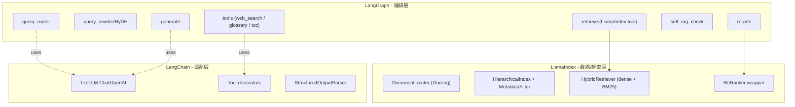
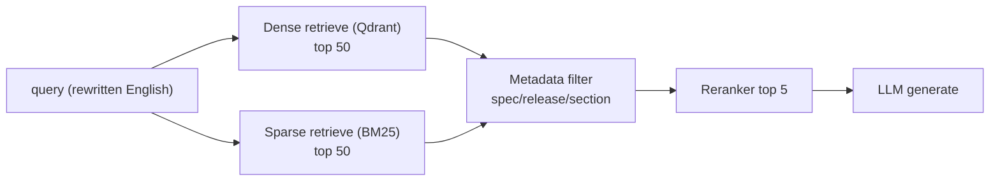
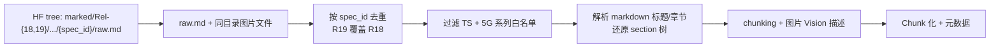
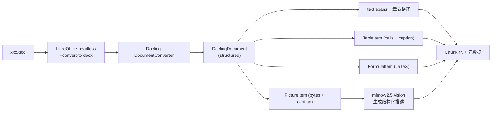
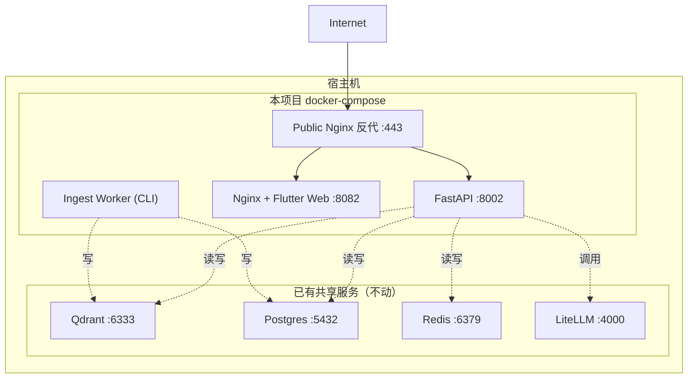
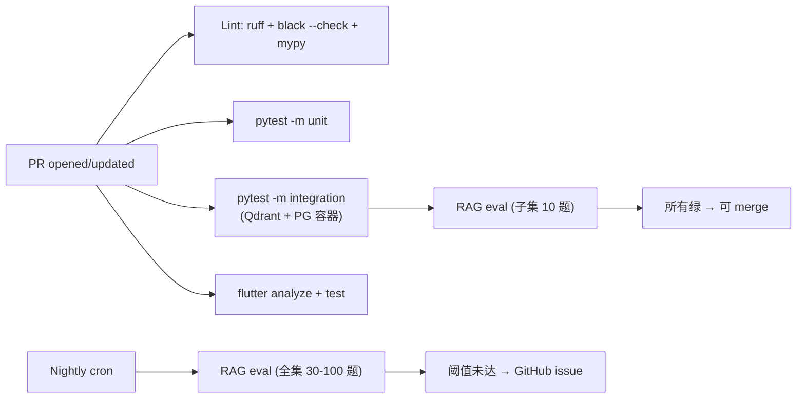

# 02 - 技术选型

> Plan 第 2 部分。逐项列出最终选型 + 备选 + 决策依据 + POC 计划 + 替换路径。
>
> 决策原则（来自需求文档 + 服务器现实）：
>
> 1. **服务器性能差**：2 核 / 3.8GB RAM（实际可用 ~500MB）/ 8GB swap，**严禁本地跑 embedding/reranker/重模型**
> 2. **磁盘紧张**：根盘 `/dev/vda2` 50G 已用 90%，本期要做全量 GSMA + 全量 Vision + 备份，**项目启动前必须准备 `/data` 可用空间 ≥ 50GB**（推荐扩容 +50GB；最低 +30GB；M2-M3 期间 voyage 2048+1024 双维度 Qdrant collection 临时占用 ~7-8GB，M3 决胜后清理输者）
> 3. **优先复用本机已有服务**：Qdrant（:6333）、PostgreSQL（:5432）、Redis（:6379）、LiteLLM（:4000）都已运行
> 4. **混合模式**：关键质量环节（embedding / reranker）走海外 SOTA API，其余环节走本地 LiteLLM 国产
> 5. **POC 验证**：embedding 维度（2048 vs 1024）在 3GPP 长上下文密集文档上的召回差异未知，必须用小子集 ablation + 金标准评测后再全量（详见 §3）
> 6. **优先吃现成轮子**：3GPP 文档主源走 [`GSMA/3GPP`](https://huggingface.co/datasets/GSMA/3GPP) HF 数据集（已预解析）；评测集骨架走 [`TeleQnA`](https://github.com/netop-team/TeleQnA)；自己只做"现成体系装配不出来的部分"

## 0. 选型总表

| 维度 | 最终选型 | 备选 | 关键理由 |
|------|---------|------|----------|
| **框架·编排** | LangGraph 1.x | - | 业界 2026 共识；PG checkpointer；状态流原生支持 |
| **框架·检索** | **自研检索层**（`qdrant-client` async + `bm25s`） | ~~LlamaIndex 0.13+~~ | **实施纠偏（M4）**：backend 未引入 LlamaIndex，dense 直接 `qdrant-client`、sparse 直接 `bm25s`；见 §1 注 |
| **框架·工具/Prompt** | LangChain（仅 `langchain-core`） | - | 只用 message 类型 + 流式回调配合 LangGraph；LLM 客户端为自写 `LiteLLMClient`（见 §2.4），**非** `ChatOpenAI` |
| **Agent 主 LLM** | `mimo-v2.5-pro` (本机 LiteLLM) | `glm-5.1` | 1M context、function calling、长 horizon agent |
| **轻量 LLM**（路由/改写/多查询） | `mimo-v2.5` (本机 LiteLLM) | `glm-4.5-air` | 便宜一半、原生 omni、1M context |
| **Vision**（索引期图片描述） | `mimo-v2.5` (本机 LiteLLM) | `qwen-vl-plus` | 已在 LiteLLM、omni 多模态、零额外配置 |
| **Embedding** | Voyage `voyage-4-large` **单轨** | 智谱 `embedding-3`（代码层 fallback） | 2026-05-16 决议：放弃双轨评测，改 voyage 单轨 + **维度 ablation**（M2 2048+1024 双维度 collection，M3 决胜）。账号 200M tokens 免费已加 payment 解除限速 |
| **Embedding（fallback）** | 智谱 `embedding-3` (本机 LiteLLM) | — | 仅保留代码 + LiteLLM 配置；不做评测、不主动建索引；voyage 海外不可达或额度告急时切换 |
| **Reranker** | Voyage `rerank-2.5` | Jina v2 | 与 voyage embedding 同供应商，协同最佳；账号 200M tokens 免费 |
| **稀疏检索** | `bm25s` | ~~LlamaIndex BM25~~ / Qdrant 原生 sparse | 与 dense 混合做 hybrid；直接用 `bm25s`（mmap 持久化），不经 LlamaIndex wrapper |
| **文档主源** | `GSMA/3GPP` HF `marked/` tree (Rel-18 + Rel-19，按 `spec_id` 去重保留最新，仅 5G 相关系列 TS) | TSpec-LLM (已陈旧)、自爬+Docling | 官方预解析 markdown；过滤后约 1296 篇；表格 inline、公式保留、图片为同目录文件；不收录 TR |
| **文档兜底** | LibreOffice + Docling | unstructured | 用于外部上传 doc / Rel-17 / 离群 spec |
| **FTP 爬虫** | `download_3gpp` PyPI | `gw-space/3gpp-document-downloader-mcp` | 兜底场景才用，主路径用 HF |
| **向量库** | Qdrant (复用本机 :6333) | pgvector | 已在运行、Rust、低资源 |
| **关系库 / LangGraph checkpoint** | PostgreSQL (复用本机 :5432) | SQLite | 已在运行、支持异步、LangGraph 原生支持 |
| **缓存** | Redis (复用本机 :6379) | 内存 LRU | 已在运行、跨进程共享 |
| **Web 搜索（显式工具）** | Tavily | Serper | langchain 生态默认、为 LLM 优化 |
| **评测集骨架** | `TeleQnA` Standards 类 3000 题 | TSpec-LLM 自带、Telco-DPR | MIT；筛选 + LLM 转化 + 人工校验 |
| **检索专项评测** | 参考 `Telco-DPR` 方法 (top-K / MRR) | - | Embedding POC 决胜口径 |
| **后端** | FastAPI + SSE | - | 用户已指定 |
| **后端 ORM** | SQLAlchemy 2.0 (async) + asyncpg | - | LangGraph PG checkpointer 共用连接 |
| **后端迁移** | Alembic | - | SQLAlchemy 标配 |
| **后端鉴权** | JWT + refresh token + RBAC + python-jose | fastapi-users | 本期按多用户基础能力实现，不再走静态 token 主路径 |
| **前端** | Flutter 3.x (Web + Android) | - | 用户已指定 |
| **前端状态** | Riverpod 2.x | Bloc | 比 Bloc 更轻量、官方推荐方向 |
| **前端流式协议** | SSE (HTTP) | WebSocket | FastAPI 简单、单向足够、移动端友好 |
| **前端 markdown/数学** | flutter_markdown_plus + flutter_math_fork | flutter_markdown core | LaTeX 与 Markdown 扩展能力更适合表格/引用定制 |
| **监控** | Langfuse Cloud Free | LangSmith | 用户已指定 |
| **评测** | Ragas + 金标准 YAML + Langfuse Datasets | DeepEval | Ragas 是 RAG 评测事实标准 |
| **CI** | GitHub Actions | - | 仓库在 GitHub |
| **Lint / Type** | Ruff + Black + MyPy | - | Python 2026 主流 |
| **测试** | Pytest + pytest-asyncio + httpx | - | FastAPI 标配 |
| **容器** | Docker Compose | - | 用户已指定 |
| **反代/TLS** | Nginx + Let's Encrypt (certbot) | Caddy | 用户已指定方向 |

## 1. 框架三件套（LangChain + LangGraph + LlamaIndex）的角色分工

> **⚠️ 实施纠偏（2026-05-18, M4；口径以本注为准）**：本节是 M1 规划期的"三件套"设想。实际实现已收敛为
> **LangGraph 编排 + 自研检索层 + 自写 `LiteLLMClient`**：
>
> - **未引入 LlamaIndex**：`backend/app/retrieval/dense.py` 直接用 `qdrant-client.AsyncQdrantClient` +
>   `LiteLLMClient.embed()`；`sparse.py` 直接用 `bm25s`。backend `pyproject.toml` 无任何 `llama-index-*` 依赖
>   （删除记录见 [`04-handoff/2026-05-18-m4-complete.md`](04-handoff/2026-05-18-m4-complete.md)）。
> - **LLM 客户端非 LangChain `ChatOpenAI`**：backend / agent 统一走自写的 async `LiteLLMClient`（§2.4）；
>   `langchain-openai.ChatOpenAI` 仅在 **eval 侧**作 Ragas / 对比裁判使用。
> - **LangChain 在 backend 的真实角色**：仅 `langchain-core` 的 message 类型（`BaseMessage` 等）+ 流式自定义
>   事件回调（`adispatch_custom_event`）+ `RunnableConfig`，配合 LangGraph，**不作 LLM 客户端**。
>
> 下方原始设想（含 mermaid 与角色分工）保留作决策留痕。

业界 2026 production RAG agent 的成熟模式是**三框架协同**而非二选一：



- **LangGraph**：状态机、节点、流式（`astream_events`）、PostgreSQL checkpointer 持久化会话上下文与中断恢复
- **LlamaIndex**：文档摄取（DoclingReader）、层级化索引（auto-merging / parent-document）、Hybrid Retriever、Reranker 包装
- **LangChain**：作为 LLM 客户端层（`ChatOpenAI` 走 LiteLLM）、Tool 装饰器、Prompt 模板

**关键边界**：LangGraph 节点里不要直接调 LlamaIndex 的高层 query engine（黑盒），而是把 LlamaIndex 当成"可控的检索 SDK"暴露 `retrieve / rerank` 等原子函数给 graph 调用。

## 2. LLM 选型详情

### 2.1 已确认的本机 LiteLLM 模型清单

来自 `/home/s1yu/litellm/config.yaml`：

| Model Name | 供应商 | 模态 | Context | 用途 |
|-----------|--------|------|---------|------|
| `mimo-v2.5-pro` | 小米 | text + agent | 1M | **Agent 主脑** |
| `mimo-v2.5` | 小米 | **omni** (text/image/video/audio) | 1M | **Vision + 轻量任务** |
| `mimo-v2-omni` | 小米 | omni | 262K | Vision 备份 |
| `glm-5.1` | 智谱 | text | - | **Eval Judge** + Agent 备份 LLM |
| `glm-4.5-air` | 智谱 | text | - | 超低成本备份 |
| `qwen-plus` / `qwen-max` | 阿里 | text | - | 备份 LLM |
| `embedding-3` | 智谱 | embedding | - | **Embedding 代码 fallback**（不主动使用） |
| `voyage-4-large` | Voyage | embedding | 32K | **Embedding 首选**；200M tokens 免费 |
| `voyage-4` | Voyage | embedding | 32K | 备用 embedding（更便宜） |
| `rerank-2.5` | Voyage | reranker | 8K | **Reranker 首选**；200M tokens 免费 |

### 2.2 Agent 主脑 — `mimo-v2.5-pro`

- 1.02T 总参 / 42B active MoE，1M context
- 原生 function calling、prompt caching、JSON 模式
- 复杂软件工程 SWE-Bench 78.9
- 长 horizon agent：1000+ tool calls
- 定价 $1/$3 per M tokens

### 2.3 Vision / 轻量任务 — `mimo-v2.5`

- 310B 总参 / 15B active MoE，**原生多模态**（text/image/video/audio）
- 1M context
- 图表理解接近 Gemini 3 水平
- 定价 $0.40/$2.00 per M tokens（比 Pro 便宜一半）
- **用途**：
  - 索引期为图片生成结构化描述（批量任务，便宜要紧）
  - Agent 路由 / 查询改写 / multi-query 这类"短输入短输出"任务
  - 留 `mimo-v2.5-pro` 给主生成 + self-RAG 校验

### 2.4 LangChain ↔ LiteLLM 接入

> **⚠️ 实施纠偏**：实际 backend **未采用**下方 `ChatOpenAI` 接法。所有 LLM / embedding / rerank 调用走自写的
> async `LiteLLMClient`（`backend/app/llm/litellm_client.py`，直接 httpx 打 LiteLLM proxy 的
> `/chat/completions`·`/embeddings`·`/rerank`）。下方 `ChatOpenAI` 片段仅在 eval 侧 Ragas judge 使用。

走 OpenAI 协议适配（历史设想，eval 裁判沿用）：

```python
from langchain_openai import ChatOpenAI

llm_agent = ChatOpenAI(
    model="mimo-v2.5-pro",
    base_url="http://127.0.0.1:4000/v1",
    api_key="<LITELLM_MASTER_KEY>",
    streaming=True,
)
```

LangGraph 节点直接复用此 client，零额外抽象。

## 3. Embedding 选型与 POC 计划

### 3.1 选型决策（2026-05-16）

**最终选型：Voyage `voyage-4-large` 单轨 + 维度 ablation**。

放弃原计划的"voyage / 智谱 embedding-3 双轨决胜"，转而：

1. M2 用 voyage **一套 embedding** 同时建 **2 个 Qdrant collection**（dim=2048 + dim=1024），单次 API 调用同时产出两个维度的向量（依赖 voyage-4-large 的 **Matryoshka Representation Learning (MRL)** 性质：2048 维向量前 1024 维 + L2 重 normalize 等价于直接调 API 要 1024 维）。
2. M3 评测仅做"voyage 2048 vs voyage 1024"的 retrieval-only 对比（context_recall / MRR）。
3. 胜出维度作为生产标准；输者 collection 在 M6 全量前清理。
4. 智谱 `embedding-3` 保留代码层 fallback，不做 POC 评测。

**为什么放弃 GLM 双轨**：

- POC §3.5 retrieval smoke 在 38.331 上 8/8 PASS（5 EXCELLENT），voyage 在 3GPP 英文技术文档上的表现已经足够说明问题
- 双轨评测要消耗 ~28M tokens × 2（多花一倍 voyage 额度 + 多一份 Qdrant 存储 + 多一周 M2 工期）
- GLM 留代码 fallback 仍能应对海外网络 / 额度告急场景

**为什么做维度 ablation**：

- voyage-4-large 默认 1024 维，但项目原计划锁 2048。1024 vs 2048 在 3GPP 长上下文密集文档上的召回差异**未实测**
- 因 MRL 性质，**ablation 不消耗额外 token**（一次 API 调用同时落两 collection）
- 仅多占 ~2.5GB Qdrant 临时存储（M3 后清理输者）

### 3.2 维度 ablation 详细方案

| 项 | Voyage `voyage-4-large` (M2 实施) |
|----|---|
| API 调用维度 | `output_dimension=2048`（LiteLLM `config.yaml` 显式声明） |
| 客户端派生维度 | 前 1024 维截断 + L2 renormalize → 等价于直接调 1024 维 |
| Qdrant collection | `tgpp_chunks_voyage_d2048` + `tgpp_chunks_voyage_d1024`（同 chunk_id，向量不同） |
| Context | 32K（足够 chunk 级） |
| 标准单价 | $0.12 / M tokens |
| 账号免费额度 | **200M tokens**（payment 已加，限速 3M TPM / 2000 RPM） |
| 海外 API | 是（统一走本机 LiteLLM proxy） |

**M2 POC 流程**：

1. **B0 spike**：先用 100 个 38.331 chunk 实测 voyage truncate+renorm 与直接调 1024 API 的 cosine 等价性。门槛 median ≥ 0.9995，min ≥ 0.998。≤ 100k tokens 成本。
2. 选 20 篇代表性 TS（详见 `docs/03-development/02-ingestion-and-indexing.md §4.7 M2`），并发跑 indexer（worker=3 / vision_concurrent=8，详见 §3.4）：
   - 一次 voyage API 调用同时 upsert 到 `_d2048` + `_d1024` 两 collection
   - BM25 / PG 共享一份（维度无关）
3. M3 在金标准评测集（≥ 120 题）上跑 retrieval-only：`context_recall@5/10/20`、`context_precision@5/10`、`MRR`
4. **决胜规则**（写在 `docs/03-development/06-evaluation-and-observability.md §8`）：
   - R@10 差距 > 2% → 选 R@10 高者
   - 否则比 MRR；MRR 差距 > 2% → 选高者
   - 否则差距不显著 → 选 **1024 维**（存储省一半 + 检索 latency 快 30-50%）

**预算订正**（按 38.331 实测 token 密度 221k/MiB 推算）：

| 项 | tokens (M) |
|----|---:|
| POC 38.331（1024 维老 collection 已花，drop 后不可复用） | 1.66 |
| B0 spike | 0.1 |
| M2 20 篇 POC（含 38.331 multidim 重做） | ~8 |
| M3 评测期单 spec 调参重 embed（10-15 次平均 1M/次） | 12-15 |
| **M6 全量索引（1271 篇 × 一次 API 调用产 2048/1024 双 collection）** | **150 ± 20** |
| 上线后增量更新（半年内 Rel-20 等） | 5-10 |
| **预计实际占用** | **~175-185M** |
| **额度余量** | **15-25M (8-12%)** |

→ 200M **足够覆盖** POC + 全量 + M3 调参；**没有"全量重做一次"的余量**。M3 评测期如发现需大改 chunker，必须先在 20 篇 POC 上 ablation 验证再上 M6。

### 3.3 索引向量重建路径

预留 `embedding_provider` + `embedding_dim` 字段在 chunk 元数据 / Qdrant collection 命名里。切换 embedding 或维度时无需重新解析 doc，只需重新走 embedding+索引环节。

### 3.4 索引期并行架构（M2 实施）

POC 实测速率（38.331 单 spec）：

- voyage TPM: 3M / batch=64 平均每 batch ~12k tokens → **理论 250 batches/min**
- voyage 全量 150M / 3M TPM = **理论 48.7 min**
- mimo-v2.5 RPM: 100（瓶颈） / 6435 唯一图 / 100 RPM = **理论 64.4 min**

实施目标：spec 级并发 + spec 内 vision fan-out 异步，把全量端到端从串行 ~24h 压到 6-12h。

```
worker_pool size = 3 (受 2 核服务器 + RAM 约束)
worker 内:
  spec → 加载 → chunker(异步 fan-out 调 mimo, concurrent=8) → embed(batch=64 异步) → 写 Qdrant×2/BM25/PG
全局速率限制器：
  - voyage: TokenBucket(rate=3M tokens/min, burst=200k)
  - mimo:   TokenBucket(rate=100 calls/min, burst=10)
  跨 worker 共享，按 LiteLLM proxy 配置维护
```

详见 `docs/03-development/02-ingestion-and-indexing.md §4.4 / §4.8`。

### 3.5 Batch API（全量索引备选，2026-05-16 暂不启用）

Voyage 提供 [Batch API](https://docs.voyageai.com/docs/batch-inference)：12h 完成窗口、相比标准 endpoint **33% 折扣**。本项目当前取舍：

- M6 全量索引（约 150M tokens 一次性）→ 当前**走标准 endpoint + 并发流水线（§3.4）**，端到端时间预估 6-12h，已能接受
- 免费额度内 33% 折扣不影响实际开支；Batch API 在 200M 免费内的收益主要是"用量监控可分账"
- 由 `.env` 中 `VOYAGE_USE_BATCH_API_FOR_FULL_INDEX` 控制，**M6 启动前再做决定**
- 标准 endpoint + 并发架构调试稳定后才考虑切 Batch（避免一上来就引入两套实现）

## 4. Reranker — Voyage `rerank-2.5`

- 8K query context（足够 3GPP chunk + 改写后 query），cross-encoder
- 与 voyage-4-large embedding 同供应商，**双方训练上下文一致**，hybrid 协同最佳
- 标准单价 $0.05 / M tokens（按 query × N_doc + Σ doc tokens 计费，**不是按 query 数**——这是 Voyage 2024 起的统一口径）
- 账号 200M tokens 免费额度，按"100 题 × 6 query × 50 candidates × 500 tokens"估算，全量评测期都用不完
- 调用模式：每次检索 top-50 candidates → reranker → top-5

如 embedding POC 智谱胜出（不走 Voyage），reranker 回退到 **Jina reranker v2**（8K context、价格 Cohere 1/5、国内可访问性好）。

## 5. 检索 - Hybrid



- **Dense**：Qdrant + Voyage / GLM embedding（`qdrant-client.AsyncQdrantClient` 直连，非 LlamaIndex）
- **Sparse**：`bm25s`（BM25 高性能实现，非 LlamaIndex wrapper），ingestion 端持久化、backend mmap 加载
- **元数据过滤**：spec_id、release、series、section_path、chunk_type（text/table/formula/figure_desc）
- **融合**：reciprocal rank fusion (RRF) → reranker

如 `bm25s` 性能不够，二期切到 Qdrant 原生 sparse vector（`bm42` / `splade`）。

## 6. 向量库 — Qdrant（复用本机）

- 本机已运行 v1.17.1 在 `127.0.0.1:6333`，已有 `forge_docs` collection
- **新建独立 collection**：`tgpp_chunks_voyage`、`tgpp_chunks_glm`（POC 期）→ 收敛后保留胜者
- 不影响现有 `forge_docs`，无需独立部署
- 单机 p95 检索目标 < 100ms；Rel-18+Rel-19 TS-only 5G 系列预计为数十万级 chunks，Qdrant 单机可承载，但必须以 M1/M2 实测 chunk 数校准内存、磁盘和 payload index 大小

**注意事项**：

- API key：现有 Qdrant 实例如开启了 API key 鉴权需取，本项目内通过 `.env` 注入
- 备份策略：Qdrant snapshot API，每日打 snapshot 到独立挂载目录

## 7. 关系库 — PostgreSQL（复用本机）

- 本机已运行 `:5432`
- **新建独立 database**：`tgpp_everything`（与其他项目隔离）
- 用途：
  1. 业务表：users / sessions / messages / documents / document_versions / chunks_meta / favorites / notes / feedback / api_usage
  2. **LangGraph checkpoint store**：`langgraph_checkpoints` schema（LangGraph 1.x `PostgresSaver` 原生支持）
- ORM：SQLAlchemy 2.0 async + asyncpg
- 迁移：Alembic

## 8. 缓存 — Redis（复用本机）

- 本机已运行 `:6379`
- 使用独立 db number（如 `db=5`）与其他项目隔离
- 用途：
  - Embedding query 缓存（key = `embed:{provider}:{sha256(query)}`，TTL 1d）
  - Reranker 缓存（key = `rerank:{sha256(query+candidates)}`，TTL 1d）
  - Vision 图片描述缓存（key = `vision:{sha256(image)}`，TTL 永久）
  - 热点 chunk 缓存
  - 限流（用户级 token 桶）

## 9. Web 搜索 — Tavily（用户显式触发）

- 专为 LLM agent 优化，返回干净 markdown 文本，自带摘要
- LangChain `TavilySearchResults` 原生 Tool
- $0.01 / call，免费层 1000 calls/月足够测试
- 在 Agent 节点中**只在用户消息含明确触发词或 UI 开关开启时调用**；返回内容带 `source=web` 标记，前端展示"未经 3GPP 验证"提示

## 10. 文档解析（双路径）

### 10.1 主路径 — GSMA/3GPP HuggingFace 数据集



- **天然解析好**：每篇 spec 已转换为 `raw.md`（表格 inline、公式可解析），但不再是 section 行表；loader 需从 markdown 标题/章节文本中还原 section 树
- **图片**：图片是 spec 目录下的 jpg 等文件；按 bytes hash 调 `mimo-v2.5` 生成结构化描述并永久缓存
- **过滤规则**：只保留 `spec_type=TS`，不收录 TR；系列白名单为 `21/22/23/24/26/27/28/29/31/32/33/34/35/36/37/38`
- **量级**：Rel-18 `1345` 篇、Rel-19 `1557` 篇；合计 `2902` 个 release-doc entries，跨 release 重复 `1173` 篇；按 `spec_id` 去重后再过滤 TS + 5G 系列白名单，保留 `1296` 篇，`raw.md` 约 `621MiB`
- **图片规模**：保留集约 `27,042` 个图片文件引用、约 `6,435` 个唯一图片 hash；单篇如 `38.211` 只有 3 张左右，但图密集 spec 会贡献数百张
- **license**：核对 GSMA 数据集声明，本项目内部使用合规即可

### 10.2 兜底路径 — LibreOffice + Docling

仅在以下场景启用：

- 用户上传外部 `.doc` / `.docx`
- HF 数据集尚未收录的最新 freeze 版本（freeze 公告与 GSMA 推送之间的窗口）
- Rel-17 或更老 spec 的"临时调出"



**版本**：Docling ≥ 2.12

### 10.3 统一 chunking 策略（两路径共用）

- **以章节为最小单元**先做 hierarchical 切分
- 文本段落 chunk：500-800 tokens，120 overlap
- 表格 chunk：每个 table 独立，附带 caption + 前 1 段上下文
- 公式 chunk：公式 LaTeX + 前后 2 句上下文
- 图片 chunk：vision 描述（200-400 tokens） + caption
- 每个 chunk 强制带 `parent_section_id`，支持 **auto-merging retriever**

## 11. 前端栈

| 项 | 选型 | 理由 |
|---|------|------|
| 框架 | Flutter 3.x stable | 用户指定 |
| 状态管理 | Riverpod 2.x | 比 Bloc 轻量、官方推荐、AsyncNotifier 适合流式 |
| HTTP | dio 5.x | 拦截器丰富、SSE 支持成熟 |
| 流式 | SSE（dio + transformer） | 单向流足够、移动端长连优于 WS |
| Markdown | flutter_markdown_plus | 维护活跃、支持自定义 builder |
| 数学公式 | flutter_math_fork | LaTeX 社区标准 |
| 路由 | go_router 14+ | 官方推荐 |
| 国际化 | flutter_localizations + intl | 中英双语 |

**SSE vs WebSocket 决策**：3GPP-Everything 的流是**单向**（后端 → 前端），SSE 简单且 Flutter Web/Android 都支持；中途取消通过新的 HTTP `DELETE /sessions/{sid}/runs/{rid}` 实现，不需要双向通道。

## 12. 部署架构



- 端口选择避开现有占用：API `:8002`、Web `:8082`、Public Nginx `:443/:80`
- `docker-compose.yml` 通过 `extra_hosts: ["host.docker.internal:host-gateway"]` 或 `network_mode: "host"` 访问宿主已有服务
- 索引 worker 不常驻，按需 `docker compose run --rm ingest python -m ingestion.cli ...`

## 12.1 资源边界与容量规划

本期目标是完整生产级交付，但宿主机规格很低（2 核 / 3.8GB RAM，实际可用内存可能只有数百 MB），因此必须把"在线服务"和"重型作业"分开规划：

| 类别 | 运行位置 | 约束 |
|------|----------|------|
| API / Web / Nginx | 项目 Docker Compose | 常驻，内存预算尽量 < 1GB |
| Qdrant / PostgreSQL / Redis / LiteLLM | 宿主已有共享服务 | 不在本项目 compose 内重复启动 |
| Flutter / Docker image 构建 | GitHub Actions 或开发机 | 不在低配生产机上构建 |
| 全量 HF ingest / Vision 描述 / embedding | `ingest` 容器按需运行，默认并发 1-2 | 必须支持断点续跑、限流、失败队列 |
| RAG eval 全集 | Nightly CI 或手动任务 | 生产机只保留结果，不承担重评测压力 |

磁盘规划按全量 Vision 口径（`docs/03-development/02-ingestion-and-indexing.md §5` 重算后口径）：

| 项 | 估算 |
|----|------|
| HF cache（`marked/` sparse-checkout + repo 元数据） | 3-8GB |
| 规范 markdown / section JSON / 元数据中间产物 | 1-2GB |
| 图片缓存与 Vision 结果（6.4k 张唯一图） | 1-3GB |
| Qdrant 生产 collection | 2.5-5GB（M3 决胜后 1024 维 ~2.5GB / 2048 维 ~5GB） |
| Qdrant M2-M3 ablation 临时空间（2048 + 1024 双 collection 共存，M3 决胜后立即 drop 输者） | +5-8GB（峰值） |
| BM25 / eval-results / 日志 | 1-2GB |
| Docker image / volume 余量 | 5-10GB |
| 本地短期备份与 snapshot 暂存（zstd 压缩） | 5-10GB |

**硬要求**：`/data` 可用空间 ≥ 50GB（推荐 +50GB），低于 30GB 不进入全量索引；M2-M3 维度 ablation 期间双 collection 同时存在（+5-8GB 峰值），M3 决胜后立即 drop 输者；全量完成后清理中间缓存，长期稳态约 15-25GB。

## 13. CI / 质量保证



- **Lint**：Ruff（替代 flake8+isort+pyupgrade）+ Black（格式化）+ MyPy（strict 模式渐进开启）
- **测试**：pytest + pytest-asyncio + httpx + pytest-cov；分 `unit / integration / eval` marker
- **集成测试容器**：Docker Compose 起 ephemeral Qdrant + Postgres，单测后销毁
- **RAG eval**：Ragas（faithfulness / answer_relevance / context_recall / context_precision），结果上传 Langfuse Datasets

## 14. POC / 验证里程碑（关键决策点）

| POC | 何时做 | 目标 | 决策点 |
|-----|--------|------|--------|
| P1: 文档解析单文件 | 开发周 1 | 1 篇 GSMA `raw.md` TS（含表格/公式/图片）走完 markdown section 解析 + mimo-v2.5 描述；另用 1 篇上传 doc 验证 Docling 兜底 | GSMA markdown 是否能稳定还原章节层级；mimo-omni 图片描述质量是否可用；Docling 兜底是否可用 |
| P2: 索引 20 篇 + 检索 | 开发周 2-3 | 20 篇代表性 TS 建索引、查询能召回正确章节 | Hybrid 是否优于单向量；chunking 策略验证 |
| P3: Embedding 维度 ablation | 开发周 3-4 | Voyage 2048 vs 1024 维在金标准集上的 retrieval 指标 | 决定全量用哪个维度（2026-05-16 决议从"provider 双轨"改为"维度 ablation"） |
| P4: Agent 端到端冒烟 | 开发周 5 | 完整 LangGraph 跑通一次复杂查询 | 验证 self-RAG / 工具调用 |
| P5: 流式 UX 验证 | 开发周 6 | Flutter Web 跑通 SSE 节点状态流 | SSE 兼容性 / 取消机制 |

## 15. 成本估算（小规模多用户、voyage 单轨 + 维度 ablation 口径）

> 量级更新（2026-05-16）：GSMA Rel-18+Rel-19 去重保留最新并过滤为 5G 相关系列 TS 后约 `1271` 篇，`raw.md` 约 `619.6MiB`（manifest 实测）。embed tokens 按 38.331 POC 实测密度 `221k tokens/MiB` 推算：全量中位 **150M ± 20M**。
>
> 选型变更：embedding 改 voyage 单轨 + 2048/1024 双维度 ablation（M2/M3）、reranker 用 `rerank-2.5`。账号在两者上各有 200M tokens 免费额度，本项目预算口径内 embedding/rerank 成本均落在免费区，下表保留"用尽免费后"的等效付费口径，便于做最差情况估算。
>
> 因 voyage-4-large MRL 性质，**一次 API 调用同时产 2048/1024 双维度向量**，ablation **不翻倍 token**；下表 token 数为单次 API 计费值。

| 项 | 计费（免费额度后等效付费口径） | 估算 |
|----|------------------------------|------|
| 索引一次性·Embedding（含 M2 POC + M3 调参 + M6 全量 + 半年增量） | voyage `voyage-4-large` ~175-185M tokens × $0.12 / M = **$21-22**；若启用 Batch API 33% 折扣 ≈ $14-15 | **本项目落在 200M 免费内 = $0**；超出按 ≤ $22 算 |
| 索引一次性·Vision 描述（保留集约 27,042 个图片引用；hash 去重约 6,435 张唯一图片） | 按唯一图片估：输入 12.9M × $0.40 + 输出 9.7M × $2 ≈ $24.5；若无 hash 缓存按引用重复调用，上限约 $100 | ~$25（有缓存） |
| Agent 月查询 100 次 × 6 LLM 调用 × 10K tokens | mimo-pro 6M × $3 ≈ $18 | ~$18 |
| Embedding 查询 100 × 6 query × 500 tokens | 0.3M × $0.12 ≈ $0.04 | **免费内 = $0** |
| Reranker 100 × 6 × 50 candidates × 500 tokens | Voyage `rerank-2.5` 约 15M tokens × $0.05 / M ≈ $0.75 | **免费内 = $0** |
| Qdrant 双 collection 临时存储（M3 决胜前） | ~7-8GB（2048 + 1024 各占约 5GB / 2.5GB；M3 后清理输者降至 ~5GB 或 ~2.5GB） | 本机磁盘，无外部开支 |
| Tavily Web 搜索 20 次/月 | 免费层 | $0 |
| Langfuse Cloud | Free | $0 |
| **合计·首月（含一次性索引，免费额度内）** | | **≈ $43**（主要是 Vision + Agent LLM） |
| **合计·后续月（不含索引，免费额度内）** | | **≈ $18-25** |

> **额度风险点**：175-185M / 200M = 87-92% 占用，**没有"全量重做一次"的余量**。M3 评测期改 chunker 必须先在 20 篇 POC 上 ablation 验证，确认改善才上 M6。详见 `docs/03-development/02-ingestion-and-indexing.md §4.7 M3→M6 过渡硬指标`。

> Vision 描述仍是主要批处理作业之一，但实际 GSMA 图片存在大量跨 release / 跨 spec 重复。已确认本期按**保留集全量图片 Vision**交付，因此控费策略不用于跳过图片，只用于限流、失败续跑、重复图片 hash 缓存与预算告警。若唯一图片数或平均输出 token 明显高于估算，必须先暂停作业并更新成本审批。

多用户低并发阶段按 5 名活跃用户 / 月 1000 次查询估算，后续月成本约为上表 Agent 与检索调用的 10 倍，即 **$180-250/月**。这不是高并发容量承诺，只用于提前设置成本告警阈值。

## 16. 替换/逃生路径

| 场景 | 触发条件 | 替代方案 |
|------|---------|----------|
| Voyage 海外不可达 / 额度耗尽 | 网络不稳 > 1h 或 200M 额度告急 | 切智谱 `embedding-3` + Jina reranker：(a) `.env` 改 `EMBEDDING_PROVIDER=glm`；(b) 用 GLM 在新 Qdrant collection `tgpp_chunks_glm_d2048` 重建索引（embedding-3 默认 2048 维）；(c) backend retrieval 切到 GLM collection。需要重做的就是 embed + Qdrant upsert（chunker / vision / BM25 / PG 都不动） |
| `mimo-v2.5-pro` 限流/不稳 | LiteLLM 报错率 > 5% | 走 `glm-5.1` fallback（在 LiteLLM 加 fallback chain） |
| Qdrant 单机不稳 | 内存/磁盘报警 | 数据冷备到 pgvector（同 PostgreSQL 内）作为应急 |
| 服务器内存爆 | 实际开发阶段才能定位 | 把 ingest worker 拆到独立 VM；或减小 chunk 数量、走 Matryoshka 缩维（M3 ablation 已经在选 1024 维） |
| voyage-4-large MRL truncate 等价性失效 | B0 spike 实测 cosine 中位 < 0.998 | 回退到"双调 API"（2048 + 1024 各调一次），token 翻倍至 ~290M，**超 200M 额度**；此时降级为单维度（2048 或 1024 选一） |

## 17. 待用户提供的运行依赖（项目启动前需就绪）

| 项 | 说明 |
|---|------|
| 磁盘扩容到 `/data` 可用空间 ≥ 50GB（推荐 +50GB；最低 +30GB） | 为 HF cache、全量 Vision、Qdrant、Docker volume、日志与短期备份留出空间；< 50GB 时 POC 期需串行跑 embedding provider |
| **HuggingFace token** | 拉 `GSMA/3GPP` 数据集（`HF_TOKEN` 环境变量；huggingface.co 注册即可，免费） |
| Voyage AI API key | embedding + reranker；从 voyageai.com 申请 |
| Tavily API key | Web 搜索；tavily.com 申请，free tier 即可 |
| Langfuse Cloud project + key | langfuse.com Free Tier，新建 project 拿 public/secret key |
| 域名 + DNS A 记录 | 公网部署 HTTPS 必需 |
| LiteLLM master key | 项目内访问本机 :4000 |
| Qdrant API key | 如本机已开启鉴权 |
| PostgreSQL 用户/密码 | 项目创建独立 db + 独立用户 |
| **TeleQnA 仓库密码** | netop-team/TeleQnA 数据 zip 解压密码为 `teleqnadataset`（公开发布的） |
