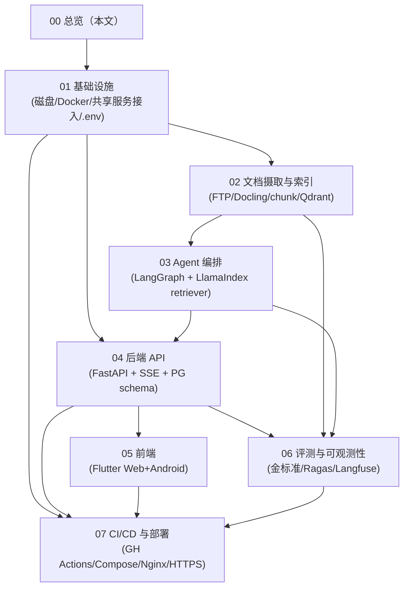
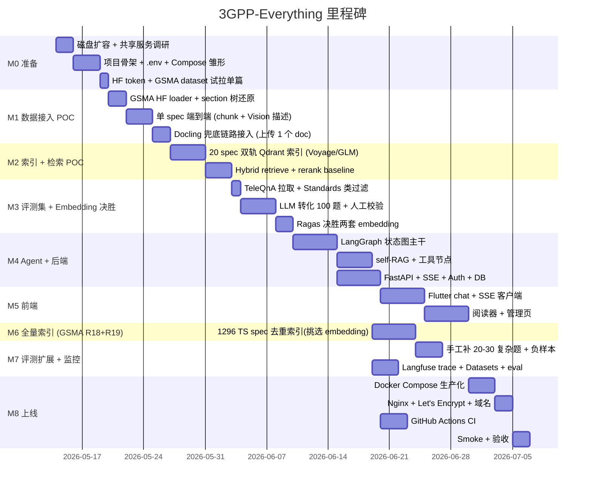

# 03·00 - 开发规划总览

> Plan 第 3 部分的入口。本目录拆分为 8 份子规划文档，按依赖顺序排列；除 00 之外的 7 份各自描述一个独立交付物。

## 1. 子规划清单与依赖



| 序号 | 文档 | 主要交付物 | 关键依赖 |
|------|------|----------|---------|
| 01 | `01-infrastructure.md` | 项目目录骨架、`.env` 规范、Docker Compose 框架、本机共享服务接入策略 | 磁盘扩容 |
| 02 | `02-ingestion-and-indexing.md` | FTP 爬虫 / 解析流水线 / chunking / Qdrant 索引 / CLI | 01 |
| 03 | `03-agent.md` | LangGraph 状态图、节点、检索工具、self-RAG、PG checkpointer | 01, 02 |
| 04 | `04-backend-api.md` | FastAPI 路由、SSE、DB schema、迁移、鉴权 | 01, 03 |
| 05 | `05-frontend.md` | Flutter 路由、状态、聊天页/阅读器/管理页、SSE 客户端 | 04 |
| 06 | `06-evaluation-and-observability.md` | 金标准 YAML、Ragas pipeline、Langfuse 集成、API 用量指标 | 02, 03 |
| 07 | `07-cicd-and-deployment.md` | GH Actions workflow、生产 Compose、Nginx 反代、Let's Encrypt | 01, 04, 05, 06 |

## 2. 全局决策总表

以下决策是本文档集的唯一口径。子文档若出现不同写法，以本表为准并同步修订。

| 决策项 | 统一口径 |
|--------|----------|
| 本期范围 | 完整生产级交付：GSMA Rel-18+Rel-19 按 `spec_id` 去重保留最新，仅收录 5G 相关系列 TS（约 1296 篇，不收录 TR）、保留集全量图片 Vision、多用户基础能力、Web+Android、CI/CD、HTTPS、备份恢复 |
| 用户模型 | 小规模多用户低并发；实现 admin/user RBAC，不做组织/租户级复杂权限矩阵 |
| 磁盘门槛 | `/data` 可用空间 ≥ 80GB；低于 50GB 不进入全量索引 |
| HyDE 模型 | `mimo-v2.5-pro`，质量优先；路由/改写/multi-query 用 `mimo-v2.5` |
| Qdrant collection | POC 与生产均使用 `tgpp_chunks_{provider}`，如 `tgpp_chunks_voyage` / `tgpp_chunks_glm` |
| 前端 Markdown | `flutter_markdown_plus` + `flutter_math_fork` |
| Redis 异步任务 | 使用 Redis Streams（`XADD`/consumer group），不使用 list `LPUSH` |
| chunk 标识 | API/SSE 使用字符串 `chunk_id`（Qdrant point id）；PG 外键字段命名为 `chunk_meta_id` |
| 生产备份 | 备份 active provider collection，collection 名从环境变量/DB 读取，不写死 provider |

## 3. 里程碑与时间线

按"周"为单位，单人节奏（每周可投入时间不固定，按工作量估算）。



**关键决策点**：

- **M1 验收**：GSMA HF loader 走通、section 树还原正确；mimo-v2.5 图片描述质量过关；Docling 兜底链路也能跑——决定主路径策略
- **M3 验收**：两套 embedding 的 retrieval recall 差距 —— 决定全量索引走 Voyage 还是智谱
- **M6 完成前不进入 M7 全量评测**：避免在错误 embedding 上浪费评测时间
- **M8 上线前 CI 必须绿**

## 4. 目录骨架

```
3GPP-Everything/
├── docs/                           # plan 三份 + 子规划
│   ├── 01-requirements.md
│   ├── 02-tech-selection.md
│   └── 03-development/
├── backend/
│   ├── app/
│   │   ├── api/                    # FastAPI 路由
│   │   ├── core/                   # config / logging / auth
│   │   ├── db/                     # SQLAlchemy models / Alembic
│   │   ├── schemas/                # Pydantic
│   │   ├── services/               # 业务逻辑
│   │   ├── agent/                  # LangGraph 状态图
│   │   ├── retrieval/              # LlamaIndex retriever wrapper
│   │   ├── tools/                  # web_search / glossary / toc / params
│   │   ├── llm/                    # LiteLLM client / model registry
│   │   └── main.py
│   ├── alembic/
│   ├── tests/
│   │   ├── unit/
│   │   ├── integration/
│   │   └── eval/                   # Ragas + 金标准
│   ├── pyproject.toml
│   └── Dockerfile
├── ingestion/
│   ├── hf_loader/                  # GSMA/3GPP HF 数据集加载（主路径）
│   ├── crawler/                    # 3GPP FTP（兜底）
│   ├── parser/                     # LibreOffice + Docling + Vision（兜底）
│   ├── images/                     # 图片下载 + Vision 描述生成
│   ├── chunker/
│   ├── indexer/                    # Qdrant 写入 + BM25 持久化
│   ├── cli.py                      # python -m ingestion.cli
│   ├── pyproject.toml
│   └── Dockerfile
├── frontend/
│   ├── lib/
│   │   ├── core/                   # router / theme / l10n
│   │   ├── data/                   # api client / sse
│   │   ├── domain/                 # entities / providers (Riverpod)
│   │   ├── features/
│   │   │   ├── chat/
│   │   │   ├── reader/
│   │   │   ├── admin/
│   │   │   └── auth/
│   │   └── main.dart
│   ├── web/
│   ├── android/
│   ├── test/
│   ├── pubspec.yaml
│   └── Dockerfile                  # build web → nginx serve
├── eval/
│   ├── golden/                     # YAML 金标准集（最终产物）
│   ├── teleqna/                    # TeleQnA 原始数据 + 过滤脚本
│   ├── builder/                    # LLM 转化（选择题→开放式问答）
│   └── runner.py
├── deploy/
│   ├── docker-compose.yml          # dev
│   ├── docker-compose.prod.yml
│   ├── nginx/
│   │   ├── default.conf
│   │   └── tls.conf
│   └── scripts/                    # certbot / backup
├── .github/
│   └── workflows/                  # ci.yml / nightly-eval.yml
├── .env.example
├── Makefile                        # 常用任务捷径
├── README.md
└── CLAUDE.md
```

## 5. 项目命名约定

- Python 包名：`backend.app`, `ingestion`，统一 snake_case
- 数据库 schema：单数 + 复数表名（`users`, `sessions`, `messages`, `documents`, ...）
- Qdrant collection：`tgpp_chunks_{provider}`（如 `tgpp_chunks_voyage`）
- Redis key prefix：`tgpp:` + 用途（`tgpp:embed:...`、`tgpp:cache:rerank:...`）
- Postgres database：`tgpp_everything`
- Postgres user：`tgpp_app`
- Docker network：`tgpp-net`
- Docker volume：`tgpp-{用途}`（如 `tgpp-postgres-backup`）
- 端口：API `:8002`，Web `:8082`，Public Nginx `:443/:80`

> 选用 `tgpp` 而非 `3gpp`，避开"标识符以数字开头"的语言/工具限制。

## 6. 开发规则

- **Conventional Commits**：`feat:`, `fix:`, `refactor:`, `docs:`, `chore:`, `test:`
- **分支**：`main` 保护；功能走 feature branch + PR
- **Python**：3.11+（与本机已有 uvicorn 一致），Pydantic v2，async 优先
- **依赖管理**：`pyproject.toml` + `uv`（更快），requirements 由 uv 锁定
- **Flutter**：稳定通道，Dart 3.x
- **测试**：单测对纯函数 / 数据变换；集成测对 retriever / agent / API；eval 对端到端 RAG 质量
- **文档**：每个模块顶部 docstring 说明"做什么 / 不做什么"，符合根目录 `CLAUDE.md` 第 2 条简洁原则

## 7. "本期不做"清单（提醒）

> 来自需求文档 §5，开发期间出现冲动时回看这里。

- 高并发多租户 SaaS（组织隔离、企业 SSO、复杂权限矩阵）
- 灰度 / AB
- 移动端深度交互优化（Android 本期完成核心闭环，精细体验二期再说）
- 自动定时索引
- LLM 微调

## 8. 阅读顺序建议

按依赖图从上到下读：`01 → 02 → 03 → 04 → 05 → 06 → 07`。

实施期允许部分并行：

- **02 摄取** 与 **04 后端骨架** 可并行（前者只依赖 01，后者 schema 也只依赖 01）
- **03 Agent** 必须等 **02 索引可用**
- **05 前端** 必须等 **04 后端 API 契约稳定**
- **06 评测** 与 **04/05** 可并行
