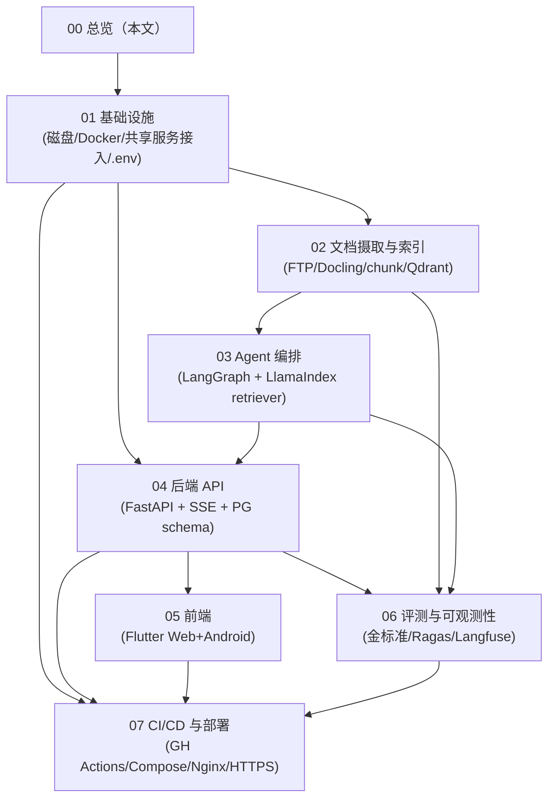
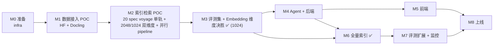

# 03·00 - 开发规划总览

> Plan 第 3 部分的入口。本目录拆分为 8 份子规划文档，按依赖顺序排列；除 00 之外的 7 份各自描述一个独立交付物。
>
> 本项目采用 **vibe coding 模式**：Agent 主导执行、人主导决策与节奏。具体协作规则见项目根 `CLAUDE.md` 与 `docs/00-vibe-coding-protocol.md`。下文里出现的"开发者要 X"一律理解为"Agent 要 X，由人按里程碑节奏验收"。

## 0. Agent 入场指南

> 你（Agent）第一次进入这个项目时，按下列顺序进行。

1. 读完 `CLAUDE.md` + `docs/00-vibe-coding-protocol.md`。如果有任一条不清楚，停下问人。
2. 用 `make` / `docker compose ps` 等命令确认当前实际进展（不要相信文档默认描述的"现在在 M0"，以代码 / 共享服务实际状态为准）。
3. 找到当前里程碑（见 §3）：
   - 若 Mx 未通过完成度门禁 → 从 Mx 继续
   - 若 Mx 已完成、Mx+1 没开始 → 主动问人："要不要进 Mx+1？"
4. 在那个里程碑对应的子文档里挑 1 个未完成的"交付物"作为本次任务。
5. 按 `CLAUDE.md §6` 的 plan → implement → self-verify → handoff 循环走。

> **不要**一次性把 8 份子文档全读完当上下文。每次只读"当前任务相关"的那一两份。

## 1. 子规划清单与依赖



| 序号 | 文档 | 主要交付物 | 关键依赖 |
|------|------|----------|---------|
| 01 | `01-infrastructure.md` | 项目目录骨架、`.env` 规范、Docker Compose 框架、本机共享服务接入策略 | 磁盘扩容 |
| 02 | `02-ingestion-and-indexing.md` | FTP 爬虫 / 解析流水线 / chunking / Qdrant 索引 / CLI | 01 |
| 03 | `03-agent.md` | LangGraph 状态图、节点、检索工具、self-RAG、PG checkpointer | 01, 02 |
| 04 | `04-backend-api.md` | FastAPI 路由、SSE、DB schema、迁移、鉴权 | 01, 03 |
| 05 | `05-frontend.md` | Flutter 路由、状态、聊天页/阅读器/管理页、SSE 客户端 | 04 |
| 06 | `06-evaluation-and-observability.md` | 金标准 YAML、Ragas pipeline、Langfuse 集成、API 用量指标 | 02, 03 |
| 07 | `07-cicd-and-deployment.md` | GH Actions workflow、生产 Compose、Nginx 反代、Let's Encrypt | 01, 04, 05, 06 |

## 2. 全局决策总表

以下决策是本文档集的唯一口径。子文档若出现不同写法，以本表为准并同步修订。

| 决策项 | 统一口径 |
|--------|----------|
| 本期范围 | 完整生产级交付：GSMA Rel-18+Rel-19 按 `spec_id` 去重保留最新，仅收录 5G 相关系列 TS（约 1271 篇，不收录 TR）、保留集全量图片 Vision、多用户基础能力、Web+Android、CI/CD、HTTPS、备份恢复 |
| 用户模型 | 小规模多用户低并发；实现 admin/user RBAC，不做组织/租户级复杂权限矩阵 |
| 磁盘门槛 | `/data` 可用空间 ≥ 50GB（推荐 +50GB）；低于 30GB 不进入全量索引；M3 决胜（2026-05-16）后已 drop 2048 collection，POC 期 Qdrant 占用降至 ~2.5GB |
| HyDE 模型 | `mimo-v2.5-pro`，质量优先；路由/改写/multi-query 用 `mimo-v2.5` |
| **Embedding provider** | `voyage-4-large` **单轨**（2026-05-16 决议放弃 GLM 双轨评测）。智谱 `embedding-3` 保留代码 fallback，不主动建索引；voyage 海外不可达 / 额度耗尽时再切 |
| **Embedding 维度** | **1024 维**（M3 决胜 2026-05-16：所有指标差距 ≤ 2pp，触发 tie-fallback → 选 1024）。详见 [`eval-results/m3-embedding-poc.md`](../../eval-results/m3-embedding-poc.md)。2048 collection 已 drop |
| Qdrant collection | M1: `tgpp_chunks_{provider}`（38.331 老 1024 维实验，M2 drop 重建）。M2 起：`tgpp_chunks_{provider}_d{dim}`；**M3 决胜后保留 `tgpp_chunks_voyage_d1024`，2048 已 drop**（2026-05-16） |
| Voyage 限速 | payment 已加，3M TPM / 2000 RPM（POC 实测有效） |
| mimo-v2.5 限速 | 10M TPM / 100 RPM；索引期 vision 调用按 100 RPM 全局 token bucket 限流 |
| 索引并行 | spec 级并发 worker=3（受 2 核服务器约束）；spec 内 vision fan-out 并发=8；全局 token bucket 共享 voyage / mimo 速率配额 |
| 前端 Markdown | `flutter_markdown_plus` + `flutter_math_fork` |
| Redis 异步任务 | 使用 Redis Streams（`XADD`/consumer group），不使用 list `LPUSH` |
| chunk 标识 | API/SSE 使用字符串 `chunk_id`（Qdrant point id）；PG 外键字段命名为 `chunk_meta_id` |
| 生产备份 | 备份 active provider × winning dim collection，名字从环境变量/DB 读取，不写死 |

## 3. 里程碑与完成度门禁

> Vibe coding 模式下不绑定"按周"时间表。里程碑按"完成度门禁"推进：上一个的门禁不全绿，不进下一个；具体节奏由人按产品反馈决定。



| 里程碑 | 主交付物 | 完成度门禁（全部通过才算完成） | 关键决策点（必须人审） |
|--------|---------|------------------------------|----------------------|
| **M0** 准备 | `/data` 扩容、共享服务命名空间、项目骨架、`.env.example`、dev Compose、Makefile | `01-infrastructure.md §3` 全部勾选；`make lint` + `curl /health` 通过 | 磁盘是否达 50GB 推荐线 |
| **M1** 数据接入 POC | HF loader、单 spec 端到端 chunk + Vision、Docling 兜底 | `02-ingestion-and-indexing.md §4.0 数据源验证门禁` 输出 audit md；至少 1 篇 spec（建议 38.331）走完整链路 | mimo-v2.5 Vision 图片描述质量；GSMA markdown section 树还原一致性（≥ 95%）|
| **M2** 索引检索 POC | (a) 并行 pipeline + voyage MRL 维度 ablation 架构实施；(b) 20 spec voyage 单轨 + 2048/1024 双维度 collection；(c) Hybrid retrieve baseline | `02-...md §8` POC 子清单全勾；每维度 collection 各 > 30000 chunks（20 篇 × 平均 1500-3000 chunks）；MRL truncate 等价性 spike 通过（B0） | retrieve baseline 在抽测查询上"看起来合理"；并发架构稳定（速率达 voyage 80% TPM、mimo 80% RPM） |
| **M3** 评测集 + Embedding 维度决胜 ✅ | TeleQnA 抽取 + 转化 119 题；金标准 v1.yaml；voyage 2048 vs 1024 维度决胜 → **1024 胜出**（2026-05-16，差距 ≤ 2pp 触发 tie-fallback） | `06-...md §12` 与 `eval-results/m3-embedding-poc.md` 齐备；2048 collection 已 drop | ✅ 人已签字（2026-05-16）；M3 → M6 过渡硬指标：chunker 参数若改动，必须先在 20 篇 POC 上确认 chunk_id 漂移率 ≤ 5% 才允许进 M6 |
| **M4** Agent + 后端 ✅ 2026-05-18 | LangGraph 主干 + self-RAG + 工具节点；FastAPI + SSE + Auth + DB；Alembic migration | `03-agent.md §14` + `04-backend-api.md §12` 全绿；CI 集成测全过 | ✅ M4.0–M4.10 全部完工（2026-05-18），剩 1 项 `[human]` 端到端人审挪到 M5 开工前；详见 [`04-handoff/2026-05-18-m4-complete.md`](../04-handoff/2026-05-18-m4-complete.md) |
| **M5** 前端 | Flutter chat + SSE 客户端、阅读器、管理后台、checkpoint UI 闭环 | `05-frontend.md §14` 全绿 | **UX 体验由人主审**（流式动效、引用 chip、checkpoint 闭环易用度）|
| **M6** 全量索引 ✅ | GSMA R18+R19 TS-only 5G 系列 1270 篇全部 indexed（voyage × 1024 维）；BM25 持久化；全量图片 Vision 命中 hash 缓存；POC 17 篇质量优先 purge 重跑 | ✅ 全量完成（2026-05-17）：specs_succeeded=1270/1270 / chunks_total=394,859 / voyage_tokens=94.4M（< 估算 150M）/ 耗时 9.5h。dense-only retrieval baseline 详见 [`eval-results/m6-retrieval-baseline.md`](../../eval-results/m6-retrieval-baseline.md)（**不构成回归失败**，留给 M4 rerank ablation 做对照基线）| ✅ 人已 approve 预算与并发策略；漂移率门禁通过（POC 17 篇质量优先 purge，详见 [`eval-results/m6-prep/poc17_purge.md`](../../eval-results/m6-prep/poc17_purge.md)）|
| **M7** 评测扩展 + 监控 | 手工补 20-30 题；Langfuse Dataset + 自动 eval；成本告警 | `06-...md §12` 全绿 + nightly eval 连跑 2 次 ≥ 阈值 | 评测阈值分两档：M7 nightly 用宽松版（faithfulness ≥ 0.75 / context recall ≥ 0.65 / answer relevancy ≥ 0.70 / answer correctness ≥ 0.55 / latency-p50 ≤ 6s / cost-p50 ≤ ¥0.30）；M8 上线门槛用严格版（faithfulness ≥ 0.85 / context recall ≥ 0.80）。详见 `04-handoff/2026-05-18-tech-debt-cleanup-todo.md` Q1 决策与 `06-...md §6` |
| **M8** 上线 | 生产 Compose、Nginx + Let's Encrypt、CI 全套、Runbook、备份/回滚演练 | `07-cicd-and-deployment.md §10` 全绿；`https://<域名>/health` 200 | 首次上线、域名 DNS、首个 admin 账号、对外可访问 |

**关键决策点重申**（来自上表"必须人审"列）：

- **M1**：HF loader 走通、section 树还原 ≥ 95%、Vision 描述质量过关——决定主路径策略
- **M3**：voyage 2048 vs 1024 维度的 retrieval 指标 → 决定全量索引用哪个维度
- **M3 → M6 过渡硬指标**：chunker 参数若改动，必须先在 20 篇 POC 上 ablation；chunk_id 漂移率 > 5% 视为"chunker 未稳定"，禁止进入 M6 全量索引（2026-05-16 实际选 D 路径，质量优先 purge 17 篇 POC 重跑，无漂移）
- **M6 完成前**不进入 M7 全量评测：避免在错误维度上浪费评测
- **M6 dense-only retrieval baseline**（2026-05-17 接受）：spec R@10=0.580 / section R@10=0.437 / MRR=0.236（vs M3 17-spec baseline -23/-21pp，**是草垛扩 75× 的预期稀释，不视作回归失败**）。docs/06 §7 的 0.80/0.85 是 end-to-end 阈值，由 M7 nightly eval 校验；retrieval-only 真正的"提升验证"在 M4 接 voyage-rerank-2.5 后做 ablation。详见 [`eval-results/m6-retrieval-baseline.md`](../../eval-results/m6-retrieval-baseline.md)
- **M8 上线前**：CI 全绿、回滚演练做过一次

**Agent 行为提示**：

- 每个里程碑内部任务的拆分与排序，Agent 自主决定，但每完成一项要按 `00-vibe-coding-protocol.md §4` 输出完成报告
- 里程碑之间不要"偷跑"：M2 没勾完不要开 M3 任务（除非 M3 任务有独立性且人明确允许）
- 任何里程碑的"关键决策点"必须由人 approve，Agent 不能自行通过——这是 `CLAUDE.md §5` 触发条件

## 4. 目录骨架

```
3GPP-Everything/
├── docs/                           # plan 三份 + 子规划
│   ├── 01-requirements.md
│   ├── 02-tech-selection.md
│   └── 03-development/
├── backend/
│   ├── app/
│   │   ├── api/                    # FastAPI 路由
│   │   ├── core/                   # config / logging / auth
│   │   ├── db/                     # SQLAlchemy models / Alembic
│   │   ├── schemas/                # Pydantic
│   │   ├── services/               # 业务逻辑
│   │   ├── agent/                  # LangGraph 状态图
│   │   ├── retrieval/              # LlamaIndex retriever wrapper
│   │   ├── tools/                  # web_search / glossary / toc / params
│   │   ├── llm/                    # LiteLLM client / model registry
│   │   └── main.py
│   ├── alembic/
│   ├── tests/
│   │   ├── unit/
│   │   ├── integration/
│   │   └── eval/                   # Ragas + 金标准
│   ├── pyproject.toml
│   └── Dockerfile
├── ingestion/
│   ├── hf_loader/                  # GSMA/3GPP HF 数据集加载（主路径）
│   ├── crawler/                    # 3GPP FTP（兜底）
│   ├── parser/                     # LibreOffice + Docling + Vision（兜底）
│   ├── images/                     # 图片下载 + Vision 描述生成
│   ├── chunker/
│   ├── indexer/                    # Qdrant 写入 + BM25 持久化
│   ├── cli.py                      # python -m ingestion.cli
│   ├── pyproject.toml
│   └── Dockerfile
├── frontend/
│   ├── lib/
│   │   ├── core/                   # router / theme / l10n
│   │   ├── data/                   # api client / sse
│   │   ├── domain/                 # entities / providers (Riverpod)
│   │   ├── features/
│   │   │   ├── chat/
│   │   │   ├── reader/
│   │   │   ├── admin/
│   │   │   └── auth/
│   │   └── main.dart
│   ├── web/
│   ├── android/
│   ├── test/
│   ├── pubspec.yaml
│   └── Dockerfile                  # build web → nginx serve
├── eval/
│   ├── golden/                     # YAML 金标准集（最终产物）
│   ├── teleqna/                    # TeleQnA 原始数据 + 过滤脚本
│   ├── builder/                    # LLM 转化（选择题→开放式问答）
│   └── runner.py
├── deploy/
│   ├── docker-compose.yml          # dev
│   ├── docker-compose.prod.yml
│   ├── nginx/
│   │   ├── default.conf
│   │   └── tls.conf
│   └── scripts/                    # certbot / backup
├── .github/
│   └── workflows/                  # ci.yml / nightly-eval.yml
├── .env.example
├── Makefile                        # 常用任务捷径
├── README.md
└── CLAUDE.md
```

## 5. 项目命名约定

- Python 包名：`backend.app`, `ingestion`，统一 snake_case
- 数据库 schema：单数 + 复数表名（`users`, `sessions`, `messages`, `documents`, ...）
- Qdrant collection：`tgpp_chunks_{provider}`（如 `tgpp_chunks_voyage`）
- Redis key prefix：`tgpp:` + 用途（`tgpp:embed:...`、`tgpp:cache:rerank:...`）
- Postgres database：`tgpp_everything`
- Postgres user：`tgpp_app`
- Docker network：`tgpp-net`
- Docker volume：`tgpp-{用途}`（如 `tgpp-postgres-backup`）
- 端口：API `:8002`，Web `:8082`，Public Nginx `:443/:80`

> 选用 `tgpp` 而非 `3gpp`，避开"标识符以数字开头"的语言/工具限制。

## 6. 开发规则

- **Conventional Commits**：`feat:`, `fix:`, `refactor:`, `docs:`, `chore:`, `test:`, `perf:`, `build:`, `ci:`
- **分支**：`main` 保护；功能走 feature branch + PR；Agent 不直接 push 到 main
- **Python**：3.11+（与本机已有 uvicorn 一致），Pydantic v2，async 优先
- **依赖管理**：`pyproject.toml` + `uv`（更快），requirements 由 uv 锁定
- **Flutter**：稳定通道，Dart 3.x
- **测试**（vibe coding 硬要求，详见 `CLAUDE.md §4` 与 `00-vibe-coding-protocol.md §6`）：
  - 单测对纯函数 / 数据变换；集成测对 retriever / agent / API；eval 对端到端 RAG 质量
  - **新增/修改业务代码 → 必须新增或更新测试**，跑通才算"完成"
  - 大功能完成或跨 ≥ 3 模块改动 → 必须跑回归（lint + unit + integration + eval 子集）
- **文档**：每个模块顶部 docstring 说明"做什么 / 不做什么"，符合 `CLAUDE.md §2` 简洁原则；文档与代码相互引用的地方，**改一处必检另一处**

## 7. "本期不做"清单（提醒）

> 来自需求文档 §5，开发期间出现冲动时回看这里。

- 高并发多租户 SaaS（组织隔离、企业 SSO、复杂权限矩阵）
- 灰度 / AB
- 移动端深度交互优化（Android 本期完成核心闭环，精细体验二期再说）
- 自动定时索引
- LLM 微调

## 8. 阅读顺序建议

按依赖图从上到下读：`01 → 02 → 03 → 04 → 05 → 06 → 07`。

实施期允许部分并行：

- **02 摄取** 与 **04 后端骨架** 可并行（前者只依赖 01，后者 schema 也只依赖 01）
- **03 Agent** 必须等 **02 索引可用**
- **05 前端** 必须等 **04 后端 API 契约稳定**
- **06 评测** 与 **04/05** 可并行
