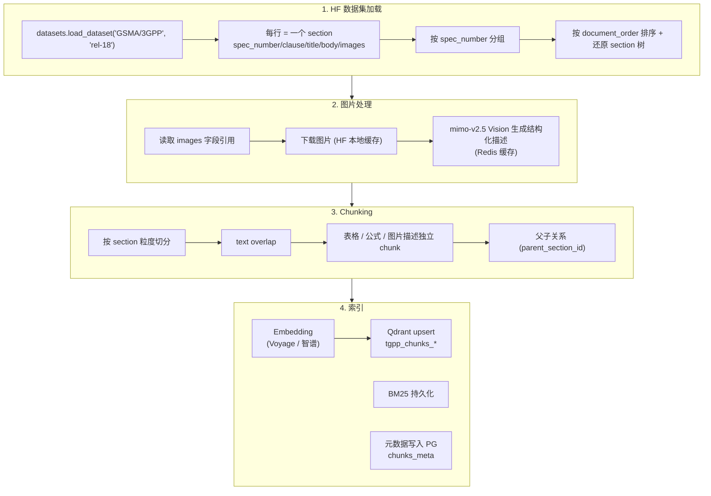
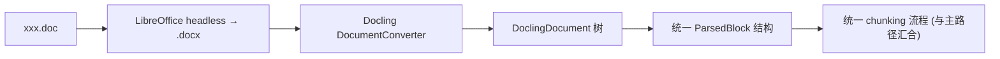

# 03·02 - 文档摄取与索引

> 负责把 3GPP 规范变成 Qdrant 中可被 hybrid 检索的 chunk。**主路径**直接消费 [`GSMA/3GPP`](https://huggingface.co/datasets/GSMA/3GPP) HF 数据集（已预解析为结构化 markdown）；**兜底路径**保留 LibreOffice + Docling 用于外部上传的离群 doc。

## 1. 交付物

- ✅ `ingestion/cli.py` 提供子命令：
  - 主路径：`hf-pull` / `hf-load` / `hf-index` / `pipeline-hf`
  - 兜底：`crawl` / `convert` / `parse` / `chunk` / `embed` / `index` / `parse-single`
  - 通用：`status` / `purge`
- ✅ 全流程 idempotent：重跑同一篇 spec 不产生重复 chunk
- ✅ POC（M2）：20 篇代表性 spec 完成 Voyage / 智谱双轨索引，存于 `tgpp_chunks_voyage` / `tgpp_chunks_glm`
- ✅ 生产（M6）：GSMA Rel-18 + Rel-19 全量 ~938 篇 specs / ~169k sections 索引
- ✅ BM25 稀疏索引（LlamaIndex 持久化到 `INGEST_DATA_DIR/bm25/`）
- ✅ 进度日志可视、失败可续传

## 2. 主路径总图（GSMA HuggingFace）



## 3. 兜底路径总图（外部 doc / Rel-17 / 离群 spec）



仅当用户在管理后台上传单个 `.doc`，或显式指定"用 Docling 重解析某 spec"时启用。**不进入主路径流量**。

## 4. 任务拆解

### 4.0 数据源验证门禁（M0/M1 阻断项）

在写正式 loader 前，必须先完成并记录一次 GSMA 数据源验证，输出 `eval-results/source-audit/gsma_dataset_audit.md`：

- **schema 验证**：打印 20 行样本，确认 `spec_number / release / clause / section_title / body / images / document_order` 的实际字段名、类型与空值比例。
- **release 覆盖**：统计 Rel-18 / Rel-19 的 spec 数、section 数、图片数，和文档中估算值（~938 specs / ~169k sections）对齐；差异 > 5% 时先更新规划再继续。
- **版本映射**：记录 `spec_number`、3GPP 官方版本号（如 `i80`）、GSMA dataset revision/commit hash 的映射，确保后续引用能追溯到具体版本。
- **license / 使用边界**：核对 GSMA HF dataset 声明与 3GPP 版权提示，确认本项目内部检索、引用、缓存与公网访问的合规边界。
- **图片字段**：确认 `images` 是否是 bytes、路径、HF Image 对象或引用列表；验证 10 张图片可下载、可 hash、可送 Vision。

未通过以上门禁，不进入 20 篇 POC 索引。

### 4.1 GSMA HF 加载器（主路径核心）

```python
ingestion/hf_loader/
├── __init__.py
├── loader.py            # datasets.load_dataset wrapper + 流式
├── spec_grouper.py      # 按 spec_number 分组、还原 section 树
├── image_resolver.py    # 处理 images 字段，下载到本地缓存
└── runner.py            # CLI 入口
```

**关键 schema**（来自 GSMA/3GPP）：

| Field | Type | 用途 |
|-------|------|------|
| `spec_id` | string | 对外展示与 API 使用的 dotted 编号，如 "38.331" |
| `spec_uid` | string | 内部紧凑编号，如 "38331"（如 GSMA 提供） |
| `spec_number` | string | 原始字段，通常等同 `spec_id` |
| `spec_type` | string | "TS" / "TR" |
| `title` | string | spec 全称 |
| `release` | string | "Rel-18" / "Rel-19" |
| `clause` | string | 章节号 "5.2.1" |
| `section_title` | string | 章节标题 |
| `body` | string | section markdown（表格/公式 inline） |
| `body_chars` | int32 | 字符数 |
| `document_order` | int32 | 在 spec 内的位置 |
| `images` | list[Image] | 图片引用 |

**加载策略**：

```python
from datasets import load_dataset

# 先 pin revision，再落本地 cache/manifest；不要在 streaming iterator 中无界 defaultdict 分组。
ds = load_dataset("GSMA/3GPP", split="train", token=HF_TOKEN, revision=GSMA_REVISION)

manifest = write_manifest(ds, releases={"Rel-18", "Rel-19"})
for spec_id in manifest.spec_ids:
    sections = load_sections_for_spec(ds, spec_id)  # 可按 parquet shard / 本地 sqlite manifest 实现
    sections.sort(key=lambda s: s["document_order"])
    yield SpecBundle(spec_id, sections, dataset_revision=GSMA_REVISION)
```

实现要求：

- 小样本/POC 可以非流式读取；全量时先建立本地 manifest（SQLite 或 parquet），避免多次全表扫描。
- 不允许把全量 169k sections 按 spec 全部塞进内存再处理；按 spec 顺序流式产出 `SpecBundle`。
- 每次 `hf-pull` 记录 `GSMA_REVISION`，后续 chunk / Qdrant payload / PG metadata 都写入同一个 revision。

**Spec → Section 树还原**：

每个 spec 内 section 按 `clause` 解析层级（`"5.6.1"` → `("5","6","1")`），构造树形结构供"父子关系"使用。

### 4.2 图片处理

GSMA `images` 字段含图片引用：

```python
# 每张图：{ "path": "...", "bytes": <bytes> } 或类似
```

- HF datasets 已把图片 cache 到本地 `~/.cache/huggingface/datasets/`，按文件指针读
- 直接喂 `mimo-v2.5` 生成描述（Prompt 同主文档原 §3.4）
- 缓存：`Redis tgpp:vision:{sha256(image_bytes)}`，TTL 永久

**全量 Vision 作业策略**：

- 启动期跑 50 张人工抽检，确认 Vision 描述质量
- 本期已确认全量图片都做 Vision 描述，不提供跳过装饰图的默认策略
- 可保留图片分类字段（`figure_kind=decorative|diagram|chart|table|unknown`），但分类只影响后续质量分析，不影响是否生成描述
- 以图片 bytes hash 做 Redis + PG 双层缓存；重复图片不重复调用 Vision
- 默认并发 1-2，按每日成本阈值和 LiteLLM 限流动态暂停；所有失败进入 retry queue
- 每 500 张输出一次抽检样本，人工确认描述没有系统性错误后再继续

### 4.3 Chunking 策略（两路径共用）

```python
ingestion/chunker/
├── section_aware.py     # 章节边界切分
├── overlap.py           # 文本 chunk overlap
└── builder.py           # 整合，产 Chunk 对象
```

| 来源 block | chunk 单元 | 大小 / overlap |
|-----------|----------|----------------|
| section body（无图无大表格） | 整段或分块 | 500-800 tokens / 120 overlap，按 tokens 计（tiktoken `cl100k_base` 近似） |
| section body 内的 markdown 表格 | 拆为独立 chunk | 不切分；附 caption + 前 1 段上下文 |
| section body 内的公式块 | 拆为独立 chunk | 公式 + 前后各 2 句 |
| 图片 | 1 张 = 1 chunk | mimo-v2.5 描述 + caption |
| section 头（虚拟）| 1 个 chunk（不入 embedding） | 仅存 markdown 全章供阅读器 |

**chunk 数据结构**（不变）：

```python
@dataclass
class Chunk:
    chunk_id: str                       # uuid5(spec_number + clause + offset_in_section)
    spec_id: str                        # "38.331"（对外展示与 API 使用）
    spec_uid: str | None                 # "38331"（内部紧凑编号，如有）
    spec_number: str                    # 原始 spec_number 字段
    spec_type: str                      # "TS" / "TR"
    release: str                        # "Rel-18" / "Rel-19"
    series: str                         # "38"
    title: str                          # spec 全称
    chunk_type: Literal["text","table","formula","figure","section_head"]
    clause: str                         # "5.2.1"
    section_path: tuple[str, ...]       # ("5","2","1")
    section_title: str
    parent_section_id: str | None
    content: str                        # 进入 embedding 的文本
    raw_extra: dict                     # 表格 md / 图片 path / 原 latex
    document_order: int
    source: Literal["gsma_hf","docling_fallback"]
    source_version: str                 # GSMA dataset revision / docling parse ts
    created_at: datetime
```

### 4.4 Embedding & Qdrant 索引

实现不变（见原 §3.6-§3.8）：

- Embedding：Voyage `voyage-3-large` 或智谱 `embedding-3`，批 64 一次
- Qdrant：collection per provider，payload 字段加索引 (`spec_number`, `release`, `series`, `clause`, `chunk_type`)
- BM25：LlamaIndex `BM25Retriever`，全量重建（50k+ chunks < 60s）
- 元数据：PG `chunks_meta` + `documents` + `document_versions`

`Document` 表新增字段：

```python
class Document(Base):
    ...
    source: Literal["gsma_hf","docling_fallback"]
    gsma_dataset_revision: str | None    # HF dataset commit hash
    last_loaded_at: datetime | None
```

### 4.5 兜底路径（LibreOffice + Docling）

实现保留（移到 `ingestion/parser/`）：

- `doc_to_docx.py`：LibreOffice 转换
- `docling_parse.py`：Docling 解析为 `ParsedBlock` 列表
- 与主路径共用 `chunker/`

仅在三种情况启用：

1. 管理 API `POST /api/v1/admin/upload-doc` 用户上传单个文件
2. CLI 显式 `parse-single <path>`
3. 用户在管理后台显式选"用 Docling 重解析 spec X"（用于对比或 GSMA 缺少时）

### 4.6 CLI 设计（更新）

`ingestion/cli.py`（typer）：

```bash
# 主路径
python -m ingestion.cli hf-pull                              # 拉取/更新 HF 数据集到本地 cache（流式，不全量下载）
python -m ingestion.cli hf-load --releases 18,19             # 加载并打印统计
python -m ingestion.cli hf-index --releases 18,19 --provider voyage --limit 20
python -m ingestion.cli pipeline-hf --releases 18,19 --provider voyage   # 一键全量

# 兜底
python -m ingestion.cli parse-single /path/to/xxx.doc --debug
python -m ingestion.cli upload-and-index /path/to/xxx.doc --provider voyage

# 通用
python -m ingestion.cli status                  # 已索引列表 + chunk_count + source
python -m ingestion.cli purge --spec 23.501 --provider voyage
```

每个子命令 idempotent：

- 主路径状态机：`hf_pulled → chunked → embedded → indexed`
- 兜底状态机：`uploaded → docx → parsed → chunked → embedded → indexed`

### 4.7 POC 验证步骤（修订）

**M1（开发周 1-2）**：HF + Docling 双路径打通

1. HF loader：拉一行验证 schema，按 `spec_number=23.501` 过滤还原章节树
2. 抽 1 篇代表性 spec（如 `38.331`，最大最复杂）：从 GSMA HF 走完整链路 → chunk + 图片 Vision 描述
3. 人工抽检：
   - 章节层级 vs 原 PDF 目录（≥ 95% 一致）
   - markdown 表格渲染正确
   - 公式 LaTeX 在 KaTeX 中能渲染
   - 10 张图片描述质量
4. 兜底链路：上传 1 个外部 `.doc` 走完整 Docling 流程

**M2（开发周 3-4）**：20 篇双轨

挑 20 篇覆盖：

- SA：23.501 / 23.502 / 23.503 / 23.401 / 24.501
- RAN：38.300 / 38.331 / 38.401 / 38.413 / 38.473
- CT：29.500 / 29.501 / 29.502 / 29.503 / 29.518
- 表格密集：38.413 / 29.502
- 公式密集：38.214 / 36.213
- 流程图密集：23.502 / 24.501

两套 collection 完成索引供 M3 评测使用。

**M6（开发周 7-8）**：全量 938 篇

- 估算单 spec 索引耗时（M2 期可得）× 938 - 并行度 → 总耗时
- 控制单日并发与每日费用阈值（防 Vision 描述费用超 §15 估算）
- 失败重试 + 续传

## 5. 数据存储约束（更新）

| 项 | 大小 | 备注 |
|----|------|------|
| HF datasets 本地 cache | ~5-10GB | 含 Parquet + 图片引用/缓存 |
| `/data/tgpp/fallback/raw/` | ~2GB | 仅兜底路径外部 doc |
| `/data/tgpp/fallback/docx/` | ~1GB | 兜底 |
| `/data/tgpp/markdown/` | ~3GB | 每篇 spec 拼接的完整 markdown（阅读器用） |
| `/data/tgpp/images/` | ~5-15GB | 全量 Vision 图片缓存 + hash manifest |
| `/data/tgpp/bm25/` | ~1-2GB | 全量 chunk 重建后 |
| Qdrant collection × 2（POC） | ~6-16GB | 各 ~3-8GB，取决于向量维度/quantization |
| Qdrant collection × 1（生产） | ~3-8GB | 仅胜出 provider |
| snapshot / backup 暂存 | ~15-25GB | 本地短期备份，长期建议同步到远端 |

**总计峰值 ~45-80GB**（含 POC 双轨、全量 Vision 与短期备份暂存）。因此项目启动前要求 `/data` 可用空间 ≥ 80GB；低于 50GB 不进入全量索引。

> 若紧张：(a) 关闭 docling fallback raw/docx 缓存（用完即删）；(b) POC 结束立即删除失败 provider collection；(c) Qdrant 启用 scalar quantization；(d) 将 snapshot 立即同步到远端后删除本地副本。

## 6. 监控点

- HF dataset load 耗时（按 spec）
- 每篇 spec chunk 数（异常值检测：< 5 或 > 5000 触发警告）
- 图片描述失败率 + 平均耗时
- Embedding API 调用次数 / 耗时 / 错误
- 写入 Qdrant 失败次数
- HF dataset revision（每次 hf-pull 记录，便于回滚）

## 7. 风险与排雷

| 风险 | 触发 | 应对 |
|------|------|------|
| GSMA 数据集 image 字段格式与文档描述不符 | 字段实际结构与 HF viewer 不一致 | M1 第 1 天先用 1 行打印结构，确定后再写 loader |
| GSMA 数据集 markdown 中公式格式特殊 | 非标 LaTeX / Word equation 残留 | M1 抽检 + 加正则净化层；前端 fallback 显示原始字符串 |
| 表格 markdown 内嵌图片 / 复杂结构 | 个别表格 | 解析时遇到非标用兜底 Docling 处理；记入 known_issues.yaml |
| HF dataset 长期不更新 | GSMA 维护节奏 | 监控 `last_modified`；6 个月无更新自动告警；兜底爬虫可补 |
| Vision 描述费用超预算 | 30k 图片 × 1500 tokens 输出 ≈ $115，实际图片数可能更高 | 按全量 Vision 要求继续处理，但用 hash 缓存、低并发、每日预算阈值、失败队列与人工暂停机制控风险 |
| HF 数据集需要授权但 token 失败 | HF 服务状态 / token 配置错 | M0 阶段验证 token 拉取 1 行成功；CI 中走匿名公共子集 fixture |
| Docling fallback 解析失败 | 老格式 / 嵌入特殊对象 | 失败计入 PG 状态表；known_issues 记录 |

## 8. 验收清单

POC 阶段（M1+M2）：

- [ ] `hf-load` 能流式读 GSMA 全量并按 release 过滤
- [ ] 单篇 spec（建议 `38.331`）从 HF 到 Qdrant 端到端跑通
- [ ] 20 篇全部完成 voyage / glm 双轨索引
- [ ] 两个 Qdrant collection 均 > 8000 chunks
- [ ] BM25 持久化目录可被 backend 加载
- [ ] 兜底 Docling 链路：手工上传 1 个 doc，完整流程跑通

生产阶段（M6）：

- [ ] GSMA Rel-18 + Rel-19 全量 938 篇 specs 状态 = `indexed`
- [ ] 单篇 spec 重新索引（`--force`）不产生 Qdrant 重复 point
- [ ] 一篇 spec 删除（`purge`）后 Qdrant + PG + BM25 三处全清干净
- [ ] `status` CLI 输出含 source 列（gsma_hf / docling_fallback）

## 9. 完成后下一步

→ `03-agent.md` 开始 LangGraph 编排，把这一层产出的检索能力包成工具节点。
