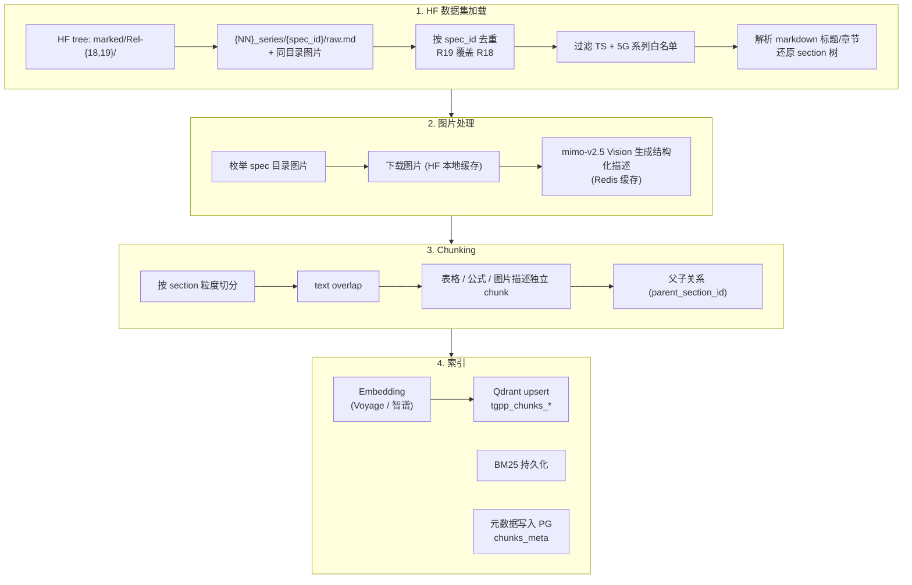
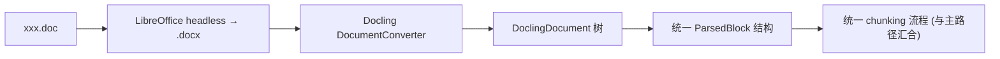

# 03·02 - 文档摄取与索引

> 负责把 3GPP 规范变成 Qdrant 中可被 hybrid 检索的 chunk。**主路径**直接消费 [`GSMA/3GPP`](https://huggingface.co/datasets/GSMA/3GPP) HF `marked/` 文件树（每篇 spec 一个 `raw.md` + 同目录图片）；**兜底路径**保留 LibreOffice + Docling 用于外部上传的离群 doc。

## 1. 交付物

- ✅ `ingestion/cli.py` 提供子命令：
  - 主路径：`hf-pull` / `hf-load` / `hf-index` / `pipeline-hf`
  - 兜底：`crawl` / `convert` / `parse` / `chunk` / `embed` / `index` / `parse-single`
  - 通用：`status` / `purge`
- ✅ 全流程 idempotent：重跑同一篇 spec 不产生重复 chunk
- ✅ POC（M2）：20 篇代表性 spec 完成 Voyage / 智谱双轨索引，存于 `tgpp_chunks_voyage` / `tgpp_chunks_glm`
- ✅ 生产（M6）：GSMA Rel-18 + Rel-19 按 `spec_id` 去重保留最新、过滤为 5G 相关系列 TS 后的 `1296` 篇 specs 索引
- ✅ BM25 稀疏索引（LlamaIndex 持久化到 `INGEST_DATA_DIR/bm25/`）
- ✅ 进度日志可视、失败可续传

## 2. 主路径总图（GSMA HuggingFace）



## 3. 兜底路径总图（外部 doc / Rel-17 / 离群 spec）



仅当用户在管理后台上传单个 `.doc`，或显式指定"用 Docling 重解析某 spec"时启用。**不进入主路径流量**。

## 4. 任务拆解

### 4.0 数据源验证门禁（M0/M1 阻断项）

在写正式 loader 前，必须先完成并记录一次 GSMA 数据源验证，输出 `eval-results/source-audit/gsma_dataset_audit.md`：

- **文件树验证**：枚举 `marked/Rel-{18,19}/{NN}_series/{spec_uid}/raw.md` 与同目录图片文件，确认当前 GSMA 仍是 markdown 文件树而非 section 行表。
- **release 覆盖**：统计 Rel-18 / Rel-19 的 release-doc 数、跨 release 重复数、去重保留最新后的 spec 数、TS/TR 分布、系列分布、`raw.md` 总大小、图片文件引用数与唯一图片 hash 数。当前主库基线：R18 `1345`、R19 `1557`、重复 `1173`；去重后再过滤 TS + 5G 系列白名单，保留 `1296` 篇（Rel-19 `1274`，R18-only `22`），图片引用 `27,042`、唯一图片约 `6,435`。
- **版本映射**：记录 `spec_id`、`spec_uid`、release、3GPP 官方版本号（如 `i90` / `j30`，从 `original/` 文件名映射）、GSMA dataset revision/commit hash，确保后续引用能追溯到具体版本。
- **license / 使用边界**：核对 GSMA HF dataset 声明与 3GPP 版权提示，确认本项目内部检索、引用、缓存与公网访问的合规边界。
- **图片文件**：验证 10 张图片可下载、可 hash、可送 Vision；确认 hash 缓存命中后不会重复计费。

未通过以上门禁，不进入 20 篇 POC 索引。

当前主库 TS-only 系列分布基线：

| 系列 | 文档数 | `raw.md` | 图片引用 |
|------|--------|----------|----------|
| 21 | 5 | 0.1MiB | 9 |
| 22 | 87 | 6.0MiB | 345 |
| 23 | 130 | 49.4MiB | 7437 |
| 24 | 141 | 41.0MiB | 2699 |
| 26 | 118 | 20.2MiB | 1591 |
| 27 | 7 | 2.3MiB | 84 |
| 28 | 132 | 14.9MiB | 1182 |
| 29 | 187 | 78.8MiB | 4174 |
| 31 | 16 | 3.7MiB | 319 |
| 32 | 145 | 19.8MiB | 1679 |
| 33 | 89 | 16.9MiB | 1409 |
| 34 | 7 | 4.0MiB | 66 |
| 35 | 32 | 1.0MiB | 90 |
| 36 | 77 | 141.5MiB | 2128 |
| 37 | 32 | 31.4MiB | 394 |
| 38 | 91 | 190.2MiB | 3436 |

### 4.1 GSMA HF 加载器（主路径核心）

```python
ingestion/hf_loader/
├── __init__.py
├── loader.py            # HF tree 枚举 + raw.md 下载 + 流式 SpecBundle
├── spec_grouper.py      # 按 spec_id 去重、还原 section 树
├── image_resolver.py    # 处理同目录图片文件，下载到本地缓存
└── runner.py            # CLI 入口
```

**关键 manifest schema**（由 GSMA/3GPP 文件树生成）：

| Field | Type | 用途 |
|-------|------|------|
| `spec_id` | string | 对外展示与 API 使用的 dotted 编号，如 "38.331" |
| `spec_uid` | string | GSMA 目录中的紧凑编号，如 "38331" |
| `spec_number` | string | 原始字段，通常等同 `spec_id` |
| `spec_type` | string | "TS" / "TR"（优先从 `original/` 文件或 markdown 标题推断） |
| `title` | string | spec 全称（从 `raw.md` 标题或原文元数据抽取） |
| `release` | string | "Rel-18" / "Rel-19" |
| `series` | string | "38" |
| `raw_md_path` | string | HF repo 内 `marked/.../raw.md` 路径 |
| `source_doc_path` | string | HF repo 内 `original/.../*.doc(x)` 路径（用于官方版本号映射） |
| `source_doc_version` | string | 3GPP 文件名版本后缀，如 "i90" / "j30" |
| `image_paths` | list[string] | 同 spec 目录下图片路径 |
| `image_hashes` | list[string] | 图片 bytes hash，用于 Vision 缓存 |
| `dataset_revision` | string | GSMA HF commit hash |

**解析后 Section schema**（由 `raw.md` 生成）：

| Field | Type | 用途 |
|-------|------|------|
| `spec_id` | string | 对外展示与 API 使用的 dotted 编号 |
| `release` | string | "Rel-18" / "Rel-19" |
| `clause` | string | 章节号 "5.2.1" |
| `section_title` | string | 章节标题 |
| `body` | string | section markdown（表格/公式 inline） |
| `body_chars` | int32 | 字符数 |
| `document_order` | int32 | 在 spec 内的位置 |
| `image_refs` | list[string] | section 中引用或邻近的图片路径 |

**加载策略**：

```python
from huggingface_hub import HfApi, hf_hub_download

# 先 pin revision，再枚举 marked/original 文件树并落本地 SQLite manifest。
api = HfApi(token=HF_TOKEN)
tree = api.list_repo_tree(
    repo_id="GSMA/3GPP",
    repo_type="dataset",
    revision=GSMA_REVISION,
    path_in_repo="marked",
    recursive=True,
)

manifest = write_manifest_from_tree(tree, releases={"Rel-18", "Rel-19"})
manifest = dedupe_keep_latest(manifest)  # 同 spec_id 优先 Rel-19
manifest = manifest.filter(
    spec_type="TS",
    series={"21","22","23","24","26","27","28","29","31","32","33","34","35","36","37","38"},
)
for spec in manifest.iter_specs():
    raw_md = hf_hub_download("GSMA/3GPP", spec.raw_md_path, repo_type="dataset", revision=GSMA_REVISION)
    sections = parse_markdown_sections(raw_md)
    yield SpecBundle(spec.spec_id, sections, image_paths=spec.image_paths, dataset_revision=GSMA_REVISION)
```

实现要求：

- 小样本/POC 可以直接下载单篇 `raw.md`；全量时先建立本地 manifest（SQLite 或 parquet），避免多次 HF tree 扫描。
- 不允许把全量 `raw.md` 或解析后 sections 全部塞进内存；按 spec 顺序流式产出 `SpecBundle`。
- 每次 `hf-pull` 记录 `GSMA_REVISION`，后续 chunk / Qdrant payload / PG metadata 都写入同一个 revision。

**Spec → Section 树还原**：

每个 spec 内 section 按 `clause` 解析层级（`"5.6.1"` → `("5","6","1")`），构造树形结构供"父子关系"使用。

### 4.2 图片处理（Vision pipeline）

GSMA `marked/` 中每个 spec 目录可包含图片文件：

```python
# marked/Rel-19/38_series/38211/
# ├── raw.md
# ├── 63e0c22852c26699d0bd095a2d796bab_img.jpg
# ├── 64662465bba247703fdec49c8f3309f9_img.jpg
# └── d401d69d03672a3e96a1c73dd3af1ccd_img.jpg
```

GSMA 主库基线：按 Rel-19 覆盖重复 spec、保留 R18-only、TS + 5G 系列白名单后，共 `27,042` 个
图片引用、约 `6,435` 个唯一图片 hash。

#### 4.2.0 Vision 策略决策（2026-05-15 修订：方案 E）

> **决策来源**：`eval-results/source-audit/vision_strategy_benchmark_v2.md`。
> 在 12 张跨 8 类真实 figure 上做了 2 轮 benchmark（v1 + v2 = 60 个 vision 生成 + 24 次 LLM judge），
> 经过两轮反转最终锁定方案 E。**任何想改 vision pipeline 的人必须先读 benchmark 报告，
> 不要凭直觉拍脑袋**。

**三种候选方案演化**：

| 方案 | 含义 | 结论 |
|------|------|------|
| A | 直接复用 GSMA raw.md 自带描述（image_alt + caption_text + spec_caption），不调 vision | ❌ 有 OCR 错误传染 + 元信息（postal address）污染；缺结构化字段 |
| B | mimo-v2.5 free-text + v2 prompt（无 GSMA caption 注入） | ✅ v2 实测 **6/9 winner**；干净不被 GSMA 错误污染 |
| C | mimo-v2.5 + GSMA caption 注入 + 结构化 JSON 输出（原方案 Y） | ❌ JSON schema 限制 description 长度；GSMA 错误会传染（实测 architecture-rp 把 N59 错传成 N58） |
| **E** | **mimo-v2.5 + 完整改进 prompt + 同次输出 description + 结构化字段；不注入 GSMA caption** | ✅ **最终采用** |

**方案 E 核心设计**：

1. **description 主路**：mimo v2 free-text quality（自适应长度 + anti-hallucination + 字面 token 保留 +
   强制枚举 visible labels），**不注入 GSMA caption / surrounding 当 hint**——避免传染 GSMA 错误
2. **结构化字段**：同一次调用让 mimo 输出 JSON，含 `description / figure_kind / visible_labels /
   visible_acronyms / spec_role / undescribable_reason`
3. **GSMA 描述不进 embedding**，但进 `raw_extra.gsma_alt` / `gsma_caption_text` / `gsma_spec_caption`
   备份 —— 前端可作为"原始 caption"显示
4. **GSMA mermaid 块特殊保留**：38.413 / 24.501 / 23.502 这类 GSMA 已生成
   ```mermaid sequenceDiagram / graph TD``` 的图，抽出存 `raw_extra.gsma_mermaid`，
   前端按 mermaid 渲染。**这是 GSMA 唯一不可替代的资产**。

#### 4.2.1 PROMPT_E_UNIFIED（vision.py 直接复用）

```text
You are reading a figure extracted from a 3GPP technical specification.

Output STRICT JSON (no prose, no markdown fences):

{
  "figure_kind": "<one of: logo|architecture|message_flow|state_diagram|block_diagram|chart|formula|bit_format|classification|other|undescribable>",
  "visible_labels": ["<every text label / box title / arrow label / axis name / legend item visible, verbatim>"],
  "visible_acronyms": ["<every 3GPP acronym / identifier / function name visible (e.g., AMF, SMF, UPF, N1, AMR, TMGI, MAC-S, f1*, Nudm_SDM_Get), verbatim, deduplicated>"],
  "description": "<see length guidance below>",
  "spec_role": "<short phrase, e.g., 'reference architecture', 'registration message flow', 'state machine for 5GMM', 'authentication function definition'>",
  "undescribable_reason": "<set only when figure_kind=='undescribable'; otherwise empty string.>"
}

Description length guidance (quality over brevity):
- Match the figure's information density. 1-2 sentences for logos / trivial bit
  formats; multiple paragraphs for dense architecture diagrams or long message
  flows. Do NOT truncate substantive content. Do NOT pad with boilerplate.
- Aim for the depth of a careful human caption by the spec author. As a rough
  range, simple figures land near 50-100 tokens; dense architectures or full
  message flows can legitimately reach 800-1500 tokens. Quality over brevity.

Strict rules:
- DO NOT invent labels or acronyms that are not actually visible in the figure.
  If a label is truncated or unreadable, omit it; do NOT guess.
- Preserve every acronym / identifier / function name verbatim. Do NOT expand
  acronyms unless the figure itself spells them out.
- For inferences beyond visible content (figure_kind, spec_role, why the figure
  exists), use weak assertions: 'likely', 'appears to', 'probably represents'.
  NEVER state 3GPP domain knowledge as fact unless it is visible in the figure.
- If the figure is undescribable (corrupted, blank, pure decorative logo with no
  technical info), set figure_kind="undescribable" and explain in
  undescribable_reason. Description should be 1 sentence.
- Output ONLY the JSON object. No surrounding text, no markdown fences.
```

**为什么不注入 GSMA caption**（v2 benchmark §7.1 实测）：23.501 architecture-rp 案例里 GSMA 描述
本身错（"NSSAAF via N59" 写成 "via N58"），方案 C 注入后 mimo 受 hint 误导也输出错答案；
方案 B（无注入）反而看图给出对的结果。**注入有风险，default 不注入；如未来想注入需先做 GSMA 描述
质量分级。**

#### 4.2.2 vision.py 接口契约

> **2026-05-15 实现完成**：`ingestion/images/{vision.py, prompts.py, runner.py}`、Redis 缓存与
> 失败队列、22 项 unit 测试、CLI `vision-call` / `vision-cache` 子命令、12 图 mini benchmark
> （§4.2.5 第 1 项）已落地。详见
> [`docs/04-handoff/2026-05-15-m1-vision.md`](../04-handoff/2026-05-15-m1-vision.md)。

```python
# ingestion/images/vision.py

@dataclass(slots=True)
class VisionResult:
    description: str                # 进 chunk content 做 embedding
    figure_kind: str                # 'logo' / 'architecture' / ... / 'undescribable'
    visible_labels: list[str]
    visible_acronyms: list[str]
    spec_role: str
    undescribable_reason: str       # 仅 figure_kind == 'undescribable' 时非空
    model: str                      # 实际调用的模型（用于 audit）
    completion_tokens: int
    reasoning_tokens: int | None
    cached: bool                    # 是否命中 Redis 缓存
    raw_response: dict | None       # debug 用，可选不存

class VisionResolver:
    """符合 chunker `figure.py::vision_resolver` 接口签名的 callable。

    chunker 调用方式：
        resolver = VisionResolver(...)
        result_dict = resolver(image_path: str, ctx: dict) -> dict | None
    """
    def __call__(self, image_path: str, ctx: dict) -> dict | None: ...
```

返回的 dict 字段名与 `VisionResult` 一致；chunker `figure.py::build_figure_content` 把 `description`
注入 chunk content，其他字段进 `raw_extra["vision"]`。

**ctx 输入**（chunker 提供，vision 用于 prompt 变量与 audit）：

```python
{
    "spec_id": "23.501",
    "clause": "4.2.3",
    "section_title": "Non-roaming reference architecture",
    "image_alt": "<GSMA alt text>",         # 仅供 audit / fallback，prompt 不注入
    "spec_caption": "<Figure 4.2.3-2: ...>",  # 同上
    "gsma_caption_text": "<GSMA 描述段>",     # 同上
    "surrounding_paragraph": "<前一段 paragraph>",  # 同上
}
```

#### 4.2.3 全量 Vision 作业策略

- **缓存**：`Redis tgpp:vision:{sha256(image_bytes)}`，TTL 永久。重复图片（如 `5G Advanced logo`
  在每个 spec 的 preamble 里都出现）只调一次。预期命中率 ≥ 70%（27k 引用 / 6.4k 唯一）。
- **并发**：默认 1-2，按每日成本阈值和 LiteLLM 限流动态暂停。
- **失败队列**：所有失败（HTTP 错 / JSON 解析失败 / `figure_kind=undescribable`）进 retry queue，
  最多重试 3 次后落 dead-letter。
- **抽检**：每 500 张输出抽检样本，人工确认描述没有系统性错误后再继续。
- **预算监控**：单日成本上限 ≤ $5，超过暂停告警。全量预估 ~$18-20（6435 张 × ~1300 ct）。

#### 4.2.4 上线前必须人审 + 独立验证（LLM-judge bias 提醒）

mimo-as-judge 在 v2 benchmark 中给自家输出（B、C）几乎全 5.0，对 GSMA（A）打 1-2 分明显偏低。
**方案 E 全量上线前必须**：

1. **人审 5 张代表性图**：架构图（architecture-rp）/ 时序图（message-flow-long）/ 复杂 block diagram
   （amr-architecture）/ 数据曲线（chart）/ logo。对比 v2 报告中 A、B、C 的实际描述，确认 E 的
   选择正确
2. **用独立 judge（如 Claude / GPT-4o）重跑 judge** 12 张，看 ranking 是否仍与 mimo-judge 一致
3. **下游检索准确率回归**（M3 评测期）：把 A vs E 两种 description 各跑一遍 indexer + golden eval，
   看哪个让 RAG faithfulness / context recall 更高—— **这是金标准**

#### 4.2.5 待 vision.py 实施时验证 / 决策的开放项

1. **PROMPT_E_UNIFIED 单调用同时输出 description + 结构化字段**——✅ **2026-05-15 已验证通过**
   （[`eval-results/source-audit/vision_e_validate.md`](../../eval-results/source-audit/vision_e_validate.md)）：
   - JSON 解析成功率：**12/12 = 100%**（≥ 95% 阈值通过）
   - description median tokens：**199**（v2 B 是 331，v2 C 是 169；E 介于两者之间，比 C 高 18%）
   - 总 completion_tokens：25,952（12 张图，~$0.30，远低于阈值）
   - 单图 elapsed median：23s（含 reasoning_tokens median 1300+，主要耗时在 reasoning）
   - 结构化字段健康：`visible_labels` median=14，`visible_acronyms` median=5，
     `figure_kind` 全部落在 valid set 内（含 1 张被识别成 `block_diagram` 而非
     `architecture`，符合实际——是 reference-point 的 box 图）
2. **mimo-v2-omni（无 reasoning，便宜 3×）配 PROMPT_E_UNIFIED** 是否够用？⏳ **延后到 M2 全量
   索引前再考虑**。M1 vision.py 已用 mimo-v2.5 跑通；25.9k ct/12 张推算全量 6435 张约 14M ct
   ≈ ~$15-20，仍在 §4.2.3 预算上限内（≤ $20），不急于换 omni。如未来想省 60% 成本，再跑 12 图
   omni 对比；prompt 已避免 hallucination（强制 anti-hallucination 边界），omni 风险可控。
3. **GSMA mermaid 抽取规则**：vision.py 写完后再补一个独立小函数 `extract_gsma_mermaid(alt, caption_text)`
   用正则识别 ```` ```mermaid ```` 块；建议放在 `chunker/figure.py` 而不是 vision.py（与 vision API
   调用解耦）。⏳ M2 chunker 复跑前补。
4. **A 路径完全弃用是否过激**？某些 spec 系列（如 38.413 时序图）GSMA 准确率可能 100%，
   那些系列直接复用 A description 可省钱。但需要按系列做正确率统计才能判断——M3 评测期再说。
5. **figure_kind=undescribable 的处理**：chunker 应识别此标记并在 `raw_extra` 中记录；考虑是否
   把这类 figure 排除出 embedding（避免低质量 chunk 污染检索）。M1 vision.py 已照常缓存
   undescribable（避免反复调），chunker 仍写 description；M3 评测期决定是否过滤。

### 4.3 Chunking 策略（两路径共用）

> **2026-05-15 修订**：原 "500-800 tokens / 120 overlap" 单档策略被推翻。在真实 spec
> （38.211 / 38.331 / 23.501）上实测后改为 **small2big 主路径**：~250 token 小检索
> chunk + parent section 大召回。Vision 走方案 E（mimo-v2.5 单次调用同时输出 description
> + 结构化字段，**不注入 GSMA caption**——见 §4.2）。详见
> `docs/04-handoff/2026-05-15-m1-chunker.md`。

```python
ingestion/chunker/
├── models.py            # Chunk / AtomicBlock 数据契约
├── tokenize_utils.py    # Voyage tokenizer 封装（voyage-4-large 本地 HF tokenizer）
├── garbage_filter.py    # section 级垃圾过滤（stop-list + 启发式）
├── atomic_blocks.py     # body → list[AtomicBlock]（table / asn1 / formula / figure / action_list / paragraph）
├── section_splitter.py  # 贪心 packing + 三级 fallback + overlap + 安全网
├── merger.py            # 短 sibling 合并到 parent clause
├── figure.py            # GSMA 描述抽取 + vision_resolver 接口（M2 接入方案 E vision.py）
├── builder.py           # 主入口：SpecBundle → list[Chunk]
└── runner.py            # CLI: ingestion chunk <spec_id>
```

**参数**（plan §0 锁定值；可通过 CLI / `ChunkParams` 覆盖）：

| 参数 | 值 | 说明 |
|------|----|------|
| target_tokens | 250 | 单 chunk 目标大小（Voyage tokenizer 计） |
| max_tokens | 400 | 单 chunk 上限；超即触发原子内切片或 fallback |
| overlap_tokens | 50 | 相邻 paragraph chunk 复制末尾 token 数 |
| short_section_threshold | 200 | sibling 合并阈值；< 此值的 sibling 与同 parent clause 下连续短 section 合并 |

**chunk 类型与切片策略**：

| 来源 block | chunk_type | 切片策略 |
|-----------|-----------|----------|
| paragraph 文本 | `text` | 三级 fallback：双换行段落 → 句子 → 强切按 token；overlap 50 token |
| markdown 表格 | `table` | 不切；超长按行切，每片重复 caption + 表头 + delim 行 |
| `$$..$$` 公式块 | `formula` | 不切；天然原子 |
| 图片 + GSMA 描述段 + Figure caption | `figure` | 整段抽出 → figure chunk；content = `[spec § clause title]` 头 + caption + description + visible_labels (vision JSON) + context |
| `-- ASN1START` / `-- ASN1STOP` 区间 | `asn1` | 不切；超长按顶层定义 (`Identifier ::=`) 切 |
| `- N>` 嵌套 RRC procedure | `action_list` | 找本块最浅 level 切；超长递归向更深 level；最深仍超用 split_by_tokens 强切 |

**Tokenizer**：`voyageai.Client.tokenize(model="voyage-4-large")`。本地 HF tokenizer，
首次跑会从 HF 拉 `voyageai/voyage-4-large` 的 `tokenizer.json` 缓存到 `~/.cache/huggingface`。
不再用 tiktoken（Voyage 文档明确说 Voyage tokenizer 比 tiktoken 多 1.1-1.2×；用 Voyage 自己的可
精确控制 chunk 大小，不会出 embedding 时超长被截断）。

**chunk 数据结构**（vs 旧版的关键改动）：

| 改动 | 旧 | 新 |
|------|----|----|
| `chunk_id` | `uuid5(spec_number + clause + offset_in_section)` | `uuid5(spec_id + clause + sha256(content)[:16])` —— 跨 dataset_revision 内容不变 → 同 ID，重跑真正幂等 |
| `parent_section_id` | `str | None`（语义未明） | `str`，必填；`uuid5(spec_id + clause + section_title)`；small2big 召回 key |
| `chunk_type` | `text/table/formula/figure/section_head` | `text/table/formula/figure/asn1/action_list/section_head` |
| 新增 `parent_section_chars` | — | `int`，整段 section 字符数；召回时决定是否退化为相邻 chunk 拼接 |
| 新增 `cross_refs` | — | `list[str]`；M1 留空，M2/M3 抽取 |
| `content` 头部 | 仅 body | 强制注入 `[<spec_id> § <clause> <section_title>]\n\n`；BM25 命中标题词，embedding 获得上下文 |

```python
@dataclass(slots=True)
class Chunk:
    chunk_id: str                  # uuid5(spec_id + clause + sha256(content)[:16])
    spec_id: str
    spec_uid: str | None
    spec_number: str
    spec_type: str                 # "TS" / "TR"
    release: str                   # "Rel-18" / "Rel-19"
    series: str                    # "38"
    title: str                     # spec 全称
    chunk_type: Literal["text","table","formula","figure","asn1","action_list","section_head"]
    clause: str                    # "5.2.1"
    section_path: tuple[str, ...]  # ("5","2","1")
    section_title: str
    parent_section_id: str         # uuid5(spec_id + clause + section_title) —— small2big key
    parent_section_chars: int
    document_order: int
    content: str                   # 头部注入 [<spec_id> § <clause> <title>]
    raw_extra: dict                # 表格 caption / 图片 path / vision 结构化 JSON / 原 latex
    cross_refs: list[str]          # M1 留空
    source: Literal["gsma_hf","docling_fallback"]
    source_version: str            # GSMA dataset revision
    created_at: datetime
```

**召回侧约定（small2big）**：

- 检索：用小 chunk（target=250）embedding；BM25 用 `content`（已含标题词）
- 召回：拿到命中 chunk 后，按 `parent_section_id` group by 取整段 section 给 reranker / LLM
- 退化（M3 评测前起步配置，2026-05-15 确认）：
  - LLM context 假设：**8k**（按当前 mimo / 主流 chat model 实际可用 context 起步；
    避免一开始就吃满 32k）
  - 退化触发阈值：`parent_section_chars > 50_000`
  - 邻居窗口：**N=5**（按 `(spec_id, clause, document_order)` 取命中 chunk 前后各 5 个
    sibling chunk 拼接，替代整段 section）
  - 38.331 部分 IE 描述（如 `ChannelAccessConfig` 178k 字符）会触发退化
  - M3 评测期按 RAG faithfulness / context recall 指标重新调
- Vision：figure chunk 的 `raw_extra["vision"]` 含方案 E 结构化字段
  （`description / figure_kind / visible_labels / visible_acronyms / spec_role /
  undescribable_reason`，详见 §4.2.2）；M1 阶段 `vision_resolver=None`，content 用
  GSMA 自带描述当 description（fallback）；M2 vision.py 写完后接入即升级

**真实 spec 实测**（详见 handoff `2026-05-15-m1-chunker.md`）：

| spec | sections (kept/dropped/merged) | chunks | 主要 chunk_type 分布 |
|------|-------------------------------:|-------:|---------------------|
| 38.211 | 186 / 91 / 37 | 308 | text=205, table=78, formula=23, figure=2 |
| 38.331 | 2394 / 310 / 49 | 9042 | asn1=3180, text=2189, action_list=2005, table=1570, figure=64, formula=34 |
| 23.501 | 960 / 260 / 57 | 2363 | text=2106, figure=161, table=93, formula=3 |

### 4.4 Embedding & Qdrant 索引

实现不变（见原 §3.6-§3.8）：

- Embedding：Voyage `voyage-4-large` 或智谱 `embedding-3`，批 64 一次（统一通过本机 LiteLLM proxy 调用，不直接走 voyageai SDK）
- 全量索引走 Voyage **Batch API**（33% 折扣、12h 完成窗口）；POC / 增量 / 重建走标准 endpoint。由 `.env` 中 `VOYAGE_USE_BATCH_API_FOR_FULL_INDEX` 控制
- Reranker：Voyage `rerank-2.5`（同样走 LiteLLM proxy）
- Qdrant：collection per provider，payload 字段加索引 (`spec_number`, `release`, `series`, `clause`, `chunk_type`)
- BM25：LlamaIndex `BM25Retriever`，全量重建（50k+ chunks < 60s）
- 元数据：PG `chunks_meta` + `documents` + `document_versions`

`Document` 表新增字段：

```python
class Document(Base):
    ...
    source: Literal["gsma_hf","docling_fallback"]
    gsma_dataset_revision: str | None    # HF dataset commit hash
    last_loaded_at: datetime | None
```

### 4.5 兜底路径（LibreOffice + Docling）

实现保留（移到 `ingestion/parser/`）：

- `doc_to_docx.py`：LibreOffice 转换
- `docling_parse.py`：Docling 解析为 `ParsedBlock` 列表
- 与主路径共用 `chunker/`

仅在三种情况启用：

1. 管理 API `POST /api/v1/admin/upload-doc` 用户上传单个文件
2. CLI 显式 `parse-single <path>`
3. 用户在管理后台显式选"用 Docling 重解析 spec X"（用于对比或 GSMA 缺少时）

### 4.6 CLI 设计（更新）

`ingestion/cli.py`（typer）：

```bash
# 主路径
python -m ingestion.cli hf-pull                              # 拉取/更新 HF 数据集到本地 cache（流式，不全量下载）
python -m ingestion.cli hf-load --releases 18,19             # 加载并打印统计
python -m ingestion.cli hf-index --releases 18,19 --provider voyage --limit 20
python -m ingestion.cli pipeline-hf --releases 18,19 --provider voyage   # 一键全量

# 兜底
python -m ingestion.cli parse-single /path/to/xxx.doc --debug
python -m ingestion.cli upload-and-index /path/to/xxx.doc --provider voyage

# 通用
python -m ingestion.cli status                  # 已索引列表 + chunk_count + source
python -m ingestion.cli purge --spec 23.501 --provider voyage
```

每个子命令 idempotent：

- 主路径状态机：`hf_pulled → chunked → embedded → indexed`
- 兜底状态机：`uploaded → docx → parsed → chunked → embedded → indexed`

### 4.7 POC 验证步骤（修订）

**M1（开发周 1-2）**：HF + Docling 双路径打通

1. HF loader：拉取单篇 `raw.md` 验证 manifest 与 markdown 解析，按 `spec_id=23.501` 过滤还原章节树
2. 抽 1 篇代表性 spec（如 `38.331`，最大最复杂）：从 GSMA HF 走完整链路 → chunk + 图片 Vision 描述
3. 人工抽检：
   - 章节层级 vs 原 PDF 目录（≥ 95% 一致）
   - markdown 表格渲染正确
   - 公式 LaTeX 在 KaTeX 中能渲染
   - 10 张图片描述质量
4. 兜底链路：上传 1 个外部 `.doc` 走完整 Docling 流程

**M2（开发周 3-4）**：20 篇双轨

挑 20 篇覆盖：

- SA：23.501 / 23.502 / 23.503 / 23.401 / 24.501
- RAN：38.300 / 38.331 / 38.401 / 38.413 / 38.473
- CT：29.500 / 29.501 / 29.502 / 29.503 / 29.518
- 表格密集：38.413 / 29.502
- 公式密集：38.214 / 36.213
- 流程图密集：23.502 / 24.501

两套 collection 完成索引供 M3 评测使用。

**M6（开发周 7-8）**：全量 1296 篇（R18/R19 去重保留最新 + TS-only + 5G 系列）

- 估算单 spec 索引耗时（M2 期可得）× 1296 - 并行度 → 总耗时
- 控制单日并发与每日费用阈值（防 Vision 描述费用超 §15 估算）
- 失败重试 + 续传

## 5. 数据存储约束（更新）

按"现在策略"（GSMA `marked/` sparse-checkout、TS-only 5G 系列白名单、1296 篇、`raw.md` 621MiB、唯一图片 6.4k 张）重算后口径：

| 项 | 大小 | 备注 |
|----|------|------|
| HF cache | ~3-8GB | 仅 sparse-checkout `marked/`（不拉 `original/` doc/docx）+ repo 元数据缓存 |
| `/data/tgpp/fallback/raw/` | ~0-1GB | 仅兜底路径外部 doc，MVP 几乎用不上 |
| `/data/tgpp/fallback/docx/` | ~0-1GB | 兜底 |
| `/data/tgpp/markdown/` | ~1-2GB | 主库 `raw.md` 当前约 621MiB，另含解析后的 section JSON |
| `/data/tgpp/images/` | ~1-3GB | 主库图片引用约 27.0k、唯一图片 hash 约 6.4k，另含 Vision 结果与 manifest |
| `/data/tgpp/bm25/` | ~1-2GB | 全量 chunk 重建后 |
| Qdrant 生产 collection | ~3-5GB | 单 provider 稳态，约 25-35 万 chunks × 1024 维 + payload index |
| POC embedding 对比临时空间 | +3-5GB（峰值） | **默认串行**跑两个 provider、跑完即清；仅在 ≥ 50GB 自由空间时允许短期双轨并存 |
| snapshot / backup 暂存（zstd） | ~5-10GB | 本地短期备份，长期建议同步到远端；启用 zstd 后比裸 tar 小 50-70% |
| Docker image / volume 余量 | ~5-10GB | 镜像层 + 临时 volume |

**总计**：
- **峰值（POC 期 + 短期备份 + 全量 Vision）**：~30-50GB
- **稳态（POC 完成清理后）**：~15-25GB

因此项目启动前要求 `/data` 可用空间 ≥ 50GB（推荐 +50GB）；最低 +30GB 时必须在 POC 期严格串行跑 embedding（跑完一个 provider→评测→删除→再跑下一个），不允许双轨并存；< 30GB 不进入全量索引。

> 若紧张：(a) HF 仅 sparse-checkout `marked/`，不拉 `original/`；(b) 关闭 docling fallback raw/docx 缓存（用完即删）；(c) POC 串行而非并行，并立即删除失败 provider collection；(d) Qdrant 启用 scalar quantization；(e) snapshot 用 zstd 压缩并立即同步到远端后删除本地副本。

## 6. 监控点

**HF / 加载阶段**：
- HF dataset load 耗时（按 spec）
- HF dataset revision（每次 hf-pull 记录，便于回滚）

**Chunker 健康指标**（M2 indexer 实施时统一采集）：
- 每篇 spec chunk 数（异常值检测：< 5 或 > 5000 触发警告）
- 每篇 spec sections kept / dropped / merged 数与 drop_reasons 分布
- **`force_split_overflow` 触发率**（chunker 安全网强切比例）：
  - 来源：`raw_extra["force_split_overflow"] == True` 的 chunk 占比
  - 阈值：> 1% 触发警告，回头改 `_estimate_max_rows_for_table` / `split_action_list_text`
    的估算逻辑
  - 该字段由 `ingestion/chunker/section_splitter.py::_enforce_size_safety_net` 标记
- chunk_type 分布（text / table / formula / figure / asn1 / action_list）

**Vision / Embedding 阶段**：
- 图片描述失败率 + 平均耗时
- 图片 Vision 缓存命中率（hash 命中率，目标 ≥ 70%；27k 引用 / 6.4k 唯一）
- `figure_kind == 'undescribable'` 的图片数（方案 E 兜底，应该极少）
- **Vision dead-letter 数**（来源：Redis key `tgpp:vision:dead:*`）：
  - vision.py 重试 3 次仍失败的图片落入 dead-letter
  - 来源指标：`ingestion vision-cache --list-dead` 列出全部条目（含 last_error）
  - 阈值：dead-letter 比例 > 1% 触发警告，需人工排查（多半是 mimo prompt 问题或图片损坏）
  - 处理：修复后 `ingestion vision-cache --purge-dead` 让下次 chunk 重新尝试
- **Vision retry 队列堆积**（Redis key `tgpp:vision:retry:*`）：理想稳态接近 0
- Embedding API 调用次数 / 耗时 / 错误
- 写入 Qdrant 失败次数

## 7. 风险与排雷

| 风险 | 触发 | 应对 |
|------|------|------|
| GSMA 数据集 image 字段格式与文档描述不符 | 字段实际结构与 HF viewer 不一致 | M1 第 1 天先用 1 行打印结构，确定后再写 loader |
| GSMA 数据集 markdown 中公式格式特殊 | 非标 LaTeX / Word equation 残留 | M1 抽检 + 加正则净化层；前端 fallback 显示原始字符串 |
| 表格 markdown 内嵌图片 / 复杂结构 | 个别表格 | 解析时遇到非标用兜底 Docling 处理；记入 known_issues.yaml |
| HF dataset 长期不更新 | GSMA 维护节奏 | 监控 `last_modified`；6 个月无更新自动告警；兜底爬虫可补 |
| Vision 描述费用超预算 | 主库约 27.0k 图片引用，但唯一图片 hash 约 6.4k；若未命中 hash 缓存会重复计费 | 按保留集全量 Vision 要求继续处理，但必须用 hash 缓存、低并发、每日预算阈值、失败队列与人工暂停机制控风险 |
| HF 数据集需要授权但 token 失败 | HF 服务状态 / token 配置错 | M0 阶段验证 token 可拉取单篇 `raw.md` 与图片；CI 中走匿名公共子集 fixture |
| Docling fallback 解析失败 | 老格式 / 嵌入特殊对象 | 失败计入 PG 状态表；known_issues 记录 |

## 8. 验收清单

> 标注：`[auto]` = Agent 自跑可判定；`[human]` = 必须人审（涉及成本审批、数据源 license、质量主观判断）。

POC 阶段（M1+M2）：

- [ ] `[auto]` `hf-load` 能流式读 GSMA 全量并按 release 过滤（pytest 集成测覆盖）
- [ ] `[human]` 单篇 spec（建议 `38.331`）从 HF 到 Qdrant 端到端跑通——**章节层级 vs 原 PDF 目录 ≥ 95% 一致** 与 **Vision 描述质量** 由人抽检
- [ ] `[human]` 20 篇全部完成 voyage / glm 双轨索引（动用 Voyage 真实 API 配额 → 必须事先 approve；见 `CLAUDE.md §5.2`）
- [ ] `[auto]` 两个 Qdrant collection 均 > 8000 chunks
- [ ] `[auto]` BM25 持久化目录可被 backend 加载（集成测覆盖：load + 简单 query 返回 ≥ 1 命中）
- [ ] `[human]` 兜底 Docling 链路：手工上传 1 个 doc，完整流程跑通（抽检解析质量）
- [ ] `[auto]` §4.0 数据源验证门禁 audit md 已生成且检查项齐备

生产阶段（M6）：

- [ ] `[human]` GSMA Rel-18 + Rel-19 去重保留最新、过滤为 5G 相关系列 TS 后的 1296 篇 specs 状态 = `indexed`（**全量动作必须由人 approve 预算/并发**；进度由 Agent 报告，达成由人确认）
- [ ] `[auto]` 单篇 spec 重新索引（`--force`）不产生 Qdrant 重复 point（集成测覆盖）
- [ ] `[auto]` 一篇 spec 删除（`purge`）后 Qdrant + PG + BM25 三处全清干净（集成测覆盖）
- [ ] `[auto]` `status` CLI 输出含 source 列（gsma_hf / docling_fallback）
- [ ] `[auto]` 一致性回归：随机抽 5 篇 spec 的 chunk 数与 manifest 一致；图片 Vision 缓存命中率 ≥ 80%

## 9. 完成后下一步

→ `03-agent.md` 开始 LangGraph 编排，把这一层产出的检索能力包成工具节点。
