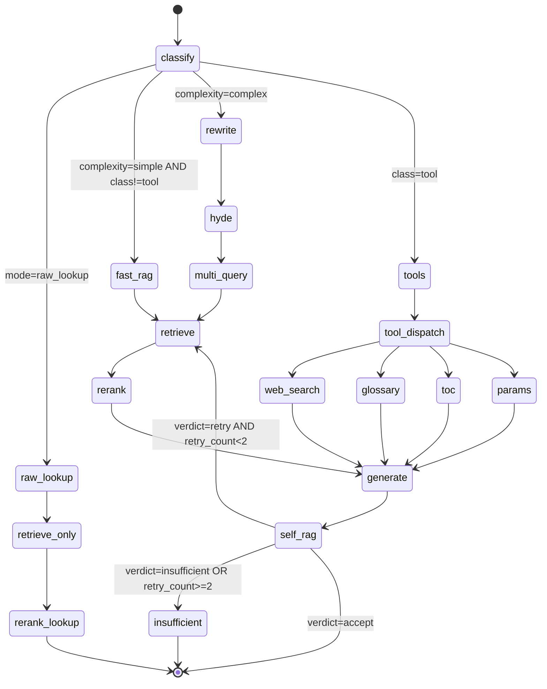
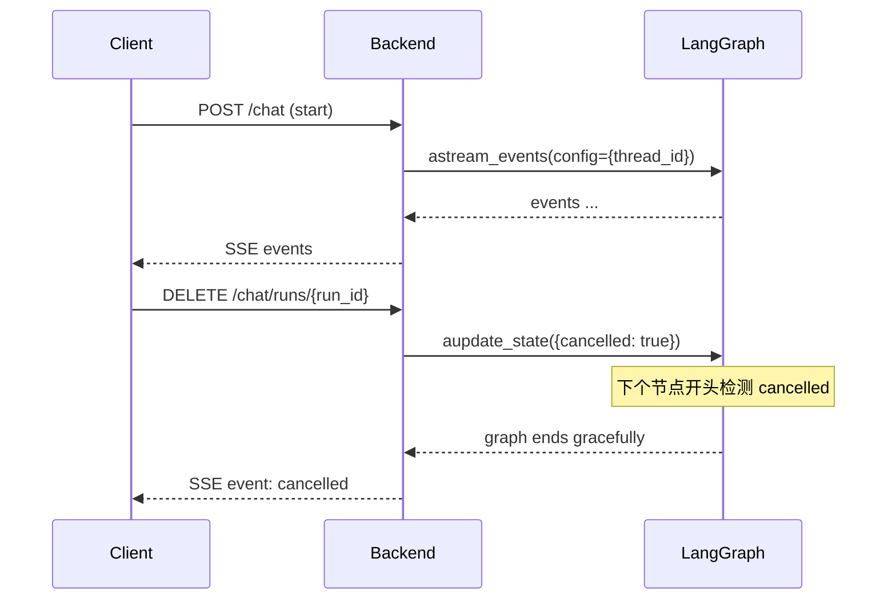

# 03·03 - Agent 编排（LangGraph）

> 把"检索 + 推理"组装成可控、可流式、可观测的 Agent。最终被后端 SSE 接口消费。

## 1. 交付物

- ✅ `backend/app/agent/graph.py`：导出编译好的 `tgpp_agent` (CompiledStateGraph) 与状态类型
- ✅ 完整节点集（路由 / 改写 / 检索 / rerank / 生成 / self-RAG 校验 / 工具调用）
- ✅ PostgresSaver checkpointer：会话级持久化、可中断恢复
- ✅ 流式 API：`astream_events` 输出节点状态 + token 增量 + 中间结果（hit chunks）
- ✅ 4 个工具节点：`web_search` / `glossary` / `toc` / `params`
- ✅ 中途取消：thread cancel 机制
- ✅ Langfuse 集成（CallbackHandler 在 graph invoke 时注入）

## 2. State Schema

```python
# backend/app/agent/state.py
from typing import Annotated, Literal, Sequence
from langchain_core.messages import BaseMessage
from langgraph.graph.message import add_messages
from pydantic import BaseModel

class RetrievedChunk(BaseModel):
    chunk_id: str
    spec_id: str
    section_path: tuple[str, ...]
    section_title: str
    chunk_type: Literal["text","table","formula","figure"]
    content: str
    score_dense: float
    score_sparse: float | None
    score_rerank: float | None
    fused_score: float

class AgentState(BaseModel):
    # 输入
    user_input: str
    user_language: Literal["zh","en"] = "en"
    mode: Literal["qa","raw_lookup"] = "qa"          # 来自前端切换
    explicit_tools: list[str] = []                   # 用户显式触发的工具，如 ["web_search"]

    # 多轮上下文
    messages: Annotated[Sequence[BaseMessage], add_messages] = []

    # 路由结果
    query_class: Literal["definition","procedure","tool","unknown"] | None = None
    complexity: Literal["simple","complex"] = "simple"   # 决定走单跳还是完整链路

    # 查询改写
    rewritten_queries: list[str] = []                # 多查询拆分后的 list
    hyde_doc: str | None = None

    # 检索
    candidates: list[RetrievedChunk] = []            # 取并集后排重 top-50
    reranked: list[RetrievedChunk] = []              # top-5

    # 工具结果（按工具名 -> 结构化结果）
    tool_results: dict[str, object] = {}

    # 生成
    final_answer: str = ""
    citations: list[dict] = []                       # [{chunk_id, spec, section, span}]
    confidence: float = 0.0                          # self-RAG 自评

    # 自校验
    self_rag_verdict: Literal["accept","retry","unknown"] | None = None
    retry_count: int = 0

    # 监控
    trace_id: str | None = None                      # Langfuse trace id
    cancelled: bool = False
```

## 3. 状态图



## 4. 节点实现

### 4.1 `classify_node` — 路由 / 复杂度判定 / fast path 改写

- 模型：`mimo-v2.5`（轻量）
- 结构化输出（Pydantic schema）：

```python
class ClassifyOutput(BaseModel):
    query_class: Literal["definition","procedure","tool","unknown"]
    complexity: Literal["simple","complex"]
    detected_language: Literal["zh","en","mixed"]
    rewritten_query: str | None          # simple fast path 直接使用；complex 可为空
    needs_explicit_tools: list[str]   # 当 user_input 明确要求"搜索一下"等
    reason: str                        # 简短理由（≤ 50 字）
```

- 在 prompt 中明示判定标准：
  - `definition` = 单一术语 / 单一字段定义
  - `procedure` = 流程类查询
  - `tool` = 缩写表 / 章节目录 / 参数查询
  - 复杂度：包含多个 entity / 需要多文档证据 → complex
- simple 查询必须同时输出一个英文 `rewritten_query`，避免再单独调用 `rewrite_node`；只有 complex 才进入 `rewrite_node + hyde + multi_query`

### 4.2 `rewrite_node` — 查询改写

- 模型：`mimo-v2.5`
- 任务：
  - 中文输入 → 英文检索 query
  - 解词改 query（`5GS` → `5G System`）
  - 输出 1 个标准化 query（多查询拆分单独走 multi_query）

### 4.3 `hyde_node` — Hypothetical Document Embedding

- 仅 complex 走
- 让 LLM 假装写一段"理想答案的章节文本"（200-400 tokens），用它的 embedding 一起检索
- 模型：`mimo-v2.5-pro`（需要够强才生成的 hyde 有意义）

### 4.4 `multi_query_node`

- 把改写后的 query 拆 3-5 个**不同角度** sub-query
- 模型：`mimo-v2.5`
- 输出：`list[str]`

### 4.5 `retrieve_node` — Hybrid 检索

```python
async def retrieve_node(state: AgentState) -> AgentState:
    queries = state.rewritten_queries or [state.user_input]
    if state.hyde_doc:
        queries.append(state.hyde_doc)
    candidates = []
    for q in queries:
        dense = await dense_retriever.aretrieve(q, top_k=30)
        sparse = await sparse_retriever.aretrieve(q, top_k=30)
        candidates.extend(rrf_merge(dense, sparse))
    # 排重 + 元数据过滤
    unique = dedup_by_chunk_id(candidates)[:50]
    return state.model_copy(update={"candidates": unique})
```

- `dense_retriever`：`backend/app/retrieval/dense.py` 包 LlamaIndex VectorStoreIndex（Qdrant backend）
- `sparse_retriever`：BM25 from persist dir
- RRF 融合：`score = sum(1 / (60 + rank_i))`
- 过滤：根据 `query_class` 选 `spec_id` 限定
- 缓存：`Redis tgpp:cache:retrieve:{sha256(query+filter)}` TTL 1h

### 4.6 `rerank_node`

```python
async def rerank_node(state: AgentState) -> AgentState:
    docs = [c.content for c in state.candidates]
    scores = await voyage_client.rerank(
        query=state.rewritten_queries[0] if state.rewritten_queries else state.user_input,
        documents=docs,
        model="rerank-2",
        top_k=5,
    )
    reranked = sorted_by_rerank(state.candidates, scores)[:5]
    return state.model_copy(update={"reranked": reranked})
```

- 缓存：同 retrieve

### 4.7 `generate_node` — 最终生成

- 模型：`mimo-v2.5-pro`（streaming=True）
- Prompt 要点（见 §5 prompt 库）：
  - 严格 grounding：仅基于 `reranked` 内容
  - 引用格式：`[spec_id §section_path ¶offset]`
  - 输出语言：`state.user_language`
  - 公式保留 LaTeX

- 输出后用正则提取 `[xx §xx]` 写入 `state.citations`

### 4.8 `self_rag_node` — 自校验

- 模型：`mimo-v2.5`（轻量）
- 输入：`user_input + reranked.content + final_answer`
- 结构化输出：

```python
class SelfRagOutput(BaseModel):
    faithful: bool                # 答案是否完全 grounded
    coverage: float               # 0-1，关键事实覆盖度
    confidence: float             # 0-1
    verdict: Literal["accept","retry","insufficient"]
    missing_aspects: list[str]    # 缺哪些 facet（驱动 retry 时新增 query）
```

- 路由：
  - `accept` → END
  - `retry` 且 `retry_count < 2` → 把 `missing_aspects` 改写为新 query，回 `retrieve_node`
  - `insufficient` 或 retry 后仍不足 → 生成最终回答："未在已索引 3GPP 文档中找到 …"，END

**性能策略**：

- simple fast path 不默认跑完整 self-RAG retry 循环；只做轻量 citation/grounding check（同一 `self_rag_node`，但 `allow_retry=false`）。
- complex 查询仍做 self-RAG 校验，最多 retry 2 次后强制收敛，避免成本失控。
- 低置信度 simple 查询（rerank top score 低、引用不足、生成答案缺引用）才升级到完整 self-RAG retry。

### 4.9 工具节点

`backend/app/tools/`：

#### `web_search`
- 用 Tavily SDK，仅当 `state.explicit_tools` 含 `"web_search"`
- 返回 markdown + url 列表
- 答案前缀强制加："以下内容来自 Web 搜索，未经 3GPP 验证："

#### `glossary`
- 查"缩写/术语表"：从 PG `glossary` 表（M2 期间从 21.905 / 各 TS Definitions 章节抽取构建）
- 命中后短答 + 给所在 spec 引用

#### `toc`
- 章节目录查询（"列出 38.331 §5.3 所有子节"）
- 从 PG `chunks_meta` 按 `spec_id + section_path` 前缀查询

#### `params`
- IE / 字段查询（"X 字段在哪些 spec 出现过"）
- 走 BM25 全文检索（精确字段名 + 限定 `chunk_type` 为 text/table）

### 4.10 `raw_lookup_node`

- mode = raw_lookup 时走
- 直接 retrieve → rerank → 返回 top-5 chunks，不调 LLM 生成自然语言答案
- 输出格式：list of chunks（前端按"检索结果列表"渲染）

## 5. Prompt 库管理

`backend/app/agent/prompts/`，单独 markdown 文件：

```
prompts/
├── classify.md
├── rewrite.md
├── hyde.md
├── multi_query.md
├── generate_qa.md
├── self_rag.md
└── tools/
    ├── web_search_prefix.md
    └── ...
```

- 每个 prompt 顶部 frontmatter 写 `version: 1` + `notes:`，迭代留痕
- 加载用 `jinja2.Template`
- 集成测覆盖：`test_prompts_render_without_undefined_vars`

## 6. PostgresSaver Checkpointer

```python
from langgraph.checkpoint.postgres import AsyncPostgresSaver

checkpointer = AsyncPostgresSaver.from_conn_string(
    DATABASE_URL.replace("+asyncpg",""),     # langgraph 用 psycopg
)
await checkpointer.setup()                    # 建 schema langgraph_*

graph = builder.compile(checkpointer=checkpointer)
```

- thread_id = `session_id`（来自后端，由 user_id + uuid 构成）
- 每个 session 的多轮消息天然累积在 messages 状态
- 支持"中途取消"：后端在另一个连接里 `graph.aupdate_state(config, {"cancelled": True})` + thread 内每个节点开头检查 `state.cancelled`

## 7. 流式输出协议

LangGraph `astream_events(v="v2")` 产出事件序列。后端把这些事件**重新映射**到我们对前端友好的 SSE event 类型：

| LangGraph event | 后端 SSE event | payload |
|----------------|---------------|---------|
| `on_chain_start` (node) | `node_start` | `{node, ts}` |
| `on_chain_end` (node) | `node_end` | `{node, duration_ms, summary}` |
| `on_chat_model_stream` (generate) | `token` | `{delta}` |
| 节点内显式 `astream_writer({"type":"chunks_hit"})` | `chunks_hit` | `[{chunk_id, spec, score, preview}]` |
| graph 完成 | `final` | `{answer, citations, confidence}` |
| graph error | `error` | `{message}` |

## 8. Langfuse 集成

```python
from langfuse.callback import CallbackHandler

handler = CallbackHandler(
    public_key=..., secret_key=..., host=...,
    session_id=session_id,
    user_id=user_id,
    metadata={"app": "tgpp", "mode": state.mode},
)
async for event in graph.astream_events(..., config={"callbacks":[handler]}):
    ...
```

- 每次 graph 调用一个 trace；每个节点一个 span
- 在 `generate_node` 前 `handler.flush()` 一次，确保 token 流的 trace 能 quasi-实时看到

## 9. 测试策略

- **单元测**：每个节点独立、mock LLM 与 retriever，断言状态变换
- **集成测**：从 user_input 直跑到 final answer，校验：
  - simple/complex 各 5 题，验证路由分支正确
  - tool 触发：用例 `"搜一下 38.331 最新版本进度"` → web_search 被调用
  - raw_lookup 模式不调 LLM 生成
- **eval 测**（M3+）：金标准集 + Ragas

## 10. 性能预算

| 节点 | 模型 | 期望耗时 | 备注 |
|------|------|---------|------|
| classify | mimo-v2.5 | 1-2s | 短输入短输出 |
| rewrite | mimo-v2.5 | 1-2s | |
| hyde | mimo-v2.5-pro | 3-5s | 仅 complex |
| multi_query | mimo-v2.5 | 1-2s | 仅 complex |
| retrieve | - | 0.3-0.8s | dense + sparse 并发 |
| rerank | voyage rerank-2 | 0.5-1s | |
| generate | mimo-v2.5-pro | 5-30s | streaming；50-1000 tokens |
| self_rag | mimo-v2.5 | 2-3s | |

**simple fast path**：classify（含 rewrite）+ retrieve + rerank + generate + 轻量 grounding check，目标 P95 < 15s。
**complex 链路**：rewrite + hyde + multi_query + retrieve/rerank + generate + self-RAG（最多 1 次 retry），目标 P95 < 60s。
**raw_lookup**：retrieve + rerank，不调用生成 LLM，目标 P95 < 5s。

与需求 §4.1 一致。

## 11. 中途取消机制



每个节点开头 1 行：

```python
if state.cancelled: raise NodeInterrupt("cancelled by user")
```

## 12. 风险与排雷

| 风险 | 触发 | 应对 |
|------|------|------|
| LLM 不遵守严格 grounding，幻觉补齐 | self_rag 检测不到 | prompts/generate_qa.md 多轮迭代；self_rag 设独立模型避免同源偏差 |
| self_rag 死循环 | 一直 retry | `retry_count >= 2` 强制 accept |
| 工具节点权限滥用 | Agent 自作主张调 web_search | 严格判断 `explicit_tools`，prompt 中明示"未列入 explicit_tools 不得调用" |
| Voyage 海外延迟波动 | 网络抖动 | tenacity + 30s timeout + fallback 到 Jina rerank（已在选型文档） |
| PG checkpointer 锁竞争 | 小规模多用户同时发起长任务 | thread_id 按 session 隔离；必要时调连接池与 checkpoint 写入频率 |

## 13. 验收清单

- [ ] `pytest -m unit backend/tests/unit/agent/` 全绿
- [ ] `pytest -m integration backend/tests/integration/agent/` 覆盖：
  - simple QA 端到端
  - complex QA 端到端
  - raw_lookup 模式
  - 中途取消
  - 工具节点显式触发（web_search、glossary、toc、params）
- [ ] Langfuse 中能看到完整 trace（每个节点 span + token stream）
- [ ] 流式 SSE event 序列符合 §7 表

## 14. 完成后下一步

→ `04-backend-api.md` 把 agent 包成 FastAPI 路由，对外暴露 SSE。
