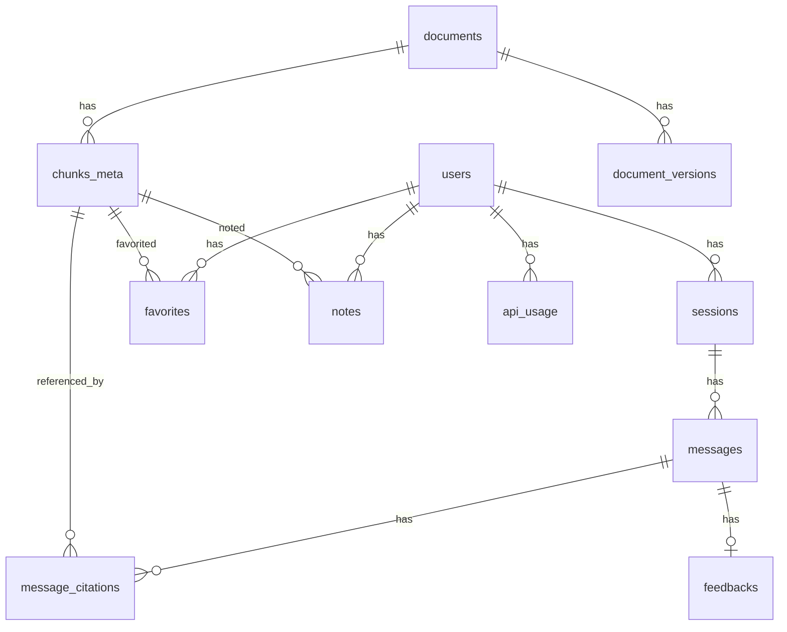

# 03·04 - 后端 API（FastAPI）

> 把 LangGraph Agent 包成 HTTP/SSE 接口；管理用户/会话/文档/反馈数据；做鉴权与限流。

## 1. 交付物

- ✅ FastAPI 应用 `backend/app/main.py`，所有路由按资源拆分到 `app/api/v1/*`
- ✅ Pydantic v2 请求/响应 schema 全套
- ✅ SQLAlchemy 2.0 async ORM + Alembic 迁移（PG schema）
- ✅ SSE 流式 `/chat` 接口，与 §3 SSE 事件表一致
- ✅ JWT + 单用户 token 双模式鉴权（`AUTH_MODE` 切换）
- ✅ OpenAPI / Swagger UI（`/docs`）覆盖所有路由
- ✅ 健康检查 `/health`、就绪检查 `/ready`
- ✅ 集成测覆盖核心路由

## 2. 路由总表

| 资源 | 方法 | 路径 | 说明 |
|------|------|------|------|
| **Auth** | POST | `/api/v1/auth/login` | 单用户 token 验证 → 签发 JWT；多用户期改账密 |
|  | POST | `/api/v1/auth/refresh` | 刷新 JWT |
|  | GET | `/api/v1/auth/me` | 当前用户信息 |
| **Sessions** | GET | `/api/v1/sessions` | 列出当前用户会话（分页） |
|  | POST | `/api/v1/sessions` | 创建空会话 |
|  | GET | `/api/v1/sessions/{sid}` | 获取会话元信息 + 消息列表 |
|  | PATCH | `/api/v1/sessions/{sid}` | 改标题等 |
|  | DELETE | `/api/v1/sessions/{sid}` | 删除会话（PG cascade） |
| **Chat (流式)** | POST | `/api/v1/sessions/{sid}/messages` | 发送消息，返回 SSE 事件流 |
|  | DELETE | `/api/v1/sessions/{sid}/runs/{rid}` | 取消正在跑的 graph |
| **Messages** | GET | `/api/v1/sessions/{sid}/messages/{mid}` | 单条消息详情（含 citations） |
| **Reader（章节阅读器）** | GET | `/api/v1/docs` | 已索引文档列表（带筛选 release/series） |
|  | GET | `/api/v1/docs/{spec_id}` | 单篇 TS 章节树 |
|  | GET | `/api/v1/docs/{spec_id}/sections/{path}` | 取某章节完整 markdown + chunks |
|  | GET | `/api/v1/chunks/{chunk_id}` | 单 chunk 详情 + 上下文展开 |
| **Admin** | POST | `/api/v1/admin/crawl` | 触发 FTP 爬虫（异步任务） |
|  | POST | `/api/v1/admin/index/rebuild` | 重建索引（异步任务，可指定 spec） |
|  | GET | `/api/v1/admin/tasks/{tid}` | 异步任务状态 |
|  | GET | `/api/v1/admin/stats` | 索引数 / chunk 数 / API 用量统计 |
| **Favorites / Notes / Feedback** | POST/GET/DELETE | `/api/v1/favorites` | 收藏 chunk/消息 |
|  | POST/GET/PATCH/DELETE | `/api/v1/notes` | 笔记 CRUD |
|  | POST | `/api/v1/messages/{mid}/feedback` | thumb up/down + 原因 |
| **Tools** | POST | `/api/v1/tools/glossary/search` | 单独术语查询（不走 Agent，给前端附加 UI 用） |
|  | POST | `/api/v1/tools/toc` | 章节目录 |
| **Health** | GET | `/health` | liveness |
|  | GET | `/ready` | readiness（检 PG/Qdrant/Redis/LiteLLM 连通） |

## 3. DB Schema



### 3.1 表定义（SQLAlchemy 2.0 风格简写）

```python
class User(Base):
    id: Mapped[UUID] = mapped_column(primary_key=True, default=uuid4)
    username: Mapped[str] = mapped_column(unique=True)
    password_hash: Mapped[str | None]              # 单用户 token 模式时可空
    role: Mapped[str] = mapped_column(default="user")   # "user" | "admin"
    created_at, updated_at: timestamps

class Session(Base):
    id: UUID = pk
    user_id: UUID = FK(users.id)
    title: str
    mode_default: Literal["qa","raw_lookup"] = "qa"
    created_at, updated_at: timestamps
    last_message_at: datetime | None
    # 计算字段：message_count via relationship

class Message(Base):
    id: UUID = pk
    session_id: UUID = FK(sessions.id, ondelete="CASCADE")
    role: Literal["user","assistant","system"]
    content: text
    user_language: Literal["zh","en"] | None
    mode: Literal["qa","raw_lookup"] | None
    explicit_tools: ARRAY(text) = []
    # assistant 端
    citations: relationship -> MessageCitation
    confidence: float | None
    self_rag_verdict: str | None
    # 关联 langgraph thread / run 用于 cancel
    langgraph_run_id: str | None
    # 关联 langfuse trace
    langfuse_trace_id: str | None
    # token 用量
    prompt_tokens, completion_tokens: int | None
    created_at: timestamp

class MessageCitation(Base):
    id: UUID = pk
    message_id: UUID = FK
    chunk_id: UUID = FK(chunks_meta.id)
    rank: int                       # 在答案中第几次出现
    rerank_score: float | None
    # 展示用
    spec_id: str
    section_path: str               # "5.6.1.2"
    char_offset: tuple[int,int] | None

class Document(Base):
    id: UUID = pk
    spec_id: str = unique           # "23.501"
    release: str                    # "Rel-18"
    series: str                     # "23"
    title: str
    latest_version: str             # "i80"
    last_indexed_at: datetime | None
    chunk_count: int = 0
    status: Literal["pending","crawled","parsed","indexed","failed"]
    error_msg: text | None

class DocumentVersion(Base):
    id: UUID = pk
    document_id: UUID = FK
    version: str
    source_url: str
    file_path: str
    file_size: int
    downloaded_at: datetime
    indexed_at: datetime | None
    indexed_for_providers: ARRAY(text) = []   # ["voyage","glm"]

class ChunkMeta(Base):
    id: UUID = pk
    chunk_id: str = unique           # 与 Qdrant point id 一致
    document_id: UUID = FK
    spec_id: str
    section_path: ARRAY(text)        # ["5","6","1","2"]
    section_title: str
    chunk_type: Literal["text","table","formula","figure"]
    char_offset_start: int
    char_offset_end: int
    parent_section_id: UUID | None   # 自引用，指向同表的 section 头 chunk
    raw_extra: JSON                  # 表格 md / 图片 uri / latex
    provider: str                    # voyage / glm（用于双轨期分辨）

class Favorite(Base):
    id, user_id, target_type (chunk|message), target_id, created_at

class Note(Base):
    id, user_id, target_type, target_id, body (text), created_at, updated_at

class Feedback(Base):
    id, user_id, message_id (unique), thumb (1|-1), reason text | None, created_at

class ApiUsage(Base):
    id, user_id, day (date), llm_input_tokens, llm_output_tokens, embedding_tokens, rerank_calls, web_search_calls, total_cost_usd
    # 每日聚合一行 (user_id, day) unique

class Task(Base):
    """异步任务（crawl / index rebuild）"""
    id: UUID = pk
    kind: Literal["crawl","index_rebuild"]
    payload: JSON
    status: Literal["queued","running","done","failed"]
    progress: int = 0   # 0-100
    log_tail: text
    started_at, finished_at: timestamp | None
    created_by: UUID FK users
```

### 3.2 索引

- `messages(session_id, created_at DESC)`
- `chunks_meta(spec_id, section_path)` GIN
- `chunks_meta(parent_section_id)`
- `api_usage(user_id, day)` unique
- `documents(release, series)`

### 3.3 Alembic 工作流

```bash
alembic init -t async backend/alembic
alembic revision --autogenerate -m "init schema"
alembic upgrade head
```

迁移文件入 git；CI 跑 `alembic upgrade head` 在 ephemeral PG 上验证。

## 4. SSE 实现细节

### 4.1 端点

```python
@router.post("/sessions/{sid}/messages")
async def send_message(
    sid: UUID,
    body: SendMessageBody,
    user: User = Depends(get_current_user),
    db: AsyncSession = Depends(get_db),
):
    # 1. 写 user message 到 DB
    # 2. 生成 run_id，开 EventSourceResponse
    return EventSourceResponse(
        stream_chat(sid, body, user, db),
        media_type="text/event-stream",
    )
```

### 4.2 SSE 事件序列

依据 `03-agent.md §7`：

```
event: run_start
data: {"run_id":"...", "session_id":"..."}

event: node_start
data: {"node":"classify","ts":...}

event: node_end
data: {"node":"classify","duration_ms":1200,"summary":{"query_class":"procedure","complexity":"complex"}}

event: node_start
data: {"node":"retrieve"}

event: chunks_hit
data: {"chunks":[{"chunk_id":"...","spec":"23.501","section":"5.6.1","preview":"..."},...]}

event: node_end
data: {"node":"retrieve","duration_ms":650}

event: token
data: {"delta":"PDU "}

event: token
data: {"delta":"Session "}

...

event: final
data: {"message_id":"...","answer":"...","citations":[...],"confidence":0.87}

event: end
data: {}
```

错误：

```
event: error
data: {"code":"agent_failed","message":"..."}
```

取消：

```
event: cancelled
data: {"reason":"user_cancelled"}
```

### 4.3 取消接口

```python
@router.delete("/sessions/{sid}/runs/{rid}")
async def cancel_run(...):
    # 在另一个 PG 连接里 update_state(cancelled=True)
    await agent.aupdate_state(
        config={"configurable":{"thread_id": str(sid)}},
        values={"cancelled": True},
    )
```

## 5. 鉴权

```python
# backend/app/core/auth.py

class AuthMode(str, Enum):
    SINGLE_USER = "single_user"
    JWT = "jwt"

def get_current_user(...) -> User:
    if settings.AUTH_MODE == "single_user":
        # 头部 Authorization: Bearer <SINGLE_USER_TOKEN>
        # 命中后返回 fixed user
        ...
    else:
        # JWT 解码 + DB 查询
        ...
```

- single_user 模式：`.env` 中静态 token 即可，省掉登录流程
- JWT 模式（预留）：标准 OAuth2 password flow，access + refresh

## 6. 限流与配额（最小实现）

`backend/app/core/ratelimit.py`：

- Redis 令牌桶：`tgpp:rl:{user_id}:{bucket}`
- bucket：
  - `chat`：60 req/小时
  - `tools_websearch`：20 calls/天（成本控制）
  - `admin_crawl`：5/天

超限返回 `429 Too Many Requests`。

## 7. 配置与日志

### 7.1 Pydantic Settings

`backend/app/core/config.py`：

```python
class Settings(BaseSettings):
    APP_ENV: Literal["dev","prod"] = "dev"
    APP_DEBUG: bool = True
    APP_SECRET_KEY: str
    AUTH_MODE: Literal["single_user","jwt"] = "single_user"
    SINGLE_USER_TOKEN: str | None = None
    # ... 全部 .env key 一一映射

    class Config:
        env_file = ".env"

@lru_cache
def get_settings() -> Settings: ...
```

### 7.2 结构化日志

`structlog` JSON 输出：

```python
import structlog

log = structlog.get_logger()
log.info("agent.node.end", node="retrieve", duration_ms=650, chunks=50)
```

- prod 输出 JSON 一行 / 一条，便于挂日志收集
- dev 输出 pretty console
- 包含 `trace_id`（与 Langfuse trace 对齐）

### 7.3 错误统一处理

```python
@app.exception_handler(AppError)
async def app_error_handler(req, exc): ...
```

- 业务错误 4xx + `{"code":"...","message":"..."}`
- 5xx：日志 traceback + Langfuse 标记 + 客户端通用消息

## 8. OpenAPI

- 每个路由都写 `summary` + `description` + `response_model` + 示例
- `app.openapi()` 自动暴露 `/openapi.json`
- 前端用 `openapi-generator` 生成 Dart client（详见 `05-frontend.md`）

## 9. 异步任务

简化方案（不引入 Celery）：

- `Task` 表 + `Redis stream tgpp:tasks`
- API 接到 admin 触发 → 写 task + LPUSH redis
- 单独的 `worker.py` 进程订阅 redis stream，按 kind 分发到 ingestion CLI
- 同进程 `asyncio.create_task` 也可（单用户场景资源紧，但要小心阻塞 event loop）

二期需要可靠任务队列再换 Celery / arq。

## 10. 测试策略

- **单元**：路由 schema 解析、auth、ratelimit 算法、citation 解析
- **集成**：用 httpx AsyncClient + ephemeral PG / Qdrant
  - `/chat` 流式：fake LangGraph 返回 fixture events，断言 SSE 序列
  - DB CRUD 全套
  - 鉴权两种模式
- **eval**：直接通过 `/chat` 跑金标准集（详见 `06-evaluation-and-observability.md`）

## 11. 风险与排雷

| 风险 | 触发 | 应对 |
|------|------|------|
| SSE 在 Nginx 后被缓冲 | 生产部署 | Nginx `proxy_buffering off` 仅作用于该 location；EventSourceResponse 加 `ping` keepalive |
| 取消时 LangGraph 已写一半 PG checkpoint | 并发写 | LangGraph 的 PG checkpointer 用事务，无锁竞争隐患；前端等 `cancelled` event 再 close |
| Pydantic v2 与 LangChain v0.3 兼容 | 升级抖动 | 锁定 minor 版本，CI 跑兼容性测试 |
| 大量历史消息撑爆 messages context | 长会话 | 取最近 N 条 + summary 注入 system prompt（v2 优化） |
| LiteLLM 共享实例临时挂 | 共享服务 | tenacity 重试 + `/ready` 检测 + 降级"503 模型暂不可用" |

## 12. 验收清单

- [ ] `pytest -m unit backend/tests/unit/api/` 全绿
- [ ] `pytest -m integration backend/tests/integration/api/` 全绿
- [ ] `curl /docs` 可访问 Swagger UI，所有路由有描述
- [ ] `curl /health` 200；`curl /ready` 检测每个依赖
- [ ] Postman 跑通端到端：登录 → 创建会话 → 发消息（SSE） → 看引用 → 取消 → 删除会话
- [ ] Alembic：`alembic upgrade head` 在干净 PG 上成功；`alembic downgrade -1` 也可
- [ ] Single-user mode 与 JWT mode 切换均可工作

## 13. 完成后下一步

→ `05-frontend.md` 消费这些路由，做 Flutter 客户端。
