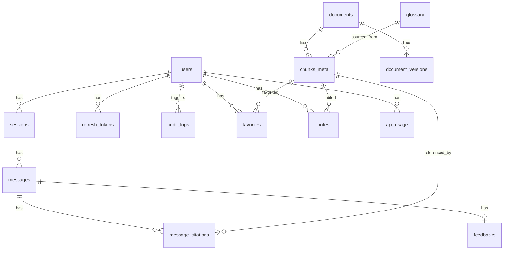

# 03·04 - 后端 API（FastAPI）

> 把 LangGraph Agent 包成 HTTP/SSE 接口；管理用户/会话/文档/反馈数据；做鉴权与限流。

## 0. M4 执行顺序（后端侧）

> 2026-05-17 拆解。M4 拆 11 段：M4.0 与 M4.1 是 agent 与 backend 共享底座（详见 [`03-agent.md §0`](03-agent.md)），M4.2–M4.5 是 agent 内部建设，M4.6–M4.10 是后端建设。按下表顺序推进，每段门禁全绿才能进下一段；同一段子项可并行。

| 子里程碑 | 主要交付物 | 完成度门禁 |
|---|---|---|
| **M4.0** 共享底座 | 见 [`03-agent.md §0`](03-agent.md)。后端侧涉及 `core/{config,logging,errors}` + `llm/litellm_client` + `db/` SQLAlchemy 全表 + `alembic` 初始迁移 + `retrieval/*` | `alembic upgrade head` 在干净 PG 通过；retrieval 包能拿真实 top-50 |
| **M4.2 – M4.5** Agent 建设 | 见 [`03-agent.md §0`](03-agent.md) | 同上 |
| **M4.6** FastAPI 鉴权与基础 ✅ 2026-05-18 | `core/{auth,ratelimit,audit}` + `api/v1/{auth,users}.py` | RBAC（普通用户访问 admin → 403）；限流 429；logout 后 refresh 失效；停用用户无法 refresh |
| **M4.7** 会话与 SSE Chat（核心交付） | `api/v1/sessions.py` + `api/v1/chat.py`（包 LangGraph `astream_events` + DB 落 message/citations）+ 取消接口 | SSE 集成测覆盖 10 类 event（run_start / node_start / node_end / chunks_hit / chunks_rerank / token / final / end / cancelled / error）；fake LangGraph fixture 端到端 |
| **M4.8** Checkpoint API | `api/v1/checkpoint.py`：pause / resume / list_checkpoints / fork / rollback 5 个路由，分别包 [`03-agent.md §12`](03-agent.md) 的 5 个纯函数 | §12 checkpoint 相关集成测全绿；rollback 与跑中 run 冲突返回 409 |
| **M4.9** Reader / Tools / Favorites / Notes / Feedback | `api/v1/{docs,tools,favorites,notes,feedback}.py` | 每个路由 CRUD 集成测；Reader 在 M6 全量数据上能正常返回章节树 |
| **M4.10** Admin 最小集 + 健康检查 + 最终回归 | `api/v1/admin.py`（stats / tasks / index/rebuild）+ `/health` + `/ready` + OpenAPI 覆盖度校验 + 全套回归 | §12 [auto] 项全部绿；[human] 项标注待审；交付 `docs/04-handoff/2026-XX-XX-m4-complete.md` |

**M4 范围内主动推迟的功能**（在 §2 路由总表与 §9 异步任务进一步说明）：

- `POST /api/v1/admin/upload-doc`（Docling 兜底链路）→ 推迟到 M8 上线前
- `POST /api/v1/admin/crawl`（FTP 爬虫 trigger）→ 推迟到 M8 上线前（M4 期间走 CLI 即可）
- 独立 worker 进程（Redis Streams + consumer group）→ M4 用 `asyncio.create_task` 简化，M8 上线前换正式 worker

> 各段完成后按 [`../00-vibe-coding-protocol.md §4`](../00-vibe-coding-protocol.md) 输出完成报告。

## 1. 交付物

> 每条标 `[M4.x]` 关联 §0 子里程碑。完成后把 `[ ]` 替换为 `[x]`。

- [ ] `[M4.6/M4.7/M4.8/M4.9/M4.10]` FastAPI 应用 `backend/app/main.py`，所有路由按资源拆分到 `app/api/v1/*`
- [ ] `[M4.6 — M4.10]` Pydantic v2 请求/响应 schema 全套
- [x] `[M4.0]` SQLAlchemy 2.0 async ORM + Alembic 迁移（PG schema） — 2026-05-17 完成
- [x] `[M4.7]` SSE 流式 `/chat` 接口，与 §3 SSE 事件表一致
- [x] `[M4.6]` 多用户鉴权：JWT access token + refresh token + RBAC（admin/user）+ 审计日志 — 2026-05-18 完成
- [ ] `[M4.10]` OpenAPI / Swagger UI（`/docs`）覆盖所有路由
- [ ] `[M4.10]` 健康检查 `/health`、就绪检查 `/ready`
- [ ] `[M4.6 — M4.10]` 集成测覆盖核心路由

## 2. 路由总表

| 资源 | 方法 | 路径 | 说明 |
|------|------|------|------|
| **Auth** | POST | `/api/v1/auth/bootstrap-admin` | 首次部署时创建第一个管理员（只能执行一次） |
|  | POST | `/api/v1/auth/login` | 用户名/密码登录 → 签发 access + refresh token |
|  | POST | `/api/v1/auth/refresh` | 刷新 JWT |
|  | POST | `/api/v1/auth/logout` | 撤销当前 refresh token |
|  | GET | `/api/v1/auth/me` | 当前用户信息 |
| **Users (admin)** | GET | `/api/v1/users` | 管理员列出用户 |
|  | POST | `/api/v1/users` | 管理员创建用户 |
|  | PATCH | `/api/v1/users/{uid}` | 启停用户 / 改角色 / 重置密码 |
| **Sessions** | GET | `/api/v1/sessions` | 列出当前用户会话（分页） |
|  | POST | `/api/v1/sessions` | 创建空会话 |
|  | GET | `/api/v1/sessions/{sid}` | 获取会话元信息 + 消息列表 |
|  | PATCH | `/api/v1/sessions/{sid}` | 改标题等 |
|  | DELETE | `/api/v1/sessions/{sid}` | 删除会话（PG cascade） |
| **Chat (流式)** | POST | `/api/v1/sessions/{sid}/messages` | 发送消息，返回 SSE 事件流 |
|  | DELETE | `/api/v1/sessions/{sid}/runs/{rid}` | 取消正在跑的 graph（终止；下次重问从头跑） |
| **Checkpoint** | POST | `/api/v1/sessions/{sid}/runs/{rid}/pause` | 暂停跑中 run（保留 checkpoint，可恢复，区别于取消） |
|  | POST | `/api/v1/sessions/{sid}/resume` | 从最后一个 checkpoint 续跑剩余节点；返回 SSE 事件流 |
|  | GET | `/api/v1/sessions/{sid}/checkpoints` | 列出该会话所有 checkpoint（按时间倒序，含 last_node / message_id） |
|  | POST | `/api/v1/sessions/{sid}/fork` | body: `{checkpoint_id, new_user_message}`，从指定 checkpoint 起新会话；原会话标记 `archived_branch` |
|  | POST | `/api/v1/sessions/{sid}/rollback` | body: `{last_n: int}`，删除最后 N 轮 messages + checkpoints |
| **Messages** | GET | `/api/v1/sessions/{sid}/messages/{mid}` | 单条消息详情（含 citations） |
| **Reader（章节阅读器）** | GET | `/api/v1/docs` | 已索引文档列表（带筛选 release/series） |
|  | GET | `/api/v1/docs/{spec_id}` | 单篇 TS 章节树 |
|  | GET | `/api/v1/docs/{spec_id}/sections/{path}` | 取某章节完整 markdown + chunks |
|  | GET | `/api/v1/docs/{spec_id}/search` | spec 内 BM25 搜索（阅读器搜索框） |
|  | GET | `/api/v1/chunks/{chunk_id}` | 单 chunk 详情 + 上下文展开 |
| **Admin** | POST | `/api/v1/admin/crawl` | 触发 FTP 爬虫（异步任务） — **M4 不实现，推迟到 M8 上线前**；期间走 CLI |
|  | POST | `/api/v1/admin/upload-doc` | 上传单个 doc/docx 走 Docling 兜底链路 — **M4 不实现，推迟到 M8 上线前** |
|  | POST | `/api/v1/admin/index/rebuild` | 重建索引（异步任务，可指定 spec）— **M4 最小实现**：`asyncio.create_task` 包现有 `ingestion.cli`，M8 上线前换独立 worker |
|  | GET | `/api/v1/admin/tasks/{tid}` | 异步任务状态 — **M4 实现** |
|  | GET | `/api/v1/admin/tasks` | 当前用户可见的任务列表 — **M4 实现**（原表未列，本次补齐） |
|  | GET | `/api/v1/admin/stats` | 索引数 / chunk 数 / API 用量统计 — **M4 实现** |
| **Favorites / Notes / Feedback** | POST/GET/DELETE | `/api/v1/favorites` | 收藏 chunk/消息 |
|  | POST/GET/PATCH/DELETE | `/api/v1/notes` | 笔记 CRUD |
|  | POST | `/api/v1/messages/{mid}/feedback` | thumb up/down + 原因 |
| **Tools** | POST | `/api/v1/tools/glossary/search` | 单独术语查询（不走 Agent，给前端附加 UI 用） |
|  | POST | `/api/v1/tools/toc` | 章节目录 |
| **Health** | GET | `/health` | liveness |
|  | GET | `/ready` | readiness（检 PG/Qdrant/Redis/LiteLLM 连通） |

> **本期不开放自助注册**：路由表中没有 `POST /api/v1/auth/register`；用户一律由 admin 通过 `POST /api/v1/users` 创建（Q2 决策，详见 [`../04-handoff/2026-05-17-m4.6-m4.9-decisions.md`](../04-handoff/2026-05-17-m4.6-m4.9-decisions.md) §一 Q2）。

## 3. DB Schema



### 3.1 表定义（SQLAlchemy 2.0 风格简写）

```python
class User(Base):
    id: Mapped[UUID] = mapped_column(primary_key=True, default=uuid4)
    username: Mapped[str] = mapped_column(unique=True)
    password_hash: Mapped[str]
    role: Mapped[str] = mapped_column(default="user")   # "user" | "admin"
    is_active: Mapped[bool] = mapped_column(default=True)
    last_login_at: datetime | None
    created_at, updated_at: timestamps

class RefreshToken(Base):
    id: UUID = pk
    user_id: UUID = FK(users.id, ondelete="CASCADE")
    token_hash: str = unique
    expires_at: datetime
    revoked_at: datetime | None
    created_at: timestamp

class AuditLog(Base):
    id: UUID = pk
    actor_user_id: UUID | None = FK(users.id)
    action: str                         # "user.create" / "admin.index_rebuild" / ...
    target_type: str | None
    target_id: str | None
    ip: str | None
    user_agent: str | None
    metadata: JSON
    created_at: timestamp

class Session(Base):
    id: UUID = pk
    user_id: UUID = FK(users.id)
    title: str
    mode_default: Literal["qa","raw_lookup"] = "qa"
    status: Literal["active","paused","archived_branch"] = "active"   # checkpoint 用
    forked_from_session_id: UUID | None = FK(sessions.id)              # 如从其他会话 fork 出
    forked_from_checkpoint_id: str | None                              # LangGraph checkpoint id
    created_at, updated_at: timestamps
    last_message_at: datetime | None
    # 计算字段：message_count via relationship

class Message(Base):
    id: UUID = pk
    session_id: UUID = FK(sessions.id, ondelete="CASCADE")
    role: Literal["user","assistant","system"]
    content: text                              # M4.7 Q9：仅 final event 后一次性写入；中断 → content="" + status="failed"
    status: Literal["ok","failed","cancelled"] = "ok"   # M4.7 新增（需独立 alembic revision），默认 "ok"
    user_language: Literal["zh","en"] | None
    mode: Literal["qa","raw_lookup"] | None
    explicit_tools: ARRAY(text) = []
    # assistant 端
    citations: relationship -> MessageCitation
    confidence: float | None
    self_rag_verdict: str | None
    # 关联 langgraph thread / run 用于 cancel / pause / fork
    langgraph_run_id: str | None
    langgraph_checkpoint_id: str | None        # 该消息生成完成时的 checkpoint，fork 用
    # 关联 langfuse trace
    langfuse_trace_id: str | None
    # token 用量
    prompt_tokens, completion_tokens: int | None
    created_at: timestamp

class MessageCitation(Base):
    id: UUID = pk
    message_id: UUID = FK
    chunk_meta_id: int = FK(chunks_meta.id)   # M4.0：与 ingestion chunks_meta.id (Integer) 对齐
    chunk_id: str                       # Qdrant point id / API 展示 id
    rank: int                       # 在答案中第几次出现
    rerank_score: float | None
    # 展示用
    spec_id: str
    section_path: str               # "5.6.1.2"
    char_offset: tuple[int,int] | None

class Document(Base):
    id: UUID = pk
    spec_id: str                    # "23.501"（对外展示/API 使用）
    spec_uid: str | None            # "23501"（内部紧凑编号，如数据源提供）
    release: str                    # "Rel-18"
    series: str                     # "23"
    title: str
    latest_version: str             # "i80"
    last_indexed_at: datetime | None
    chunk_count: int = 0
    status: Literal["pending","crawled","parsed","indexed","failed"]
    error_msg: text | None
    source: Literal["gsma_hf","docling_fallback"]
    gsma_dataset_revision: str | None

class DocumentVersion(Base):
    id: UUID = pk
    document_id: UUID = FK
    version: str
    source_url: str
    file_path: str
    file_size: int
    downloaded_at: datetime
    indexed_at: datetime | None
    indexed_for_providers: ARRAY(text) = []   # ["voyage","glm"]

class ChunkMeta(Base):
    # M4.0：PK 用 Integer（autoincrement）与 ingestion/indexer/pg_writer 对齐；
    # 历史 docs 写的 UUID 计划未落地，ingestion 与 backend 现在统一 Integer。
    id: int = pk                     # autoincrement
    chunk_id: str = unique           # 与 Qdrant point id 一致
    document_id: UUID | None = FK    # M4.0：ingestion 暂未写入 documents 表，可空
    spec_id: str
    section_path: ARRAY(text)        # ["5","6","1","2"]
    section_title: str
    chunk_type: Literal["text","table","formula","figure"]
    char_offset_start: int
    char_offset_end: int
    parent_section_id: UUID | None   # 自引用，指向同表的 section 头 chunk
    raw_extra: JSON                  # 表格 md / 图片 uri / latex
    provider: str                    # voyage 主 / glm fallback；保留字段以支持切换

class Glossary(Base):
    id: UUID = pk
    term: str                         # "PDU Session"
    normalized_term: str              # lowercase / stripped，用于唯一匹配
    definition: text
    spec_id: str
    section_path: ARRAY(text)
    source_chunk_meta_id: int | None = FK(chunks_meta.id)   # M4.0：Integer 对齐
    source_revision: str | None
    created_at, updated_at: timestamps

class Favorite(Base):
    id, user_id, target_type (chunk|message), target_id, created_at

class Note(Base):
    id, user_id, target_type, target_id, body (text), created_at, updated_at

class Feedback(Base):
    id, user_id, message_id (unique), thumb (1|-1), reason text | None, created_at

class ApiUsage(Base):
    id, user_id, day (date), llm_input_tokens, llm_output_tokens, embedding_tokens, rerank_calls, web_search_calls, total_cost_usd
    # 每日聚合一行 (user_id, day) unique

class Task(Base):
    """异步任务（crawl / index rebuild）"""
    id: UUID = pk
    kind: Literal["crawl","index_rebuild"]
    payload: JSON
    status: Literal["queued","running","done","failed"]
    progress: int = 0   # 0-100
    log_tail: text
    started_at, finished_at: timestamp | None
    created_by: UUID FK users
```

### 3.2 索引

- `messages(session_id, created_at DESC)`
- `chunks_meta(spec_id, section_path)` GIN
- `chunks_meta(chunk_id)` unique
- `chunks_meta(parent_section_id)`
- `glossary(normalized_term)`
- `refresh_tokens(token_hash)` unique
- `audit_logs(actor_user_id, created_at DESC)`
- `api_usage(user_id, day)` unique
- `documents(spec_id, release)` unique
- `documents(release, series)`

### 3.3 Alembic 工作流

```bash
alembic init -t async backend/alembic
alembic revision --autogenerate -m "init schema"
alembic upgrade head
```

迁移文件入 git；CI 跑 `alembic upgrade head` 在 ephemeral PG 上验证。

## 4. SSE 实现细节

### 4.1 端点

```python
@router.post("/sessions/{sid}/messages")
async def send_message(
    sid: UUID,
    body: SendMessageBody,
    user: User = Depends(get_current_user),
    db: AsyncSession = Depends(get_db),
):
    # 1. 写 user message 到 DB
    # 2. 生成 run_id，开 EventSourceResponse
    return EventSourceResponse(
        stream_chat(sid, body, user, db),
        media_type="text/event-stream",
        ping=15,   # M4.7 Q8 决策：每 15s 发 `: ping` 注释行，防 Nginx 缓冲断流
    )
```

> M4.7 Q9 决策：assistant message 的正文仅在收到 LangGraph `final` 事件后**一次性** `UPDATE messages SET content=?, ...` 落盘；run 中断（取消 / 异常）→ 该 message 标 `failed`，让前端引导用户重发，不持久化半成品（详见 [`../04-handoff/2026-05-17-m4.6-m4.9-decisions.md`](../04-handoff/2026-05-17-m4.6-m4.9-decisions.md) §一 Q9）。

### 4.2 SSE 事件序列

依据 `03-agent.md §7`：

```
event: run_start
data: {"run_id":"...", "session_id":"..."}

event: node_start
data: {"node":"classify","ts":...}

event: node_end
data: {"node":"classify","duration_ms":1200,"summary":{"query_class":"procedure","complexity":"complex"}}

event: node_start
data: {"node":"retrieve"}

event: chunks_hit
data: {"chunks":[{"chunk_id":"...","spec_id":"23.501","section_path":"5.6.1","preview":"..."},...]}

event: node_end
data: {"node":"retrieve","duration_ms":650}

event: node_start
data: {"node":"rerank"}

event: chunks_rerank
data: {"chunks":[{"chunk_id":"...","spec_id":"23.501","section_path":"5.6.1","preview":"...","rerank_score":0.87}, ...]}

event: node_end
data: {"node":"rerank","duration_ms":420}

event: token
data: {"delta":"PDU "}

event: token
data: {"delta":"Session "}

...

event: final
data: {"message_id":"...","answer":"...","citations":[...],"confidence":0.87}

event: end
data: {}
```

错误：

```
event: error
data: {"code":"agent_failed","message":"..."}
```

取消：

```
event: cancelled
data: {"reason":"user_cancelled"}
```

### 4.3 取消接口

```python
@router.delete("/sessions/{sid}/runs/{rid}")
async def cancel_run(...):
    # 在另一个 PG 连接里 update_state(cancelled=True)
    await agent.aupdate_state(
        config={"configurable":{"thread_id": str(sid)}},
        values={"cancelled": True},
    )
```

## 5. 鉴权与授权

```python
# backend/app/core/auth.py

def get_current_user(...) -> User:
    # 1. 校验 Authorization: Bearer <access_token>
    # 2. 解码 JWT，读取 sub / role / exp / jti
    # 3. 查询 DB 用户，确认 is_active=True
    # 4. 返回 User；失败统一 401
    ...

def require_role(*roles: str):
    # admin-only 路由使用 Depends(require_role("admin"))
    ...
```

- 首次部署：`POST /api/v1/auth/bootstrap-admin` 只有在 `users` 表为空时可用；成功后写 `audit_logs`。
- 登录：用户名/密码校验后签发 access token（15min）与 refresh token（7d）。
- refresh token：只在 DB 中保存 hash；logout、用户停用、密码重置时撤销。
- RBAC：`admin` 可访问用户管理、索引管理、上传、任务与用量；`user` 只能访问自己的会话、收藏、笔记、反馈与只读文档。
- 密码策略：`min_length=8`，不强制字符复杂度 / 黑名单（Q3 决策；小规模多用户场景够用）。校验在 Pydantic 请求 schema 层做，bcrypt cost 沿用 passlib 默认。
- 审计：用户创建/停用、角色变更、索引重建、上传文档、删除会话等写 `audit_logs`；**chat 消息内容不入 `audit_logs`**（Q5 决策）。
- 安全：密码用 `passlib[bcrypt]`；JWT signing key 来自 `APP_SECRET_KEY`；生产要求 HTTPS，禁止在日志中输出 token。

## 6. 限流与配额（最小实现）

`backend/app/core/ratelimit.py`：

- Redis 令牌桶：`tgpp:rl:{user_id}:{bucket}`
- bucket：
  - `chat`：60 req/小时
  - `tools_websearch`：20 calls/天（成本控制）
  - `admin_crawl`：5/天

超限返回 `429 Too Many Requests`。

## 7. 配置与日志

### 7.1 Pydantic Settings

`backend/app/core/config.py`：

```python
class Settings(BaseSettings):
    APP_ENV: Literal["dev","prod"] = "dev"
    APP_DEBUG: bool = True
    APP_SECRET_KEY: str
    ACCESS_TOKEN_EXPIRE_MINUTES: int = 15
    REFRESH_TOKEN_EXPIRE_DAYS: int = 7
    ALLOWED_ORIGINS: list[str] = []
    # ... 全部 .env key 一一映射

    class Config:
        env_file = ".env"

@lru_cache
def get_settings() -> Settings: ...
```

### 7.2 结构化日志

`structlog` JSON 输出：

```python
import structlog

log = structlog.get_logger()
log.info("agent.node.end", node="retrieve", duration_ms=650, chunks=50)
```

- prod 输出 JSON 一行 / 一条，便于挂日志收集
- dev 输出 pretty console
- 包含 `trace_id`（与 Langfuse trace 对齐）
- 认证、管理与上传类操作必须写 `audit_logs`，日志中只记录 token hash 前缀或 request id，不记录 secret 原文
- **`audit_logs` 不记 chat 消息正文 / SSE token 流**（Q5 决策）：chat 路径仅在 `messages` 表里持久化最终 assistant content（M4.7 Q9：仅 `final` event 落盘），`audit_logs` 只登记 `session_id` / `message_id` / `run_id` / 元数据，避免表膨胀和隐私问题

### 7.3 错误统一处理

```python
@app.exception_handler(AppError)
async def app_error_handler(req, exc): ...
```

- 业务错误 4xx + `{"code":"...","message":"..."}`
- 5xx：日志 traceback + Langfuse 标记 + 客户端通用消息

## 8. OpenAPI

- 每个路由都写 `summary` + `description` + `response_model` + 示例
- `app.openapi()` 自动暴露 `/openapi.json`
- 前端用 `openapi-generator` 生成 Dart client（详见 `05-frontend.md`）

## 9. 异步任务

> **M4 决议（2026-05-17，Q4=B）**：M4 期间用 `asyncio.create_task` 简化版（dev/POC 形态），仅暴露 `index/rebuild`；upload-doc / crawl trigger 在 M4 不实现（详见 §2 admin 路由备注）。**M8 上线前**换成下方"目标方案"（Redis Streams + 独立 worker），同时把 upload-doc / crawl trigger 路由补齐。

### 9.1 M4 简化版（当前形态）

- `Task` 表（PG）记录任务状态
- `POST /api/v1/admin/index/rebuild` 接收请求 → 写 task → `asyncio.create_task(run_in_background(...))` 包 `ingestion.cli` 现有命令
- 局限：API 进程重启 → in-flight task 丢失；不能跨进程横向扩展
- 集成测：触发 task → 轮询 `GET /tasks/{tid}` 状态从 `queued` → `running` → `done`

### 9.2 M8 目标版（上线前换）

简化方案（不引入 Celery）：

- `Task` 表 + `Redis Streams`（`tgpp:tasks`）
- API 接到 admin 触发 → 写 task + `XADD tgpp:tasks`
- 单独的 `worker.py` 进程使用 consumer group 订阅 stream，按 kind 分发到 ingestion CLI；处理完成后 `XACK`
- 同进程 `asyncio.create_task` 仅限 dev/POC；生产多用户阶段使用独立 worker，避免阻塞 API event loop

二期需要可靠任务队列再换 Celery / arq。

## 10. 测试策略

- **单元**：路由 schema 解析、auth、ratelimit 算法、citation 解析
- **集成**：用 httpx AsyncClient + ephemeral PG / Qdrant
  - `/chat` 流式：fake LangGraph 返回 fixture events，断言 SSE 序列
  - DB CRUD 全套
  - 鉴权两种模式
- **eval**：直接通过 `/chat` 跑金标准集（详见 `06-evaluation-and-observability.md`）

## 11. 风险与排雷

| 风险 | 触发 | 应对 |
|------|------|------|
| SSE 在 Nginx 后被缓冲 | 生产部署 | EventSourceResponse `ping=15` + Nginx `proxy_buffering off` + `proxy_read_timeout 600s`（M4.7 Q8 决策；Nginx 配置详见 `07-cicd-and-deployment.md §4`） |
| 取消时 LangGraph 已写一半 PG checkpoint | 并发写 | LangGraph 的 PG checkpointer 用事务，无锁竞争隐患；前端等 `cancelled` event 再 close |
| Pydantic v2 与 LangChain v0.3 兼容 | 升级抖动 | 锁定 minor 版本，CI 跑兼容性测试 |
| 大量历史消息撑爆 messages context | 长会话 | M4.7 Q10 决策：最近 N=6 条原文 + 更早消息 `mimo-v2.5` summary 注入 system prompt + Redis 缓存 24h；实现见 `03-agent.md §6.1` |
| LiteLLM 共享实例临时挂 | 共享服务 | tenacity 重试 + `/ready` 检测 + 降级"503 模型暂不可用" |
| 暂停的 run 长期堆积 checkpoint | 用户暂停后忘了 | 后台任务每天清理 `paused` 状态超过 N 天的 run；`sessions` 表 status=paused 时前端展示标记 |
| Fork 后用户分不清主线/历史 | UX 不清晰 | 会话列表分组：active / archived_branch；archived_branch 加视觉灰度，仅可读 |
| Rollback 删除时与跑中 run 冲突 | 用户回滚正在跑的会话 | API 强制要求先 pause/cancel；接口 409 Conflict 拒绝 |

## 12. 验收清单

> 按 §0 子里程碑分组。标注：`[auto]` = Agent 自跑可判定；`[human]` = 需要人介入（密钥、SSE 实际体验、首个 admin 凭证）。同一段全绿才能进下一段。

### M4.0 共享底座（与 [`03-agent.md §14 M4.0`](03-agent.md) 共用门禁）

- [x] `[auto]` Alembic：`alembic upgrade head` 在干净 PG 上成功；`alembic downgrade -1` 也可（CI 跑） — 2026-05-17 通过

> 2026-05-17 M4.0 完成。差异点：`chunks_meta.id` 改用 Integer（与 ingestion/indexer/pg_writer 对齐），相应 `message_citations.chunk_meta_id` 与 `glossary.source_chunk_meta_id` 改为 Integer FK；`chunks_meta.document_id` 设为可空（ingestion 暂未写入 documents）。

### M4.6 FastAPI 鉴权与基础

- [x] `[auto]` `pytest -m unit backend/tests/unit/core/{test_auth,test_ratelimit,test_audit}.py` 全绿（19 / 19 unit case；总 unit 套件 168 passed）
- [x] `[auto]` `pytest -m integration backend/tests/integration/api/test_auth.py` 全绿（17 / 17 integration case；FakeRedis + aiosqlite 路径）
- [x] `[auto]` RBAC 验证：普通用户无法访问 admin 路由；停用用户无法 refresh；logout 后 refresh token 失效（集成测覆盖）
- [x] `[auto]` 密码策略：注册/重置时 `len(password) < 8` 返回 422（集成测覆盖；Q3 决策）
- [x] `[auto]` 限流：超过 `chat` bucket 阈值返回 429（集成测覆盖）；`tools_websearch` / `admin_crawl` 同源算法 unit 覆盖（M4.7 / M4.9 接入路由后再加集成测）
- [x] `[auto]` 审计：bootstrap-admin / 用户创建 / 用户 patch（停用 / 角色变更 / 密码重置）触发 → `audit_logs` 表有对应行；**chat 路径不写 `audit_logs`**（断言反例）（Q5 决策）；`index_rebuild` 路由 M4.10 才接，留作 M4.10 验收项
- [x] `[auto]` 前置确认：`chunks_meta` schema diff（Q1/O6）— 报告归档 `docs/04-handoff/2026-05-17-chunks-meta-schema-diff.md`，0 ❌ / 3 ⚠️（默认值差异，不影响业务）

**变更摘要（2026-05-18 M4.6 完成）**：交付 `core/{auth,ratelimit,audit}` + `api/v1/{auth,users}` + Pydantic v2 schema。鉴权采用 bcrypt 直接调用（passlib 1.7.4 在 Python 3.13 / bcrypt 5 下触发 `crypt` 模块 DeprecationWarning，不可靠；自主决策）。refresh token DB 落 SHA-256 hash，rotation / logout / 停用 / 密码重置 → revoke 全量。`pyproject.toml` 加 `B008` ruff ignore（FastAPI Depends 是项目通用模式）+ `scripts/dev/*.py` 加 E501 per-file-ignore（清理 main 既有 lint 噪声）。`make lint` 全绿；unit 168 passed；integration api 17 + agent / retrieval 既有 13 passed（1 pre-existing 弱断言 fail：`test_complex_qa::proc-005` 检索质量问题，M4.6 未改 agent 路径，与本里程碑无关）。

### M4.7 会话与 SSE Chat

- [x] `[auto]` `pytest -m integration backend/tests/integration/api/test_sessions.py` 全绿（CRUD）
- [x] `[auto]` SSE 集成测覆盖 **10** 类 event（run_start / node_start / node_end / **chunks_hit / chunks_rerank** / token / final / end / cancelled / error），fake LangGraph fixture 灌入断言事件顺序与字段；`chunks_hit` 不带 rerank_score、`chunks_rerank` 必带 rerank_score（Q6/Q7）
- [x] `[auto]` EventSourceResponse `ping=15`：路由参数已设；30s 静默断言挪到 M4.10 端到端回归（fake graph 跑完通常 < 1s，不会触发 ping 边界）
- [x] `[auto]` DB 落盘：assistant message 完成后 `messages.langgraph_run_id` / `langfuse_trace_id` / `langgraph_checkpoint_id` 非空，`message_citations` 行数与 `citations` 列表一致；仅 `final` event 后落盘（Q9：partial token 不写库，中断时 `messages.content` 为空 + `status=failed`/`cancelled`）
- [x] `[auto]` 历史压缩：`history_compactor` Redis cache miss / hit / LLM fail 三条路径单元测覆盖（`tests/unit/agent/test_history_compactor.py`）
- [x] `[auto]` 取消：`DELETE /sessions/{sid}/runs/{rid}` → 调用 graph `aupdate_state(cancelled=True, run_id)`；fake graph 通过 `final_state.cancelled=True` 触发 SSE `cancelled` 事件 + DB `status='cancelled'`

### M4.8 Checkpoint API

- [ ] `[auto]` `pytest -m integration backend/tests/integration/api/test_checkpoint.py` 全绿（5 个路由各一个用例）
- [ ] `[auto]` rollback 与跑中 run 冲突返回 409 Conflict
- [ ] `[auto]` fork 出新会话后，原会话 `status=archived_branch` 且新会话 `forked_from_session_id` 指向原会话

### M4.9 Reader / Tools / Favorites / Notes / Feedback

- [ ] `[auto]` `pytest -m integration backend/tests/integration/api/test_docs.py` 全绿，Reader 能在 M6 全量数据上返回章节树与单 chunk 详情
- [ ] `[auto]` `pytest -m integration backend/tests/integration/api/test_tools.py` 全绿（glossary search / toc 单独查询）
- [ ] `[auto]` `pytest -m integration backend/tests/integration/api/test_{favorites,notes,feedback}.py` 全绿（CRUD）

### M4.10 Admin 最小集 + 健康检查 + 最终回归

- [ ] `[auto]` `pytest -m integration backend/tests/integration/api/test_admin.py` 覆盖 stats / tasks list / index_rebuild trigger 三条路径；upload-doc / crawl trigger 路由不存在（404）
- [ ] `[auto]` `curl /health` 200；`curl /ready` 检测每个依赖（集成测覆盖各依赖断连时降级行为）
- [ ] `[auto]` `curl /docs` 可访问 Swagger UI，所有路由有 `summary` + `description`（pytest 检查 OpenAPI schema 覆盖度）
- [ ] `[auto]` 最终回归：`make lint` + `pytest -m unit` + `pytest -m integration`（backend + ingestion 全套）全绿；ReadLints 无新增 error/warning
- [ ] `[human]` Postman 或脚本跑通端到端：bootstrap admin → 登录 → 创建普通用户 → 创建会话 → 发消息（SSE） → 看引用 → 取消 → 删除会话 —— **bootstrap admin invite code、SSE 体验、checkpoint 链路由人确认**

## 13. 完成后下一步

→ `05-frontend.md` 消费这些路由，做 Flutter 客户端。
