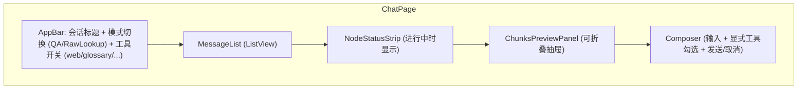

# 03·05 - 前端（Flutter Web + Android）

> 一套 Flutter 代码同时跑 Web 与 Android。MVP 优先 Web 体验，但 Android 必须完成核心闭环；移动端精细交互优化排到 v2。
>
> 设计语言：**黑白主调 + 冷调蓝 accent**，专业感优先，参考 Google AI Studio Playground / Grok mobile 的灰阶留白风格。

## 0. M5 执行顺序

> 2026-05-24 拆解。M5 拆 7 段子里程碑，按下表顺序推进；每段门禁全绿才能进下一段。同一段内的子项可并行。本环境（Linux）只做代码 + `flutter analyze` + Chrome web smoke；Android 真机由人在 Windows 上 `flutter build apk --dart-define=API_BASE_URL=http://<dev-ip>:8002/api/v1` 后连真机验证。

| 子里程碑 | 主要交付物 | 完成度门禁 |
|---|---|---|
| **M5.0** 骨架 + 主题 + 登录 | `flutter create`（web + android）→ Riverpod + go_router + dio + secure_storage + 手写 Dart client 雏形 + 黑白主题 + 登录页 + AuthRedirect + `Makefile` web/apk target | `flutter analyze` 0 警告；登录页 widget test；Chrome smoke 跑通 bootstrap-admin / login / `/auth/me` |
| **M5.1** AppShell + 会话列表 + 空聊天页 | go_router shellroute + 响应式 nav（宽 sidebar / 窄 drawer）+ 会话 CRUD + 空聊天页占位 | 会话 CRUD 集成测（mock dio adapter）；Chrome 桌面 / 窄 viewport 双布局正常 |
| **M5.2** SSE 流式核心 | `SseClient`（dio + stream transformer，按 §8）+ `ChatController` 状态机 + Composer + NodeStatusStrip + 取消按钮 + Markdown + LaTeX | SSE 解析单测覆盖 comment / multi-line data / blank-line 分隔；ChatController 状态机单测覆盖 10 类事件；Chrome 跑通一次完整 send → token → final + cancel |
| **M5.3** 引用 chip + Reader | 自定义 markdown inline syntax 把 `[<spec_id> §<section_path> ¶<rank>]` 渲染成可点击 chip + bottom sheet；`/reader/{spec}` + `/reader/{spec}/{section}` 章节树 drawer + 内容渲染 + `#chunk-{chunk_id}` 锚点高亮 3s 淡出 | 引用 chip widget test；Reader 章节树/搜索/锚点 widget test |
| **M5.4** Checkpoint UX | 暂停按钮 + 暂停 banner + 恢复续跑；assistant 长按菜单（复制 / thumb / 收藏 / 笔记 / 反馈）；用户消息长按 "从这里重问" → fork；会话设置 "删除最后 N 轮" → rollback；archived_branch 视觉灰度 + 只读 banner | checkpoint 5 路由集成测；UI 状态机覆盖 active/paused/archived_branch |
| **M5.5** Admin 后台 | 仅 `role=admin` 可见入口 + 文档表（release/series 过滤）+ 任务面板轮询（progress + log_tail）+ 统计页 + 重建索引弹框 + Langfuse 外链 | RBAC widget test；admin 4 路由集成测；前端隐藏 + 后端 403 兜底两道防线 |
| **M5.6** i18n + 主题切换 + golden + Docker | ARB zh/en + 右上角语言/主题切换 + shared_preferences 持久化；golden test（聊天气泡 light/dark × zh/en 4 张）；`integration_test` mock 跑 send→token→final；`frontend/Dockerfile` 换 web build + nginx | §14 所有 `[auto]` 项全绿；`make web-build` / `docker build -t tgpp-web .` 双路径通 |

> 各段完成后按 [`../00-vibe-coding-protocol.md §4`](../00-vibe-coding-protocol.md) 输出完成报告到 `docs/04-handoff/2026-05-2x-m5.x-completion.md`。

## 1. 交付物

> 每条标 `[M5.x]` 关联 §0 子里程碑。完成后把 `[ ]` 替换为 `[x]`。

- [x] `[M5.0]` Flutter 3.x 项目骨架（Web + Android target）
- [x] `[M5.0/M5.1/M5.2]` Riverpod 2.x 状态管理；go_router 路由（M5.1 起 ShellRoute + 响应式 nav；M5.3 reader 走平级路由 + 支持 `#chunk-{id}` fragment）；dio HTTP；自定义 SSE 解析器（M5.2 落：`sse_client.dart` + `messages_api.dart` 10 类事件 sealed-style + `ChatController` 状态机）
- [x] `[M5.0/M5.1/M5.2/M5.3/M5.5]` 4 个核心页面中已落 3 个：登录 / 聊天 / 章节阅读器（M5.3 完成：spec overview + section view + toc drawer + 搜索 + `#chunk-{id}` 锚点 3s 高亮）；管理后台 M5.5
- [x] `[M5.2]` 流式 UX：节点状态行 + token 流 + chunks 预览 + 一键取消
- [x] `[M5.2/M5.3]` Markdown + LaTeX + 表格 / 引用 chip / 章节跳转锚点（M5.2 落：`flutter_markdown_plus` + 块级 `$$…$$` LaTeX；M5.3 落：`CitationInlineSyntax` 把 `[<spec> §<sec> ¶<rank>]` 渲染成可点 chip + bottom sheet 拉 `GET /chunks/{id}` 上下文 + "跳到完整章节" 按钮；长按复制；表格沿用 markdown 默认渲染）
- [ ] `[M5.6]` 中英 i18n、浅深色主题（M5.0 已落：light/dark Material3 黑白主调，切换器 M5.6 加）
- [x] `[M5.0]` 手写 Dart client（freezed + json_serializable + dio），不引 openapi_generator（M5.0–M5.3 现状：仍手写无 freezed；SSE event sealed-style + chat/message / docs 全部手写 fromJson 完成；codegen 仍可推迟）
- [ ] `[M5.6]` 部署：`docker build` 产物 → nginx 静态托管

## 2. 模块拆分

```
frontend/lib/
├── main.dart
├── core/
│   ├── api_base.dart          # 读 --dart-define=API_BASE_URL
│   ├── theme.dart             # light/dark + 黑白主调 + 冷调蓝 accent
│   ├── router.dart            # go_router
│   ├── l10n/                  # ARB 文件 zh/en（M5.6）
│   └── utils/
├── data/
│   ├── api/                   # 手写 Dart client（freezed + json_serializable）
│   │   ├── dio_provider.dart
│   │   ├── interceptors.dart  # auth header / 401→refresh→retry / 错误归一化
│   │   ├── auth_api.dart
│   │   ├── sessions_api.dart
│   │   ├── messages_api.dart
│   │   ├── docs_api.dart
│   │   ├── admin_api.dart
│   │   ├── tools_api.dart
│   │   └── sse_client.dart    # dio + stream transformer 自家 SSE parser
│   └── storage/               # secure_storage for JWT + shared_preferences for prefs
├── domain/                    # entities + Riverpod providers
│   ├── auth/
│   ├── session/
│   ├── message/
│   ├── document/
│   ├── chunk/
│   └── admin/
└── features/
    ├── auth/login_page.dart
    ├── chat/
    │   ├── chat_page.dart
    │   ├── widgets/
    │   │   ├── message_bubble.dart
    │   │   ├── node_status_strip.dart
    │   │   ├── chunks_panel.dart        # 监听 chunks_hit + chunks_rerank，后者覆盖前者
    │   │   ├── citation_chip.dart
    │   │   ├── mode_toggle.dart
    │   │   └── composer.dart
    │   └── chat_controller.dart
    ├── reader/
    │   ├── reader_page.dart
    │   ├── widgets/
    │   │   ├── toc_drawer.dart
    │   │   ├── section_view.dart
    │   │   └── highlight_overlay.dart
    │   └── reader_controller.dart
    └── admin/
        ├── admin_dashboard.dart
        ├── docs_table.dart
        ├── tasks_panel.dart
        └── usage_panel.dart
```

## 3. 主要依赖

> 手写 Dart client（不引 `openapi_generator`，理由见 §13）：model 与 endpoint 用 freezed + json_serializable 一次定型，后端 schema 变更靠人审 PR diff + CI fields-diff 脚本兜底。

```yaml
dependencies:
  flutter:
    sdk: flutter
  flutter_localizations:
    sdk: flutter
  flutter_riverpod: ^2.5.1
  riverpod_annotation: ^2.3.5
  go_router: ^14.6.0
  dio: ^5.7.0
  flutter_secure_storage: ^9.2.2
  shared_preferences: ^2.3.0    # 主题 / 语言偏好（非敏感）
  flutter_markdown_plus: ^1.0.0
  flutter_math_fork: ^0.7.2
  url_launcher: ^6.3.0
  intl: ^0.19.0
  json_annotation: ^4.9.0
  freezed_annotation: ^2.4.4
  fluttertoast: ^8.2.6

dev_dependencies:
  flutter_test:
    sdk: flutter
  integration_test:
    sdk: flutter
  build_runner: ^2.4.13
  freezed: ^2.5.7
  json_serializable: ^6.8.0
  riverpod_generator: ^2.4.3
  flutter_lints: ^4.0.0
```

## 4. 路由

```dart
final router = GoRouter(
  initialLocation: '/chat',
  redirect: authRedirect,  // 未登录 → /login（公开路由白名单：/login）
  routes: [
    GoRoute(path: '/login', builder: ...),
    ShellRoute(
      builder: (c, s, child) => AppShell(child: child),
      routes: [
        GoRoute(path: '/chat', builder: (c, s) => const ChatPage()),
        GoRoute(path: '/sessions/:sid', builder: ...),         // 与后端 /sessions/{sid}/messages 对齐
        GoRoute(path: '/reader/:spec', builder: ...),
        GoRoute(path: '/reader/:spec/:section', builder: ...),
        GoRoute(path: '/admin', builder: ...),                 // role=admin 守卫
      ],
    ),
  ],
);
```

`AppShell`：左侧导航（会话列表 + 阅读器入口 + 管理）+ 右侧主区。响应式布局：宽屏（>=840px）侧栏固定，窄屏（Android / 移动 Web）侧栏抽屉化。

## 5. 聊天页详细设计



### 5.1 流式状态机

```dart
enum RunStatus { idle, streaming, cancelling, done, error }

class ChatRunState {
  final String? runId;
  final RunStatus status;
  final List<NodeEvent> nodes;       // 节点状态条
  final List<ChunkPreview> chunksHit;
  final String partialAnswer;        // 拼接 token
  final List<Citation> citations;
  final double? confidence;
  final String? errorMessage;
}

class ChatController extends AsyncNotifier<ChatRunState> {
  late StreamSubscription _sub;

  Future<void> send(String text, ChatOptions opts) async {
    final stream = ref.read(sseClientProvider).sendMessage(...);
    _sub = stream.listen(_onEvent);
  }

  void _onEvent(SseEvent e) {
    switch (e.event) {
      case 'node_start': ...
      case 'node_end':   ...
      case 'chunks_hit': ...
      case 'token':      ...   // setState(partialAnswer += delta)
      case 'final':      ...
      case 'cancelled':  ...
      case 'error':      ...
    }
  }

  Future<void> cancel() async {
    state = AsyncData(state.value!.copyWith(status: RunStatus.cancelling));
    await ref.read(apiClientProvider).cancelRun(runId);
    _sub.cancel();
  }
}
```

### 5.2 节点状态条

显示 chip 序列（运行/完成/失败颜色不同），节点白名单见 [`backend/app/api/v1/chat.py::_NODE_NAMES`](../../backend/app/api/v1/chat.py)（共 9 个）：

```
[classify ✓] [rewrite ✓] [retrieve ⟳] [rerank …] [generate …] [self_rag …]
```

完成时收起。点击 chip 可看该节点 duration / summary。

### 5.3 命中 chunks 预览（合并 hit + rerank）

抽屉式（默认折叠）。后端会先后 emit 两轮：

- `chunks_hit`：retrieve 节点 emit（含 cache-hit 分支，F-3 修复后保证）；5-10 个候选，**不带 rerank_score**
- `chunks_rerank`：rerank 节点 emit；与 hit 同序但**带 rerank_score**，UI 用它**覆盖** hit 的显示

行为：

- 抽屉在 `chunks_hit` 首次到达时自动弹出一次（用户可关）
- 卡片展示：spec / section / preview / rerank_score 条（hit 阶段无 score 时显示 loading 占位）
- 点击：跳到阅读器 `/reader/{spec}/{section}#chunk-{chunk_id}`

### 5.4 消息气泡 + 引用 chip

每个 assistant 消息：
- markdown 渲染（`flutter_markdown_plus`），自定义 `InlineSyntax` 把 `[<spec_id> §<section_path> ¶<rank>]`（如 `[23.501 §5.6.1 ¶3]`）解析为可点击 chip；正则严格匹配 `\[\d+\.\d+ §[\d\.]+ ¶\d+\]`，不与 markdown link `[text](url)` 冲突
- chip 点击 → 弹底部 sheet 显示 chunk 上下文（拉 `GET /chunks/{chunk_id}`，content 来自 Qdrant payload + raw_extra fallback，详见 §6） + "跳到完整章节" 按钮
- 长按 chip：复制引用文本
- chip 与 `message.citations[rank]` 按 `rank` 索引一一对应；chunk_id 是 Qdrant point id 字符串（`MessageCitationOut.chunk_id`）

代码块、公式（`$$ ... $$` → flutter_math_fork）、表格（markdown 表 → 自定义 Table widget）专门渲染。

### 5.5 Composer

- 多行输入；Enter 发送，Shift+Enter 换行
- 显式工具下拉勾选：`web_search`、`glossary`、`toc`、`params`，未勾选 Agent 不会调
- 模式 toggle：QA / RawLookup
- 跑起来后按钮变 "暂停 / 取消" 双按钮：
  - **取消**：终止当前 run，保留已生成内容；下次重问从头跑（语义同今 MVP）
  - **暂停**：停在下一节点边界并保留 checkpoint；UI 在该消息位置显示 "已暂停 · 点击恢复" 横幅，点击触发 `POST /sessions/{sid}/resume`，SSE 接续后续节点事件

### 5.6 历史、分叉、回滚

- **用户消息长按**：复制 / "从这里重问"（fork）
  - "从这里重问"调 `POST /sessions/{sid}/fork` body `{checkpoint_id, new_user_message}`，后端返回新 `session_id'`，前端跳转到新会话；原会话标记 `archived_branch`，从会话列表的 "主线" 分组移到 "分叉历史" 分组（折叠默认收起）
- **assistant 消息长按**：复制全文 / 复制 markdown / thumb up/down / 添加到收藏
- **会话回滚**：会话设置菜单里 "删除最后 N 轮"（slider 选 1-10），调 `POST /sessions/{sid}/rollback`；UI 提示 "不可撤销"二次确认
- **archived_branch 会话**：仅可读，不显示 composer，顶部 banner "这是从主线 fork 出的历史分支" + "回到主线" 按钮

## 6. 章节阅读器

```
/reader/23.501                     → 章节目录树 + 首页（spec metadata）
/reader/23.501/5.6.1.2             → 单章节
/reader/23.501/5.6.1.2#chunk-<id>  → 滚动到该 chunk + 高亮 3s
```

- 左抽屉：章节树（来自 `GET /docs/{spec_id}`），可折叠
- 中央：markdown 全章（来自 `GET /docs/{spec_id}/sections/{path}`）
  - 表格、公式、图片正常渲染
  - chunk content 由后端从 Qdrant payload 拉取（F-4 修复后），Qdrant 不可达时 fallback 到 `chunks_meta.raw_extra`
  - 锚点 `#chunk-{chunk_id}` 是 Qdrant point id 字符串；前端用 `Scrollable.ensureVisible` + 临时 `AnimatedContainer` 高亮 3s 淡出，不依赖原生 anchor
- 右上：搜索框（spec 内全文搜索，调 `GET /docs/{spec_id}/search`，当前为 ILIKE 子串匹配，M7+ 视情况切 PG full-text）

## 7. 管理后台

仅 `role=admin` 用户可访问。首次部署通过 bootstrap 创建第一个管理员，之后由管理员在用户管理页创建或停用其他账号。

- **文档表**：列出 `documents` + 状态 + chunk_count + 最后索引时间。按 release / series 过滤
- **任务面板**：列出 crawl / index_rebuild 任务，进度条 + log_tail（10 行）
- **统计**：
  - 已索引 / 总数
  - 总 chunk 数（按 provider 分）
  - 今日 / 本月 API 用量（PG `api_usage` 聚合）
- **操作**：
  - "拉取新文档"（弹框选 release/series）
  - "重建索引"（弹框选 spec_id）
  - "跳 Langfuse 查看 trace"（外链 deep link）

## 8. SSE 客户端

Flutter Web 浏览器自带 `EventSource`，但 Android 上 dart:html 不可用；统一用 **dio + stream transformer**：

```dart
Stream<SseEvent> sendMessage(...) async* {
  final response = await dio.post<ResponseBody>(
    '/api/v1/sessions/$sid/messages',
    data: body.toJson(),
    options: Options(
      responseType: ResponseType.stream,
      headers: {'Accept': 'text/event-stream'},
    ),
  );
  await for (final line in response.data!.stream
      .transform(utf8.decoder)
      .transform(const LineSplitter())) {
    final event = _parseSseLine(line);
    if (event != null) yield event;
  }
}
```

要点：
- 处理 `:` 注释行（后端 `EventSourceResponse(ping=15)` 每 15s 发 `: ping`，防 nginx 缓冲断流）
- 空行作为事件分隔；`event:` + `data:`（多行 data 拼接）
- 与后端 [`sse-starlette`](https://github.com/sysid/sse-starlette) 行为对齐
- 自动重连（用 `Last-Event-ID` header）—— MVP 简单不重连，断了让用户重发

## 9. i18n

`lib/core/l10n/`：

```
app_en.arb        # English UI strings
app_zh.arb        # 中文
```

- intl + flutter_localizations
- 用户切换：右上角语言切换器，写入 secure storage
- API 调用时根据当前 locale 设置 `user_language`（影响 Agent 输出语言）

## 10. 主题

设计语言：**黑白主调 + 冷调蓝 accent**，专业感优先，参考 Google AI Studio / Grok mobile 的灰阶留白风格。

- light / dark 两套，跟系统；用户可在右上角强制切换（M5.6）
- Material 3 ColorScheme：
  - `seedColor`: `Color(0xFF4F6D7A)`（冷调蓝灰）
  - light: `surface=#FFFFFF / onSurface=#1A1A1A / surfaceContainer=#F5F5F5 / outline=#E5E5E5`
  - dark:  `surface=#0E0E0E / onSurface=#EDEDED / surfaceContainer=#1C1C1C / outline=#2A2A2A`
  - 仅在关键起点（发送按钮、当前会话高亮、引用 chip 边框、节点状态 chip "running" 态）使用 accent；其余一律灰阶
- 圆角：cards 16px / chips 999px / buttons 12px（与参考图保持一致的现代圆润感）
- 代码块、引用 chip、表格在两个主题下都要可读（`monospace` 字体 + 浅灰背景框）

## 11. 测试

- **widget test**：每个核心 widget 至少 1 个测（chips render、composer enter behavior 等）
- **golden test**：聊天气泡的 light/dark 截图固定
- **integration_test**：mock API + 跑 send → token stream → final 的完整用户流程

## 12. 性能注意

- 长会话：`ListView.builder` 虚拟化，messages > 200 时只渲染最近 50（往上滚动按需加载）
- markdown 渲染缓存：同一字符串只渲染一次（Riverpod `Provider.family.autoDispose`）
- LaTeX 渲染较重，公式 widget 用 `RepaintBoundary` 隔离

## 13. 风险与排雷

| 风险 | 触发 | 应对 |
|------|------|------|
| SSE 在 Flutter Web Safari 上不稳 | Safari 跨域 / 长连 | dev 默认 Chrome；CI 加 Safari smoke；生产 nginx 加 `X-Accel-Buffering: no` |
| dev 期 Chrome 跨域 | Web build 打 `http://localhost:8002` 触发 CORS preflight | 后端 `ALLOWED_ORIGINS` dev 期含 `http://localhost:<flutter-web-port>`；生产同源 nginx 反代不存在 |
| Windows Android 真机连不上 dev API | 真机与开发机不在同一网段或防火墙拦 | 编译期 `--dart-define=API_BASE_URL=http://<dev-ip>:8002/api/v1`；README/Makefile 给示例；或 `adb reverse tcp:8002 tcp:8002` |
| LaTeX 渲染白屏 | flutter_math_fork 解析失败 | catch + fallback 显示原始 latex |
| Android SSE 后台被回收 | 应用切后台 | MVP 不解决；提示用户保持前台；二期改 foreground service |
| 大消息（>50KB）卡渲染 | 一次性 markdown | 设置消息文本长度上限 + 分块渲染 |
| 手写 Dart client 与后端 schema 漂移 | 后端改 schema 没同步前端 | CI 跑 `scripts/check_openapi_diff.py` 比对 `/openapi.json` 字段集与 Dart freezed model 字段集，差异 → 失败 |

## 14. 验收清单

> 标注：`[auto]` = Agent 自跑可判定；`[human]` = 需要人介入（UX 体验由人主审，这是 §M5 关键决策点）。

- [ ] `[auto]` `flutter analyze` 0 警告 0 错误
- [ ] `[auto]` `flutter test` 全绿（widget test + golden test）
- [ ] `[auto]` `flutter test integration_test/` 跑通 mock API 下的完整 send → token → final 流程
- [ ] `[auto]` 手写 Dart client 字段与后端 `/openapi.json` 字段一一对齐（CI 跑 `scripts/check_openapi_diff.py`）
- [ ] `[human]` Chrome / Edge 实测：登录 → 创建会话 → 流式问答 → 看引用 → 跳阅读器 → 高亮 → 取消正在进行的问答 → 收藏 / 笔记 / 反馈
- [ ] `[human]` Checkpoint 闭环实测：跑中暂停 → 关浏览器 → 重进会话点恢复 → SSE 续跑后续节点；从历史 user 消息 fork → 跳转新会话 → 老会话进入 "分叉历史" 分组只读；删除最后 N 轮后剩余消息状态正确
- [ ] `[human]` Windows Android 真机实测：人在 Windows 上 `flutter build apk --release --dart-define=API_BASE_URL=http://<dev-ip>:8002/api/v1`，安装到真机，跑同 Web 完整流程（交互可简陋，能用即可）
- [ ] `[human]` 切换中/英、light/dark 后再走一次完整流程
- [ ] `[human]` 管理后台：拉取任务 + 进度 + 跳 Langfuse

## 15. 完成后下一步

→ `06-evaluation-and-observability.md` 把质量保证体系搭起来。
