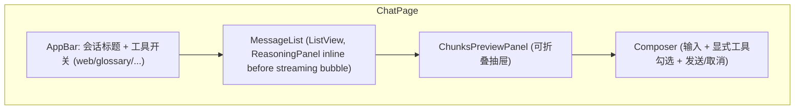

# 03·05 - 前端（Flutter Web + Android）

> 一套 Flutter 代码同时跑 Web 与 Android。MVP 优先 Web 体验，但 Android 必须完成核心闭环；移动端精细交互优化排到 v2。
>
> 设计语言：**黑白主调 + 冷调蓝 accent**，专业感优先，参考 Google AI Studio Playground / Grok mobile 的灰阶留白风格。

## 0. M5 执行顺序

> 2026-05-24 拆解。M5 拆 7 段子里程碑，按下表顺序推进；每段门禁全绿才能进下一段。同一段内的子项可并行。本环境（Linux）只做代码 + `flutter analyze` + Chrome web smoke；Android 真机由人在 Windows 上 `flutter build apk --dart-define=API_BASE_URL=http://<dev-ip>:8002/api/v1` 后连真机验证。

| 子里程碑 | 主要交付物 | 完成度门禁 |
|---|---|---|
| **M5.0** 骨架 + 主题 + 登录 | `flutter create`（web + android）→ Riverpod + go_router + dio + secure_storage + 手写 Dart client 雏形 + 黑白主题 + 登录页 + AuthRedirect + `Makefile` web/apk target | `flutter analyze` 0 警告；登录页 widget test；Chrome smoke 跑通 bootstrap-admin / login / `/auth/me` |
| **M5.1** AppShell + 会话列表 + 空聊天页 | go_router shellroute + 响应式 nav（宽 sidebar / 窄 drawer）+ 会话 CRUD + 空聊天页占位 | 会话 CRUD 集成测（mock dio adapter）；Chrome 桌面 / 窄 viewport 双布局正常 |
| **M5.2** SSE 流式核心 | `SseClient`（dio + stream transformer，按 §8）+ `ChatController` 状态机 + Composer + NodeStatusStrip + 取消按钮 + Markdown + LaTeX | SSE 解析单测覆盖 comment / multi-line data / blank-line 分隔；ChatController 状态机单测覆盖 10 类事件；Chrome 跑通一次完整 send → token → final + cancel |
| **M5.3** 引用 chip + Reader | 自定义 markdown inline syntax 把 `[<spec_id> §<section_path> ¶<rank>]` 渲染成可点击 chip + bottom sheet；`/reader/{spec}` + `/reader/{spec}/{section}` 章节树 drawer + 内容渲染 + `#chunk-{chunk_id}` 锚点高亮 3s 淡出 | 引用 chip widget test；Reader 章节树/搜索/锚点 widget test |
| **M5.4** Checkpoint UX ✅ 2026-05-24 | 暂停按钮 + 暂停 banner + 恢复续跑；assistant 长按菜单（复制 / thumb / 收藏 / 笔记 / 反馈）；用户消息长按 "从这里重问" → fork；会话设置 "删除最后 N 轮" → rollback；archived_branch 视觉灰度 + 只读 banner + "回到主线" 按钮 | ✅ `flutter analyze` 0 / `flutter test` 136 全绿；checkpoint 5 路由前端 API + UI 集成测；ChatController 状态机增 `paused` 态覆盖；详见 [`../04-handoff/2026-05-24-m5.4-completion.md`](../04-handoff/2026-05-24-m5.4-completion.md) |
| **M5.5** Admin 后台 ✅ 2026-05-25 | 仅 `role=admin` 可见入口 + 文档表（release/series 过滤）+ 任务面板轮询（progress + log_tail）+ 统计页 + 重建索引弹框 + Langfuse 外链 | ✅ `flutter analyze` 0 / `flutter test` 154 全绿；RBAC widget test（admin/user 各 1）；admin 4 路由 widget 集成测（4 个 tab + 重建弹框成功/取消/错误 + 统计错误）；AdminApi 7 case 含 403 兜底；前端隐藏 + 后端 403 双重防线。详见 [`../04-handoff/2026-05-25-m5.5-completion.md`](../04-handoff/2026-05-25-m5.5-completion.md) |
| **M5.6** i18n + 主题切换 + golden + Docker ✅ 2026-05-25 | ARB zh/en + 右上角语言/主题切换 + shared_preferences 持久化；golden test（聊天气泡 light/dark × zh/en 4 张）；`integration_test` mock 跑 send→token→final；`frontend/Dockerfile` 换 web build + nginx | ✅ `flutter analyze` 0 / `flutter test` 168 全绿（含 4 张 golden）/ `web-smoke` 全绿 / `make web-build` + `make web-docker` 双路径通 / `make check-openapi-diff` 通过；frontend-ci workflow 上线；schema 漂移 CI 兜底。详见 [`../04-handoff/2026-05-25-m5.6-completion.md`](../04-handoff/2026-05-25-m5.6-completion.md) |

> 各段完成后按 [`../00-vibe-coding-protocol.md §4`](../00-vibe-coding-protocol.md) 输出完成报告到 `docs/04-handoff/2026-05-2x-m5.x-completion.md`。

## 1. 交付物

> 每条标 `[M5.x]` 关联 §0 子里程碑。完成后把 `[ ]` 替换为 `[x]`。

- [x] `[M5.0]` Flutter 3.x 项目骨架（Web + Android target）
- [x] `[M5.0/M5.1/M5.2/M5.4]` Riverpod 2.x 状态管理；go_router 路由（M5.1 起 ShellRoute + 响应式 nav；M5.3 reader 走平级路由 + 支持 `#chunk-{id}` fragment；M5.5 加 `/admin` 子路由 + RBAC redirect）；dio HTTP；自定义 SSE 解析器（M5.2 落：`sse_client.dart` + `messages_api.dart` 10 类事件 sealed-style + `ChatController` 状态机；M5.4 加 `paused` 态 + `pause()/resume()/rollback()/listCheckpoints()` 方法 + 从 PG refetch 路径处理 resume 后 stub 清理）
- [x] `[M5.0/M5.1/M5.2/M5.3/M5.4/M5.5]` 4 个核心页面已落齐：登录 / 聊天 / 章节阅读器（M5.3 完成：spec overview + section view + toc drawer + 搜索 + `#chunk-{id}` 锚点 3s 高亮）；管理后台 M5.5（4 个 Tab：文档表 / 任务面板轮询 / 统计 / 工具含重建索引弹框 + Langfuse 外链）；M5.4 在聊天页加 paused banner + archived_branch "回到主线" + 长按菜单（assistant 复制/thumb/收藏/笔记/反馈 · user 复制/"从这里重问"）+ 会话设置"删除最后 N 轮" 入口
- [x] `[M5.2/M5.4]` 流式 UX：节点状态行 + token 流 + chunks 预览 + 一键取消；M5.4 加 暂停 / 恢复 双按钮（streaming → `暂停 · 取消` / paused → `恢复 · 取消`）
- [x] `[M5.2/M5.3]` Markdown + LaTeX + 表格 / 引用 chip / 章节跳转锚点（M5.2 落：`flutter_markdown_plus` + 块级 `$$…$$` LaTeX；M5.3 落：`CitationInlineSyntax` 把 `[<spec> §<sec> ¶<rank>]` 渲染成可点 chip + bottom sheet 拉 `GET /chunks/{id}` 上下文 + "跳到完整章节" 按钮；长按复制；表格沿用 markdown 默认渲染；M5.4 起 MarkdownBody `selectable: false`，让长按交给父级 GestureDetector，复制走 message 长按菜单）
- [x] `[M5.6]` 中英 i18n、浅深色主题（M5.0 落 light/dark Material3 黑白主调；M5.6 落 ARB zh/en + sidebar header `_LanguageSwitcher`/`_ThemeSwitcher` PopupMenuButton + `PrefsController` + `shared_preferences` 持久化，重启保留选择）
- [x] `[M5.0/M5.4/M5.5/M5.6]` 手写 Dart client（手写 fromJson + dio），不引 freezed/openapi_generator；M5.6 加 `scripts/check_openapi_diff.py` 兜底：扫 `lib/data/api/*.dart` factory + OpenAPI `components.schemas`，前端漏读字段 → fail，未识别 schema → warn；进 `.github/workflows/frontend-ci.yml`
- [x] `[M5.6]` 部署：`frontend/Dockerfile` 单阶段 `nginx:1.27-alpine` + `nginx/default.conf`（SPA `try_files` + gzip + 长 cache）；`make web-docker` = `web-build` + `docker build -t tgpp-web frontend/`；CI 跑 docker smoke（`/` + `/admin` 200）

## 2. 模块拆分

```
frontend/lib/
├── main.dart
├── core/
│   ├── api_base.dart          # 读 --dart-define=API_BASE_URL
│   ├── theme.dart             # light/dark + 黑白主调 + 冷调蓝 accent
│   ├── router.dart            # go_router
│   ├── l10n/                  # ARB 文件 zh/en（M5.6）
│   └── utils/
├── data/
│   ├── api/                   # 手写 Dart client（freezed + json_serializable）
│   │   ├── dio_provider.dart
│   │   ├── interceptors.dart  # auth header / 401→refresh→retry / 错误归一化
│   │   ├── auth_api.dart
│   │   ├── sessions_api.dart
│   │   ├── messages_api.dart
│   │   ├── docs_api.dart
│   │   ├── admin_api.dart
│   │   ├── tools_api.dart
│   │   └── sse_client.dart    # dio + stream transformer 自家 SSE parser
│   └── storage/               # secure_storage for JWT + shared_preferences for prefs
├── domain/                    # entities + Riverpod providers
│   ├── auth/
│   ├── session/
│   ├── message/
│   ├── document/
│   ├── chunk/
│   └── admin/
└── features/
    ├── auth/login_page.dart
    ├── chat/
    │   ├── chat_page.dart
    │   ├── widgets/
    │   │   ├── message_bubble.dart
    │   │   ├── reasoning_panel.dart     # 2026-05-31 取代 node_status_strip：节点 chip 列 + hyde 字符流 + summary 人话 + 首 token 自动折叠
    │   │   ├── chunks_panel.dart        # 监听 chunks_hit + chunks_rerank，后者覆盖前者
    │   │   ├── citation_chip.dart
    │   │   ├── mode_toggle.dart
    │   │   └── composer.dart
    │   └── chat_controller.dart
    ├── reader/
    │   ├── reader_page.dart
    │   ├── widgets/
    │   │   ├── toc_drawer.dart
    │   │   ├── section_view.dart
    │   │   └── highlight_overlay.dart
    │   └── reader_controller.dart
    └── admin/
        ├── admin_dashboard.dart
        ├── docs_table.dart
        ├── tasks_panel.dart
        └── usage_panel.dart
```

## 3. 主要依赖

> 手写 Dart client（不引 `openapi_generator`，理由见 §13）：model 与 endpoint 用 freezed + json_serializable 一次定型，后端 schema 变更靠人审 PR diff + CI fields-diff 脚本兜底。

```yaml
dependencies:
  flutter:
    sdk: flutter
  flutter_localizations:
    sdk: flutter
  flutter_riverpod: ^2.5.1
  riverpod_annotation: ^2.3.5
  go_router: ^14.6.0
  dio: ^5.7.0
  flutter_secure_storage: ^9.2.2
  shared_preferences: ^2.3.2    # M5.6 起：主题 / 语言偏好（非敏感），与 secure_storage 分管
  flutter_markdown_plus: ^1.0.0
  flutter_math_fork: ^0.7.2
  url_launcher: ^6.3.1          # M5.5 起：Langfuse 外链 + 未来 spec doc 外链
  intl: ^0.20.2                 # M5.6 起：Flutter 3.44 把 intl pin 死 0.20.2，不写 ^0.19
  json_annotation: ^4.9.0
  freezed_annotation: ^2.4.4
  fluttertoast: ^8.2.6

dev_dependencies:
  flutter_test:
    sdk: flutter
  integration_test:
    sdk: flutter
  build_runner: ^2.4.13
  freezed: ^2.5.7
  json_serializable: ^6.8.0
  riverpod_generator: ^2.4.3
  flutter_lints: ^4.0.0
```

## 4. 路由

```dart
final router = GoRouter(
  initialLocation: '/chat',
  redirect: authRedirect,  // 未登录 → /login（公开路由白名单：/login）
  routes: [
    GoRoute(path: '/login', builder: ...),
    ShellRoute(
      builder: (c, s, child) => AppShell(child: child),
      routes: [
        GoRoute(path: '/chat', builder: (c, s) => const ChatPage()),
        GoRoute(path: '/sessions/:sid', builder: ...),         // 与后端 /sessions/{sid}/messages 对齐
        GoRoute(path: '/reader/:spec', builder: ...),
        GoRoute(path: '/reader/:spec/:section', builder: ...),
        GoRoute(path: '/admin', builder: ...),                 // role=admin 守卫
      ],
    ),
  ],
);
```

`AppShell`：左侧导航（会话列表 + 阅读器入口 + 管理）+ 右侧主区。响应式布局：宽屏（>=840px）侧栏固定，窄屏（Android / 移动 Web）侧栏抽屉化。

**全站可选中复制（2026-05-25, 0b7ee00）**：`AppShell.build` 把路由主内容包进 `SelectionArea`，Flutter Web（CanvasKit）下 chat / sessions / admin 全部支持鼠标拖选 + `Ctrl/Cmd+C`；聊天气泡保留 `selectable:false`（长按菜单复用其手势，与 `SelectionArea` 拖选手势不冲突）。`SelectionArea` 须放在 `Navigator` **之下**（最初放 `MaterialApp.builder` 会抛 "No Overlay widget found"），所以下沉到 `AppShell`。Reader 页已有 `selectable:true` 不重复包，登录页是表单不包。

**Sidebar 一键清空全部会话（2026-05-28, 18edf81）**：sidebar 底部新增红色「清空全部会话」按钮（**仅会话列表非空时显示**），二次确认对话框给出本次将删的会话数；调 `DELETE /api/v1/sessions` 成功后跳回 `/chat`，snackbar 回显后端返回的真实 `deleted` 数（与前端乐观更新独立）。失败回滚到原列表。i18n key：`sidebarDeleteAll` / `deleteAllDialog*` / `snackbarDeleteAll*`（6 个中英 key）。

## 5. 聊天页详细设计



> **2026-05-28 (0eea4ee)**：chat header 原先有一行 `mode=qa · status=...` 副标题，删除——`mode=qa` 是会话唯一可能值（`raw_lookup` 已下线），`status` 在 sidebar 已通过分组（active / 分叉历史）+ paused/archived banner 体现，副标题对用户无信息量。

### 5.1 流式状态机

> **2026-05-28 (4a2960d)**：后端 `final` 之后还要跑 autotitle LLM 才发 `end`（详见
> `04-backend-api.md §4.2` autotitle 并发说明），前端原本在 `EndEvent` 才 flush
> streaming bubble 到 history，导致 `status=done` 但 history 还没更新的几秒里
> streaming bubble 与 history 都不显示本轮消息，画面"突然消失"。改为 `FinalEvent` /
> `CancelledEvent` 一到立即 flush，`EndEvent` 仍兜底（status idle 时 no-op）。

```dart
enum RunStatus { idle, streaming, cancelling, paused, done, cancelled, error }

class ChatRunState {
  final String? runId;
  final RunStatus status;
  final List<NodeRunStatus> nodes;            // 节点状态（ReasoningPanel chip 列）
  final List<ChunkPreview> chunksHit;
  final List<ChunkPreview> chunksRerank;
  final String partialAnswer;                 // 拼接 token
  final List<Citation> citations;
  final double? confidence;
  final String? errorMessage;
  // —— 2026-05-31 reasoning 折叠框（详见 §5.2）—— //
  final Map<String, String> reasoningByNode;  // hyde 字符级累积；其它节点不写
  final String? activeNode;                   // 当前 running 节点名（node_start 设、node_end 清）
  final DateTime? reasoningStartedAt;         // send 时设；折叠态显示「已思考 X.Xs」
  final bool reasoningCollapsed;              // 首个 token 到达自动 true；用户可 override
}

// SessionChatState（history + run）2026-06-01 加：
//   Map<String, ReasoningSnapshot> reasoningByMessageId;  // 答案完成后保留过程框（按 assistant id），详见 §5.2

class ChatController extends AsyncNotifier<ChatRunState> {
  late StreamSubscription _sub;

  Future<void> send(String text, ChatOptions opts) async {
    final stream = ref.read(sseClientProvider).sendMessage(...);
    _sub = stream.listen(_onEvent);
  }

  void _onEvent(SseEvent e) {
    switch (e.event) {
      case 'node_start':     ...   // 设 activeNode + nodes 加 running chip
      case 'node_end':       ...   // 清 activeNode（若是当前 active）+ chip 翻 done
      case 'node_progress':  ...   // 2026-05-31：reasoningByNode[node] += delta（hyde 字符流）
      case 'chunks_hit':     ...
      case 'chunks_rerank':  ...
      case 'token':          ...   // setState(partialAnswer += delta)；首次到达切 reasoningCollapsed=true
      case 'final':          ...   // 2026-05-28 (4a2960d): 立即 flush streaming bubble 到 history
      case 'cancelled':      ...   // 同上：cancelled 也立即 flush
      case 'end':            ...   // 仍兜底（status idle 时 no-op）
      case 'error':          ...
      case 'title':          ...   // 首轮自动标题，刷 sessions sidebar
    }
  }

  Future<void> cancel() async {
    state = AsyncData(state.value!.copyWith(status: RunStatus.cancelling));
    await ref.read(apiClientProvider).cancelRun(runId);
    _sub.cancel();
  }
}
```

### 5.2 ReasoningPanel（2026-05-31，取代独立 NodeStatusStrip）

> 用户提问到首个 `token` 到达期间，复杂查询要跑完 `classify → rewrite → hyde → multi_query → retrieve → rerank` 这一长串才到 `generate`，hyde 单独可能要 5-10 秒。M5.2 原 `NodeStatusStrip` 只在 Composer 上方一行显示节点 chip，用户在等的几十秒里看不到任何"reasoning 文字"——体感像卡死。`ReasoningPanel` 把这段过程做成"在回答位置出现的灰色折叠框，逐字刷新当前步骤的 LLM 输出"，类似 Claude/o1 的 reasoning 框，回答出来后自动折叠成 `已思考 X.Xs · N 步骤` 单行。

实现要点（[`frontend/lib/features/chat/widgets/reasoning_panel.dart`](../../frontend/lib/features/chat/widgets/reasoning_panel.dart)）：

- **嵌进消息列表底部**（streaming bubble 上方），不再是 Composer 上方独立一行 —— 视觉上"在回答的位置"
- **展开态**：顶部节点 chip 列（沿用 M5.2 视觉，running 转圈 / done 打勾）+ 灰色滚动文字区（maxHeight 120）：
  - hyde active 时：[`ChatRunState.reasoningByNode`](../../frontend/lib/features/chat/chat_controller.dart)`['hyde']` 字符级累积内容，后端 SSE `node_progress` 事件喂（详见 §8 / [`03-agent.md §7`](03-agent.md)）；hyde 是 reasoning enabled 模型，输出长（200-400 token）且是自然语言段落，真流式最有 reasoning 感
  - 其它 LLM 节点（classify / rewrite / multi_query / self_rag，全部 `thinking=disabled`）：从 `node_end.summary` 一次性渲染人话（`改写为: ...` / `拆出 N 个子查询: ...` / `自检: accept · 置信度 0.87`）—— 这些节点输出是 JSON / 一行，token 流体感差且看着像代码碎片，不值得真流式
  - retrieve / rerank：从 summary 的 `*_count` 字段渲染 `找到 N 个候选` / `Top-N 排序完成`
  - active 节点没显式 reasoning 文字时显示节点名 + `...`（如 `hyde...`）
- **步骤名用英文技术名**（2026-06-01）：chip 标题与文字区前缀直接显示节点 key（`classify` / `rewrite` / `hyde` / `multi_query` / `self_rag` …），不再走 i18n 翻成中文释义（`nodeLabel(node) => node`）。节点下方 summary「人话」仍是中文。
- **折叠态**：单行 `已思考 X.Xs · N 步骤` + 上下箭头；streaming 期间秒数依赖 parent 自然 rebuild（token 流持续到达）刷新，没有独立 Timer.periodic（避免 widget test pumpAndSettle 不稳）；历史快照用 `frozenElapsed` 显示固定耗时
- **自动折叠**：首个 `token` 事件到达 → controller 切 `reasoningCollapsed=true` → 直接切单行（无动画，AnimatedSize 在 widget test 下 pumpAndSettle 偶发不稳）
- **答案完成后过程框不消失，只收起可展开**（2026-06-01）：`final` / `cancelled` 把本轮推进 history 时，[`_flushDoneToHistory`](../../frontend/lib/features/chat/chat_controller.dart) 把本轮 reasoning 冻结成 `ReasoningSnapshot`、按 assistant message id 存进 `SessionChatState.reasoningByMessageId`，在该 assistant 消息上方渲染默认折叠（`collapsedFromController=true` + `frozenElapsed`）、可点开复盘的折叠框。仅本会话视图内刚跑完的轮次有快照；切会话 / 从 PG 重载历史不带（后端不持久化节点 summary）
- **手动 override**：`_userOverride` 标记。用户手动展开后即便 controller 仍说 collapsed=true 也保留展开
- **节点白名单**：classify / rewrite / hyde / multi_query / retrieve / rerank / generate / self_rag / tool_dispatch 共 9 个，与 [`backend/app/api/v1/chat.py::_NODE_NAMES`](../../backend/app/api/v1/chat.py) 一致

i18n keys：`reasoningCollapsedTitle` / `reasoningExpand` / `reasoningCollapse` / `reasoningWaiting` / 6 条 `*Done` 文案，详见 [`app_zh.arb`](../../frontend/lib/core/l10n/app_zh.arb) / [`app_en.arb`](../../frontend/lib/core/l10n/app_en.arb)。节点名不再走 i18n（步骤名固定英文），原 9 条 `reasoning<Node>` key 已随 2026-06-01 改动删除。

> 详见 [`../04-handoff/2026-05-31-reasoning-panel.md`](../04-handoff/2026-05-31-reasoning-panel.md) 完成报告。

### 5.3 命中 chunks 预览（合并 hit + rerank）

抽屉式（默认折叠）。后端会先后 emit 两轮：

- `chunks_hit`：retrieve 节点 emit（含 cache-hit 分支，F-3 修复后保证）；5-10 个候选，**不带 rerank_score**
- `chunks_rerank`：rerank 节点 emit；与 hit 同序但**带 rerank_score**，UI 用它**覆盖** hit 的显示

行为：

- 抽屉在 `chunks_hit` 首次到达时自动弹出一次（用户可关）
- 卡片展示：spec / section / preview / rerank_score 条（hit 阶段无 score 时显示 loading 占位）
- 点击：跳到阅读器 `/reader/{spec}/{section}#chunk-{chunk_id}`

### 5.4 消息气泡 + 引用 chip

每个 assistant 消息：
- markdown 渲染（`flutter_markdown_plus`），自定义 `InlineSyntax` 把 `[<spec_id> §<section_path>( ¶<rank>)?]`（如 `[23.501 §5.6.1 ¶3]` / `[38.213 §8.1]` / 多部分 spec `[36.523-1 §7.1.6.2.2]`）解析为可点击 chip；正则 `\[(\d+\.\d+(-\d+)?) §\s*([^\]¶]+?)( ¶\d+)?\]`：`¶rank` 整段**可选**（generate 节点的 LLM 实际只稳定输出 `[spec §section]`，强制三段会让引用退化成普通文本），spec 号 `-N` 后缀必须支持（测试规范 `36.523-1` 等），不与 markdown link `[text](url)` 冲突。section 段刻意放宽到"非 `]`/`¶` 任意串"（先前 `[\d\.]+` 只认数字+点）：实测 LLM 会漂移出 `§ 5.2.3.2.1_5.3.3_1`（下划线复合章节）、`§ PDSCH-Config`（IE 名）、`§ —`（破折号占位）及 `§` 后多余空格，窄正则会让这些退化成裸文本（chip 不渲染 = 超链接失效）。根治靠 `generate_qa` prompt v2 收紧 LLM 输出；占位/IE 名这类无效目标的跳转由 `jumpToReader` 剥前导破折号后落到 spec 概览页兜底
- chip **单击 → 直跳阅读器** `/reader/{spec}/{section}`（有 chunk_id 时带 `#chunk-{chunk_id}` 锚点）；不再弹底部 sheet（决策点 B3）
- chip **hover → Tooltip 预览 chunk 上下文**（拉 `GET /chunks/{chunk_id}`，缺 chunk_id 时只显示 "spec §section（无 chunk 上下文）"；`waitDuration=300ms` 充当 debounce）
- 长按 chip：复制引用文本
- chip 与 `message.citations[rank]` 按 `rank` 索引一一对应；chunk_id 是 Qdrant point id 字符串（`MessageCitationOut.chunk_id`）。`¶rank` 缺省时 rank 取哨兵 `0`，lookup 不到对应 chunk 即降级为只跳 spec+section

代码块、公式（`$$ ... $$` → flutter_math_fork）、表格（markdown 表 → 自定义 Table widget）专门渲染。

### 5.5 Composer

- 多行输入；Enter 发送，Shift+Enter 换行
- 显式工具下拉勾选：`web_search`、`glossary`、`toc`、`params`，未勾选 Agent 不会调
- 模式：仅 QA（RawLookup 已下线，不再有模式 toggle）
- 跑起来后按钮变 "暂停 / 取消" 双按钮：
  - **取消**：终止当前 run，保留已生成内容；下次重问从头跑（语义同今 MVP）
  - **暂停**：停在下一节点边界并保留 checkpoint；UI 在该消息位置显示 "已暂停 · 点击恢复" 横幅，点击触发 `POST /sessions/{sid}/resume`，SSE 接续后续节点事件

### 5.6 历史、分叉、回滚

- **用户消息分叉**：两种触发方式等价
  - 长按 user 气泡 → 菜单"从这里分叉"
  - 点击 user 气泡下方 `Key('msg-fork-{user_msg_id}')` 的"分叉"图标按钮（2026-06-01 加入，所有 user message 都有）
  - **2026-06-02 行为变更**：点击后**不再弹输入框**，直接基于最近 checkpoint 调 `POST /sessions/{sid}/fork` body `{checkpoint_id, up_to_message_id}`（不带 `new_user_message`）→ 后端返回新 `session_id'`，前端跳转到新会话。fork 语义从"用新问题重问"改为"复制当前对话到新分支继续聊"：分叉会话带着 fork 前的历史（后端把原会话已完成消息 + citations 复制到新会话 PG `messages`），用户进去后在 composer 直接继续提问
  - **精准分叉**：fork 把被点 user 消息 id 作为 `up_to_message_id` 传给后端，历史只复制到这条提问所在回合末尾（含其答案）——点中间那条 = 截到那条，点最后一条 = 全量。多轮接通（`c561673`）后，分叉会话里的历史会真实改变 agent 看到的上下文（不再是装饰）
  - **2026-06-01 行为变更**：原会话不再被标记 `archived_branch`，保持 active 可继续对话；新会话作为独立分叉存在，通过 `forked_from_session_id` 追溯。"分叉历史" 分组现在只装 M5 之前已 archived 的老会话（向后兼容）
- **assistant 消息长按**：复制全文 / 复制 markdown / thumb up/down / 添加到收藏
- **会话回滚**：会话设置菜单里 "删除最后 N 轮"（slider 选 1-10），调 `POST /sessions/{sid}/rollback`；UI 提示 "不可撤销"二次确认。"一轮" = 一条 user message + 它之后的所有消息（典型一对：user+assistant）；2026-06-01 修复 PG `now()` 同事务排序不稳定导致 "只删用户提问留下答案" 的 bug，详见 backend `rollback_session` docstring
- **修改最后一次提问**（2026-06-01）：history 末尾形如 `[..., user, assistant]` 且当前 run idle 时，最后一条 user 气泡下方显示 "修改并重新提问" 按钮（`Key('msg-edit-{user_msg_id}')`）。点击进入编辑模式：composer 顶部出现 `chat_editing_banner`、输入框预填该 user message 原文、获取焦点；点发送调 `ChatController.editLastTurn(content)`，内部串行 `rollback(lastN=1)` + `send(content)`，等价 "丢弃最后一对 + 用新内容重发"，之前的历史 context 不动。点 banner 上的 "取消" 退出编辑模式恢复原 composer
- **archived_branch 会话**：仅可读，不显示 composer，顶部 banner "这是从主线 fork 出的历史分支" + "回到主线" 按钮

## 6. 章节阅读器

```
/reader/23.501                     → 章节目录树 + 首页（spec metadata）
/reader/23.501/5.6.1.2             → 单章节
/reader/23.501/5.6.1.2#chunk-<id>  → 滚动到该 chunk + 高亮 3s
```

- 左抽屉：章节树（来自 `GET /docs/{spec_id}`），可折叠
- 中央：markdown 全章（来自 `GET /docs/{spec_id}/sections/{path}`）
  - 表格、公式、图片正常渲染
  - chunk content 由后端从 Qdrant payload 拉取（F-4 修复后），Qdrant 不可达时 fallback 到 `chunks_meta.raw_extra`
  - 锚点 `#chunk-{chunk_id}` 是 Qdrant point id 字符串；前端用 `Scrollable.ensureVisible` + 临时 `AnimatedContainer` 高亮 3s 淡出，不依赖原生 anchor
- 右上：搜索框（spec 内全文搜索，调 `GET /docs/{spec_id}/search`，当前为 ILIKE 子串匹配，M7+ 视情况切 PG full-text）
- **返回**：reader 用 `push`（非 `go`）进入，来源会话留在导航栈里 → AppBar 左上「返回」键 / 安卓系统返回 / 侧滑 / 浏览器后退都回到**刚才的会话**（深链直接进、无来源时兜底回 `/chat`）。reader 内切章节用 `pushReplacement`（替换栈顶不堆叠，保留来源）。窄屏「章节目录」按钮移到 AppBar 右侧，给返回键让出 leading。

## 7. 管理后台

仅 `role=admin` 用户可访问。首次部署通过 bootstrap 创建第一个管理员，之后由管理员在用户管理页创建或停用其他账号。

- **文档表**：列出 `documents` + 状态 + chunk_count + 最后索引时间。按 release / series 过滤
- **任务面板**：列出 crawl / index_rebuild 任务，进度条 + log_tail（10 行）
- **统计**：
  - 已索引 / 总数
  - 总 chunk 数（按 provider 分）
  - 今日 / 本月 API 用量（PG `api_usage` 聚合）
- **反馈**（后补，第 5 个 tab）：`GET /admin/feedback` —— 顶部点赞/点踩/合计计数 + thumb 过滤（全部/👍/👎）+ 明细列表（消息预览 + reason + 反馈者 + 时间）。**点一条 → 打开会话详情页**（`/admin/sessions/:sid?msg=<id>`，`GET /admin/sessions/{sid}`）：admin 只读看该用户**整段对话**，复用聊天气泡 + 引用 chip，滚到并高亮被反馈的那条，便于判断是检索还是生成的问题
- **操作**：
  - "拉取新文档"（弹框选 release/series）
  - "重建索引"（弹框选 spec_id）
  - "跳 Langfuse 查看 trace"（外链 deep link）

## 7bis. 我的收藏 / 我的笔记（后补）

侧栏「我的收藏」「我的笔记」入口（全体登录用户可见），与 reader 平级的独立页（`/favorites`、`/notes`，`push` 进入、返回回到来源页）：

- **收藏页**：列出收藏，message 类型显示后端 enrich 的内容预览；点条目 → `/sessions/{sid}?msg={mid}` 跳回原消息；右侧删除
- **笔记页**：列出笔记内容 + 关联消息预览；点跳回原消息；编辑（弹框 PATCH）/ 删除
- **跳回原消息**：`/sessions/:sid?msg=<id>` → `ChatPage.highlightMessageId` → 历史加载后 `Scrollable.ensureVisible` 滚到该气泡 + 复用 reader 的 `HighlightOverlay` 高亮淡出；期间抑制自动滚到底

## 8. SSE 客户端

> **2026-05-25 变更（pre-M8）**：dio 5.x 的 web adapter（`BrowserHttpClientAdapter` / XHR）
> 不支持流式响应——整段 SSE 会缓冲到结束才交付，且 `Options.receiveTimeout=Duration.zero`
> 被当作"未 override"退化到 30s 触发 `receive timeout`。改为**按平台分流**的传输层
> （`sse_transport.dart` 门面 + 条件 import）：
> - **io / Android / 桌面 / VM 测试**：仍走 dio `ResponseType.stream`，`receiveTimeout/sendTimeout` 显式 24h；
> - **web**：改用浏览器 **Fetch API + ReadableStream**（`sse_transport_web.dart`，`dart:js_interop` + `package:web`）
>   逐 chunk 读取 → 复用同一套 `sse_client.dart` 解析器，得到真正逐字流式；手动带 `Bearer`、
>   401 调一次刷新重试（复用 `dio_provider.dart` 抽出的 `TokenRefresher`），`CancelToken` 桥接 `AbortController`。
>
> 解析器（`SseLineParser` / `sseFramesFromBytes`）与事件协议不变；下方代码示意保留为 io 路径写法。

Flutter Web 浏览器自带 `EventSource`，但 Android 上 dart:html 不可用；io 路径用 **dio + stream transformer**：

```dart
Stream<SseEvent> sendMessage(...) async* {
  final response = await dio.post<ResponseBody>(
    '/api/v1/sessions/$sid/messages',
    data: body.toJson(),
    options: Options(
      responseType: ResponseType.stream,
      headers: {'Accept': 'text/event-stream'},
    ),
  );
  await for (final line in response.data!.stream
      .transform(utf8.decoder)
      .transform(const LineSplitter())) {
    final event = _parseSseLine(line);
    if (event != null) yield event;
  }
}
```

要点：
- 处理 `:` 注释行（后端 `EventSourceResponse(ping=15)` 每 15s 发 `: ping`，防 nginx 缓冲断流）
- 空行作为事件分隔；`event:` + `data:`（多行 data 拼接）
- 与后端 [`sse-starlette`](https://github.com/sysid/sse-starlette) 行为对齐
- 自动重连（用 `Last-Event-ID` header）—— MVP 简单不重连，断了让用户重发

## 9. i18n

`lib/core/l10n/`：

```
app_en.arb        # English UI strings
app_zh.arb        # 中文
```

- intl + flutter_localizations
- 用户切换：右上角语言切换器，写入 secure storage
- API 调用时根据当前 locale 设置 `user_language`（影响 Agent 输出语言）

## 10. 主题

设计语言：**黑白主调 + 冷调蓝 accent**，专业感优先，参考 Google AI Studio / Grok mobile 的灰阶留白风格。

实现全部收敛在 `frontend/lib/core/theme.dart`（`AppTheme`）+ 共享 markdown 排版
`frontend/lib/core/markdown_style.dart`（`appMarkdownStyleSheet`）。

### 10.1 字体（2026-07 质感优化）

Web 端默认 Roboto 字重偏细、渲染发糊，且无内置 CJK 时中文会去 Google Fonts CDN
拉 Noto 兜底、离线部署失败 → 中文又细又糊。因此**内置字体、随包发布**：

- **Inter**：拉丁 / 数字主字体，可变字体单文件 `assets/fonts/Inter-Variable.ttf`
  （~876KB，覆盖 100-900 全字重，Flutter 按 `fontWeight` 自动取 wght 轴）。
- **NotoSansSC**：CJK fallback，从可变字体 `fontTools.varLib.instancer` 固定到
  Regular(400) 的静态实例 `assets/fonts/NotoSansSC-Regular.ttf`（~10MB）；
  Medium/粗体标题由引擎合成，避免再多打一份数 MB。
- 全局 `fontFamily: 'Inter'` + `fontFamilyFallback: ['NotoSansSC']`，中文自动回退。
- `pubspec.yaml` 的 `flutter.fonts` 声明两 family；`frontend/nginx/default.conf`
  已把 `font/ttf` / `application/font-sfnt` 加入 `gzip_types`（10MB → ~6MB 传输），
  并走 30d immutable 长缓存（首屏一次下载）。

### 10.2 排版（显式 TextTheme）

基于 M3 baseline 尺寸（不改字号，保持布局稳定），仅调字体 / 字重 / 行高 / 字距 /
次要色：标题 `w600` + 收紧字距（headline/title `letterSpacing -0.2 ~ -0.1`）；
正文 `height 1.55`；次要文字（bodySmall / labelSmall）用更实的 `onSurfaceVariant`
解决「灰得看不清」。

### 10.3 配色（Material 3 ColorScheme）

- `seedColor`: `Color(0xFF4F6D7A)`（冷调蓝灰）
- light: `surface=#FFFFFF / onSurface=#1A1A1A / onSurfaceVariant=#565B63`；
  分层灰阶 `surfaceContainerLow=#FAFAFB / surfaceContainer=#F4F5F6 /
  High=#EDEEF0 / Highest=#E7E9EC`；`outline=#D7D9DE / outlineVariant=#EBECEF`
- dark:  `surface=#0E0E0E / onSurface=#EDEDED / onSurfaceVariant=#B4B9C1`；
  `surfaceContainerLow=#151515 / surfaceContainer=#1C1C1C / High=#232323 /
  Highest=#2A2A2A`；`outline=#3A3A3A / outlineVariant=#262626`
- 仅在关键起点（发送按钮、当前会话高亮、引用 chip 边框、节点状态 chip "running" 态）
  使用 accent；其余一律灰阶

### 10.4 层次与组件

- 圆角：cards 16px / chips 999px / buttons 12px / 输入框 12px / 气泡 16px
- 轻量层次：`AppTheme.softShadow(brightness)` 给卡片 / 气泡 / 浮层一点「浮起」感
  （light 两层近乎透明黑影；dark 近乎不投影）；卡片 / 分隔线用 `outlineVariant`
  发丝边，替代原先生硬的整框实线
- 统一组件主题：`divider / card / chip / filled·outlined·text·iconButton /
  inputDecoration（filled+圆角+focus accent）/ appBar / dialog / popupMenu /
  snackBar（floating）/ listTile / tooltip / scrollbar`
- 聊天气泡：user 用克制 accent 底 + 淡 primary 描边；assistant 用
  `surfaceContainerLow` 卡面 + 发丝边 + softShadow
- 代码块、引用 chip、表格在两个主题下都要可读（`monospace` 字体 + 浅灰背景框）；
  答案 / 规范正文的 markdown 统一走 `appMarkdownStyleSheet`（正文 / 标题 / 代码块 /
  引用左描边 / 表格发丝边）

## 11. 测试

- **widget test**：每个核心 widget 至少 1 个测（chips render、composer enter behavior 等）
- **golden test**：聊天气泡的 light/dark 截图固定
- **integration_test**：mock API + 跑 send → token stream → final 的完整用户流程

## 12. 性能注意

- 长会话：`ListView.builder` 虚拟化，messages > 200 时只渲染最近 50（往上滚动按需加载）
- markdown 渲染缓存：同一字符串只渲染一次（Riverpod `Provider.family.autoDispose`）
- LaTeX 渲染较重，公式 widget 用 `RepaintBoundary` 隔离

## 13. 风险与排雷

| 风险 | 触发 | 应对 |
|------|------|------|
| SSE 在 Flutter Web Safari 上不稳 | Safari 跨域 / 长连 | dev 默认 Chrome；CI 加 Safari smoke；`frontend/nginx/default.conf` 已 `proxy_buffering off` |
| 远程浏览器访问 dev box :8082 加载 API 超时（10s connect timeout） | M5.6 早期镜像把 `http://localhost:8002/api/v1` 硬嵌进 `main.dart.js`，远程浏览器把 `localhost` 当成自己机器（2026-05-26 修） | `make web-docker` 默认 `WEB_DOCKER_API_BASE_URL=/api/v1`（同源相对路径），`frontend/nginx/default.conf` 把 `/api/v1/` 反代到 `api:8002`；`make web-run`（dev hot reload）仍用 `http://localhost:8002/api/v1`，靠 `ALLOWED_ORIGINS` 兜 CORS |
| Windows Android 真机连不上 dev API | 真机与开发机不在同一网段或防火墙拦 | 编译期 `--dart-define=API_BASE_URL=http://<dev-ip>:8002/api/v1`；README/Makefile 给示例；或 `adb reverse tcp:8002 tcp:8002` |
| LaTeX 渲染白屏 | flutter_math_fork 解析失败 | catch + fallback 显示原始 latex |
| Android SSE 后台被回收 | 应用切后台 | MVP 不解决；提示用户保持前台；二期改 foreground service |
| 大消息（>50KB）卡渲染 | 一次性 markdown | 设置消息文本长度上限 + 分块渲染 |
| 手写 Dart client 与后端 schema 漂移 | 后端改 schema 没同步前端 | CI 跑 `scripts/check_openapi_diff.py` 比对 `/openapi.json` 字段集与 Dart freezed model 字段集，差异 → 失败 |

## 14. 验收清单

> 标注：`[auto]` = Agent 自跑可判定；`[human]` = 需要人介入（UX 体验由人主审，这是 §M5 关键决策点）。

- [x] `[auto]` `flutter analyze` 0 警告 0 错误（M5.0 起每子里程碑保持）
- [x] `[auto]` `flutter test` 全绿（M5.6 共 168 case：unit + widget + integration smoke + 4 张 golden（聊天气泡 light/dark × zh/en））
- [x] `[auto]` `flutter test integration_test/` 跑通 mock API 下的完整 send → token → final 流程（M5.2 落，M5.4/M5.5/M5.6 回归仍绿）
- [x] `[auto]` 手写 Dart client 字段与后端 `/openapi.json` 字段一一对齐（`scripts/check_openapi_diff.py` + `.github/workflows/frontend-ci.yml`；alias 表见脚本顶部 `DART_TO_BACKEND_ALIAS`）
- [ ] `[human]` Chrome / Edge 实测：登录 → 创建会话 → 流式问答 → 看引用 → 跳阅读器 → 高亮 → 取消正在进行的问答 → 收藏 / 笔记 / 反馈
- [ ] `[human]` Checkpoint 闭环实测：跑中暂停 → 关浏览器 → 重进会话点恢复 → SSE 续跑后续节点；从历史 user 消息 fork → 跳转新会话 → **老会话保持 active 可继续提问（2026-06-01 行为变更，老 archived_branch 会话仍只读）**；删除最后 N 轮后剩余消息状态正确
- [ ] `[human]` Windows Android 真机实测：人在 Windows 上 `flutter build apk --release --dart-define=API_BASE_URL=http://<dev-ip>:8002/api/v1`，安装到真机，跑同 Web 完整流程（交互可简陋，能用即可）
- [ ] `[human]` 切换中/英、light/dark 后再走一次完整流程
- [ ] `[human]` 管理后台：拉取任务 + 进度 + 跳 Langfuse

## 15. 完成后下一步

M5.6 后 M5 全部交付物 (`[auto]`) 完工：

- `flutter analyze` 0 警告
- `flutter test` 168 全绿（含 4 张 golden）
- `web-smoke`（mock send→token→cancel）跑通
- `make web-build` 产线打包 OK
- `make web-docker` → `tgpp-web` 镜像 docker run smoke OK（`/` + `/admin` 200；`/api/v1/*` 由 nginx 同源反代到 `api:8002`，2026-05-26 补）
- `make check-openapi-diff` 在 CI（`frontend-ci`）兜底 schema 漂移

剩 `[human]` 体验项（路线已写在 docs §14；不阻塞 M7 推进）：

- Chrome 实测：登录 → SSE 流式问答 → 引用 chip → reader 锚点 → 取消/收藏/笔记/反馈
- Checkpoint 闭环实测：跑中暂停 → 关浏览器 → 重进会话点恢复 → fork 历史 → 删除最后 N 轮
- Windows Android 真机实测：`flutter build apk --release --dart-define=API_BASE_URL=http://<dev-ip>:8002/api/v1`
- 切中/英、light/dark 后跑回归
- 管理后台：拉取任务 + 进度 + 跳 Langfuse

→ `06-evaluation-and-observability.md` 进 M7 把质量保证 / 监控体系搭起来。
