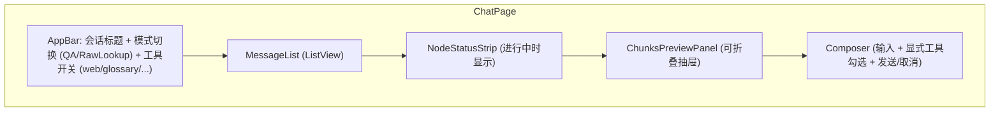

# 03·05 - 前端（Flutter Web + Android）

> 一套 Flutter 代码同时跑 Web 与 Android。MVP 优先 Web 体验，Android 交互精修排到 v2。

## 1. 交付物

- ✅ Flutter 3.x 项目骨架（Web + Android target）
- ✅ Riverpod 2.x 状态管理；go_router 路由；dio HTTP；自定义 SSE 解析器
- ✅ 4 个核心页面：登录 / 聊天 / 章节阅读器 / 管理后台
- ✅ 流式 UX：节点状态行 + token 流 + chunk 命中预览 + 一键取消
- ✅ Markdown + LaTeX + 表格 / 引用气泡 / 章节跳转锚点
- ✅ 中英 i18n、浅深色主题
- ✅ Dart client 由 OpenAPI 自动生成 + 手工补充 SSE
- ✅ 部署：`docker build` 产物 → nginx 静态托管

## 2. 模块拆分

```
frontend/lib/
├── main.dart
├── core/
│   ├── config.dart            # API base url / env
│   ├── theme.dart             # light/dark
│   ├── router.dart            # go_router
│   ├── l10n/                  # ARB 文件 zh/en
│   └── utils/
├── data/
│   ├── api/                   # OpenAPI generated client + 手写 SSE
│   │   ├── generated/
│   │   ├── sse_client.dart
│   │   └── interceptors.dart  # auth header / error
│   └── storage/               # secure_storage for JWT
├── domain/                    # entities + Riverpod providers
│   ├── auth/
│   ├── session/
│   ├── message/
│   ├── document/
│   ├── chunk/
│   └── admin/
└── features/
    ├── auth/login_page.dart
    ├── chat/
    │   ├── chat_page.dart
    │   ├── widgets/
    │   │   ├── message_bubble.dart
    │   │   ├── node_status_strip.dart
    │   │   ├── chunks_preview_panel.dart
    │   │   ├── citation_chip.dart
    │   │   ├── mode_toggle.dart
    │   │   └── composer.dart
    │   └── chat_controller.dart
    ├── reader/
    │   ├── reader_page.dart
    │   ├── widgets/
    │   │   ├── toc_drawer.dart
    │   │   ├── section_view.dart
    │   │   └── highlight_overlay.dart
    │   └── reader_controller.dart
    └── admin/
        ├── admin_dashboard.dart
        ├── docs_table.dart
        ├── tasks_panel.dart
        └── usage_panel.dart
```

## 3. 主要依赖

```yaml
dependencies:
  flutter:
    sdk: flutter
  flutter_riverpod: ^2.5.1
  riverpod_annotation: ^2.3.5
  go_router: ^14.6.0
  dio: ^5.7.0
  flutter_secure_storage: ^9.2.2
  flutter_markdown_plus: ^1.0.0
  flutter_math_fork: ^0.7.2
  url_launcher: ^6.3.0
  intl: ^0.19.0
  json_annotation: ^4.9.0
  freezed_annotation: ^2.4.4
  fluttertoast: ^8.2.6

dev_dependencies:
  flutter_test:
    sdk: flutter
  build_runner: ^2.4.13
  freezed: ^2.5.7
  json_serializable: ^6.8.0
  riverpod_generator: ^2.4.3
  flutter_lints: ^4.0.0
  openapi_generator: ^5.0.2     # 生成 Dart 客户端
```

## 4. 路由

```dart
final router = GoRouter(
  initialLocation: '/chat',
  redirect: authRedirect,  // 未登录 → /login
  routes: [
    GoRoute(path: '/login', builder: ...),
    ShellRoute(
      builder: (c, s, child) => AppShell(child: child),
      routes: [
        GoRoute(path: '/chat', builder: (c, s) => const ChatPage()),
        GoRoute(path: '/chat/:sid', builder: ...),
        GoRoute(path: '/reader/:spec', builder: ...),
        GoRoute(path: '/reader/:spec/:section', builder: ...),
        GoRoute(path: '/admin', builder: ...),
      ],
    ),
  ],
);
```

`AppShell`：左侧导航（会话列表 + 阅读器入口 + 管理）+ 右侧主区。响应式布局：宽屏侧栏固定，窄屏（Android）侧栏抽屉化。

## 5. 聊天页详细设计



### 5.1 流式状态机

```dart
enum RunStatus { idle, streaming, cancelling, done, error }

class ChatRunState {
  final String? runId;
  final RunStatus status;
  final List<NodeEvent> nodes;       // 节点状态条
  final List<ChunkPreview> chunksHit;
  final String partialAnswer;        // 拼接 token
  final List<Citation> citations;
  final double? confidence;
  final String? errorMessage;
}

class ChatController extends AsyncNotifier<ChatRunState> {
  late StreamSubscription _sub;

  Future<void> send(String text, ChatOptions opts) async {
    final stream = ref.read(sseClientProvider).sendMessage(...);
    _sub = stream.listen(_onEvent);
  }

  void _onEvent(SseEvent e) {
    switch (e.event) {
      case 'node_start': ...
      case 'node_end':   ...
      case 'chunks_hit': ...
      case 'token':      ...   // setState(partialAnswer += delta)
      case 'final':      ...
      case 'cancelled':  ...
      case 'error':      ...
    }
  }

  Future<void> cancel() async {
    state = AsyncData(state.value!.copyWith(status: RunStatus.cancelling));
    await ref.read(apiClientProvider).cancelRun(runId);
    _sub.cancel();
  }
}
```

### 5.2 节点状态条

显示 chip 序列（运行/完成颜色不同）：

```
[classify ✓] [rewrite ✓] [retrieve ⟳] [rerank …] [generate …] [self_rag …]
```

完成时收起。点击 chip 可看该节点 duration / summary。

### 5.3 命中 chunks 预览

抽屉式（默认折叠）：

- 在节点状态条出现 `chunks_hit` 后，抽屉自动弹出一次（用户可关）
- 显示 5-10 个候选 chunk 卡片：spec / section / preview / score 条
- 点击：跳到阅读器 `/reader/{spec}/{section}#chunk-{id}`

### 5.4 消息气泡 + 引用 chip

每个 assistant 消息：
- markdown 渲染（`flutter_markdown_plus`），自定义 `inline syntax` 把 `[23.501 §5.6.1 ¶3]` 解析为可点击 chip
- chip 点击 → 弹底部 sheet 显示 chunk 上下文（前后段落） + "跳到完整章节"按钮
- 长按 chip：复制引用文本

代码块、公式（`$$ ... $$` → flutter_math_fork）、表格（markdown 表 → 自定义 Table widget）专门渲染。

### 5.5 Composer

- 多行输入；Enter 发送，Shift+Enter 换行
- 显式工具下拉勾选：`web_search`、`glossary`、`toc`、`params`，未勾选 Agent 不会调
- 模式 toggle：QA / RawLookup
- 跑起来后按钮变"取消"

### 5.6 历史与重问

- 用户消息长按：复制 / 编辑后重发（创建新分支会话还是覆盖 thread？MVP 简单做：编辑后新建会话，复制粘贴现有历史）
- assistant 消息长按：复制全文 / 复制 markdown / thumb up/down / 添加到收藏

## 6. 章节阅读器

```
/reader/23.501              → 章节目录树 + 首页 README
/reader/23.501/5.6.1.2      → 单章节
/reader/23.501/5.6.1.2#chunk-abc → 高亮某 chunk
```

- 左抽屉：章节树（来自 API `/docs/{spec}` 章节目录），可折叠
- 中央：markdown 全章（来自 `/docs/{spec}/sections/{path}`）
  - 表格、公式、图片正常渲染
  - 引用页内锚点（`#chunk-{id}`）滚动 + 高亮 3s 后淡出
- 右上：搜索框（spec 内全文搜索，调 BM25 接口）

## 7. 管理后台

仅 `role=admin` 用户可访问（单用户阶段默认是 admin）。

- **文档表**：列出 `documents` + 状态 + chunk_count + 最后索引时间。按 release / series 过滤
- **任务面板**：列出 crawl / index_rebuild 任务，进度条 + log_tail（10 行）
- **统计**：
  - 已索引 / 总数
  - 总 chunk 数（按 provider 分）
  - 今日 / 本月 API 用量（PG `api_usage` 聚合）
- **操作**：
  - "拉取新文档"（弹框选 release/series）
  - "重建索引"（弹框选 spec_id）
  - "跳 Langfuse 查看 trace"（外链 deep link）

## 8. SSE 客户端

Flutter Web 浏览器自带 `EventSource`，但 Android 上 dart:html 不可用；统一用 **dio + stream transformer**：

```dart
Stream<SseEvent> sendMessage(...) async* {
  final response = await dio.post<ResponseBody>(
    '/api/v1/sessions/$sid/messages',
    data: body.toJson(),
    options: Options(
      responseType: ResponseType.stream,
      headers: {'Accept': 'text/event-stream'},
    ),
  );
  await for (final line in response.data!.stream
      .transform(utf8.decoder)
      .transform(const LineSplitter())) {
    final event = _parseSseLine(line);
    if (event != null) yield event;
  }
}
```

要点：
- 处理 `:` 注释行、空行作为事件分隔
- `event:` + `data:`（多行 data 拼接）
- 自动重连（用 `Last-Event-ID` header）—— MVP 简单不重连，断了让用户重发

## 9. i18n

`lib/core/l10n/`：

```
app_en.arb        # English UI strings
app_zh.arb        # 中文
```

- intl + flutter_localizations
- 用户切换：右上角语言切换器，写入 secure storage
- API 调用时根据当前 locale 设置 `user_language`（影响 Agent 输出语言）

## 10. 主题

- light / dark 两套，跟系统
- Material 3，主色取一个中性蓝
- 代码块、引用 chip、表格在两个主题下都要可读

## 11. 测试

- **widget test**：每个核心 widget 至少 1 个测（chips render、composer enter behavior 等）
- **golden test**：聊天气泡的 light/dark 截图固定
- **integration_test**：mock API + 跑 send → token stream → final 的完整用户流程

## 12. 性能注意

- 长会话：`ListView.builder` 虚拟化，messages > 200 时只渲染最近 50（往上滚动按需加载）
- markdown 渲染缓存：同一字符串只渲染一次（Riverpod `Provider.family.autoDispose`）
- LaTeX 渲染较重，公式 widget 用 `RepaintBoundary` 隔离

## 13. 风险与排雷

| 风险 | 触发 | 应对 |
|------|------|------|
| SSE 在 Flutter Web Safari 上不稳 | Safari 跨域 / 长连 | dev 默认 Chrome；CI 加 Safari smoke；生产 nginx 加 `X-Accel-Buffering: no` |
| LaTeX 渲染白屏 | flutter_math_fork 解析失败 | catch + fallback 显示原始 latex |
| Android SSE 后台被回收 | 应用切后台 | MVP 不解决；提示用户保持前台；二期改 foreground service |
| 大消息（>50KB）卡渲染 | 一次性 markdown | 设置消息文本长度上限 + 分块渲染 |
| OpenAPI 生成代码膨胀 | dart 编译慢 | 只生成 model + 关键 endpoint，自定义部分手写 |

## 14. 验收清单

- [ ] `flutter analyze` 0 警告 0 错误
- [ ] `flutter test` 全绿
- [ ] Chrome / Edge 实测：登录 → 创建会话 → 流式问答 → 看引用 → 跳阅读器 → 高亮 → 取消正在进行的问答 → 收藏 / 笔记 / 反馈
- [ ] Android emulator 实测：同上（交互可简陋，能用即可）
- [ ] 切换中/英、light/dark 后再走一次完整流程
- [ ] 管理后台：拉取任务 + 进度 + 跳 Langfuse

## 15. 完成后下一步

→ `06-evaluation-and-observability.md` 把质量保证体系搭起来。
