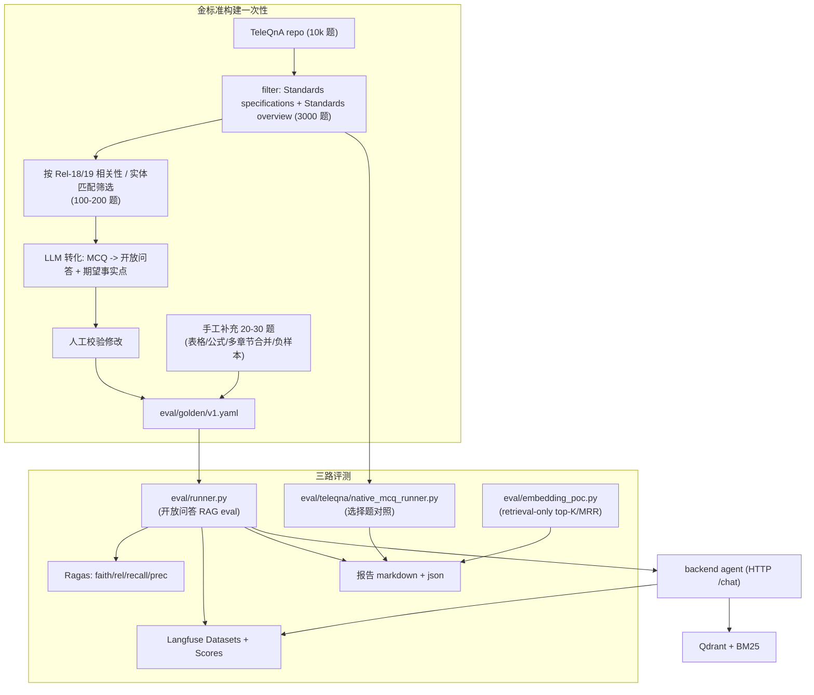

# 03·06 - 评测与可观测性

> "生产级"的硬指标在这里落地。覆盖：金标准评测集、自动评测（Ragas）、Langfuse 监控、成本告警。

## 1. 交付物

- ✅ TeleQnA 抽取与转化流水线：`eval/teleqna/` + `eval/builder/`，从公开 [`TeleQnA`](https://github.com/netop-team/TeleQnA) Standards 类 3000 题筛选 + LLM 转化 + 人工校验
- ✅ 金标准评测集 `eval/golden/*.yaml`：v1 ≥ 120 题（100 TeleQnA 转化 + 20-30 手工补充），v2 200+
- ✅ TeleQnA 原生选择题对照评测：`eval/teleqna/native_mcq_runner.py`（看 LLM 选对 %，知识准确性维度）
- ✅ `eval/runner.py`：从金标准集驱动 Agent 跑出结果，写 Ragas + 写 Langfuse Dataset
- ✅ Ragas pipeline：faithfulness / answer_relevance / context_recall / context_precision
- ✅ Telco-DPR 风格 retrieval-only 评测：`eval/embedding_poc.py`（M3 决胜，top-K / MRR）
- ✅ Langfuse 集成：所有 Agent 调用产生 trace；上传 Dataset；自动 eval
- ✅ 成本与用量监控：API usage 聚合表 + 每日告警阈值
- ✅ Pytest `eval` marker：CI 跑子集（10 题），nightly 跑全集

## 2. 评测体系总览



## 3. 金标准集构建工作流

### 3.1 TeleQnA 拉取与过滤

```python
# eval/teleqna/pull.py
# 1. git clone https://github.com/netop-team/TeleQnA
# 2. 解压 TeleQnA.txt.zip (密码 'teleqnadataset')
# 3. 解析为 list[dict]
# 4. filter category in {"Standards specifications", "Standards overview"}  → 3000 题
# 5. 进一步过滤与 Rel-18/19 相关：
#    - 关键词匹配（NR / 5GS / SBA / NEF / NWDAF / AMF/SMF/UPF / ...）
#    - LLM 二次确认（mimo-v2.5 判定 yes/no）
#    保留 200-300 题
```

输出：`eval/teleqna/filtered.jsonl`，结构：

```json
{
  "id": "teleqna-2456",
  "category": "Standards specifications",
  "question": "Which of the following is responsible for ... ?",
  "options": {"option 1": "AMF", "option 2": "SMF", "option 3": "UPF", "option 4": "NEF"},
  "answer": "option 2: SMF",
  "explanation": "...",
  "filter_score": 0.92
}
```

### 3.2 选择题 → 开放问答转化

```python
# eval/builder/transform.py
# 对每个 filtered TeleQnA item：
# 用 LLM (glm-4.6) 生成：
# - rewritten_question: 把"以下哪个..."这种 MCQ 题面改为开放式提问
# - expected_specs: 根据 explanation 推断哪几篇 spec 涉及
# - expected_facts: 从 answer + explanation 抽取关键事实
# - candidate_section_hints: 从 explanation 提取可能的章节关键词
```

输出：`eval/golden/v1.draft.yaml`（v1 草稿，待人工校验）

**LLM 转化 prompt 要点**：

```
你将一道 telecom 选择题转化为 RAG 评测题目。

原题：{question}
选项：{options}
正确答案：{correct_option}
解释：{explanation}

任务：
1. 改写为开放式问题（不要泄露选项；保留 telecom 术语）
2. 给出预期 spec_id 列表（从解释中推断；保守只给确定的）
3. 给出 3-7 个"答案必须命中的关键事实"（substring 即可）
4. 给出 1-3 个"答案不能包含的内容"（避免幻觉）

输出 YAML：
```

### 3.3 人工校验流程

简单脚本 `eval/builder/review.py`：

- 在终端按 q 顺序展示原 TeleQnA + 转化结果
- 操作：`a` accept / `e` edit (开 EDITOR) / `r` reject / `s` skip
- accept 写入 `eval/golden/v1.yaml`，reject 写入 `eval/golden/_rejected.yaml`

**目标**：100 题转化后人工通过 ≥ 80 题；剔除"原 TeleQnA 答案存疑"的题目。

### 3.4 手工补充（20-30 题）

补充 TeleQnA 难以覆盖的场景：

- **表格定位**："38.331 中 RRCReconfiguration 的 IE 列表完整结构"
- **公式查询**："38.214 的 CQI 计算公式"
- **章节路径**："列出 23.502 §4.2 所有子节"
- **多章节合并推理**："列出 23.502 §4.3 PDU Session 建立涉及到的所有 NF 与消息序列"
- **负样本**："5G UE 的 MAC 地址格式"（必须返回未找到）

每条保持 §3.5 的 YAML 格式。

### 3.5 金标准集格式

`eval/golden/v1.yaml`：

```yaml
version: 1
created_at: 2026-05-20
total: 120                # 100 TeleQnA 转化 + 20 手工补充
sources:
  - teleqna_transformed   # 来源标识
  - hand_crafted

categories:
  - definition            # ~30 题
  - procedure             # ~35 题
  - multi_section         # ~10 题（多章节合并推理，但不跨 spec/版本）
  - table_lookup          # ~10 题
  - formula               # ~10 题
  - tool                  # ~10 题
  - negative              # ~15 题 (期望"未找到")

items:
  - id: def-001
    source: teleqna_transformed
    teleqna_origin_id: "teleqna-2456"
    category: definition
    language: en
    question: "What is the definition of 'PDU Session' in 5G System?"
    expected_specs:
      - spec_id: "23.501"
        sections:
          - "3.1"            # 章节路径前缀，匹配即可
    expected_facts:           # 关键事实点（substring 或 regex 任一命中即算覆盖）
      - "association between"
      - "UE and a DN"
    forbidden:                # 答案不能包含的内容（用于检测幻觉）
      - "4G"
    notes: "PDU Session 是 5G 核心概念"

  - id: proc-005
    category: procedure
    language: zh
    question: "请描述 5G UE Initial Registration 完整流程"
    expected_specs:
      - spec_id: "23.502"
        sections: ["4.2.2"]
    expected_facts:
      - "Registration Request"
      - "AMF selection"
      - "AUSF"
      - "UDM"
      - "Registration Accept"
    expected_min_facts_coverage: 0.7   # 至少命中 70%

  - id: neg-002
    category: negative
    language: en
    question: "What is the MAC address format of a UE PDU Session?"
    expected_specs: []
    expected_facts: []
    must_say_not_found: true           # 答案必须明示"未找到"
```

**维护规则**：

- TeleQnA 转化的题目必须保留 `teleqna_origin_id` 便于回溯
- 手工题与转化题在统计上同等权重；CI eval 子集时分层抽样
- `expected_facts` 是 "答案里必须出现的关键事实"，不要 paraphrase 一致才算
- `must_say_not_found` 给负样本做严格 grounding 校验
- CI 子集必须按 category 分层抽样，至少覆盖 definition / procedure / table_lookup / negative；不得只抽简单题。

## 4. Runner 实现

`eval/runner.py`：

```python
@dataclass
class EvalResult:
    item_id: str
    # retrieval 指标
    retrieved_specs: list[str]
    retrieved_sections: list[str]
    context_recall_spec: float
    context_recall_section: float
    # 答案指标
    answer: str
    citations: list[dict]
    fact_coverage: float
    forbidden_violations: list[str]
    must_say_not_found_passed: bool | None
    # Ragas 指标（异步评测）
    ragas_faithfulness: float | None
    ragas_answer_relevance: float | None
    ragas_context_recall: float | None
    ragas_context_precision: float | None
    # 性能
    duration_ms: int
    llm_calls: int
    total_cost_usd: float

async def run_eval(golden_path: Path, subset: int | None = None) -> list[EvalResult]:
    items = load_golden(golden_path)
    if subset: items = items[:subset]
    results = []
    for it in items:
        agent_result = await call_agent_via_http(it.question, mode="qa", lang=it.language)
        r = compute_metrics(it, agent_result)
        results.append(r)
        await push_to_langfuse_dataset(it, agent_result, r)
    return results
```

输出：

- `eval-results/{timestamp}/report.md`（人读）
- `eval-results/{timestamp}/results.json`
- Langfuse Dataset run（在线可看）

## 5. Ragas 集成

```python
from ragas import evaluate
from ragas.metrics import faithfulness, answer_relevancy, context_recall, context_precision
from datasets import Dataset

ds = Dataset.from_list([
    {
        "question": r.item.question,
        "answer": r.answer,
        "contexts": [c.content for c in r.contexts],
        "ground_truth": r.item.expected_facts_joined,
    }
    for r in results
])
ragas_scores = evaluate(ds, metrics=[faithfulness, answer_relevancy, context_recall, context_precision])
```

**Ragas 用的 LLM**（评估时本身也要调 LLM）：建议**用与 Agent 不同**的模型避免同源偏差。例如 Agent 用 `mimo-v2.5-pro`，Ragas 评估用 `glm-4.6`（都在 LiteLLM 中）。

```python
import os
os.environ["RAGAS_LLM"] = "langchain_openai.ChatOpenAI"
ragas_llm = ChatOpenAI(model="glm-4.6", base_url=LITELLM_BASE, api_key=LITELLM_KEY)
ragas_embed = ... # 同 RAG 用的 embedding，或独立的
```

## 6. Langfuse Datasets

```python
from langfuse import Langfuse
lf = Langfuse(public_key=..., secret_key=..., host=...)

# 一次性建 dataset
dataset = lf.create_dataset(name="tgpp-golden-v1", description="3GPP RAG eval v1")
for item in golden_items:
    lf.create_dataset_item(
        dataset_name="tgpp-golden-v1",
        input={"question": item.question, "language": item.language},
        expected_output={"specs": item.expected_specs, "facts": item.expected_facts},
        metadata={"category": item.category, "id": item.id},
    )

# Runner 每次跑产生一个 run
with lf.observe(...) as trace:
    answer = await call_agent(...)
    lf.score(trace_id=trace.id, name="fact_coverage", value=fact_coverage)
    lf.score(trace_id=trace.id, name="must_say_not_found", value=passed)
    ...
```

Langfuse 自动 eval（Cloud 内置）：

- 在 UI 中开启 Dataset 关联的 evaluator（`faithfulness`、`relevance`）
- 跑完一个 Run，Langfuse 自动算分

## 7. Pytest 集成

`backend/tests/eval/test_golden_v1.py`：

```python
import os

@pytest.mark.eval
async def test_golden_v1_subset(api_client):
    """CI 跑 - 10 题快速烟测"""
    subset = int(os.getenv("EVAL_SUBSET_SIZE", "10"))
    results = await run_eval(Path("eval/golden/v1.yaml"), subset=subset, stratified=True)
    avg_recall = mean(r.context_recall_section for r in results)
    avg_faith = mean(r.ragas_faithfulness for r in results if r.ragas_faithfulness)
    assert avg_recall >= 0.6, f"context recall too low: {avg_recall}"
    assert avg_faith >= 0.75, f"faithfulness too low: {avg_faith}"
    # 负样本必须全过
    neg_passed = [r for r in results if r.item.category == "negative" and r.must_say_not_found_passed]
    neg_total = [r for r in results if r.item.category == "negative"]
    assert len(neg_passed) == len(neg_total), "negative sample failed"

@pytest.mark.eval
@pytest.mark.nightly
async def test_golden_v1_full(api_client):
    """Nightly - 全集 30/60/100 题"""
    results = await run_eval(Path("eval/golden/v1.yaml"))
    write_report(results, Path(f"eval-results/{ts}/"))
    # 验收阈值（来自需求验收标准）
    assert mean(r.context_recall_section for r in results) >= 0.80
    assert mean(r.ragas_faithfulness for r in results) >= 0.85
```

## 8. Embedding 维度决胜评测（2026-05-16 修订）

> **决策变更**：放弃原"voyage / 智谱 embedding-3 双轨决胜"，改为"voyage 单轨 + 2048/1024 维度 ablation"。
> 详见 [`docs/02-tech-selection.md §3.1`](../02-tech-selection.md#31-选型决策2026-05-16) 与
> [`docs/03-development/02-ingestion-and-indexing.md §4.7`](02-ingestion-and-indexing.md#47-poc-验证步骤修订)。
> 智谱 `embedding-3` 仅保留代码层 fallback，不进入决胜评测。

这是 M3 关键决策点。专用脚本 `eval/embedding_poc.py`：

```python
async def main():
    # 1. 两个 collection 已就绪 (M2 完成):
    #    tgpp_chunks_voyage_d2048 / tgpp_chunks_voyage_d1024
    #    （voyage MRL 性质让一次 API 调用同时产 2048 + 1024 维向量）
    # 2. 关掉 Agent 上层，仅评 retrieval-only
    items = load_golden("eval/golden/v1.yaml")
    for dim in [2048, 1024]:
        recall_at_5, recall_at_10, recall_at_20, mrr = [], [], [], []
        for it in items:
            hits = await retrieve_only(
                it.question, provider="voyage", dim=dim, top_k=20
            )
            r5 = compute_section_recall(hits[:5], it.expected_specs)
            r10 = compute_section_recall(hits[:10], it.expected_specs)
            r20 = compute_section_recall(hits[:20], it.expected_specs)
            mrr.append(compute_mrr(hits, it.expected_specs))
            ...
        print(f"voyage_d{dim} | R@5={mean(r5):.2f} R@10={mean(r10):.2f} "
              f"R@20={mean(r20):.2f} MRR={mean(mrr):.2f}")
```

**决胜规则**（写在文档与 README）：

- R@10 差距 > 2% → 选 R@10 高者
- 否则比 MRR；MRR 差距 > 2% → 选高者
- 否则差距不显著 → 选 **1024 维**（存储省一半、检索 latency 快 30-50%、HNSW 内存占用更友好）

结果一并 push 到 Langfuse 与 git 一个 `eval-results/m3-embedding-poc.md` 记录决策。决胜后立即 drop 输者 Qdrant collection。

**M3 → M6 过渡硬指标**（2026-05-16 新增）：

- 决胜后若任何 chunker / vision 改动会让 content 变化（影响 chunk_id），必须在 20 篇 POC 上重跑改动后的 chunker → diff chunk_id 集合
- **漂移率 > 5% 视为"chunker 未稳定"**，禁止进入 M6 全量索引；先在 20 篇上 ablation 确认指标改善才能上 M6
- 漂移率 ≤ 5% 时 M6 可通过 `--skip-indexed` 跳过 POC 20 篇，省 ~8M voyage tokens

## 9. 成本与用量监控

### 9.1 计费层

`backend/app/services/usage.py`：

- LLM / Embedding / Reranker / Vision / WebSearch 每次调用计入 PG `api_usage`
- LLM token 数从 LiteLLM 响应 `usage` 字段读
- Embedding 按 token 数估算
- Reranker 按 token 数计费（Voyage 口径：`query_tokens × n_docs + Σ doc_tokens`，**不是按 query 次数**）
- WebSearch 按调用次数计费
- 单价由 `app/llm/pricing.py` 表维护；标的是"用尽免费额度后"的等效单价，免费区内本表算出的成本由 usage 上层标记为 `billed=false`

```python
PRICING = {
    "mimo-v2.5-pro":    {"input": 1.0/1e6, "output": 3.0/1e6},
    "mimo-v2.5":        {"input": 0.4/1e6, "output": 2.0/1e6},
    "voyage-4-large":   {"per_token_embed": 0.12/1e6},      # 200M tokens 免费
    "voyage-rerank-2.5": {"per_token_rerank": 0.05/1e6},    # 200M tokens 免费，按 token 不按 query
    "tavily-search":    {"per_call": 0.01},
}
```

### 9.2 告警阈值

`backend/app/services/alerts.py`：

- 每日聚合 job（apscheduler 或 cron）：检查 `api_usage(day=today)`
- 阈值（可在 .env 覆盖）：
  - 日总成本 > $5 → log warning
  - 日总成本 > $10 → 发邮件 / Telegram / Discord webhook（看用户偏好）
  - 月累计 > $50 → 同上

### 9.3 前端展示

管理后台 `usage_panel` 展示：

- 折线：最近 30 天 daily cost
- 饼图：今日成本分项（LLM / embed / rerank / web）
- 数字：本月累计 / 本月查询数

## 10. Langfuse 配置清单

需要在 Langfuse Cloud 上手工做的：

- [ ] 注册账号
- [ ] 新建 project `tgpp-everything`
- [ ] 拿 public_key + secret_key → 写 `.env`
- [ ] 创建 Dataset `tgpp-golden-v1`
- [ ] 启用内置 evaluators（faithfulness、relevance）关联到 Dataset
- [ ] 设置成本预警（Free Tier 含基本告警）

## 11. 监控指标（应用层）

记录到 PG / structlog（小规模多用户阶段先不引入 Prometheus）：

- `agent.run.duration_ms` (p50/p95)
- `agent.run.llm_calls`
- `agent.run.error_rate`
- `agent.node.duration_ms` by node
- `retrieve.recall_at_5` (from eval runs)
- `db.connection.errors`
- `litellm.errors_by_model`

二期可外挂 OpenTelemetry。

## 12. 验收清单

> 标注：`[auto]` = Agent 自跑可判定；`[human]` = 需要人介入（评测内容由懂 3GPP 的人 review、外部账号、决策签字）。

- [ ] `[auto]` TeleQnA 拉取 + 过滤 + 转化流水线可重跑（`make eval-build`）
- [ ] `[human]` `eval/golden/v1.yaml` ≥ 120 题；含 `teleqna_origin_id` 可追溯；**由懂 3GPP 的人 review 过**（这是质量门禁，Agent 不能自己说通过）
- [ ] `[auto]` `python -m eval.runner --subset 10` 跑通无错误
- [ ] `[auto]` `python -m eval.teleqna.native_mcq_runner` 跑完 Standards 子集，输出 LLM 选对 %
- [ ] `[human]` Langfuse Dataset 与 Run 在 Web UI 可见，evaluators 自动出分（外部账号，人确认看到）
- [ ] `[auto]` CI eval 子集（10 题）耗时 < 10 分钟，全绿；分层抽样按 category 覆盖
- [ ] `[auto]` Nightly eval 全集跑通；阈值未达自动开 GitHub issue
- [ ] `[human]` M3 embedding POC 决胜**决策由人拍板**，结果与签字记录在 `eval-results/m3-embedding-poc.md`
- [ ] `[auto]` 前端管理后台展示 today / month 成本（widget test 覆盖渲染）
- [ ] `[auto]` 成本告警阈值触发后能写日志/发通知（mock webhook 验证）

## 13. 风险与排雷

| 风险 | 触发 | 应对 |
|------|------|------|
| TeleQnA 部分答案过时或与 Rel-18/19 不符 | 数据集发布于 2023 | 转化阶段人工校验剔除；保留 `teleqna_origin_id` 便于追溯 |
| LLM 转化误把"选项排除题"做成开放题 | "以下哪个不属于"类 | 转化 prompt 检测此类题型，跳过 → 进 `_rejected.yaml` |
| TeleQnA 解释字段引用的 spec 与现行版本编号不同 | spec 重命名 / 拆分 | M3 校验时手工映射；维护 `teleqna_spec_alias.yaml` |
| 金标准集主观偏差 | 一人写一人评 | 标注规范文档化；M7 期请第二人 sanity check 10 题 |
| Ragas 评分本身不稳 | LLM 评估随机性 | 评估固定 temperature=0；多跑 3 次取均值 |
| Langfuse Cloud 网络抖动 | 国内访问 | 写入 retry + 本地落盘 fallback；监控 ingest 失败率 |
| 评测 LLM 与 Agent LLM 同源偏差 | 都用 mimo | 明确 Ragas 用 glm-4.6（已在 LiteLLM） |
| CI eval 超时 | 子集 10 题但 Agent 慢 | 子集用 simple 题为主；并发 2-3 题；timeout 30min |

## 14. 完成后下一步

→ `07-cicd-and-deployment.md` 把 CI / 生产部署 / HTTPS 收尾。
