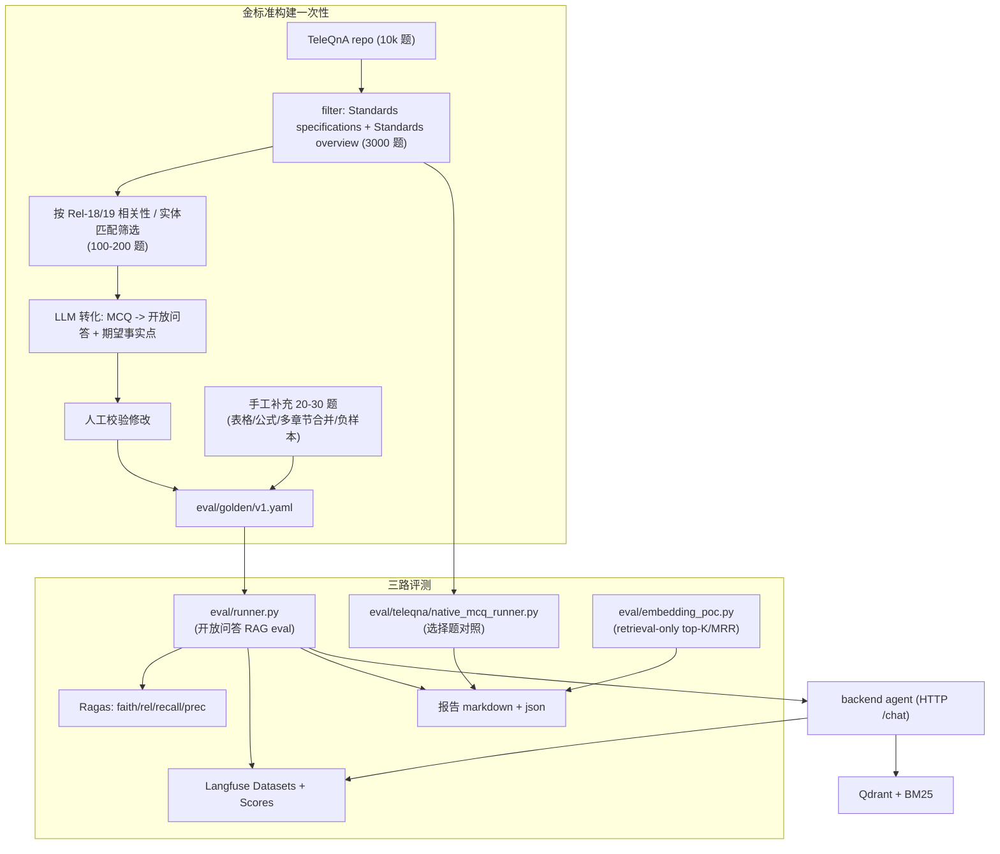

# 03·06 - 评测与可观测性

> "生产级"的硬指标在这里落地。覆盖：金标准评测集、自动评测（Ragas）、Langfuse 监控、成本告警。

## 0. M7 执行顺序

> 2026-05-19 拆解。M7 拆 7 段，按下表顺序推进，每段门禁全绿才进下一段；同段子项可并行。
>
> **2026-05-19 人 approve 决策**（详见 [`../04-handoff/2026-05-19-m7-plan.md §3`](../04-handoff/2026-05-19-m7-plan.md)）：
>
> - **Q1 跑测节奏**：全集（v1.yaml 总 ≥ 140 题）每周一次 + 手写题（`source==hand_crafted`，≥ 20 题）每日跑。预算估月度 ¥35（远低于 ¥1000 警戒线）
> - **Q2 阈值告警通道**：仅 log warning（不接 webhook，零 secret 维护）；M8 上线视监控需要再加
> - **Q3 D13 两档阈值**：M7 nightly 用宽松版（faithfulness ≥ 0.75 / context recall ≥ 0.65 / answer relevancy ≥ 0.70 / answer correctness ≥ 0.55 / latency-p50 ≤ 6s / cost-p50 ≤ ¥0.30）；M8 上线门槛用严格版（≥ 0.85 / 0.80）。沿用 [`2026-05-18-tech-debt-cleanup-todo.md` Q1](../04-handoff/2026-05-18-tech-debt-cleanup-todo.md) 决议
> - **Q4 spec 查看方式**：选 Swagger UI（M4.10 已就位 `/docs`），M7 不再补 `eval spec` CLI

| 子里程碑 | 主要交付物 | 完成度门禁 |
|---|---|---|
| **M7.0** 金标准 v1 → v1.5 | `eval/golden/_template.yaml` 模板 + `eval.cli golden validate/merge/stats` 子命令 + 手写补题（neg / formula / multi_section 重点；2026-05-19 砍 `tool` category） | v1.yaml 题数 ≥ 140；分布按 §3.4 容差 ±5 题；`[human]` 至少 20 题人审过 |
| **M7.1** 端到端 runner + 第一档阈值 | `eval/runner.py`（HTTP `/chat` SSE → metrics → report.md/json）；`backend/tests/eval/test_golden_v1.py` 落 D13 第一档断言；Makefile `eval-daily/eval-weekly` | unit + integration 全绿；daily 子集（≥ 20 题）跑通；`make eval-daily` < 10min |
| **M7.2** Ragas + native MCQ | Ragas 4 metric 接入（judge=`glm-4.6`，避免同源偏差）；`eval/scripts/native_mcq_runner.py`（TeleQnA 选择题对照） | Ragas 跑 daily 子集输出非空；MCQ runner 输出 LLM 选对 % 报告 |
| **M7.3** Langfuse Dataset 集成 | `eval/langfuse_dataset.py` 一次性 push 金标准；runner 每条 item 上传 score（fact_coverage / faithfulness 等） | Langfuse Cloud UI 可见 dataset run；`[human]` 启用 built-in evaluators |
| **M7.4** 成本与用量监控 | `backend/app/services/usage.py` + `app/llm/pricing.py` + `services/alerts.py`（仅 log）；LiteLLM 响应钩 `usage` 字段 → ApiUsage upsert | unit 覆盖 LLM/Embed/Rerank/WebSearch 4 路径；`/admin/stats` 真实数据；alerts 阈值触发 → log warning（mock 验证） |
| **M7.5** Batch C 技术债（retrieval 校准） | C.2 R10/R11/R19 retrieval 校准（数据 drive 调 dense/RRF/rerank top_k）；C.3 O2 rerank ablation 报告 → `eval-results/m7-rerank-ablation.md`；C.4 `test_retrieve_node_p50_latency_under_800ms` 处理 | C.2：daily eval 连跑 2 次 ≥ 第一档阈值；C.3：报告归档；C.4：阈值放宽或 outlier 处理 |
| **M7.6** Daily/Weekly CI + 完成验收 | `.github/workflows/eval-daily.yml` cron 02:00 跑 daily / `eval-weekly.yml` cron 周一 03:00 跑全集；阈值未达自动开 issue（mock 验证） | nightly 连跑 2 次 ≥ D13 第一档；交付 `docs/04-handoff/yyyy-mm-dd-m7-complete.md` |

各段完成后按 [`../00-vibe-coding-protocol.md §4`](../00-vibe-coding-protocol.md) 输出完成报告。

## 1. 交付物

> 每条标 `[M7.x]` 关联 §0 子里程碑。完成后把 `[ ]` 替换为 `[x]`。

- [x] `[已存在]` TeleQnA 抽取与转化流水线：`eval/teleqna/` + `eval/builder/`，从公开 [`TeleQnA`](https://github.com/netop-team/TeleQnA) Standards 类 3000 题筛选 + LLM 转化 + 人工校验（M3 已落，119 题入 v1.yaml）
- [ ] `[M7.0]` 金标准评测集 `eval/golden/v1.yaml`：v1 ≥ 140 题（119 TeleQnA 转化 + ≥ 20 手工补充）；`source==hand_crafted` 切片即 daily 子集
- [x] `[M7.0]` `eval/golden/_template.yaml` 手写题模板（已落，2026-05-19）+ `eval.cli golden validate / merge / stats` 子命令 2026-05-19 落地（44 单测覆盖 validator + merger + stats + 3 套 CLI）
- [ ] `[M7.2]` TeleQnA 原生选择题对照评测：`eval/scripts/native_mcq_runner.py`（看 LLM 选对 %，知识准确性维度）
- [ ] `[M7.1]` `eval/runner.py`：从金标准集驱动 Agent（HTTP `/chat` SSE）跑出结果，输出 metrics + 报告
- [ ] `[M7.2]` Ragas pipeline：faithfulness / answer_relevance / context_recall / context_precision，judge=`glm-4.6`
- [x] `[已存在]` Telco-DPR 风格 retrieval-only 评测：`eval/runner_retrieval.py`（M3 决胜已用）+ `eval/retrieval/{retriever,metrics,client}.py`
- [x] `[已存在]` Langfuse client + langchain CallbackHandler：`backend/app/agent/langfuse_handler.py`（v4，缺 key 自动 disable）；`.env` 已配 pk/sk/host
- [ ] `[M7.3]` Langfuse Dataset：`eval/langfuse_dataset.py` push 金标准 + runner 每次跑上传 score
- [x] `[已存在]` `ApiUsage` 表 + Alembic 迁移 + `/admin/stats` 7 天聚合查询（M4.10）
- [ ] `[M7.4]` 成本与用量监控**写入链路**：`services/usage.py` + `llm/pricing.py` + `services/alerts.py`（仅 log warning）+ LiteLLM 响应 `usage` 钩
- [x] `[已存在]` Pytest `eval` marker（`pyproject.toml::markers` + `Makefile::eval`）+ `ragas>=0.2` 已声明
- [ ] `[M7.1]` `backend/tests/eval/test_golden_v1.py`：D13 第一档（宽松）阈值断言；daily 子集 + 全集两套 case
- [ ] `[M7.6]` Daily / Weekly CI：`.github/workflows/eval-{daily,weekly}.yml`；阈值未达自动开 GitHub issue

## 2. 评测体系总览



## 3. 金标准集构建工作流

### 3.1 TeleQnA 拉取与过滤

```python
# eval/teleqna/pull.py
# 1. git clone https://github.com/netop-team/TeleQnA
# 2. 解压 TeleQnA.txt.zip (密码 'teleqnadataset')
# 3. 解析为 list[dict]
# 4. filter category in {"Standards specifications", "Standards overview"}  → 3000 题
# 5. 进一步过滤与 Rel-18/19 相关：
#    - 关键词匹配（NR / 5GS / SBA / NEF / NWDAF / AMF/SMF/UPF / ...）
#    - LLM 二次确认（mimo-v2.5 判定 yes/no）
#    保留 200-300 题
```

输出：`eval/teleqna/filtered.jsonl`，结构：

```json
{
  "id": "teleqna-2456",
  "category": "Standards specifications",
  "question": "Which of the following is responsible for ... ?",
  "options": {"option 1": "AMF", "option 2": "SMF", "option 3": "UPF", "option 4": "NEF"},
  "answer": "option 2: SMF",
  "explanation": "...",
  "filter_score": 0.92
}
```

### 3.2 选择题 → 开放问答转化

```python
# eval/builder/transform.py
# 对每个 filtered TeleQnA item：
# 用 LLM (glm-4.6) 生成：
# - rewritten_question: 把"以下哪个..."这种 MCQ 题面改为开放式提问
# - expected_specs: 根据 explanation 推断哪几篇 spec 涉及
# - expected_facts: 从 answer + explanation 抽取关键事实
# - candidate_section_hints: 从 explanation 提取可能的章节关键词
```

输出：`eval/golden/v1.draft.yaml`（v1 草稿，待人工校验）

**LLM 转化 prompt 要点**：

```
你将一道 telecom 选择题转化为 RAG 评测题目。

原题：{question}
选项：{options}
正确答案：{correct_option}
解释：{explanation}

任务：
1. 改写为开放式问题（不要泄露选项；保留 telecom 术语）
2. 给出预期 spec_id 列表（从解释中推断；保守只给确定的）
3. 给出 3-7 个"答案必须命中的关键事实"（substring 即可）
4. 给出 1-3 个"答案不能包含的内容"（避免幻觉）

输出 YAML：
```

### 3.3 人工校验流程

简单脚本 `eval/builder/review.py`：

- 在终端按 q 顺序展示原 TeleQnA + 转化结果
- 操作：`a` accept / `e` edit (开 EDITOR) / `r` reject / `s` skip
- accept 写入 `eval/golden/v1.yaml`，reject 写入 `eval/golden/_rejected.yaml`

**目标**：100 题转化后人工通过 ≥ 80 题；剔除"原 TeleQnA 答案存疑"的题目。

### 3.4 手工补充（20-30 题）

补充 TeleQnA 难以覆盖的场景：

- **表格定位**："38.331 中 RRCReconfiguration 的 IE 列表完整结构"
- **公式查询**："38.214 的 CQI 计算公式"
- **章节路径**："列出 23.502 §4.2 所有子节"
- **多章节合并推理**："列出 23.502 §4.3 PDU Session 建立涉及到的所有 NF 与消息序列"
- **负样本**："5G UE 的 MAC 地址格式"（必须返回未找到）

每条保持 §3.5 的 YAML 格式。

### 3.5 金标准集格式

`eval/golden/v1.yaml`：

```yaml
version: 1
created_at: 2026-05-20
total: 120                # 100 TeleQnA 转化 + 20 手工补充
sources:
  - teleqna_transformed   # 来源标识
  - hand_crafted

categories:                # 2026-05-19 砍 tool；10 个名额分到 multi_section+2/formula+4/negative+4
  - definition            # ~30 题
  - procedure             # ~35 题
  - multi_section         # ~12 题（多章节合并推理，但不跨 spec/版本）
  - table_lookup          # ~10 题
  - formula               # ~14 题
  - negative              # ~19 题 (期望"未找到")

items:
  - id: def-001
    source: teleqna_transformed
    teleqna_origin_id: "teleqna-2456"
    category: definition
    language: en
    question: "What is the definition of 'PDU Session' in 5G System?"
    expected_specs:
      - spec_id: "23.501"
        sections:
          - "3.1"            # 章节路径前缀，匹配即可
    expected_facts:           # 关键事实点（substring 或 regex 任一命中即算覆盖）
      - "association between"
      - "UE and a DN"
    forbidden:                # 答案不能包含的内容（用于检测幻觉）
      - "4G"
    notes: "PDU Session 是 5G 核心概念"

  - id: proc-005
    category: procedure
    language: zh
    question: "请描述 5G UE Initial Registration 完整流程"
    expected_specs:
      - spec_id: "23.502"
        sections: ["4.2.2"]
    expected_facts:
      - "Registration Request"
      - "AMF selection"
      - "AUSF"
      - "UDM"
      - "Registration Accept"
    expected_min_facts_coverage: 0.7   # 至少命中 70%

  - id: neg-002
    category: negative
    language: en
    question: "What is the MAC address format of a UE PDU Session?"
    expected_specs: []
    expected_facts: []
    must_say_not_found: true           # 答案必须明示"未找到"
```

**维护规则**：

- TeleQnA 转化的题目必须保留 `teleqna_origin_id` 便于回溯
- 手工题与转化题在统计上同等权重；CI eval 子集时分层抽样
- `expected_facts` 是 "答案里必须出现的关键事实"，不要 paraphrase 一致才算
- `must_say_not_found` 给负样本做严格 grounding 校验
- CI 子集必须按 category 分层抽样，至少覆盖 definition / procedure / table_lookup / negative；不得只抽简单题。

### 3.6 重跑 SOP（2026-05-19 落 CLI 后可一键重跑）

如果 TeleQnA 上游更新 / 想换 LLM 模型 / 想重做 transform，按下序重跑（每步可独立）：

```bash
# 0. 进 eval 目录，依赖已通过 uv sync
cd /data/3GPP-Everything && uv sync --project eval --extra dev

# 1. 拉 TeleQnA 仓库 → 解压 (AES) → parse JSON → raw.jsonl
#    输出：eval/teleqna/data/raw.jsonl (~10k 行)
uv run --project eval python -m eval.cli teleqna pull

# 2. raw.jsonl → filtered.jsonl + out_of_scope.jsonl + stats
#    硬约束：17 篇 whitelist；--keep-overview/--strict 二选一
#    输出：eval/teleqna/data/filtered/{filtered,out_of_scope}.jsonl + stats.json
uv run --project eval python -m eval.cli teleqna filter

# 3. (可选) 对没硬命中 whitelist 的 Standards 类题跑 LLM 推断
#    输出：eval/teleqna/data/llm_inferred.jsonl
uv run --project eval python -m eval.cli teleqna infer --rpm 50 --concurrent 8

# 4. MCQ → 开放问答 LLM 转化（mimo-v2.5-pro）
#    输入：filtered.jsonl OR llm_inferred.jsonl（自动识别）
#    输出：eval/golden/v1.draft.yaml
uv run --project eval python -m eval.cli builder transform \
    --candidates eval/teleqna/data/filtered/filtered.jsonl \
    --min-confidence medium

# 5. 草稿先 validate（schema 通过才进人工校验）
uv run --project eval python -m eval.cli golden validate -f eval/golden/v1.draft.yaml

# 6. 人工校验（accept / edit / reject）→ 写入 eval/golden/v1.yaml
#    review 脚本本期仍为半自动；编辑直接打 v1.yaml 也行
#    （`eval/builder/review.py` 在 §3.3 列出，命令以最终落地为准）

# 7. (可选) 手写题与 teleqna 转化 merge
uv run --project eval python -m eval.cli golden merge \
    -i eval/golden/v1.yaml \
    -i eval/golden/v1.handwritten.yaml \
    -o eval/golden/v1.yaml

# 8. 最终 validate + 看分布
uv run --project eval python -m eval.cli golden validate -f eval/golden/v1.yaml
uv run --project eval python -m eval.cli golden stats    -f eval/golden/v1.yaml
```

**SOP 自检（可在 CI 跑）**：
- 步骤 1-3 涉及网络 / LLM 调用 → 不进 unit；纯函数已在 `eval/tests/unit/` 覆盖（`test_filter.py` / `test_infer.py` / `test_builder.py`）
- 步骤 4-8 任一改动 → 必须重跑步骤 5 + 8（validate / stats），把这两条作为门禁

> 上一次完整重跑：M3 决胜（2026-05-16，119 题落 v1.yaml）。如需在 M7 重跑，先和人确认是
> 否要换 transform LLM（影响 expected_facts 风格 → 既有人审结果失效）。

## 4. Runner 实现

`eval/runner.py`：

```python
@dataclass
class EvalResult:
    item_id: str
    # retrieval 指标
    retrieved_specs: list[str]
    retrieved_sections: list[str]
    context_recall_spec: float
    context_recall_section: float
    # 答案指标
    answer: str
    citations: list[dict]
    fact_coverage: float
    forbidden_violations: list[str]
    must_say_not_found_passed: bool | None
    # Ragas 指标（异步评测）
    ragas_faithfulness: float | None
    ragas_answer_relevance: float | None
    ragas_context_recall: float | None
    ragas_context_precision: float | None
    # 性能
    duration_ms: int
    llm_calls: int
    total_cost_usd: float

async def run_eval(golden_path: Path, subset: int | None = None) -> list[EvalResult]:
    items = load_golden(golden_path)
    if subset: items = items[:subset]
    results = []
    for it in items:
        agent_result = await call_agent_via_http(it.question, mode="qa", lang=it.language)
        r = compute_metrics(it, agent_result)
        results.append(r)
        await push_to_langfuse_dataset(it, agent_result, r)
    return results
```

输出：

- `eval-results/{timestamp}/report.md`（人读）
- `eval-results/{timestamp}/results.json`
- Langfuse Dataset run（在线可看）

## 5. Ragas 集成

```python
from ragas import evaluate
from ragas.metrics import faithfulness, answer_relevancy, context_recall, context_precision
from datasets import Dataset

ds = Dataset.from_list([
    {
        "question": r.item.question,
        "answer": r.answer,
        "contexts": [c.content for c in r.contexts],
        "ground_truth": r.item.expected_facts_joined,
    }
    for r in results
])
ragas_scores = evaluate(ds, metrics=[faithfulness, answer_relevancy, context_recall, context_precision])
```

**Ragas 用的 LLM**（评估时本身也要调 LLM）：建议**用与 Agent 不同**的模型避免同源偏差。例如 Agent 用 `mimo-v2.5-pro`，Ragas 评估用 `glm-4.6`（都在 LiteLLM 中）。

```python
import os
os.environ["RAGAS_LLM"] = "langchain_openai.ChatOpenAI"
ragas_llm = ChatOpenAI(model="glm-4.6", base_url=LITELLM_BASE, api_key=LITELLM_KEY)
ragas_embed = ... # 同 RAG 用的 embedding，或独立的
```

## 6. Langfuse Datasets

```python
from langfuse import Langfuse
lf = Langfuse(public_key=..., secret_key=..., host=...)

# 一次性建 dataset
dataset = lf.create_dataset(name="tgpp-golden-v1", description="3GPP RAG eval v1")
for item in golden_items:
    lf.create_dataset_item(
        dataset_name="tgpp-golden-v1",
        input={"question": item.question, "language": item.language},
        expected_output={"specs": item.expected_specs, "facts": item.expected_facts},
        metadata={"category": item.category, "id": item.id},
    )

# Runner 每次跑产生一个 run
with lf.observe(...) as trace:
    answer = await call_agent(...)
    lf.score(trace_id=trace.id, name="fact_coverage", value=fact_coverage)
    lf.score(trace_id=trace.id, name="must_say_not_found", value=passed)
    ...
```

Langfuse 自动 eval（Cloud 内置）：

- 在 UI 中开启 Dataset 关联的 evaluator（`faithfulness`、`relevance`）
- 跑完一个 Run，Langfuse 自动算分

## 7. Pytest 集成

> **D13 两档阈值（2026-05-18 人审通过 Q1 决策）**：M7 nightly 用宽松版（`test_golden_v1_subset` 当前
> 实装），用于尽早暴露 retrieval / agent 质量问题；M8 上线门槛用严格版（`test_golden_v1_full` 当前实装），
> 仅在上线前 PR 收紧（详见 `04-handoff/2026-05-18-tech-debt-cleanup-todo.md` Q1 与 batch C / D）。
>
> | 档位 | 触发时机 | faithfulness | context recall | answer relevancy | answer correctness | latency-p50 | cost-p50 |
> |---|---|---|---|---|---|---|---|
> | **宽松（M7 nightly）** | M7 启动后每日 | ≥ 0.75 | ≥ 0.65 | ≥ 0.70 | ≥ 0.55 | ≤ 6s | ≤ ¥0.30 |
> | **严格（M8 上线门槛）** | M8 上线前 PR | ≥ 0.85 | ≥ 0.80 | （收紧 PR 时定）| （收紧 PR 时定）| （同上）| （同上）|
>
> 实施位置（2026-05-19 决策 Q1）：宽松版断言在 `test_golden_v1_daily`（每日跑 `source==hand_crafted` 切片，≥ 20 题）；
> 严格版断言在 `test_golden_v1_full`（每周一全集 ≥ 140 题）；M7 → M8 之间一次性 PR 把严格版
> 写进 `test_golden_v1_full` 的最终断言（不破坏 daily / weekly）。

`backend/tests/eval/test_golden_v1.py`：

```python
@pytest.mark.eval
async def test_golden_v1_daily(api_client):
    """每日 CI - daily 子集（source==hand_crafted，≥ 20 题，D13 宽松档）"""
    results = await run_eval(
        Path("eval/golden/v1.yaml"),
        source_filter="hand_crafted",
    )
    assert len(results) >= 20, "daily 子集题数不足 20"
    avg_recall = mean(r.context_recall_section for r in results)
    avg_faith = mean(r.ragas_faithfulness for r in results if r.ragas_faithfulness)
    assert avg_recall >= 0.65, f"context recall too low: {avg_recall}"
    assert avg_faith >= 0.75, f"faithfulness too low: {avg_faith}"
    # 负样本必须全过
    neg_passed = [r for r in results if r.item.category == "negative" and r.must_say_not_found_passed]
    neg_total = [r for r in results if r.item.category == "negative"]
    assert len(neg_passed) == len(neg_total), "negative sample failed"

@pytest.mark.eval
@pytest.mark.weekly
async def test_golden_v1_full(api_client):
    """每周一 CI - 全集 ≥ 140 题（D13 严格档：M8 上线门槛）"""
    results = await run_eval(Path("eval/golden/v1.yaml"))
    write_report(results, Path(f"eval-results/{ts}/"))
    # 验收阈值（来自需求验收标准）
    assert mean(r.context_recall_section for r in results) >= 0.80
    assert mean(r.ragas_faithfulness for r in results) >= 0.85
```

## 8. Embedding 维度决胜评测（2026-05-16 修订 → ✅ 决胜完成）

> **决策变更**：放弃原"voyage / 智谱 embedding-3 双轨决胜"，改为"voyage 单轨 + 2048/1024 维度 ablation"。
> 详见 [`docs/02-tech-selection.md §3.1`](../02-tech-selection.md#31-选型决策2026-05-16) 与
> [`docs/03-development/02-ingestion-and-indexing.md §4.7`](02-ingestion-and-indexing.md#47-poc-验证步骤修订)。
> 智谱 `embedding-3` 仅保留代码层 fallback，不进入决胜评测。
>
> **✅ 决胜结果（2026-05-16）：`1024` 胜出**。所有指标差距 ≤ 2pp，触发 tie-fallback；
> 1024 在 119 题金标准上全线略胜或持平（spec R@10 0.815 vs 0.798；R@10 0.647 vs 0.630；table_lookup 类 +8.4pp）。
> 报告 + 签字记录：[`eval-results/m3-embedding-poc.md`](../../eval-results/m3-embedding-poc.md)。
> 2048 collection 已 drop，生产维度固化为 1024。

这是 M3 关键决策点。专用脚本 `eval/embedding_poc.py`：

```python
async def main():
    # 1. 两个 collection 已就绪 (M2 完成):
    #    tgpp_chunks_voyage_d2048 / tgpp_chunks_voyage_d1024
    #    （voyage MRL 性质让一次 API 调用同时产 2048 + 1024 维向量）
    # 2. 关掉 Agent 上层，仅评 retrieval-only
    items = load_golden("eval/golden/v1.yaml")
    for dim in [2048, 1024]:
        recall_at_5, recall_at_10, recall_at_20, mrr = [], [], [], []
        for it in items:
            hits = await retrieve_only(
                it.question, provider="voyage", dim=dim, top_k=20
            )
            r5 = compute_section_recall(hits[:5], it.expected_specs)
            r10 = compute_section_recall(hits[:10], it.expected_specs)
            r20 = compute_section_recall(hits[:20], it.expected_specs)
            mrr.append(compute_mrr(hits, it.expected_specs))
            ...
        print(f"voyage_d{dim} | R@5={mean(r5):.2f} R@10={mean(r10):.2f} "
              f"R@20={mean(r20):.2f} MRR={mean(mrr):.2f}")
```

**决胜规则**（写在文档与 README）：

- R@10 差距 > 2% → 选 R@10 高者
- 否则比 MRR；MRR 差距 > 2% → 选高者
- 否则差距不显著 → 选 **1024 维**（存储省一半、检索 latency 快 30-50%、HNSW 内存占用更友好）

结果一并 push 到 Langfuse 与 git 一个 `eval-results/m3-embedding-poc.md` 记录决策。决胜后立即 drop 输者 Qdrant collection（**已于 2026-05-16 完成：drop `tgpp_chunks_voyage_d2048`**）。

**M3 → M6 过渡硬指标**（2026-05-16 新增）：

- 决胜后若任何 chunker / vision 改动会让 content 变化（影响 chunk_id），必须在 20 篇 POC 上重跑改动后的 chunker → diff chunk_id 集合
- **漂移率 > 5% 视为"chunker 未稳定"**，禁止进入 M6 全量索引；先在 20 篇上 ablation 确认指标改善才能上 M6
- 漂移率 ≤ 5% 时 M6 可通过 `--skip-indexed` 跳过 POC 20 篇，省 ~8M voyage tokens

## 9. 成本与用量监控

### 9.1 计费层

`backend/app/services/usage.py`：

- LLM / Embedding / Reranker / Vision / WebSearch 每次调用计入 PG `api_usage`
- LLM token 数从 LiteLLM 响应 `usage` 字段读
- Embedding 按 token 数估算
- Reranker 按 token 数计费（Voyage 口径：`query_tokens × n_docs + Σ doc_tokens`，**不是按 query 次数**）
- WebSearch 按调用次数计费
- 单价由 `app/llm/pricing.py` 表维护；标的是"用尽免费额度后"的等效单价，免费区内本表算出的成本由 usage 上层标记为 `billed=false`

```python
PRICING = {
    "mimo-v2.5-pro":    {"input": 1.0/1e6, "output": 3.0/1e6},
    "mimo-v2.5":        {"input": 0.4/1e6, "output": 2.0/1e6},
    "voyage-4-large":   {"per_token_embed": 0.12/1e6},      # 200M tokens 免费
    "voyage-rerank-2.5": {"per_token_rerank": 0.05/1e6},    # 200M tokens 免费，按 token 不按 query
    "tavily-search":    {"per_call": 0.01},
}
```

### 9.2 告警阈值

`backend/app/services/alerts.py`：

- 每日聚合 job（apscheduler 或 cron）：检查 `api_usage(day=today)`
- 阈值（可在 .env 覆盖）：
  - 日总成本 > $5 → log warning
  - 日总成本 > $10 → 发邮件 / Telegram / Discord webhook（看用户偏好）
  - 月累计 > $50 → 同上

### 9.3 前端展示

管理后台 `usage_panel` 展示：

- 折线：最近 30 天 daily cost
- 饼图：今日成本分项（LLM / embed / rerank / web）
- 数字：本月累计 / 本月查询数

## 10. Langfuse 配置清单

需要在 Langfuse Cloud 上手工做的：

- [ ] 注册账号
- [ ] 新建 project `tgpp-everything`
- [ ] 拿 public_key + secret_key → 写 `.env`
- [ ] 创建 Dataset `tgpp-golden-v1`
- [ ] 启用内置 evaluators（faithfulness、relevance）关联到 Dataset
- [ ] 设置成本预警（Free Tier 含基本告警）

## 11. 监控指标（应用层）

记录到 PG / structlog（小规模多用户阶段先不引入 Prometheus）：

- `agent.run.duration_ms` (p50/p95)
- `agent.run.llm_calls`
- `agent.run.error_rate`
- `agent.node.duration_ms` by node
- `retrieve.recall_at_5` (from eval runs)
- `db.connection.errors`
- `litellm.errors_by_model`

二期可外挂 OpenTelemetry。

## 12. 验收清单

> 按 §0 子里程碑分组。标注：`[auto]` = Agent 自跑可判定；`[human]` = 需要人介入（评测内容由懂 3GPP 的人 review、外部账号、决策签字）。同一段全绿才能进下一段。

### M7.0 金标准 v1 → v1.5

- [x] `[已落]` `eval/golden/_template.yaml` 手写题模板（4 个示例：negative / formula×2 / multi_section，2026-05-19；同日砍 tool category）
- [x] `[auto]` `eval.cli golden validate --file <yaml>` 子命令：必填字段 / 枚举值 / id 唯一性 / language 取值校验，错误位置精确报行（2026-05-19 落 `eval/validators/golden.py` + 22 单测；含 `--json` / `--strict-warnings` 选项）
- [x] `[auto]` `eval.cli golden merge` 子命令：把 `v1.handwritten.yaml` 合并到 `v1.yaml`，跨文件检查 0 重复 id（2026-05-19 落 `eval/validators/merger.py` + 11 单测；含 `--dry-run` / `--force` 选项）
- [x] `[auto]` TeleQnA 拉取 + 过滤 + 转化流水线可重跑：`eval.cli teleqna {pull,filter,infer}` + `eval.cli builder transform` 在 M3 已就位；2026-05-19 在 §3.6 落 SOP 文档
- [ ] `[human]` `eval/golden/v1.yaml` 题数 ≥ 140 题；含 `teleqna_origin_id` 可追溯；**至少 20 题（手写部分）由懂 3GPP 的人 review 过**（这是质量门禁，Agent 不能自己说通过）
- [x] `[auto]` 分布按 §3.4 容差 ±5 题校验：`eval.cli golden stats -f <yaml>` 输出 category / source / language 分布 + 目标 ±5 容差比对；2026-05-19 落 `eval/validators/stats.py` + 11 单测（实际分布达标仍依赖人写题）。**2026-05-19 砍 tool category**：目标 multi_section 12 / formula 14 / negative 19 / 其余不变，合计 120

### M7.1 端到端 runner + 第一档阈值

- [ ] `[auto]` `eval/runner.py`：HTTP `POST /api/v1/sessions/{sid}/messages` 取 SSE → 拼 `partial_answer` + `citations` → 计算 `fact_coverage` / `forbidden_violations` / `must_say_not_found_passed` / `context_recall_section` / `context_recall_spec`
- [ ] `[auto]` 输出 `eval-results/{ts}/{report.md, results.json}`；CLI: `python -m eval.runner --golden eval/golden/v1.yaml [--source hand_crafted] [--subset N]`
- [ ] `[auto]` runner 单测：mock SSE 流 → 断言 metrics 计算正确（fixture）
- [ ] `[auto]` `backend/tests/eval/test_golden_v1.py` 落 D13 第一档断言（context recall ≥ 0.65 / faith ≥ 0.75 / answer relevancy ≥ 0.70 / answer correctness ≥ 0.55 / latency p50 ≤ 6s / cost p50 ≤ ¥0.30）
- [ ] `[auto]` `make eval-daily` 跑 daily 子集（`source==hand_crafted`，≥ 20 题）< 10min 全绿；负样本必须全过 `must_say_not_found_passed`

### M7.2 Ragas + native MCQ

- [ ] `[auto]` Ragas 4 metric 接入：faithfulness / answer_relevancy / context_recall / context_precision；judge LLM = `glm-4.6`（temperature=0）；评估 embedding 复用 `voyage-4-large`
- [ ] `[auto]` Ragas 单题失败容忍：单条评估异常不挂 runner（log warning + 该 metric 记 None）
- [ ] `[auto]` `eval/scripts/native_mcq_runner.py`：从 TeleQnA filtered.jsonl 跑选择题对照（mimo-v2.5 + glm-4.6 各一遍），输出 LLM 选对 % 报告归档 `eval-results/m7-native-mcq/{ts}/report.md`
- [ ] `[auto]` MCQ runner 单测：mock LLM 返回特定 option → 断言准确率计算正确

### M7.3 Langfuse Dataset 集成

- [ ] `[auto]` `eval/langfuse_dataset.py`：一次性把 `v1.yaml` 全集 push 到 Langfuse Dataset `tgpp-golden-v1`；幂等（已存在的 item 跳过）
- [ ] `[auto]` runner 跑时给每条 item 创建 dataset run + 上传 score（`fact_coverage` / `faithfulness` / `context_recall` / `must_say_not_found`）；缺 Langfuse key 时 disable，runner 仍可跑
- [ ] `[human]` Langfuse Cloud Web UI 验证：dataset 可见、run 出现、built-in evaluators（faithfulness / relevance）已启用并出分

### M7.4 成本与用量监控

- [ ] `[auto]` `backend/app/llm/pricing.py`：单价表（mimo-v2.5-pro / mimo-v2.5 / voyage-4-large / voyage-rerank-2.5 / tavily-search），免费额度区间用 `billed=false` 标记
- [ ] `[auto]` `backend/app/services/usage.py`：LLM / Embedding / Rerank / WebSearch 4 路 hook，从 LiteLLM 响应 `usage` 字段取 token；写 ApiUsage 按 `(user_id, day)` upsert；rerank 按 `query_tokens × n_docs + Σ doc_tokens` 计费（Voyage 口径）
- [ ] `[auto]` LiteLLM client 在 `chat_completion` / `embedding` / `rerank` 返回处调 usage hook（侵入最小，不改业务路径）
- [ ] `[auto]` `backend/app/services/alerts.py`：每日聚合 job（apscheduler 进程内 cron） + 阈值（`.env` 覆盖：日 $5 / $10 / 月 $50） → 仅 log warning（决策 Q2）
- [ ] `[auto]` unit 覆盖 4 路径 + alerts 阈值边界（mock 用量数据 → 断言 log warning 行为）；`/admin/stats` 集成测从 ApiUsage 真实数据查询

### M7.5 Batch C 技术债（retrieval 校准）

- [ ] `[auto]` C.2 R10/R11/R19 retrieval 校准：根据 daily eval 暴露的 `proc-005` 等问题数据 drive 调 `backend/app/retrieval/{dense,sparse,hybrid,rerank}.py` 参数（top_k / RRF k / rerank top_k）；变更前后用 daily 子集对照
- [ ] `[auto]` C.3 O2 rerank ablation：同一份 daily 子集在 `tgpp_chunks_voyage_d1024` 上跑 baseline（dense+BM25+RRF）vs 加 voyage rerank-2.5；spec R@10 / section R@10 / MRR 提升曲线归档 `eval-results/m7-rerank-ablation.md`
- [ ] `[auto]` C.4 `test_retrieve_node_p50_latency_under_800ms`：选项 A 调宽阈值到 1200ms 加注释 / 选项 B 剔除 outlier 后取 p50（agent 自决）

### M7.6 Daily / Weekly CI + 完成验收

- [ ] `[auto]` `.github/workflows/eval-daily.yml` cron 每日 02:00（UTC+8）跑 `make eval-daily`；阈值未达自动开 GitHub issue（mock 验证：手动塞失败结果触发 issue 创建）
- [ ] `[auto]` `.github/workflows/eval-weekly.yml` cron 每周一 03:00 跑全集（`make eval-weekly`）；上传 results.json + report.md 到 artifact
- [ ] `[auto]` Daily eval 连跑 2 次 ≥ D13 第一档阈值
- [ ] `[auto]` 最终回归：`make lint` + `pytest -m unit` + `pytest -m integration`（backend + ingestion）+ `pytest -m eval`（daily 子集）全绿
- [ ] `[human]` 交付 `docs/04-handoff/yyyy-mm-dd-m7-complete.md` 完成报告

### 非 M7 范围（保留行）

- [x] `[human]` M3 embedding POC 决胜**决策由人拍板**：✅ 1024 维（2026-05-16），结果与签字记录在 `eval-results/m3-embedding-poc.md`
- [ ] `[M5]` 前端管理后台展示 today / month 成本（widget test 覆盖渲染） — **挪到 M5**，M7 只保证 `/admin/stats` 数据真实

## 13. 风险与排雷

| 风险 | 触发 | 应对 |
|------|------|------|
| TeleQnA 部分答案过时或与 Rel-18/19 不符 | 数据集发布于 2023 | 转化阶段人工校验剔除；保留 `teleqna_origin_id` 便于追溯 |
| LLM 转化误把"选项排除题"做成开放题 | "以下哪个不属于"类 | 转化 prompt 检测此类题型，跳过 → 进 `_rejected.yaml` |
| TeleQnA 解释字段引用的 spec 与现行版本编号不同 | spec 重命名 / 拆分 | M3 校验时手工映射；维护 `teleqna_spec_alias.yaml` |
| 金标准集主观偏差 | 一人写一人评 | 标注规范文档化；M7 期请第二人 sanity check 10 题 |
| Ragas 评分本身不稳 | LLM 评估随机性 | 评估固定 temperature=0；M7 暂不多跑取均值（成本控制 Q1） |
| Langfuse Cloud 网络抖动 | 国内访问 | 写入 retry + 本地落盘 fallback；监控 ingest 失败率；缺 key 时 runner 仍可跑（M7.3 容忍） |
| 评测 LLM 与 Agent LLM 同源偏差 | 都用 mimo | 明确 Ragas judge 用 `glm-4.6`（已在 LiteLLM） |
| CI eval 超时 | daily 20 题但 Agent 慢 | daily 子集偏 hand_crafted 高信号题；并发 2-3 题；timeout 30min |
| 全集每周一次 + daily 20 题预算超支 | 模型涨价 / 题目复杂化 | M7.4 alerts 仅 log；预算超 ¥1000/月 → 触发 §5.10 上报，降配 daily 隔日跑 |

## 14. 完成后下一步

→ `07-cicd-and-deployment.md` 把 CI / 生产部署 / HTTPS 收尾。
