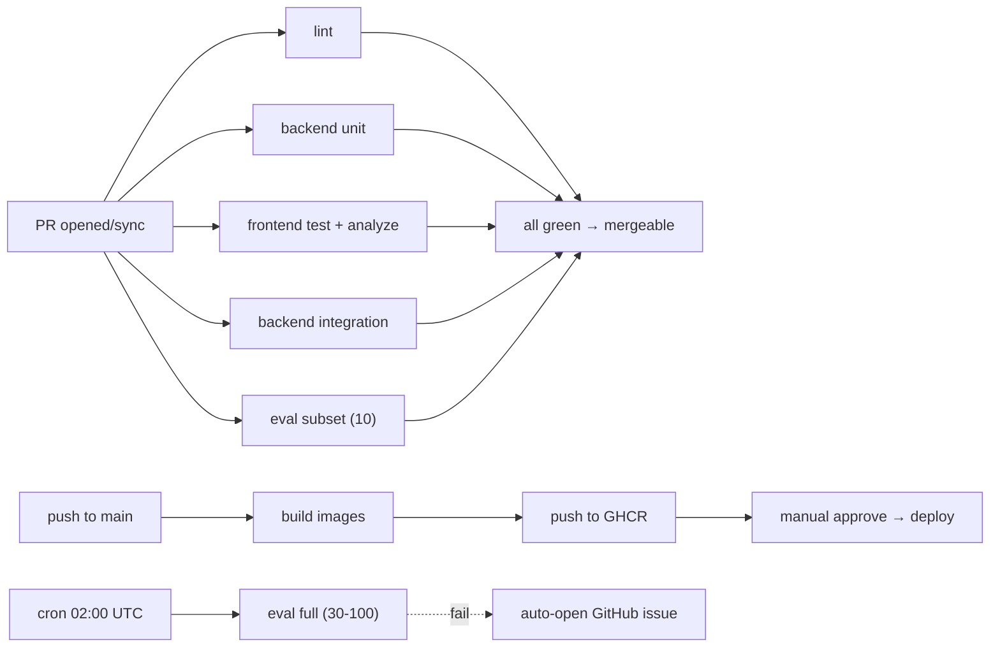

# 03·07 - CI/CD 与部署

> 把前面 6 份的所有产物变成"可重复部署 + 持续保障质量"的工程闭环。

## 1. 交付物

- ✅ GitHub Actions workflows：`ci.yml`（PR 触发）+ `nightly-eval.yml`（每日跑全量评测）+ `deploy.yml`（手动触发或 main push 后部署）
- ✅ 生产 Docker Compose：`deploy/docker-compose.prod.yml`
- ✅ Nginx 反代配置：`deploy/nginx/{default.conf, tls.conf}` 支持 HTTPS、SSE、长连接
- ✅ Let's Encrypt 自动续期（certbot 容器或宿主 cron）
- ✅ 部署脚本：`deploy/scripts/{deploy.sh, backup.sh, restore.sh}`
- ✅ 启动健康检查 + 滚动重启
- ✅ 文档：`README.md` 部署章节 + runbook

## 2. CI（GitHub Actions）

### 2.1 触发矩阵



### 2.2 `.github/workflows/ci.yml`

```yaml
name: ci
on:
  pull_request:
    branches: [main]
  push:
    branches: [main]

concurrency:
  group: ci-${{ github.ref }}
  cancel-in-progress: true

jobs:
  lint:
    runs-on: ubuntu-latest
    steps:
      - uses: actions/checkout@v4
      - uses: astral-sh/setup-uv@v3
      - run: cd backend && uv sync --dev
      - run: cd backend && uv run ruff check . && uv run black --check . && uv run mypy app
      - run: cd ingestion && uv sync --dev
      - run: cd ingestion && uv run ruff check . && uv run black --check .

  backend-unit:
    runs-on: ubuntu-latest
    steps:
      - uses: actions/checkout@v4
      - uses: astral-sh/setup-uv@v3
      - run: cd backend && uv sync --dev
      - run: cd backend && uv run pytest -m unit --cov=app --cov-report=xml -q
      - uses: codecov/codecov-action@v4
        with: { files: ./backend/coverage.xml }

  backend-integration:
    runs-on: ubuntu-latest
    services:
      postgres:
        image: postgres:16
        env:
          POSTGRES_USER: tgpp_app
          POSTGRES_PASSWORD: ci
          POSTGRES_DB: tgpp_everything
        ports: ["5432:5432"]
        options: >-
          --health-cmd "pg_isready -U tgpp_app" --health-interval 5s
          --health-timeout 5s --health-retries 5
      qdrant:
        image: qdrant/qdrant:v1.17.1
        ports: ["6333:6333"]
      redis:
        image: redis:7
        ports: ["6379:6379"]
    env:
      DATABASE_URL: postgresql+asyncpg://tgpp_app:ci@localhost:5432/tgpp_everything
      QDRANT_URL: http://localhost:6333
      REDIS_URL: redis://localhost:6379/0
      LITELLM_BASE_URL: http://localhost:9999/v1   # mock
      LITELLM_API_KEY: dummy
    steps:
      - uses: actions/checkout@v4
      - uses: astral-sh/setup-uv@v3
      - run: cd backend && uv sync --dev
      - run: cd backend && uv run alembic upgrade head
      - run: cd backend && uv run pytest -m integration -q

  eval-subset:
    runs-on: ubuntu-latest
    needs: [backend-integration]
    if: github.event_name == 'pull_request'
    services: # 同 backend-integration
      ...
    env:
      # 注入真实 LiteLLM / Voyage / Langfuse keys（GitHub Secrets）
      LITELLM_BASE_URL: ${{ secrets.LITELLM_BASE_URL }}
      LITELLM_API_KEY: ${{ secrets.LITELLM_API_KEY }}
      VOYAGE_API_KEY: ${{ secrets.VOYAGE_API_KEY }}
      LANGFUSE_PUBLIC_KEY: ${{ secrets.LANGFUSE_PUBLIC_KEY }}
      LANGFUSE_SECRET_KEY: ${{ secrets.LANGFUSE_SECRET_KEY }}
      LANGFUSE_HOST: https://cloud.langfuse.com
    steps:
      - uses: actions/checkout@v4
      - uses: astral-sh/setup-uv@v3
      - run: cd backend && uv sync --dev
      - run: cd backend && uv run alembic upgrade head
      # 注：CI 中没有真实全量 Qdrant 索引；用 fixture index（事先生成的小数据集 dump）
      - run: |
          mkdir -p /tmp/qdrant-fixture
          curl -L "${{ secrets.EVAL_FIXTURE_URL }}" -o /tmp/qdrant-fixture/snapshot.tar.gz
          ./deploy/scripts/restore-qdrant-fixture.sh /tmp/qdrant-fixture/snapshot.tar.gz
      - run: cd backend && EVAL_SUBSET_SIZE=10 uv run pytest -m eval -q

  frontend:
    runs-on: ubuntu-latest
    steps:
      - uses: actions/checkout@v4
      - uses: subosito/flutter-action@v2
        with: { channel: stable }
      - run: cd frontend && flutter pub get
      - run: cd frontend && flutter analyze
      - run: cd frontend && flutter test
```

### 2.3 `.github/workflows/nightly-eval.yml`

```yaml
name: nightly-eval
on:
  schedule:
    - cron: "0 18 * * *"     # UTC 18:00 ≈ 北京 02:00
  workflow_dispatch:

jobs:
  full-eval:
    runs-on: ubuntu-latest
    services: # 同 ci.yml
      ...
    env: # 同 ci eval-subset 真实 keys
      ...
    steps:
      - uses: actions/checkout@v4
      - uses: astral-sh/setup-uv@v3
      - run: cd backend && uv sync --dev
      - run: cd backend && uv run alembic upgrade head
      - run: cd backend && uv run pytest -m eval -m nightly -q --report json:eval-results/nightly.json
      - name: Open issue on failure
        if: failure()
        uses: actions/github-script@v7
        with:
          script: |
            github.rest.issues.create({
              owner: context.repo.owner,
              repo: context.repo.repo,
              title: `Nightly eval failed - ${new Date().toISOString().split('T')[0]}`,
              body: 'Eval thresholds breached. See workflow logs and Langfuse dataset.',
              labels: ['eval', 'auto']
            })
      - uses: actions/upload-artifact@v4
        with:
          name: eval-results
          path: eval-results/
```

### 2.4 `.github/workflows/deploy.yml`

```yaml
name: deploy
on:
  push:
    branches: [main]
  workflow_dispatch:

permissions:
  contents: read
  packages: write

jobs:
  build-and-push:
    runs-on: ubuntu-latest
    steps:
      - uses: actions/checkout@v4
      - uses: docker/setup-buildx-action@v3
      - uses: docker/login-action@v3
        with:
          registry: ghcr.io
          username: ${{ github.actor }}
          password: ${{ secrets.GITHUB_TOKEN }}
      - name: build & push backend
        uses: docker/build-push-action@v6
        with:
          context: ./backend
          push: true
          tags: |
            ghcr.io/episodeyu/tgpp-backend:${{ github.sha }}
            ghcr.io/episodeyu/tgpp-backend:latest
      - name: build & push ingestion
        uses: docker/build-push-action@v6
        with:
          context: ./ingestion
          push: true
          tags: ghcr.io/episodeyu/tgpp-ingestion:${{ github.sha }}
      - name: build & push frontend
        uses: docker/build-push-action@v6
        with:
          context: ./frontend
          push: true
          tags: ghcr.io/episodeyu/tgpp-frontend:${{ github.sha }}

  deploy:
    needs: build-and-push
    runs-on: ubuntu-latest
    environment: production    # GitHub Environments 加 approval
    steps:
      - uses: actions/checkout@v4
      - name: SSH deploy
        uses: appleboy/ssh-action@v1.2.0
        with:
          host: ${{ secrets.DEPLOY_HOST }}
          username: ${{ secrets.DEPLOY_USER }}
          key: ${{ secrets.DEPLOY_SSH_KEY }}
          script: |
            cd /opt/tgpp
            git pull
            export TAG=${{ github.sha }}
            docker compose -f deploy/docker-compose.prod.yml pull
            docker compose -f deploy/docker-compose.prod.yml up -d
            ./deploy/scripts/healthcheck.sh
```

## 3. 生产 Docker Compose

`deploy/docker-compose.prod.yml`：

```yaml
name: tgpp

services:
  api:
    image: ghcr.io/episodeyu/tgpp-backend:${TAG:-latest}
    container_name: tgpp-api
    env_file: ../.env
    extra_hosts:
      - "host.docker.internal:host-gateway"
    expose: ["8002"]
    volumes:
      - tgpp-data:/data/tgpp
    networks: [tgpp-net]
    restart: unless-stopped
    healthcheck:
      test: ["CMD","curl","-f","http://localhost:8002/health"]
      interval: 30s
      timeout: 3s
      retries: 5
    logging:
      driver: json-file
      options: { max-size: "10m", max-file: "5" }

  web:
    image: ghcr.io/episodeyu/tgpp-frontend:${TAG:-latest}
    container_name: tgpp-web
    expose: ["80"]
    networks: [tgpp-net]
    depends_on:
      api: { condition: service_healthy }
    restart: unless-stopped

  nginx:
    image: nginx:1.27-alpine
    container_name: tgpp-nginx
    ports:
      - "80:80"
      - "443:443"
    volumes:
      - ./nginx:/etc/nginx/conf.d:ro
      - ./certbot/conf:/etc/letsencrypt:ro
      - ./certbot/www:/var/www/certbot:ro
    networks: [tgpp-net]
    depends_on: [api, web]
    restart: unless-stopped

  certbot:
    image: certbot/certbot
    container_name: tgpp-certbot
    volumes:
      - ./certbot/conf:/etc/letsencrypt
      - ./certbot/www:/var/www/certbot
    entrypoint: "/bin/sh -c 'trap exit TERM; while :; do certbot renew --webroot -w /var/www/certbot; sleep 12h & wait $${!}; done;'"
    restart: unless-stopped

  ingest:
    image: ghcr.io/episodeyu/tgpp-ingestion:${TAG:-latest}
    container_name: tgpp-ingest
    env_file: ../.env
    extra_hosts:
      - "host.docker.internal:host-gateway"
    volumes:
      - tgpp-data:/data/tgpp
    networks: [tgpp-net]
    profiles: ["ingest"]   # 按需启动

networks:
  tgpp-net:
    driver: bridge

volumes:
  tgpp-data:
    driver: local
    driver_opts:
      type: none
      o: bind
      device: /data/tgpp
```

> 复用宿主已有 Qdrant / PG / Redis / LiteLLM，**不在 compose 中起这些**。

## 3.1 共享服务依赖

生产 compose 只管理本项目 API/Web/Nginx/ingest，以下共享服务必须在部署前通过 `/ready` 与脚本检查：

| 服务 | 检查 | 失败时处理 |
|------|------|------------|
| PostgreSQL | `pg_isready` + `alembic upgrade head --sql` dry run | 不启动新版本 API；先恢复 DB 或修权限 |
| Qdrant | `GET /collections` + active collection 存在 | API 进入 degraded read-only；禁止重建索引 |
| Redis | `PING` + stream consumer group 可创建 | 禁止 admin 异步任务；聊天限流降级为内存 |
| LiteLLM | `/v1/models` 至少含 `mimo-v2.5-pro`、`mimo-v2.5`、`embedding-3`、`voyage-4-large`、`rerank-2.5` | `/ready` 失败；聊天接口返回 503 |

部署脚本必须先检查共享服务，再拉起项目容器。备份脚本也只备份本项目 database、active Qdrant collection、BM25/markdown 目录，不碰其他项目数据。

## 4. Nginx 配置

### 4.1 `deploy/nginx/default.conf`（HTTP，仅做 ACME challenge + 301 跳 HTTPS）

```nginx
server {
    listen 80;
    server_name tgpp.example.com;

    location /.well-known/acme-challenge/ {
        root /var/www/certbot;
    }

    location / {
        return 301 https://$host$request_uri;
    }
}
```

### 4.2 `deploy/nginx/tls.conf`（HTTPS）

```nginx
server {
    listen 443 ssl http2;
    server_name tgpp.example.com;

    ssl_certificate     /etc/letsencrypt/live/tgpp.example.com/fullchain.pem;
    ssl_certificate_key /etc/letsencrypt/live/tgpp.example.com/privkey.pem;
    ssl_protocols TLSv1.2 TLSv1.3;
    ssl_ciphers HIGH:!aNULL:!MD5;
    ssl_session_cache shared:SSL:10m;

    client_max_body_size 50m;

    # 前端
    location / {
        proxy_pass http://web:80;
        proxy_http_version 1.1;
        proxy_set_header Host $host;
        proxy_set_header X-Real-IP $remote_addr;
        proxy_set_header X-Forwarded-For $proxy_add_x_forwarded_for;
        proxy_set_header X-Forwarded-Proto $scheme;
    }

    # 后端 API
    location /api/ {
        proxy_pass http://api:8002;
        proxy_http_version 1.1;
        proxy_set_header Host $host;
        proxy_set_header X-Real-IP $remote_addr;
        proxy_set_header X-Forwarded-For $proxy_add_x_forwarded_for;
        proxy_set_header X-Forwarded-Proto $scheme;
        proxy_read_timeout 300s;
        proxy_send_timeout 300s;
    }

    # SSE 单独 location 必须关 buffering
    # 与后端 EventSourceResponse `ping=15` 协作（M4.7 Q8 决策；详见
    # docs/04-handoff/2026-05-17-m4.6-m4.9-decisions.md §一 Q8）：
    # - `proxy_buffering off` + `X-Accel-Buffering: no` 保证 token 流不被缓冲
    # - `proxy_read_timeout 600s` 覆盖最长 chat 时长（包含 self-RAG retry）
    # - 后端每 15s 发一条 `: ping` 注释行，远低于 600s 阈值，防代理认为连接死掉
    location ~ ^/api/v1/sessions/[^/]+/messages$ {
        proxy_pass http://api:8002;
        proxy_http_version 1.1;
        proxy_set_header Host $host;
        proxy_set_header Connection "";
        proxy_buffering off;
        proxy_cache off;
        proxy_read_timeout 600s;
        proxy_send_timeout 600s;
        chunked_transfer_encoding on;
        add_header X-Accel-Buffering no;
    }

    # 健康检查 & OpenAPI
    location /health { proxy_pass http://api:8002/health; }
    location /docs   { proxy_pass http://api:8002/docs; }
    location /openapi.json { proxy_pass http://api:8002/openapi.json; }
}
```

## 5. Let's Encrypt 初始化

`deploy/scripts/init-letsencrypt.sh`：

```bash
#!/usr/bin/env bash
set -e
DOMAIN=tgpp.example.com
EMAIL=ops@example.com

mkdir -p deploy/certbot/conf deploy/certbot/www

# 临时假证书（启动 nginx 才能拉真证书）
docker run --rm -v "$PWD/deploy/certbot/conf:/etc/letsencrypt" \
  certbot/certbot certonly --register-unsafely-without-email \
  --staging --webroot -w /var/www/certbot -d $DOMAIN || true

# 启 nginx
docker compose -f deploy/docker-compose.prod.yml up -d nginx

# 拉真证书
docker compose -f deploy/docker-compose.prod.yml run --rm certbot \
  certonly --webroot -w /var/www/certbot --email $EMAIL --agree-tos --no-eff-email -d $DOMAIN --force-renewal

# 重新加载 nginx
docker compose -f deploy/docker-compose.prod.yml exec nginx nginx -s reload
```

## 6. 部署 / 回滚脚本

### 6.1 `deploy/scripts/deploy.sh`

```bash
#!/usr/bin/env bash
set -euo pipefail
TAG=${1:-latest}
cd /opt/tgpp
git pull
export TAG
docker compose -f deploy/docker-compose.prod.yml pull
docker compose -f deploy/docker-compose.prod.yml up -d --remove-orphans
./deploy/scripts/healthcheck.sh
```

### 6.2 `deploy/scripts/healthcheck.sh`

```bash
#!/usr/bin/env bash
for i in {1..30}; do
  if curl -fsS https://tgpp.example.com/health >/dev/null; then
    echo "API healthy"
    exit 0
  fi
  sleep 2
done
echo "API failed to come up"
exit 1
```

### 6.3 回滚

```bash
./deploy/scripts/deploy.sh <previous-sha>
```

## 7. 备份策略

`deploy/scripts/backup.sh`（宿主 cron 每日 03:00）：

```bash
#!/usr/bin/env bash
set -e
TS=$(date -u +%Y%m%dT%H%M%S)
BACKUP_DIR=/backup/tgpp/$TS
mkdir -p $BACKUP_DIR

# 1. PG dump（仅本项目 db）
pg_dump -h 127.0.0.1 -U tgpp_app -d tgpp_everything -F c -f $BACKUP_DIR/pg.dump

# 2. Qdrant snapshot（仅本项目 collection）
ACTIVE_PROVIDER=${EMBEDDING_PROVIDER:-voyage}
ACTIVE_COLLECTION=${QDRANT_ACTIVE_COLLECTION:-tgpp_chunks_${ACTIVE_PROVIDER}}
curl -X POST "http://127.0.0.1:6333/collections/${ACTIVE_COLLECTION}/snapshots"
# 拷贝 snapshot 出来（路径取决于 Qdrant storage 配置；生产部署时必须在 .env 或 runbook 中写明）
cp -r "/var/lib/qdrant/storage/collections/${ACTIVE_COLLECTION}/snapshots" "$BACKUP_DIR/qdrant_${ACTIVE_COLLECTION}"

# 3. BM25 持久化目录
tar czf $BACKUP_DIR/bm25.tar.gz /data/tgpp/bm25/

# 4. markdown / parsed json（可选，大文件）
tar czf $BACKUP_DIR/markdown.tar.gz /data/tgpp/markdown/

# 5. 保留最近 7 天；同时建议异步同步到远端对象存储/另一台机器
find /backup/tgpp -mindepth 1 -maxdepth 1 -mtime +7 -exec rm -rf {} +

echo "backup done: $BACKUP_DIR"
```

`restore.sh` 反向，注意先停服务再 restore。

## 8. Runbook（README 部署章节摘要）

### 8.1 全新机器首次部署

1. `git clone` 项目
2. 填好 `.env`
3. 跑 `01-infrastructure.md §2` 的所有"共享服务命名空间"准备
4. `docker compose -f deploy/docker-compose.prod.yml build`
5. `./deploy/scripts/init-letsencrypt.sh`
6. `docker compose -f deploy/docker-compose.prod.yml up -d`
7. `curl https://tgpp.example.com/health` 验
8. `POST /api/v1/auth/bootstrap-admin` 创建首个管理员
9. （可选）`docker compose --profile ingest run --rm ingest python -m ingestion.cli pipeline-hf --releases 18,19 --provider $EMBEDDING_PROVIDER`

### 8.2 日常更新

- 走 GitHub Actions `deploy.yml`（main push 后 manual approve）

### 8.3 常见故障处置

| 现象 | 排查 | 处置 |
|------|------|------|
| `/health` 200 但 `/api/v1/...` 504 | LiteLLM 不通 | `curl localhost:4000/health`；重启 LiteLLM |
| SSE 客户端无 token 流 | nginx buffering | 确认 `/api/v1/sessions/.../messages` location 是否生效 |
| Agent 总报 voyage 超时 | 海外网络 | 切 `EMBEDDING_PROVIDER=glm`，热切换 |
| Langfuse 写不进 | Cloud 抖动 | 看 backend 日志 `langfuse.flush` 错误；本地缓冲会自动重试 |
| 磁盘满 | data volume 涨 | `du -sh /data/tgpp/*`；清理 `images/` 重建索引时不动 markdown |
| 用户无法登录 | token/用户状态 | 查 `audit_logs`、确认 `is_active=true`、必要时用管理员重置密码 |

## 9. 安全

- 所有 secrets 走 GitHub Secrets + `.env`（不入 git）
- Nginx 启用 HSTS、CSP、X-Frame-Options
- API 默认拒绝 cors（仅放行配置的 frontend origin）
- 首个管理员通过一次性 bootstrap invite code 创建，创建后清空或轮换
- JWT access 15min、refresh 7d；refresh token 只存 hash，可撤销
- admin 路由强制 RBAC + audit log；上传文件限制类型/大小并隔离到 `/data/tgpp/fallback/raw/`

## 10. 验收清单

> 标注：`[auto]` = Agent 自跑可判定；`[human]` = 必须人介入（生产部署、域名、首次上线、回滚演练）。

- [ ] `[auto]` PR opened 时 CI 全部 job 跑通；< 15 分钟总耗时
- [ ] `[auto]` Nightly eval 跑通；阈值未达开 issue
- [ ] `[human]` `deploy.yml` 手动触发后 GHCR 有镜像、生产成功拉新版（生产部署必须人 approve，这是 `CLAUDE.md §5.3 / 5.4` 触发）
- [ ] `[human]` `https://tgpp.example.com/health` 200（域名/证书涉外部账号）
- [ ] `[human]` SSE 在生产域名下顺畅（token 流不卡顿）—— 由人在浏览器实测
- [ ] `[auto]` `init-letsencrypt.sh` 可重复执行不破坏现状（dry-run 与 staging 模式跑过）
- [ ] `[auto]` `backup.sh` 输出可用的 dump 与 snapshot；`restore.sh` 在测试环境上 restore 成功（集成测/CI 跑）
- [ ] `[auto]` 项目根 `README.md` 含完整部署 runbook（结构检查脚本可验证关键小节存在）
- [ ] `[human]` **失败回滚演练 1 次**（部署上一版本 sha 成功）—— 必须由人执行并签字

## 11. 风险与排雷

| 风险 | 触发 | 应对 |
|------|------|------|
| 共享 Postgres 在我 deploy 时不可用 | 同机其他项目升级 | API `/ready` 失败、不切流；监控告警 |
| GHCR rate limit | 大量 pull | 部署机配置 docker login GHCR |
| Let's Encrypt 域名限速 | 重复申请 | 先 staging 测；正式只跑 1 次 + 自动 renew |
| GitHub Actions secrets 泄漏 | 误配置日志 | 不打印 env；`set -x` 用前 `set +x` 包关键值 |
| 单点宿主机 | 整机故障 | 备份 + 远端 PG dump 拷贝；二期再谈多机/异地 |

## 12. 项目收尾

完成本文档后，整个 3GPP-Everything 项目应满足：

- ✅ 需求文档 (`docs/01-requirements.md`) 全部验收标准达成
- ✅ 8 份开发规划全部交付 + 各自验收清单全绿
- ✅ Langfuse 上能看到完整生产流量的 trace
- ✅ Nightly eval 连续 7 天无降级
- ✅ Runbook 经过至少 1 次完整执行（含回滚）

→ 项目从"建设期"进入"运营期"，按需求 §5 外的扩展（多用户 / 移动端精修 / 增量索引等）属 v2 范畴。
